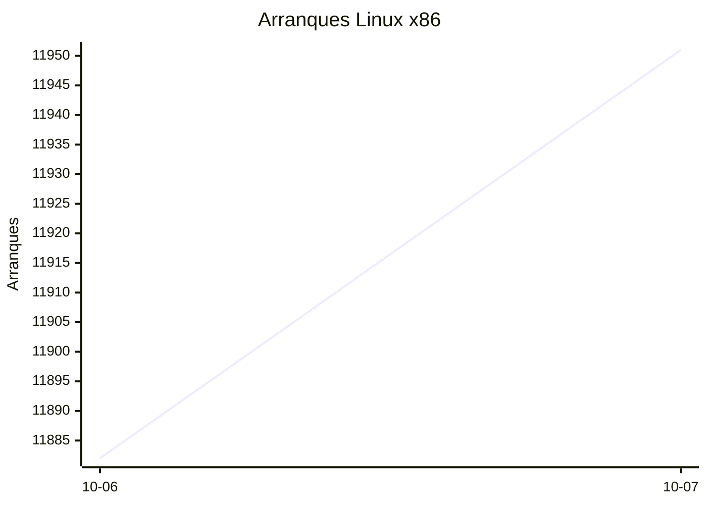
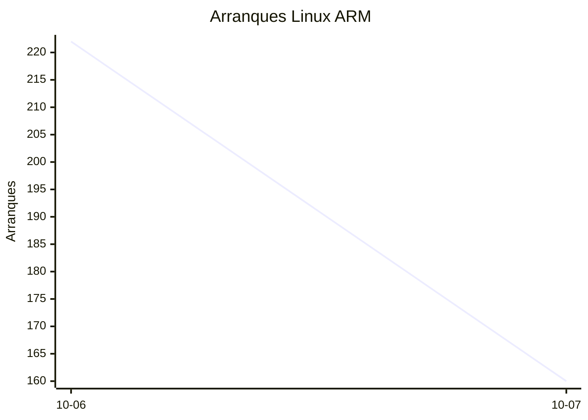
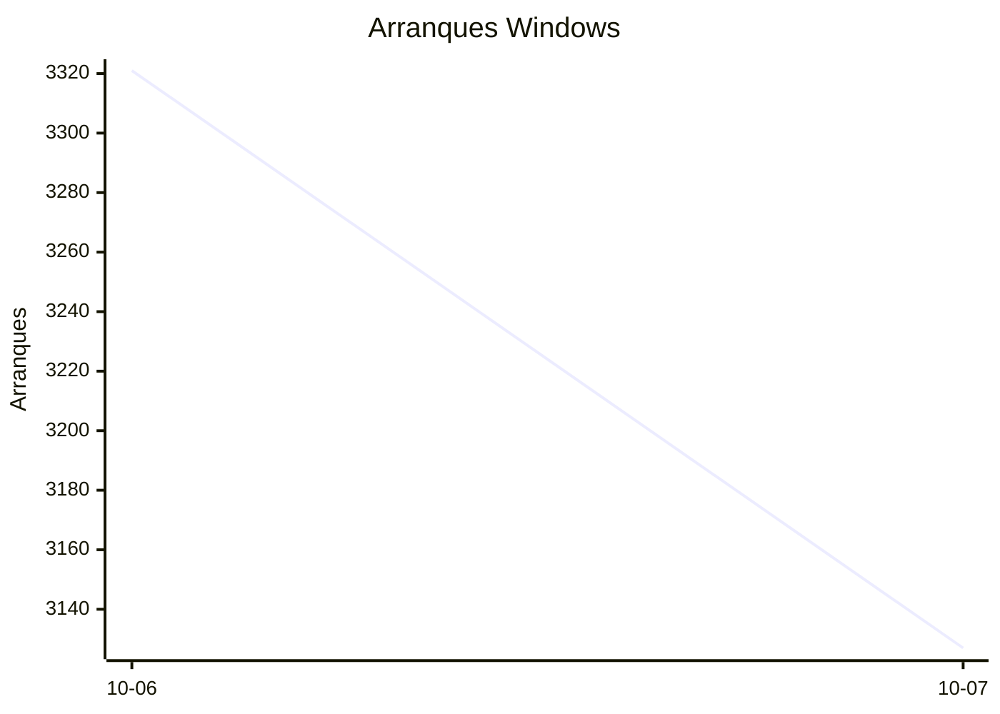

# Estadísticas de EmuDeck

Actualizado: 2026-10-08 23:40 UTC. Las gráficas no incluyen el día de hoy porque aún está incompleto.

## Arranques de la app (comprobaciones de actualización)

Cada arranque descarga el `latest*.yml` de su sistema. Cuenta arranques, no personas.

| Sistema | Ayer | Últimos 7 días |
|---|---|---|
| Linux x86 | 11951 | 23833 |
| Linux ARM | 160 | 382 |
| Windows | 3127 | 6448 |
| Mac | 0 | 0 |

Instalaciones nuevas estimadas en Windows (7 días, `.exe` menos `.blockmap`): **239**

## Instalaciones de EmuDeck (beacons)

Cada `setup` descarga `system-<sistema>.txt` y cada instalación de un emulador `<emulador>-<plataforma>.txt`. Los emuladores cuentan también las actualizaciones. Histórico completo desde el primer día.

| Sistema | Ayer | Últimos 7 días | Últimos 30 días | Total |
|---|---|---|---|---|
| linux | 34 | 34 | 34 | 97 |
| linux-arm | 1 | 1 | 1 | 15 |
| windows | 5 | 5 | 5 | 23 |

### Por mes

| Mes | Linux | Linux ARM | Windows | Total |
|---|---|---|---|---|
| 2026-10 | 34 | 1 | 5 | 40 |

### Canal early (early + early-unstable)

Instalaciones de EmuDeck con el backend en una rama early, y cuántas de ellas instalan CloudSync.

| | Últimos 7 días | Últimos 30 días | Total |
|---|---|---|---|
| Instalaciones early | 29 | 29 | 91 |
| Con CloudSync | 58 | 58 | 191 |
| % con CloudSync | | | 210% |

### Por emulador

| Emulador | Linux (total) | Linux ARM (total) | Windows (total) | Últimos 7 días | Últimos 30 días | Total |
|---|---|---|---|---|---|---|
| pcsx2 | 245 | 11 | 36 | 95 | 95 | 292 |
| esde | 218 | 14 | 48 | 84 | 84 | 280 |
| azahar | 219 | 24 | 30 | 88 | 88 | 273 |
| duckstation | 235 | 20 | 14 | 87 | 87 | 269 |
| ryujinx | 208 | 22 | 29 | 84 | 84 | 259 |
| rpcs3 | 209 | 19 | 15 | 78 | 78 | 243 |
| cemu | 209 | 20 | 9 | 80 | 80 | 238 |
| xenia | 187 | 18 | 23 | 79 | 79 | 228 |
| shadps4 | 187 | 20 | 19 | 81 | 81 | 226 |
| srm | 191 | 17 | 17 | 76 | 76 | 225 |
| vita3k | 191 | 17 | 6 | 68 | 68 | 214 |
| cloudsync | 129 | 4 | 64 | 60 | 60 | 197 |
| ra | 94 | 16 | 13 | 35 | 35 | 123 |
| dolphin | 89 | 15 | 15 | 34 | 34 | 119 |
| ppsspp | 82 | 12 | 21 | 31 | 31 | 115 |
| melonds | 77 | 11 | 12 | 31 | 31 | 100 |
| mgba | 82 | 11 | 6 | 35 | 35 | 99 |
| xemu | 69 | 11 | 14 | 26 | 26 | 94 |
| primehack | 70 | 11 | 10 | 23 | 23 | 91 |
| model2 | 66 | 12 | 2 | 22 | 22 | 80 |
| scummvm | 62 | 8 | 7 | 22 | 22 | 77 |
| supermodel | 63 | 12 | 2 | 21 | 21 | 77 |
| bigpemu | 52 | 3 | 1 | 18 | 18 | 56 |
| armsx2 | 17 | 21 | 0 | 13 | 13 | 38 |
| flycast | 24 | 1 | 2 | 9 | 9 | 27 |
| rmg | 20 | 6 | 0 | 6 | 6 | 26 |
| mame | 17 | 0 | 4 | 2 | 2 | 21 |
| eden | 8 | 0 | 0 | 0 | 0 | 8 |
| pegasus | 3 | 0 | 0 | 1 | 1 | 3 |
| ares | 0 | 1 | 0 | 1 | 1 | 1 |
