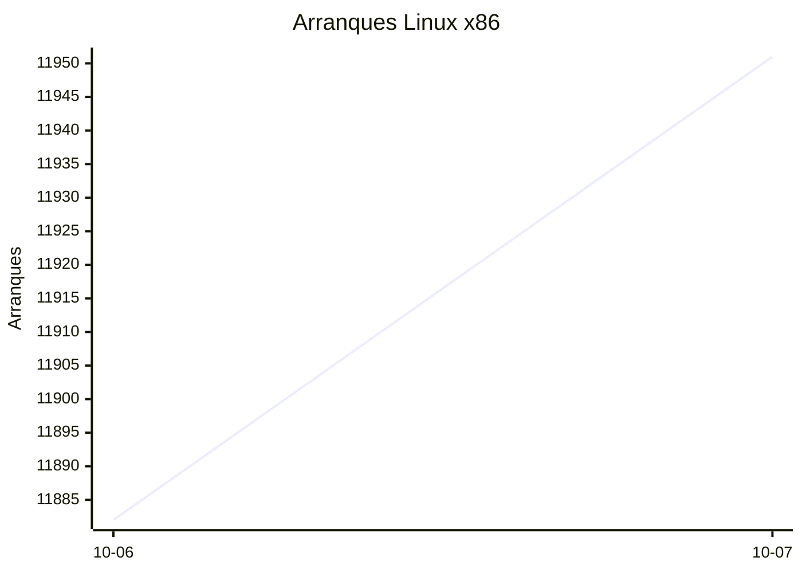
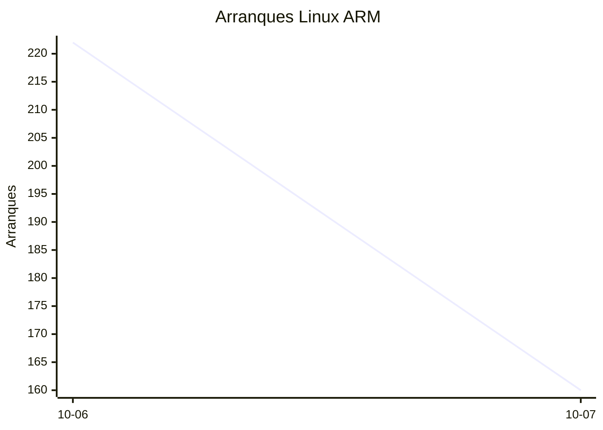
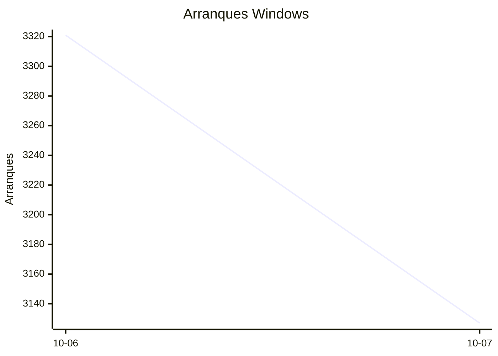

# Estadísticas de EmuDeck

Actualizado: 2026-10-08 00:42 UTC. Las gráficas no incluyen el día de hoy porque aún está incompleto.

## Arranques de la app (comprobaciones de actualización)

Cada arranque descarga el `latest*.yml` de su sistema. Cuenta arranques, no personas.

| Sistema | Ayer | Últimos 7 días |
|---|---|---|
| Linux x86 | 11951 | 23833 |
| Linux ARM | 160 | 382 |
| Windows | 3127 | 6448 |
| Mac | 0 | 0 |

Instalaciones nuevas estimadas en Windows (7 días, `.exe` menos `.blockmap`): **239**

## Instalaciones de EmuDeck (beacons)

Cada `setup` descarga `system-<sistema>.txt` y cada instalación de un emulador `<emulador>-<plataforma>.txt`. Los emuladores cuentan también las actualizaciones. Histórico completo desde el primer día.

| Sistema | Ayer | Últimos 7 días | Últimos 30 días | Total |
|---|---|---|---|---|
| linux | 34 | 34 | 34 | 57 |
| linux-arm | 1 | 1 | 1 | 4 |
| windows | 5 | 5 | 5 | 13 |

### Por mes

| Mes | Linux | Linux ARM | Windows | Total |
|---|---|---|---|---|
| 2026-10 | 34 | 1 | 5 | 40 |

### Canal early (early + early-unstable)

Instalaciones de EmuDeck con el backend en una rama early, y cuántas de ellas instalan CloudSync.

| | Últimos 7 días | Últimos 30 días | Total |
|---|---|---|---|
| Instalaciones early | 29 | 29 | 54 |
| Con CloudSync | 58 | 58 | 129 |
| % con CloudSync | | | 239% |

### Por emulador

| Emulador | Linux (total) | Linux ARM (total) | Windows (total) | Últimos 7 días | Últimos 30 días | Total |
|---|---|---|---|---|---|---|
| esde | 137 | 8 | 36 | 84 | 84 | 181 |
| pcsx2 | 150 | 4 | 19 | 95 | 95 | 173 |
| azahar | 140 | 11 | 16 | 88 | 88 | 167 |
| duckstation | 146 | 11 | 8 | 87 | 87 | 165 |
| ryujinx | 126 | 13 | 15 | 84 | 84 | 154 |
| rpcs3 | 132 | 10 | 8 | 78 | 78 | 150 |
| shadps4 | 127 | 11 | 10 | 81 | 81 | 148 |
| cemu | 130 | 10 | 6 | 80 | 80 | 146 |
| xenia | 119 | 11 | 12 | 79 | 79 | 142 |
| vita3k | 120 | 10 | 4 | 68 | 68 | 134 |
| cloudsync | 81 | 3 | 49 | 60 | 60 | 133 |
| srm | 110 | 8 | 8 | 76 | 76 | 126 |
| dolphin | 51 | 5 | 9 | 34 | 34 | 65 |
| ra | 54 | 4 | 7 | 35 | 35 | 65 |
| ppsspp | 47 | 4 | 13 | 31 | 31 | 64 |
| melonds | 49 | 4 | 7 | 31 | 31 | 60 |
| mgba | 48 | 8 | 2 | 35 | 35 | 58 |
| xemu | 41 | 4 | 8 | 26 | 26 | 53 |
| primehack | 39 | 3 | 6 | 23 | 23 | 48 |
| scummvm | 39 | 3 | 4 | 22 | 22 | 46 |
| model2 | 39 | 4 | 0 | 22 | 22 | 43 |
| supermodel | 38 | 4 | 0 | 21 | 21 | 42 |
| bigpemu | 34 | 3 | 0 | 18 | 18 | 37 |
| armsx2 | 12 | 12 | 0 | 13 | 13 | 24 |
| flycast | 13 | 1 | 1 | 9 | 9 | 15 |
| rmg | 10 | 1 | 0 | 6 | 6 | 11 |
| eden | 8 | 0 | 0 | 0 | 0 | 8 |
| mame | 6 | 0 | 1 | 2 | 2 | 7 |
| pegasus | 3 | 0 | 0 | 1 | 1 | 3 |
| ares | 0 | 1 | 0 | 1 | 1 | 1 |
