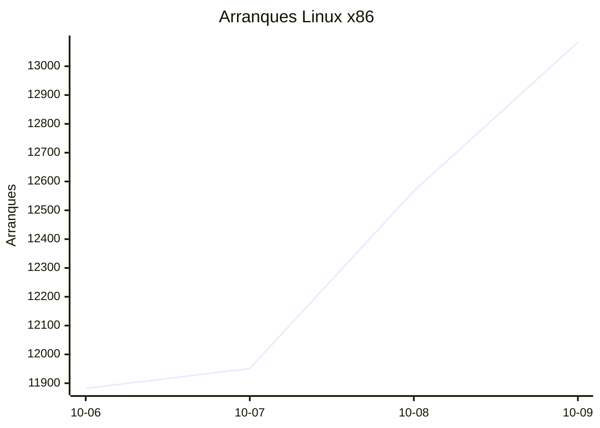
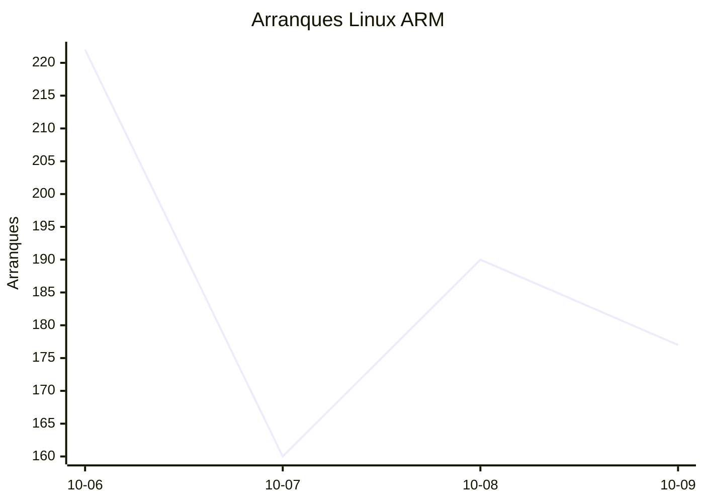
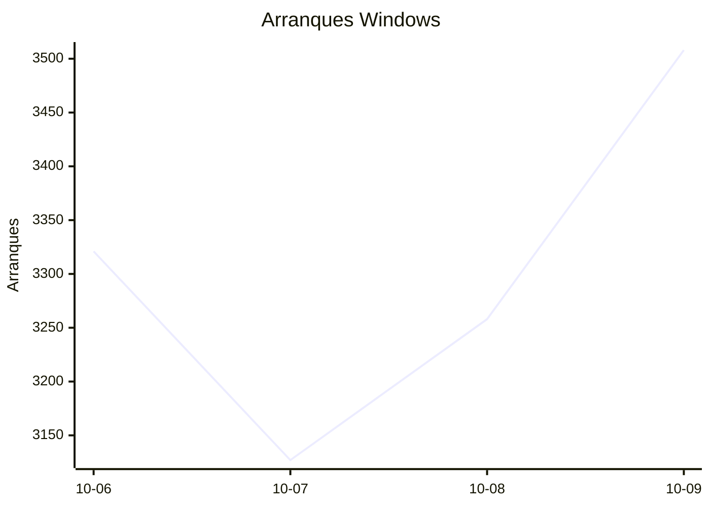
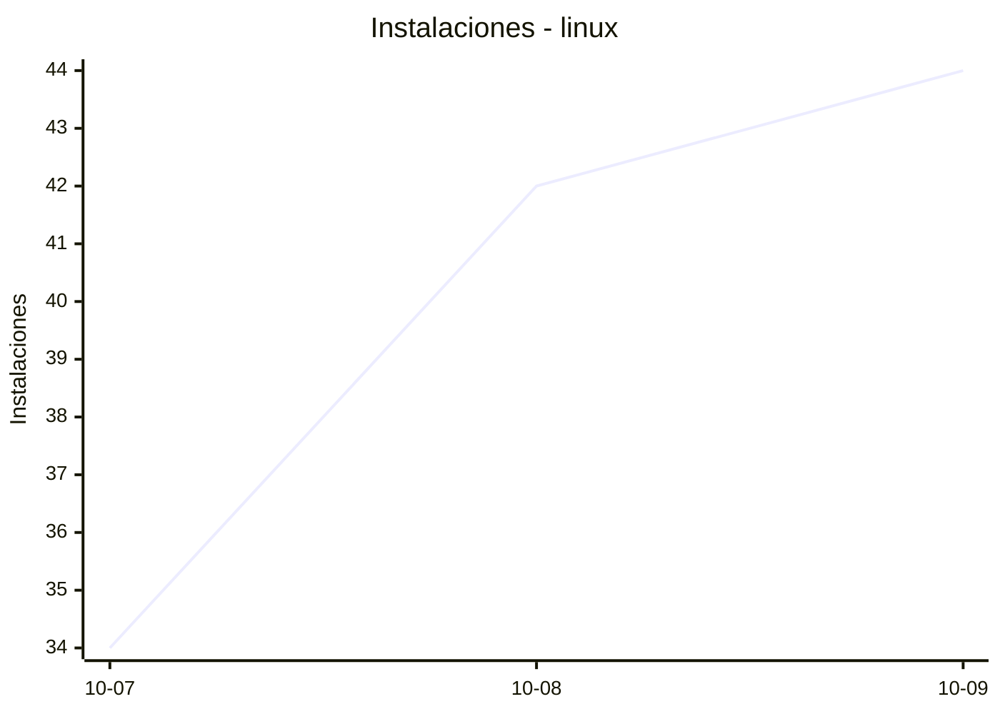
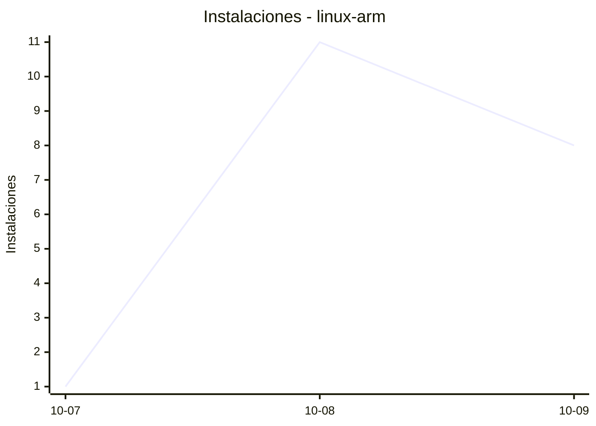
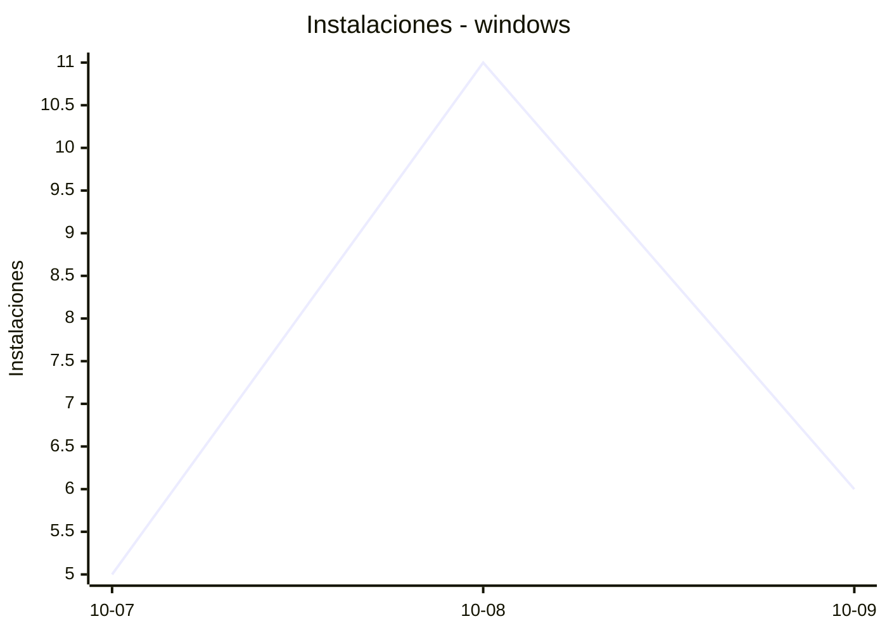
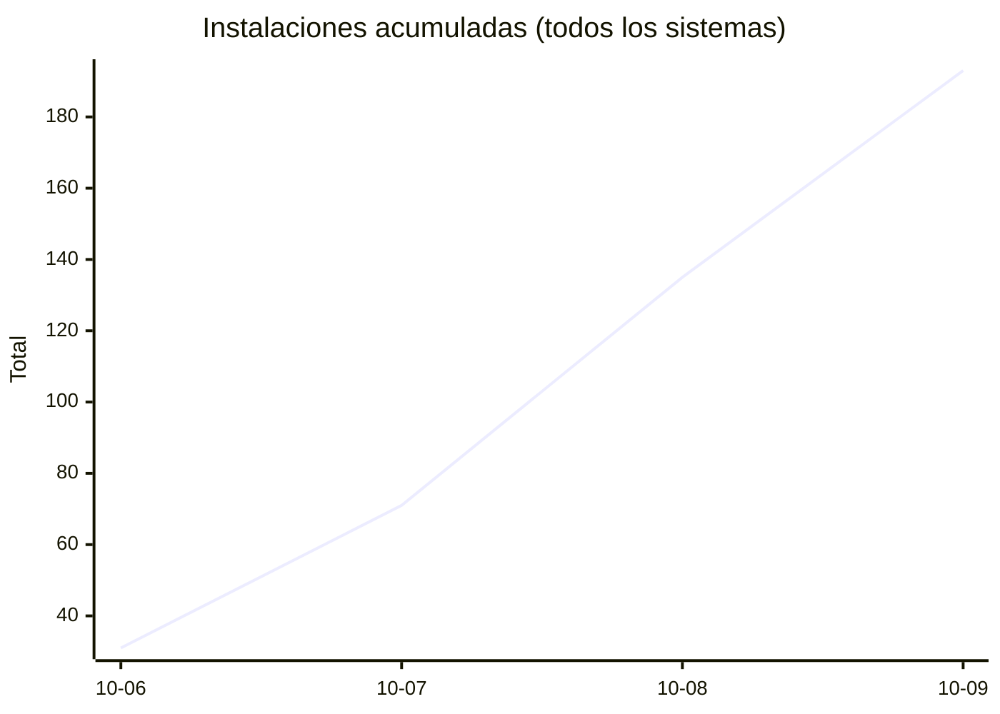
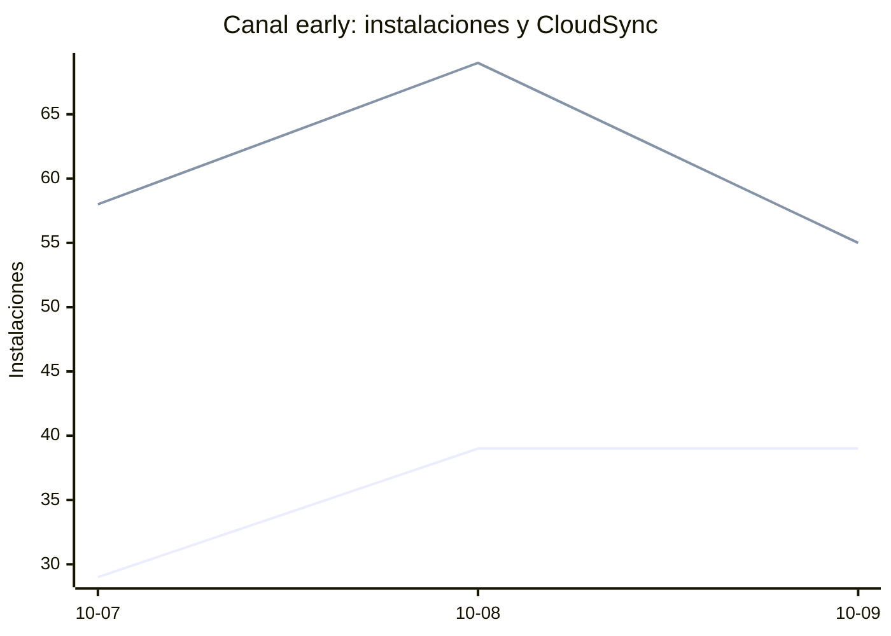

# Estadísticas de EmuDeck

Actualizado: 2026-10-10 00:42 UTC. Las gráficas no incluyen el día de hoy porque aún está incompleto.

## Arranques de la app (comprobaciones de actualización)

Cada arranque descarga el `latest*.yml` de su sistema. Cuenta arranques, no personas.

| Sistema | Ayer | Últimos 7 días |
|---|---|---|
| Linux x86 | 13083 | 49483 |
| Linux ARM | 177 | 749 |
| Windows | 3508 | 13214 |
| Mac | 0 | 0 |

Instalaciones nuevas estimadas en Windows (7 días, `.exe` menos `.blockmap`): **739**

## Instalaciones de EmuDeck (beacons)

Cada `setup` descarga `system-<sistema>.txt` y cada instalación de un emulador `<emulador>-<plataforma>.txt`. Los emuladores cuentan también las actualizaciones. Histórico completo desde el primer día.

| Sistema | Ayer | Últimos 7 días | Últimos 30 días | Total |
|---|---|---|---|---|
| linux | 44 | 120 | 120 | 141 |
| linux-arm | 8 | 20 | 20 | 23 |
| windows | 6 | 22 | 22 | 29 |

### Por mes

| Mes | Linux | Linux ARM | Windows | Total |
|---|---|---|---|---|
| 2026-10 | 120 | 20 | 22 | 162 |

### Canal early (early + early-unstable)

Instalaciones de EmuDeck con el backend en una rama early, y cuántas de ellas instalan CloudSync.

| | Últimos 7 días | Últimos 30 días | Total |
|---|---|---|---|
| Instalaciones early | 107 | 107 | 130 |
| Con CloudSync | 182 | 182 | 247 |
| % con CloudSync | | | 190% |

Línea de arriba: instalaciones early. Línea de abajo: de ellas, con CloudSync.

### Por emulador

| Emulador | Linux (total) | Linux ARM (total) | Windows (total) | Últimos 7 días | Últimos 30 días | Total |
|---|---|---|---|---|---|---|
| pcsx2 | 335 | 11 | 43 | 316 | 316 | 389 |
| esde | 290 | 23 | 66 | 288 | 288 | 379 |
| azahar | 299 | 34 | 43 | 301 | 301 | 376 |
| duckstation | 320 | 30 | 17 | 294 | 294 | 367 |
| ryujinx | 288 | 33 | 44 | 299 | 299 | 365 |
| cemu | 295 | 30 | 13 | 276 | 276 | 338 |
| rpcs3 | 289 | 29 | 17 | 269 | 269 | 335 |
| xenia | 263 | 26 | 28 | 259 | 259 | 317 |
| srm | 264 | 23 | 22 | 262 | 262 | 309 |
| shadps4 | 253 | 28 | 22 | 240 | 240 | 303 |
| vita3k | 262 | 25 | 8 | 233 | 233 | 295 |
| cloudsync | 169 | 10 | 80 | 192 | 192 | 259 |
| ra | 139 | 24 | 15 | 147 | 147 | 178 |
| dolphin | 130 | 23 | 19 | 141 | 141 | 172 |
| ppsspp | 120 | 20 | 27 | 135 | 135 | 167 |
| melonds | 110 | 16 | 14 | 113 | 113 | 140 |
| primehack | 106 | 18 | 13 | 113 | 113 | 137 |
| xemu | 103 | 16 | 15 | 109 | 109 | 134 |
| mgba | 107 | 13 | 10 | 109 | 109 | 130 |
| model2 | 99 | 18 | 2 | 99 | 99 | 119 |
| scummvm | 95 | 14 | 9 | 95 | 95 | 118 |
| supermodel | 95 | 18 | 4 | 97 | 97 | 117 |
| bigpemu | 73 | 3 | 1 | 59 | 59 | 77 |
| armsx2 | 25 | 32 | 0 | 48 | 48 | 57 |
| rmg | 29 | 8 | 0 | 32 | 32 | 37 |
| flycast | 29 | 2 | 3 | 28 | 28 | 34 |
| mame | 22 | 1 | 5 | 24 | 24 | 28 |
| eden | 10 | 0 | 0 | 2 | 2 | 10 |
| pegasus | 4 | 0 | 1 | 3 | 3 | 5 |
| ares | 1 | 1 | 0 | 2 | 2 | 2 |
| yuzu | 1 | 0 | 0 | 1 | 1 | 1 |
