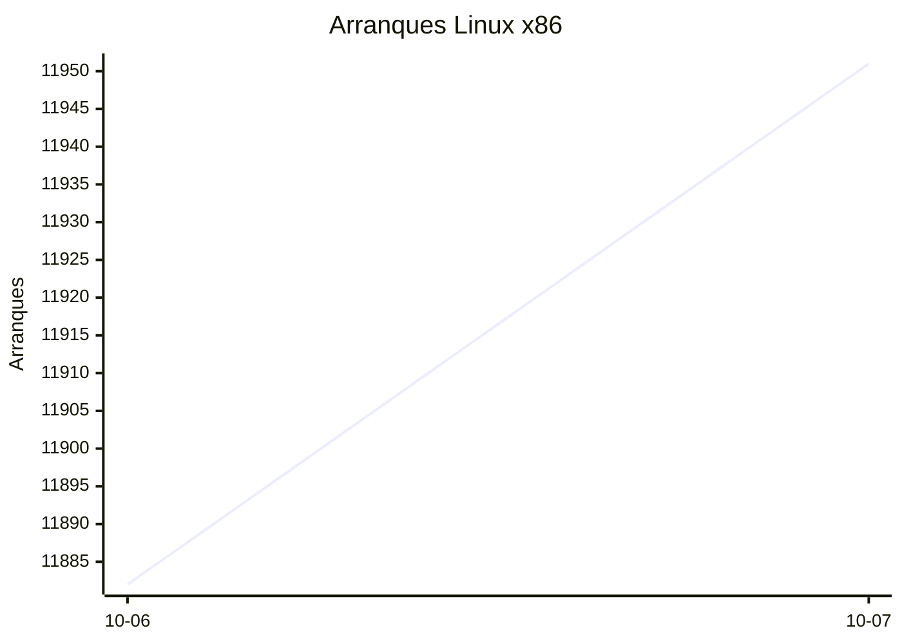
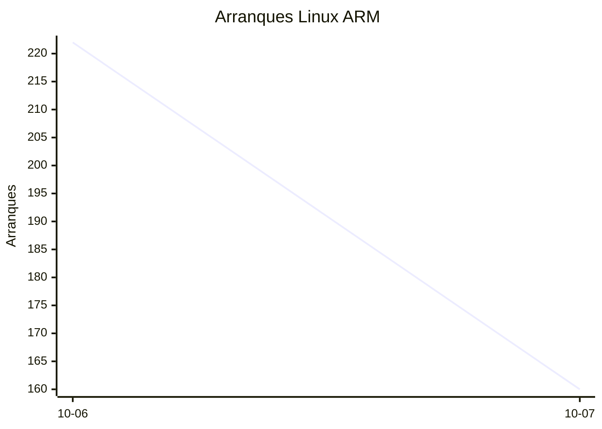
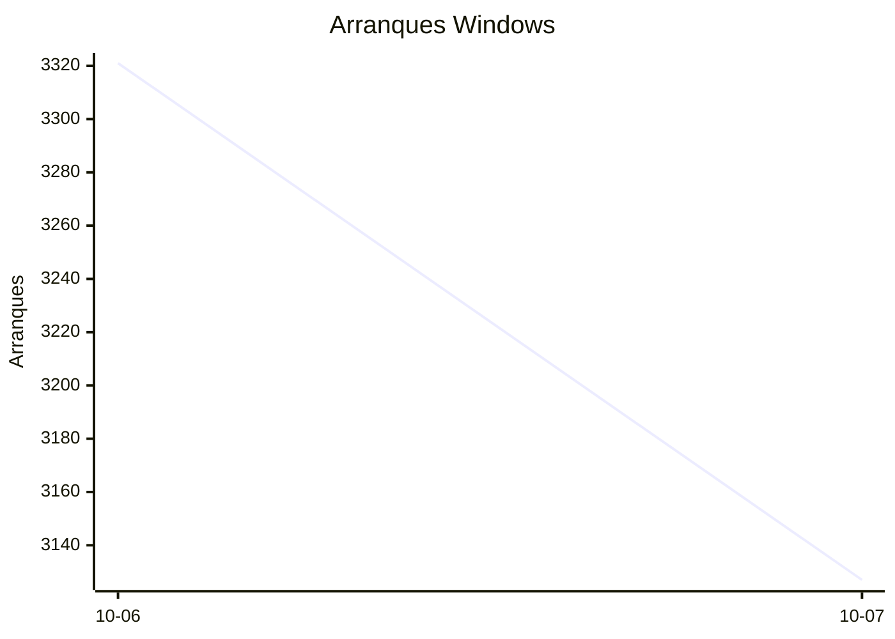

# Estadísticas de EmuDeck

Actualizado: 2026-10-08 23:13 UTC. Las gráficas no incluyen el día de hoy porque aún está incompleto.

## Arranques de la app (comprobaciones de actualización)

Cada arranque descarga el `latest*.yml` de su sistema. Cuenta arranques, no personas.

| Sistema | Ayer | Últimos 7 días |
|---|---|---|
| Linux x86 | 11951 | 23833 |
| Linux ARM | 160 | 382 |
| Windows | 3127 | 6448 |
| Mac | 0 | 0 |

Instalaciones nuevas estimadas en Windows (7 días, `.exe` menos `.blockmap`): **239**

## Instalaciones de EmuDeck (beacons)

Cada `setup` descarga `system-<sistema>.txt` y cada instalación de un emulador `<emulador>-<plataforma>.txt`. Los emuladores cuentan también las actualizaciones. Histórico completo desde el primer día.

| Sistema | Ayer | Últimos 7 días | Últimos 30 días | Total |
|---|---|---|---|---|
| linux | 34 | 34 | 34 | 96 |
| linux-arm | 1 | 1 | 1 | 15 |
| windows | 5 | 5 | 5 | 22 |

### Por mes

| Mes | Linux | Linux ARM | Windows | Total |
|---|---|---|---|---|
| 2026-10 | 34 | 1 | 5 | 40 |

### Canal early (early + early-unstable)

Instalaciones de EmuDeck con el backend en una rama early, y cuántas de ellas instalan CloudSync.

| | Últimos 7 días | Últimos 30 días | Total |
|---|---|---|---|
| Instalaciones early | 29 | 29 | 90 |
| Con CloudSync | 58 | 58 | 190 |
| % con CloudSync | | | 211% |

### Por emulador

| Emulador | Linux (total) | Linux ARM (total) | Windows (total) | Últimos 7 días | Últimos 30 días | Total |
|---|---|---|---|---|---|---|
| pcsx2 | 244 | 11 | 34 | 95 | 95 | 289 |
| esde | 217 | 14 | 47 | 84 | 84 | 278 |
| azahar | 218 | 24 | 29 | 88 | 88 | 271 |
| duckstation | 234 | 20 | 13 | 87 | 87 | 267 |
| ryujinx | 208 | 22 | 28 | 84 | 84 | 258 |
| rpcs3 | 208 | 19 | 14 | 78 | 78 | 241 |
| cemu | 209 | 20 | 9 | 80 | 80 | 238 |
| xenia | 187 | 18 | 23 | 79 | 79 | 228 |
| srm | 191 | 17 | 16 | 76 | 76 | 224 |
| shadps4 | 186 | 20 | 17 | 81 | 81 | 223 |
| vita3k | 190 | 17 | 6 | 68 | 68 | 213 |
| cloudsync | 128 | 4 | 64 | 60 | 60 | 196 |
| ra | 93 | 16 | 12 | 35 | 35 | 121 |
| dolphin | 88 | 15 | 14 | 34 | 34 | 117 |
| ppsspp | 80 | 12 | 21 | 31 | 31 | 113 |
| melonds | 77 | 11 | 11 | 31 | 31 | 99 |
| mgba | 82 | 11 | 6 | 35 | 35 | 99 |
| xemu | 69 | 11 | 13 | 26 | 26 | 93 |
| primehack | 70 | 11 | 10 | 23 | 23 | 91 |
| model2 | 65 | 12 | 2 | 22 | 22 | 79 |
| scummvm | 62 | 8 | 7 | 22 | 22 | 77 |
| supermodel | 62 | 12 | 2 | 21 | 21 | 76 |
| bigpemu | 51 | 3 | 1 | 18 | 18 | 55 |
| armsx2 | 17 | 21 | 0 | 13 | 13 | 38 |
| flycast | 23 | 1 | 2 | 9 | 9 | 26 |
| rmg | 19 | 6 | 0 | 6 | 6 | 25 |
| mame | 16 | 0 | 4 | 2 | 2 | 20 |
| eden | 8 | 0 | 0 | 0 | 0 | 8 |
| pegasus | 3 | 0 | 0 | 1 | 1 | 3 |
| ares | 0 | 1 | 0 | 1 | 1 | 1 |
