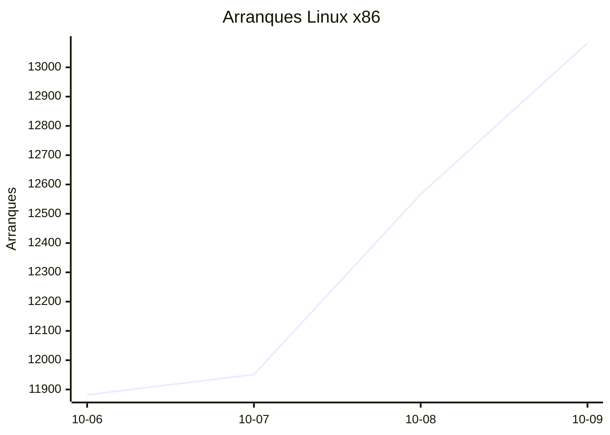
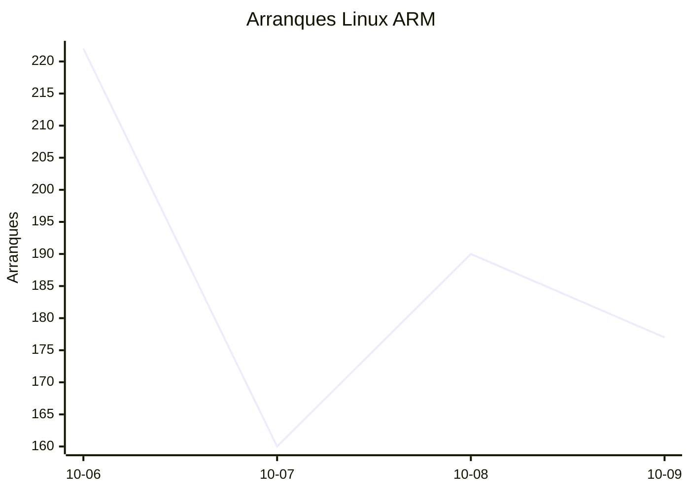
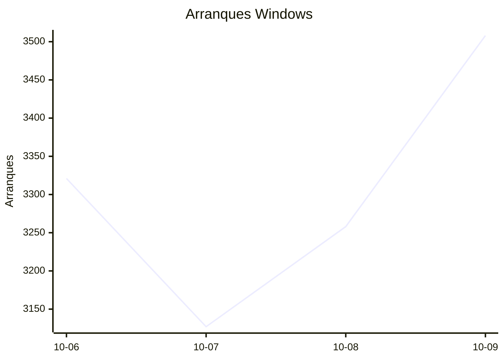
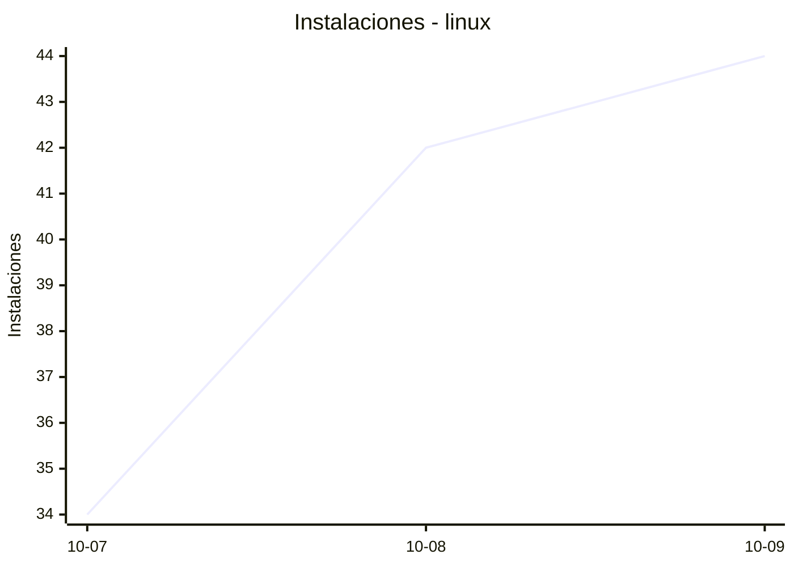
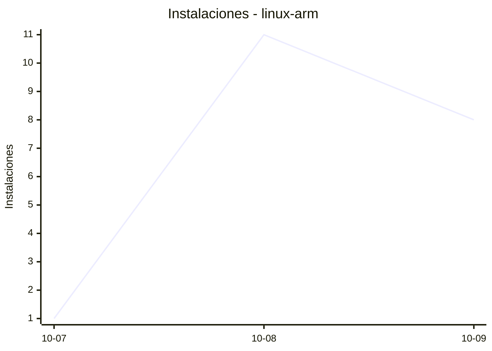
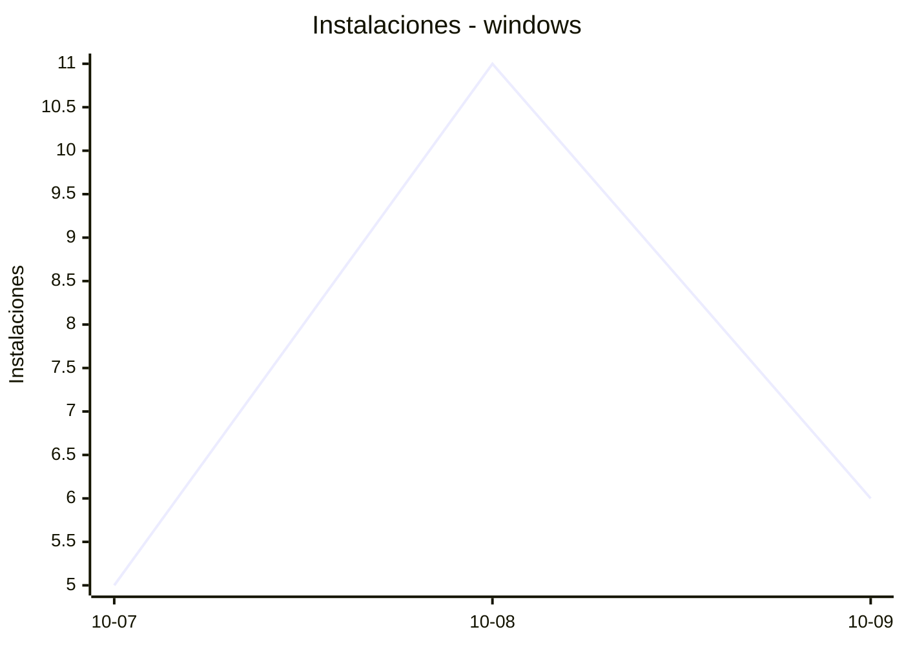
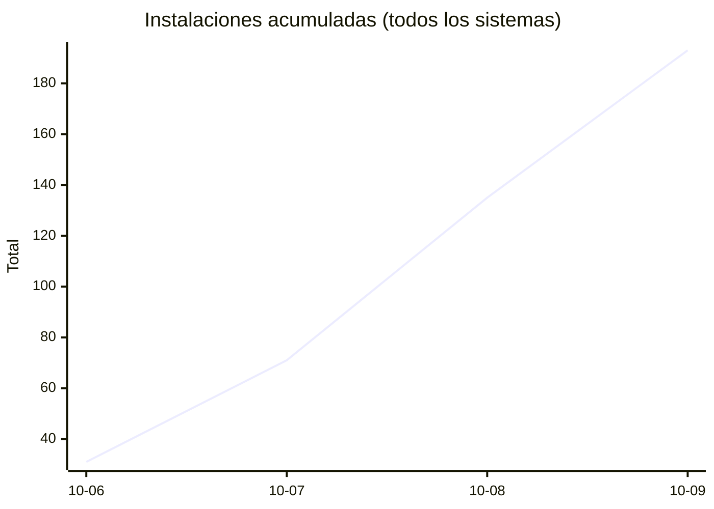
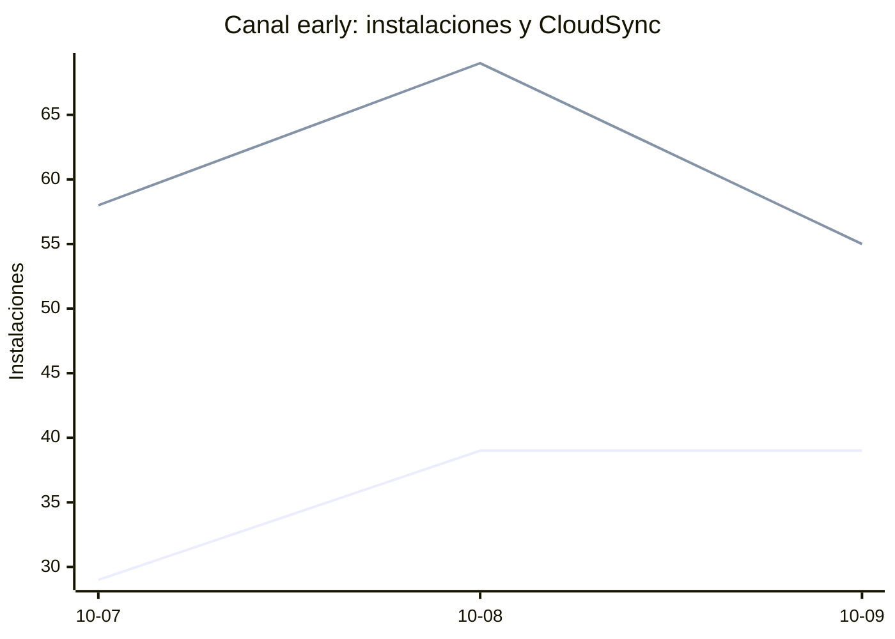

# Estadísticas de EmuDeck

Actualizado: 2026-10-10 04:17 UTC. Las gráficas no incluyen el día de hoy porque aún está incompleto.

## Arranques de la app (comprobaciones de actualización)

Cada arranque descarga el `latest*.yml` de su sistema. Cuenta arranques, no personas.

| Sistema | Ayer | Últimos 7 días |
|---|---|---|
| Linux x86 | 13083 | 49483 |
| Linux ARM | 177 | 749 |
| Windows | 3508 | 13214 |
| Mac | 0 | 0 |

Instalaciones nuevas estimadas en Windows (7 días, `.exe` menos `.blockmap`): **739**

## Instalaciones de EmuDeck (beacons)

Cada `setup` descarga `system-<sistema>.txt` y cada instalación de un emulador `<emulador>-<plataforma>.txt`. Los emuladores cuentan también las actualizaciones. Histórico completo desde el primer día.

| Sistema | Ayer | Últimos 7 días | Últimos 30 días | Total |
|---|---|---|---|---|
| linux | 44 | 120 | 120 | 147 |
| linux-arm | 8 | 20 | 20 | 24 |
| windows | 6 | 22 | 22 | 31 |

### Por mes

| Mes | Linux | Linux ARM | Windows | Total |
|---|---|---|---|---|
| 2026-10 | 120 | 20 | 22 | 162 |

### Canal early (early + early-unstable)

Instalaciones de EmuDeck con el backend en una rama early, y cuántas de ellas instalan CloudSync.

| | Últimos 7 días | Últimos 30 días | Total |
|---|---|---|---|
| Instalaciones early | 107 | 107 | 138 |
| Con CloudSync | 182 | 182 | 261 |
| % con CloudSync | | | 189% |

Línea de arriba: instalaciones early. Línea de abajo: de ellas, con CloudSync.

### Por emulador

| Emulador | Linux (total) | Linux ARM (total) | Windows (total) | Últimos 7 días | Últimos 30 días | Total |
|---|---|---|---|---|---|---|
| pcsx2 | 353 | 11 | 45 | 316 | 316 | 409 |
| esde | 303 | 26 | 68 | 288 | 288 | 397 |
| azahar | 313 | 37 | 45 | 301 | 301 | 395 |
| duckstation | 338 | 33 | 18 | 294 | 294 | 389 |
| ryujinx | 303 | 34 | 46 | 299 | 299 | 383 |
| cemu | 312 | 33 | 14 | 276 | 276 | 359 |
| rpcs3 | 302 | 31 | 18 | 269 | 269 | 351 |
| xenia | 277 | 27 | 30 | 259 | 259 | 334 |
| srm | 277 | 26 | 22 | 262 | 262 | 325 |
| shadps4 | 265 | 30 | 24 | 240 | 240 | 319 |
| vita3k | 278 | 27 | 9 | 233 | 233 | 314 |
| cloudsync | 182 | 10 | 81 | 192 | 192 | 273 |
| ra | 146 | 25 | 17 | 147 | 147 | 188 |
| dolphin | 137 | 24 | 20 | 141 | 141 | 181 |
| ppsspp | 126 | 21 | 28 | 135 | 135 | 175 |
| melonds | 116 | 17 | 15 | 113 | 113 | 148 |
| primehack | 111 | 19 | 14 | 113 | 113 | 144 |
| xemu | 109 | 17 | 16 | 109 | 109 | 142 |
| mgba | 113 | 13 | 10 | 109 | 109 | 136 |
| model2 | 106 | 19 | 2 | 99 | 99 | 127 |
| scummvm | 101 | 15 | 10 | 95 | 95 | 126 |
| supermodel | 102 | 19 | 4 | 97 | 97 | 125 |
| bigpemu | 76 | 3 | 1 | 59 | 59 | 80 |
| armsx2 | 25 | 35 | 0 | 48 | 48 | 60 |
| rmg | 30 | 10 | 0 | 32 | 32 | 40 |
| flycast | 32 | 2 | 3 | 28 | 28 | 37 |
| mame | 24 | 1 | 5 | 24 | 24 | 30 |
| eden | 10 | 0 | 0 | 2 | 2 | 10 |
| pegasus | 4 | 0 | 1 | 3 | 3 | 5 |
| ares | 1 | 1 | 0 | 2 | 2 | 2 |
| yuzu | 1 | 0 | 0 | 1 | 1 | 1 |
