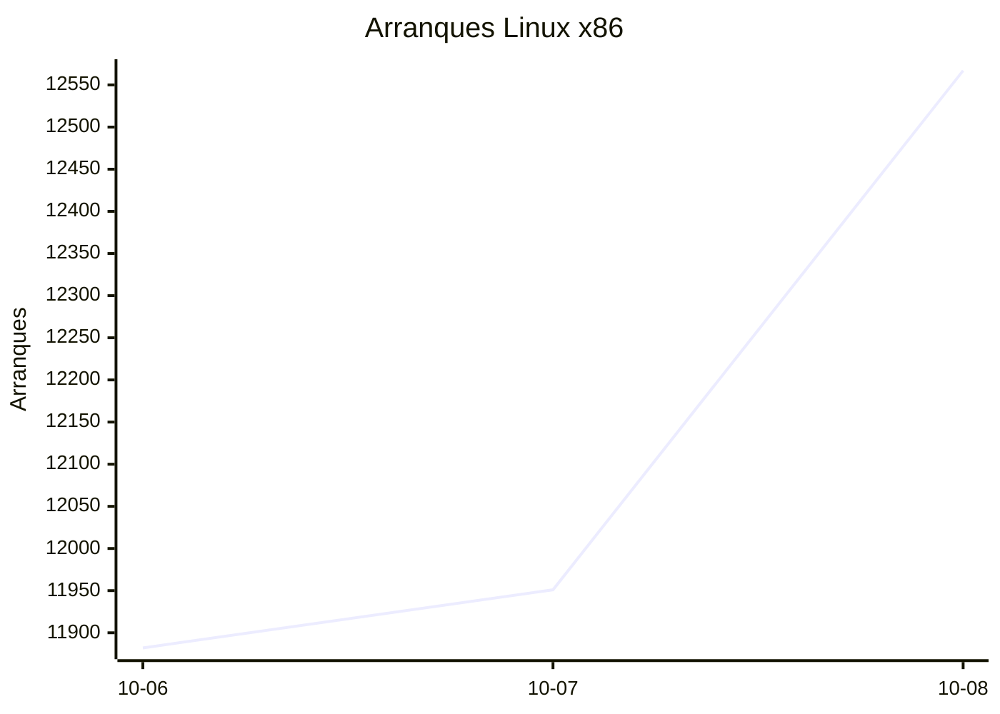
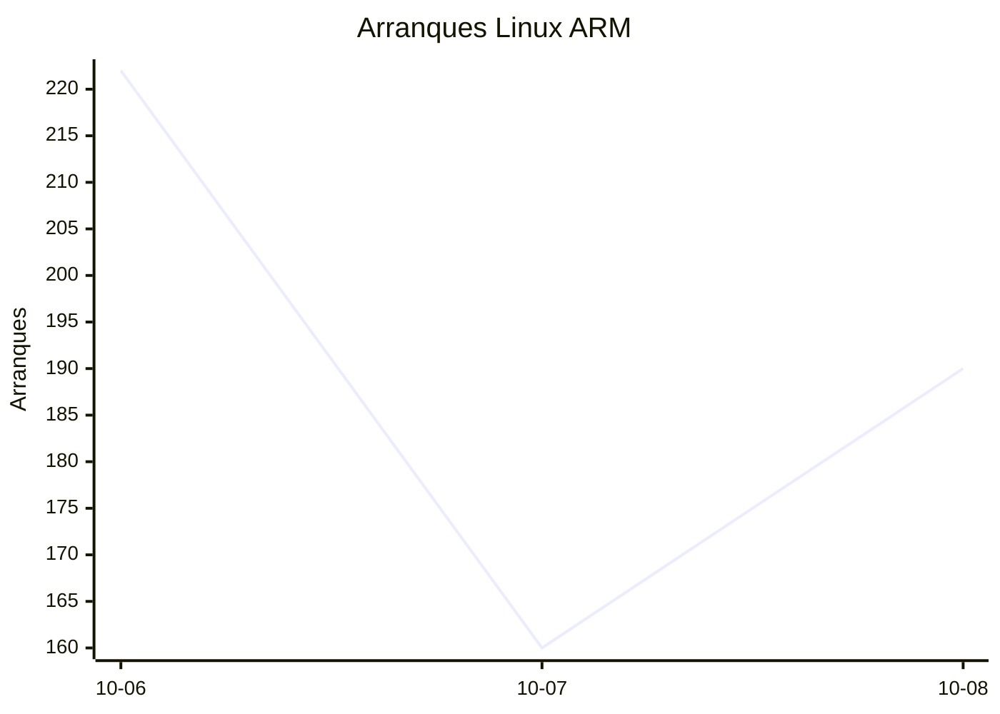
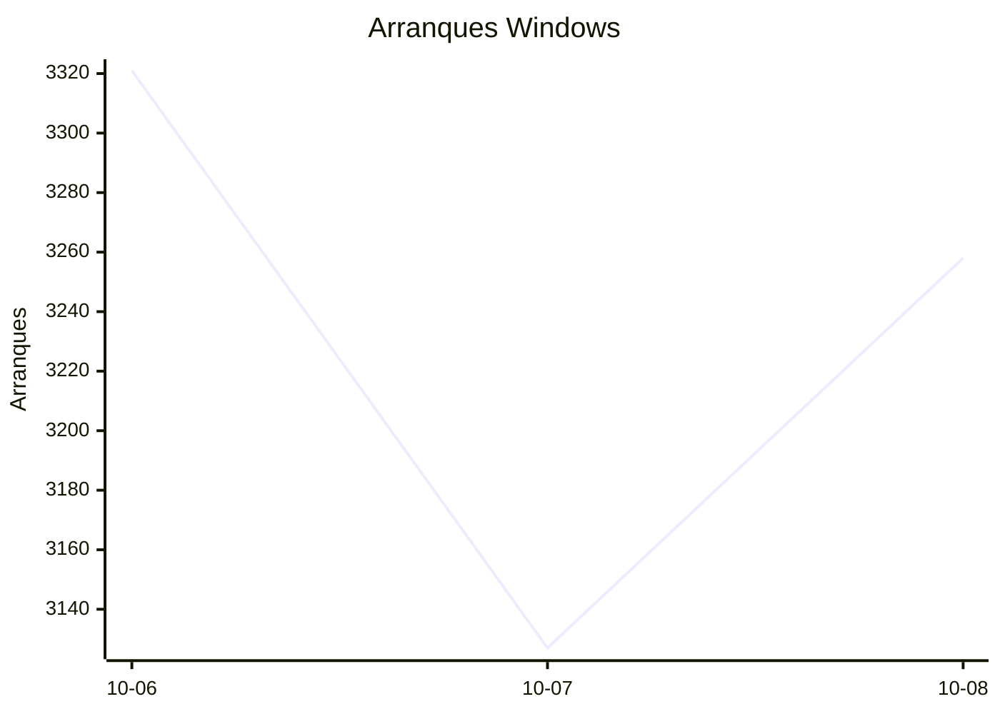
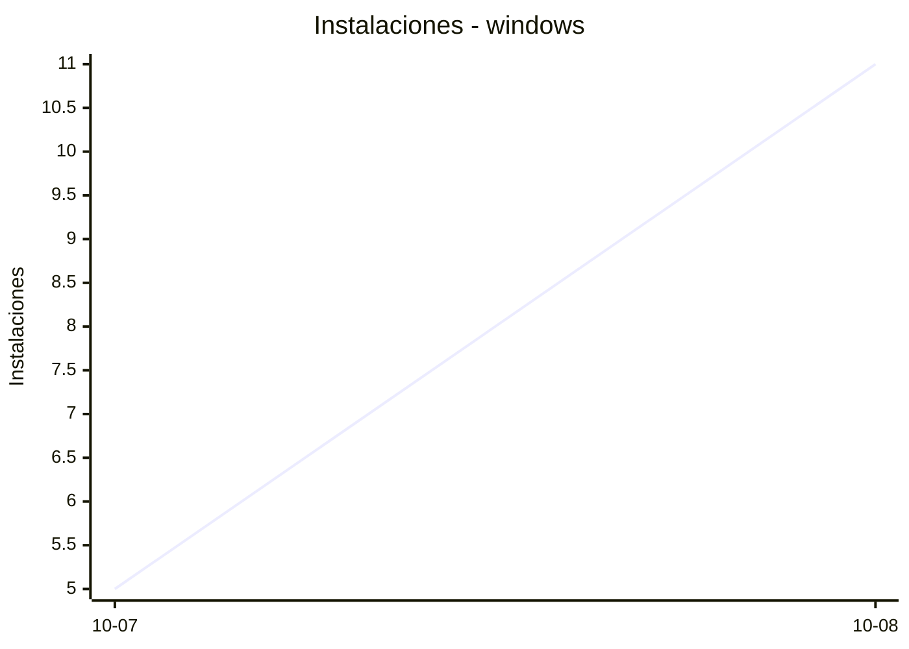
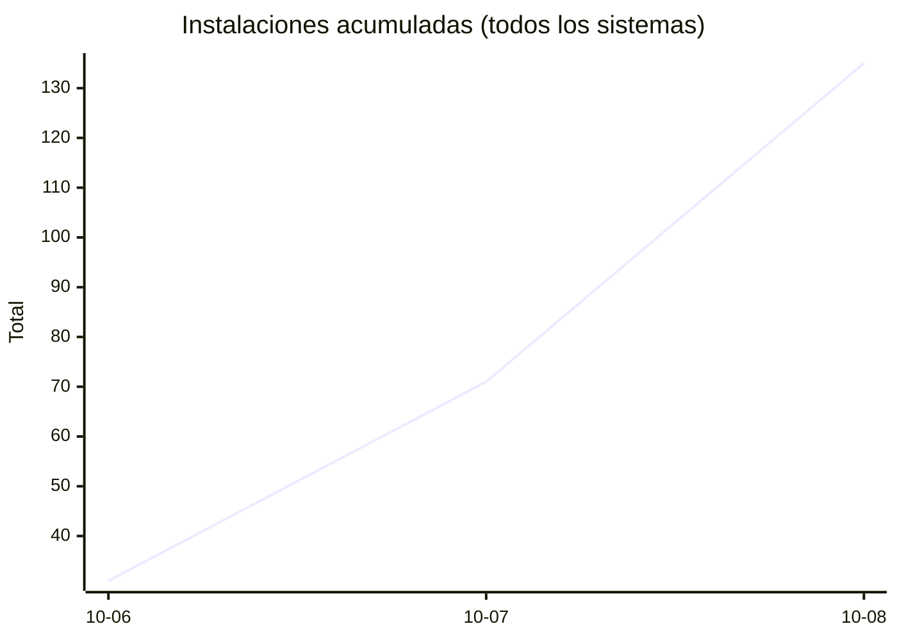
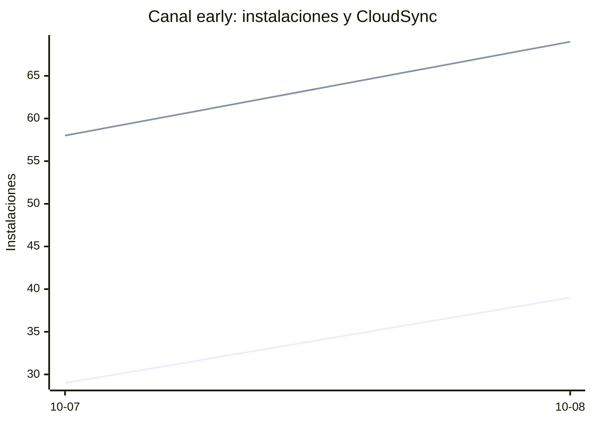

# Estadísticas de EmuDeck

Actualizado: 2026-10-09 18:18 UTC. Las gráficas no incluyen el día de hoy porque aún está incompleto.

## Arranques de la app (comprobaciones de actualización)

Cada arranque descarga el `latest*.yml` de su sistema. Cuenta arranques, no personas.

| Sistema | Ayer | Últimos 7 días |
|---|---|---|
| Linux x86 | 12567 | 36400 |
| Linux ARM | 190 | 572 |
| Windows | 3258 | 9706 |
| Mac | 0 | 0 |

Instalaciones nuevas estimadas en Windows (7 días, `.exe` menos `.blockmap`): **455**







## Instalaciones de EmuDeck (beacons)

Cada `setup` descarga `system-<sistema>.txt` y cada instalación de un emulador `<emulador>-<plataforma>.txt`. Los emuladores cuentan también las actualizaciones. Histórico completo desde el primer día.

| Sistema | Ayer | Últimos 7 días | Últimos 30 días | Total |
|---|---|---|---|---|
| linux | 42 | 76 | 76 | 129 |
| linux-arm | 11 | 12 | 12 | 21 |
| windows | 11 | 16 | 16 | 28 |

```mermaid
xychart-beta
    title "Instalaciones - linux"
    x-axis ["10-07", "10-08"]
    y-axis "Instalaciones"
    line [34, 42]
```

```mermaid
xychart-beta
    title "Instalaciones - linux-arm"
    x-axis ["10-07", "10-08"]
    y-axis "Instalaciones"
    line [1, 11]
```





### Por mes

| Mes | Linux | Linux ARM | Windows | Total |
|---|---|---|---|---|
| 2026-10 | 76 | 12 | 16 | 104 |

### Canal early (early + early-unstable)

Instalaciones de EmuDeck con el backend en una rama early, y cuántas de ellas instalan CloudSync.

| | Últimos 7 días | Últimos 30 días | Total |
|---|---|---|---|
| Instalaciones early | 68 | 68 | 121 |
| Con CloudSync | 127 | 127 | 230 |
| % con CloudSync | | | 190% |

Línea de arriba: instalaciones early. Línea de abajo: de ellas, con CloudSync.



### Por emulador

| Emulador | Linux (total) | Linux ARM (total) | Windows (total) | Últimos 7 días | Últimos 30 días | Total |
|---|---|---|---|---|---|---|
| pcsx2 | 305 | 11 | 41 | 219 | 219 | 357 |
| esde | 261 | 21 | 61 | 189 | 189 | 343 |
| azahar | 268 | 33 | 39 | 199 | 199 | 340 |
| ryujinx | 260 | 31 | 43 | 193 | 193 | 334 |
| duckstation | 288 | 28 | 16 | 197 | 197 | 332 |
| rpcs3 | 263 | 27 | 17 | 177 | 177 | 307 |
| cemu | 265 | 28 | 12 | 176 | 176 | 305 |
| xenia | 235 | 24 | 27 | 170 | 170 | 286 |
| srm | 235 | 22 | 21 | 178 | 178 | 278 |
| shadps4 | 229 | 26 | 21 | 163 | 163 | 276 |
| vita3k | 239 | 23 | 8 | 152 | 152 | 270 |
| cloudsync | 161 | 8 | 73 | 131 | 131 | 242 |
| ra | 122 | 22 | 15 | 95 | 95 | 159 |
| dolphin | 118 | 21 | 17 | 90 | 90 | 156 |
| ppsspp | 110 | 18 | 26 | 84 | 84 | 154 |
| melonds | 102 | 15 | 13 | 73 | 73 | 130 |
| primehack | 97 | 17 | 12 | 67 | 67 | 126 |
| xemu | 94 | 15 | 15 | 69 | 69 | 124 |
| mgba | 97 | 12 | 8 | 78 | 78 | 117 |
| model2 | 91 | 16 | 2 | 60 | 60 | 109 |
| scummvm | 87 | 12 | 9 | 54 | 54 | 108 |
| supermodel | 87 | 16 | 4 | 57 | 57 | 107 |
| bigpemu | 65 | 3 | 1 | 38 | 38 | 69 |
| armsx2 | 18 | 30 | 0 | 29 | 29 | 48 |
| rmg | 23 | 8 | 0 | 22 | 22 | 31 |
| flycast | 26 | 1 | 3 | 22 | 22 | 30 |
| mame | 19 | 1 | 5 | 17 | 17 | 25 |
| eden | 10 | 0 | 0 | 0 | 0 | 10 |
| pegasus | 3 | 0 | 1 | 1 | 1 | 4 |
| ares | 1 | 1 | 0 | 1 | 1 | 2 |
| yuzu | 1 | 0 | 0 | 0 | 0 | 1 |
