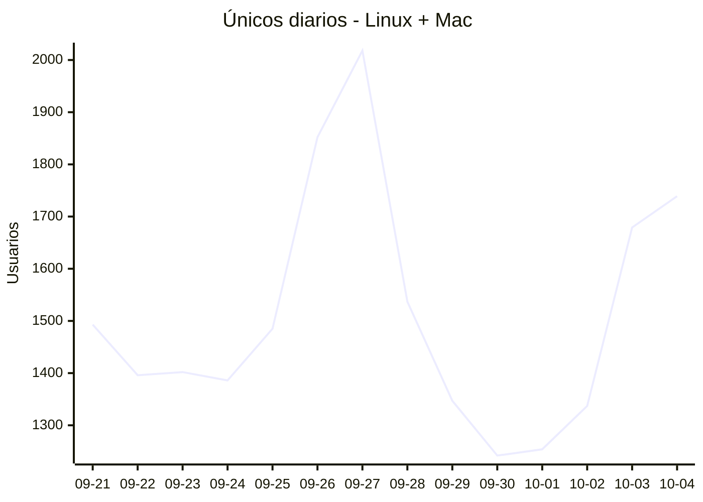
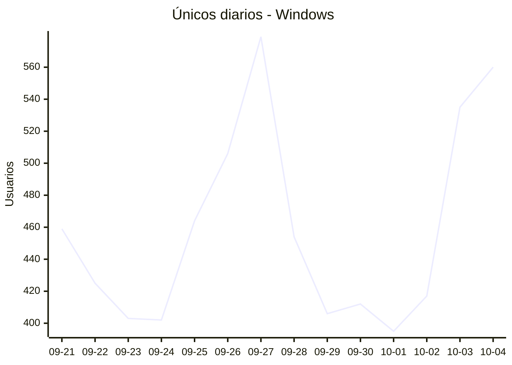

# Estadísticas de EmuDeck

Actualizado: 2026-10-05 21:19 UTC. Las gráficas no incluyen el día de hoy porque aún está incompleto.

## Usuarios que actualizan el backend (clonados de git)

| Backend | Únicos ayer | Clonados ayer | Únicos medios (7 días) |
|---|---|---|---|
| Linux + Mac | 1739 | 2355 | 1448 |
| Windows | 560 | 585 | 454 |

## Arranques de la app (comprobaciones de actualización)

Cada arranque descarga el `latest*.yml` de su sistema. Cuenta arranques, no personas.

Hacen falta al menos dos días de datos para calcular arranques diarios.
