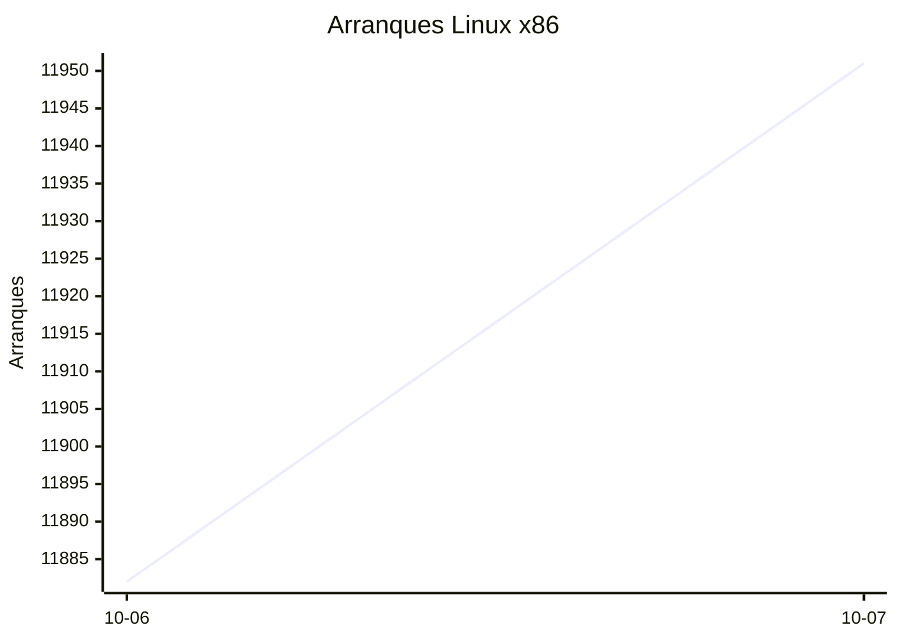
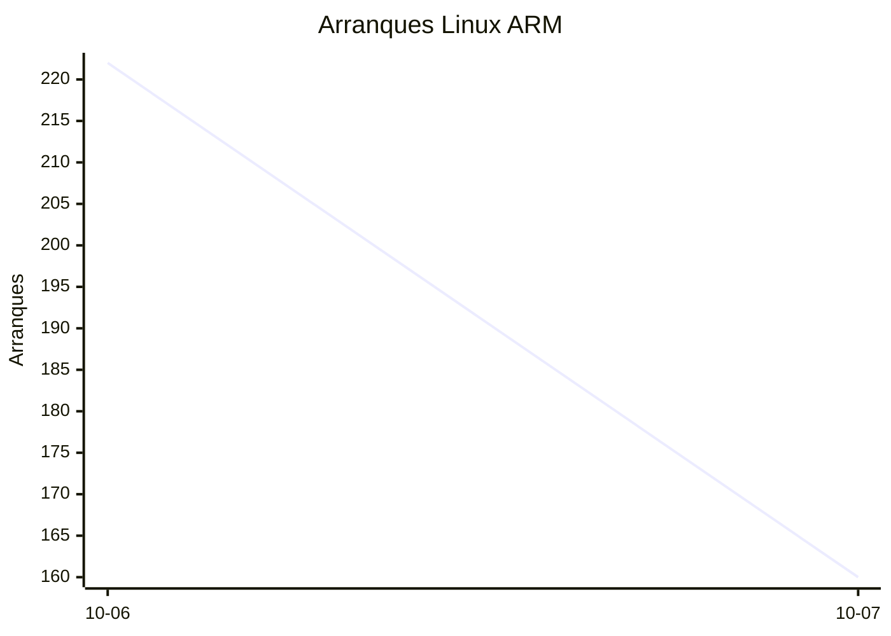
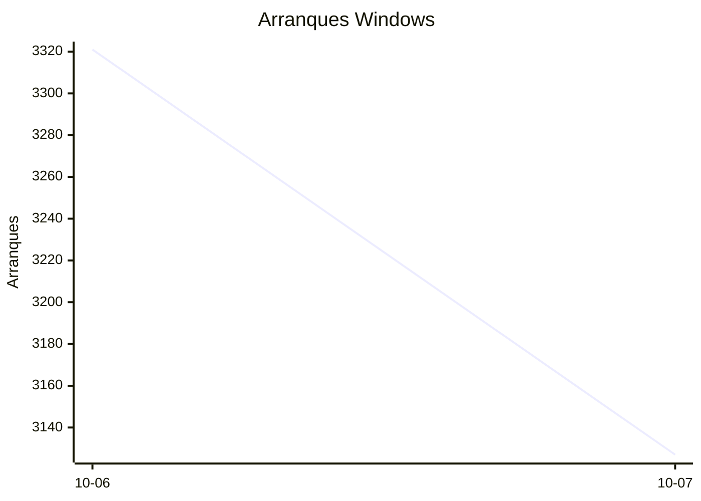

# Estadísticas de EmuDeck

Actualizado: 2026-10-08 08:50 UTC. Las gráficas no incluyen el día de hoy porque aún está incompleto.

## Arranques de la app (comprobaciones de actualización)

Cada arranque descarga el `latest*.yml` de su sistema. Cuenta arranques, no personas.

| Sistema | Ayer | Últimos 7 días |
|---|---|---|
| Linux x86 | 11951 | 23833 |
| Linux ARM | 160 | 382 |
| Windows | 3127 | 6448 |
| Mac | 0 | 0 |

Instalaciones nuevas estimadas en Windows (7 días, `.exe` menos `.blockmap`): **239**

## Instalaciones de EmuDeck (beacons)

Cada `setup` descarga `system-<sistema>.txt` y cada instalación de un emulador `<emulador>-<plataforma>.txt`. Los emuladores cuentan también las actualizaciones. Histórico completo desde el primer día.

| Sistema | Ayer | Últimos 7 días | Últimos 30 días | Total |
|---|---|---|---|---|
| linux | 34 | 34 | 34 | 74 |
| linux-arm | 1 | 1 | 1 | 6 |
| windows | 5 | 5 | 5 | 18 |

### Por mes

| Mes | Linux | Linux ARM | Windows | Total |
|---|---|---|---|---|
| 2026-10 | 34 | 1 | 5 | 40 |

### Canal early (early + early-unstable)

Instalaciones de EmuDeck con el backend en una rama early, y cuántas de ellas instalan CloudSync.

| | Últimos 7 días | Últimos 30 días | Total |
|---|---|---|---|
| Instalaciones early | 29 | 29 | 74 |
| Con CloudSync | 58 | 58 | 157 |
| % con CloudSync | | | 212% |

### Por emulador

| Emulador | Linux (total) | Linux ARM (total) | Windows (total) | Últimos 7 días | Últimos 30 días | Total |
|---|---|---|---|---|---|---|
| pcsx2 | 195 | 5 | 28 | 95 | 95 | 228 |
| esde | 173 | 10 | 40 | 84 | 84 | 223 |
| azahar | 180 | 13 | 23 | 88 | 88 | 216 |
| duckstation | 189 | 14 | 12 | 87 | 87 | 215 |
| ryujinx | 156 | 15 | 20 | 84 | 84 | 191 |
| cemu | 166 | 13 | 8 | 80 | 80 | 187 |
| rpcs3 | 166 | 12 | 9 | 78 | 78 | 187 |
| shadps4 | 155 | 14 | 11 | 81 | 81 | 180 |
| xenia | 151 | 14 | 15 | 79 | 79 | 180 |
| vita3k | 156 | 13 | 5 | 68 | 68 | 174 |
| srm | 143 | 9 | 11 | 76 | 76 | 163 |
| cloudsync | 101 | 3 | 58 | 60 | 60 | 162 |
| dolphin | 71 | 7 | 11 | 34 | 34 | 89 |
| ppsspp | 65 | 6 | 17 | 31 | 31 | 88 |
| ra | 73 | 5 | 9 | 35 | 35 | 87 |
| melonds | 61 | 6 | 10 | 31 | 31 | 77 |
| mgba | 64 | 8 | 5 | 35 | 35 | 77 |
| xemu | 55 | 6 | 11 | 26 | 26 | 72 |
| primehack | 54 | 4 | 8 | 23 | 23 | 66 |
| scummvm | 51 | 4 | 6 | 22 | 22 | 61 |
| model2 | 52 | 6 | 2 | 22 | 22 | 60 |
| supermodel | 51 | 6 | 1 | 21 | 21 | 58 |
| bigpemu | 45 | 3 | 1 | 18 | 18 | 49 |
| armsx2 | 14 | 14 | 0 | 13 | 13 | 28 |
| flycast | 18 | 1 | 2 | 9 | 9 | 21 |
| rmg | 15 | 1 | 0 | 6 | 6 | 16 |
| mame | 11 | 0 | 2 | 2 | 2 | 13 |
| eden | 8 | 0 | 0 | 0 | 0 | 8 |
| pegasus | 3 | 0 | 0 | 1 | 1 | 3 |
| ares | 0 | 1 | 0 | 1 | 1 | 1 |
