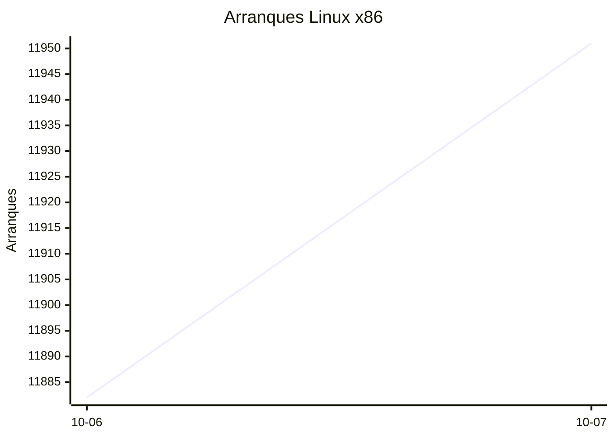
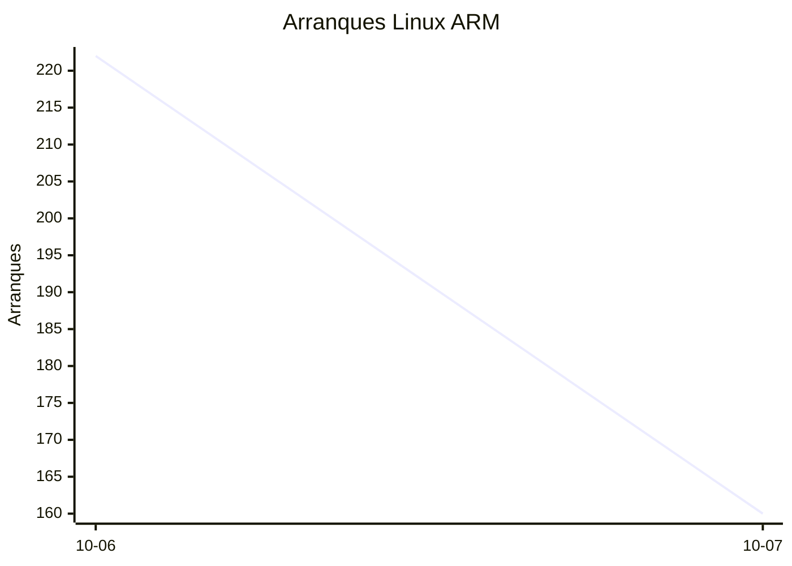
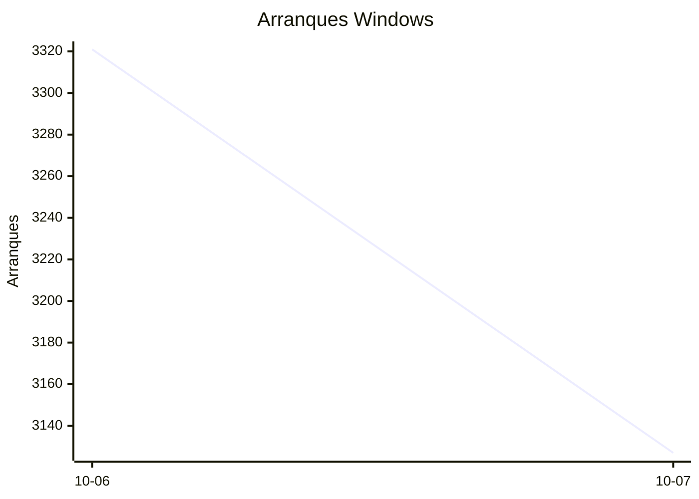

# Estadísticas de EmuDeck

Actualizado: 2026-10-08 20:15 UTC. Las gráficas no incluyen el día de hoy porque aún está incompleto.

## Arranques de la app (comprobaciones de actualización)

Cada arranque descarga el `latest*.yml` de su sistema. Cuenta arranques, no personas.

| Sistema | Ayer | Últimos 7 días |
|---|---|---|
| Linux x86 | 11951 | 23833 |
| Linux ARM | 160 | 382 |
| Windows | 3127 | 6448 |
| Mac | 0 | 0 |

Instalaciones nuevas estimadas en Windows (7 días, `.exe` menos `.blockmap`): **239**

## Instalaciones de EmuDeck (beacons)

Cada `setup` descarga `system-<sistema>.txt` y cada instalación de un emulador `<emulador>-<plataforma>.txt`. Los emuladores cuentan también las actualizaciones. Histórico completo desde el primer día.

| Sistema | Ayer | Últimos 7 días | Últimos 30 días | Total |
|---|---|---|---|---|
| linux | 34 | 34 | 34 | 92 |
| linux-arm | 1 | 1 | 1 | 11 |
| windows | 5 | 5 | 5 | 21 |

### Por mes

| Mes | Linux | Linux ARM | Windows | Total |
|---|---|---|---|---|
| 2026-10 | 34 | 1 | 5 | 40 |

### Canal early (early + early-unstable)

Instalaciones de EmuDeck con el backend en una rama early, y cuántas de ellas instalan CloudSync.

| | Últimos 7 días | Últimos 30 días | Total |
|---|---|---|---|
| Instalaciones early | 29 | 29 | 85 |
| Con CloudSync | 58 | 58 | 177 |
| % con CloudSync | | | 208% |

### Por emulador

| Emulador | Linux (total) | Linux ARM (total) | Windows (total) | Últimos 7 días | Últimos 30 días | Total |
|---|---|---|---|---|---|---|
| pcsx2 | 230 | 8 | 32 | 95 | 95 | 270 |
| esde | 206 | 10 | 47 | 84 | 84 | 263 |
| duckstation | 222 | 19 | 12 | 87 | 87 | 253 |
| azahar | 206 | 18 | 27 | 88 | 88 | 251 |
| ryujinx | 192 | 20 | 25 | 84 | 84 | 237 |
| rpcs3 | 195 | 17 | 13 | 78 | 78 | 225 |
| cemu | 197 | 16 | 8 | 80 | 80 | 221 |
| xenia | 176 | 17 | 22 | 79 | 79 | 215 |
| shadps4 | 175 | 17 | 16 | 81 | 81 | 208 |
| srm | 177 | 11 | 15 | 76 | 76 | 203 |
| vita3k | 178 | 16 | 5 | 68 | 68 | 199 |
| cloudsync | 115 | 4 | 64 | 60 | 60 | 183 |
| ra | 89 | 12 | 11 | 35 | 35 | 112 |
| dolphin | 84 | 12 | 13 | 34 | 34 | 109 |
| ppsspp | 76 | 11 | 20 | 31 | 31 | 107 |
| melonds | 73 | 10 | 10 | 31 | 31 | 93 |
| mgba | 73 | 8 | 5 | 35 | 35 | 86 |
| xemu | 65 | 9 | 12 | 26 | 26 | 86 |
| primehack | 66 | 9 | 9 | 23 | 23 | 84 |
| model2 | 60 | 9 | 2 | 22 | 22 | 71 |
| scummvm | 58 | 7 | 6 | 22 | 22 | 71 |
| supermodel | 58 | 9 | 1 | 21 | 21 | 68 |
| bigpemu | 48 | 3 | 1 | 18 | 18 | 52 |
| armsx2 | 16 | 19 | 0 | 13 | 13 | 35 |
| flycast | 20 | 1 | 2 | 9 | 9 | 23 |
| rmg | 15 | 4 | 0 | 6 | 6 | 19 |
| mame | 12 | 0 | 3 | 2 | 2 | 15 |
| eden | 8 | 0 | 0 | 0 | 0 | 8 |
| pegasus | 3 | 0 | 0 | 1 | 1 | 3 |
| ares | 0 | 1 | 0 | 1 | 1 | 1 |
