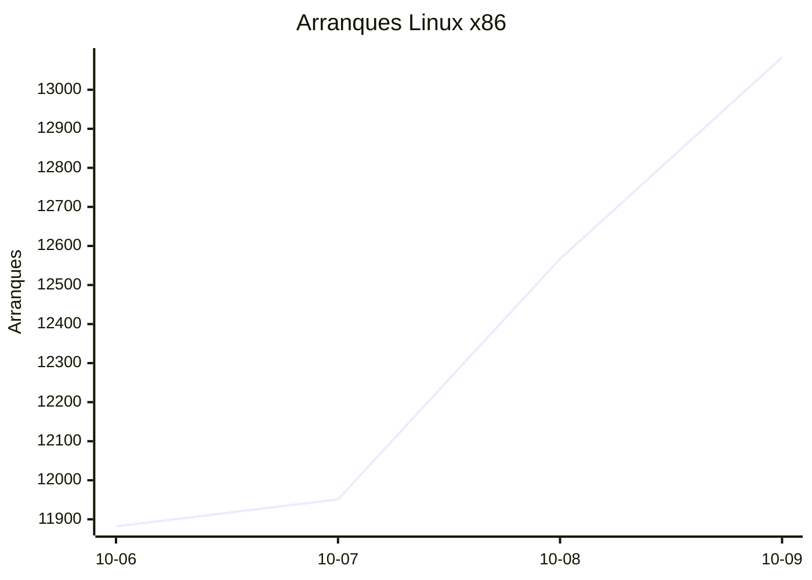
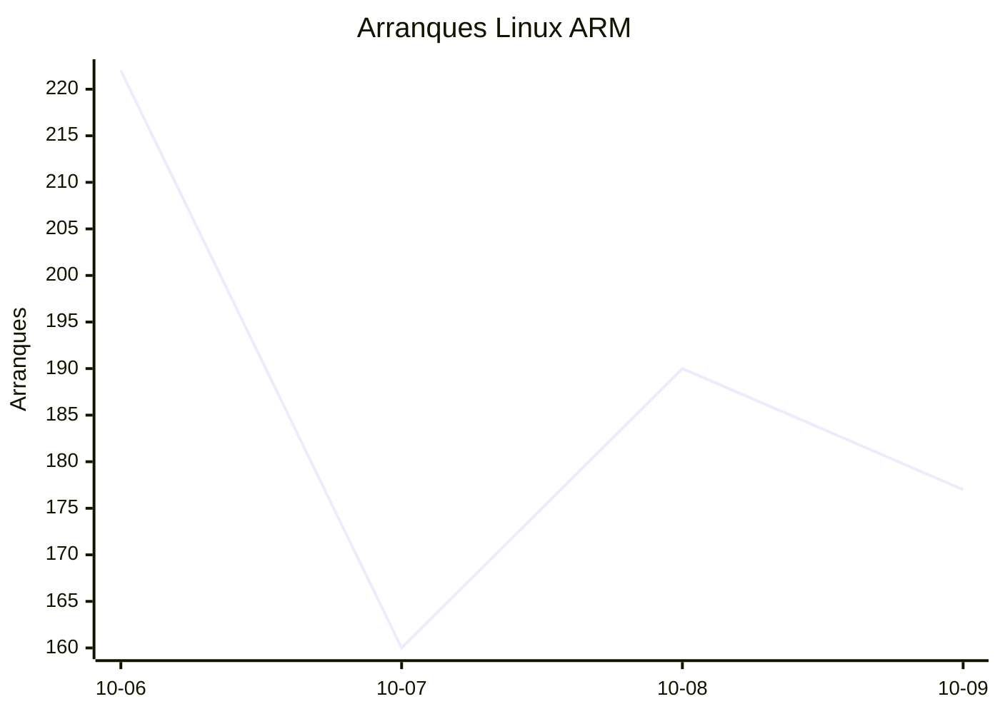
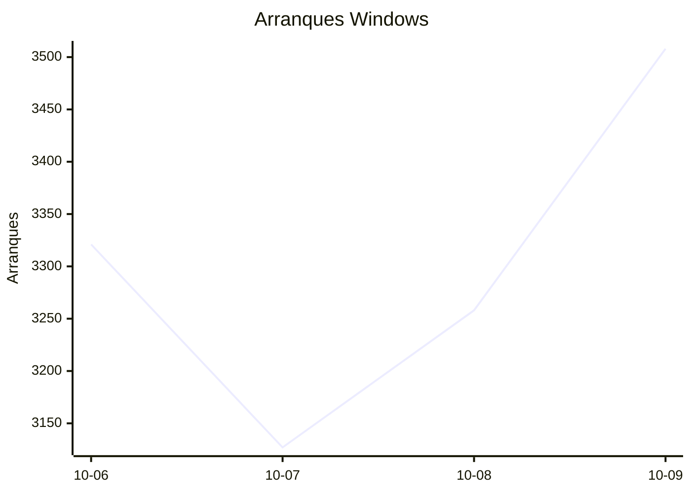
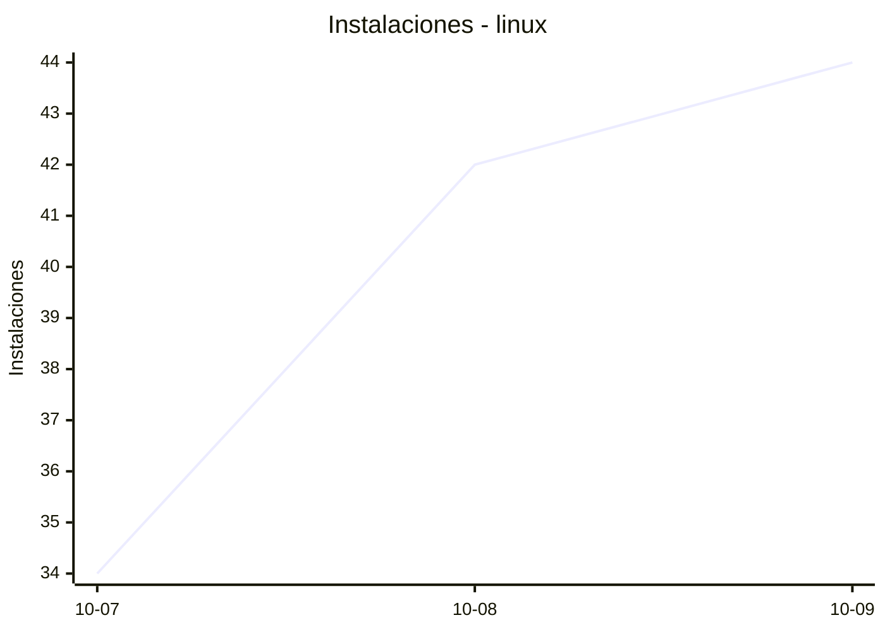
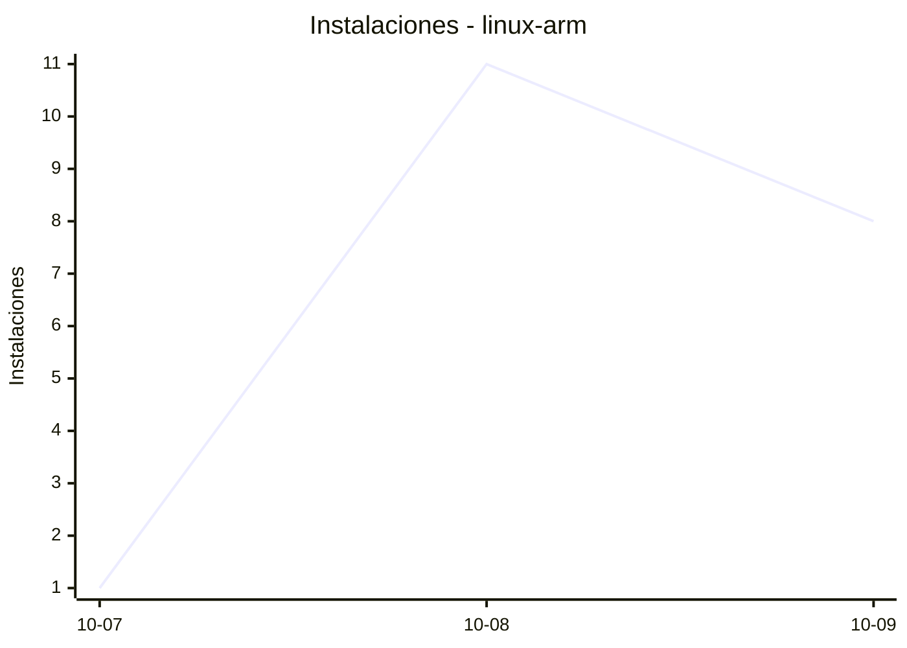
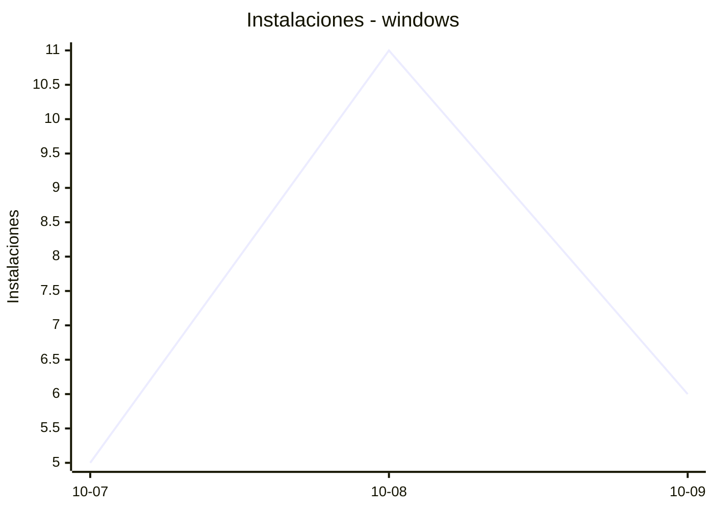
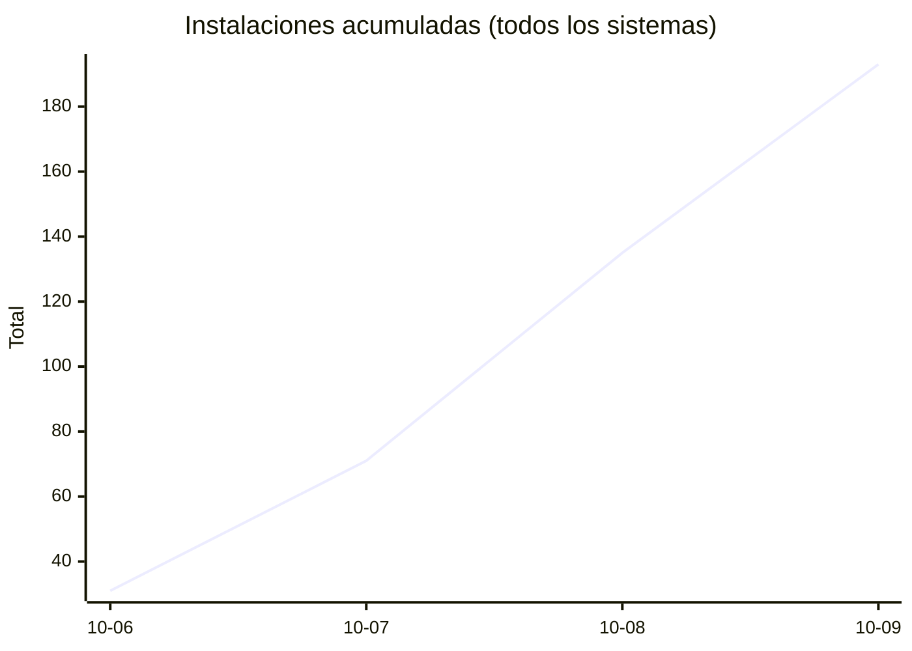
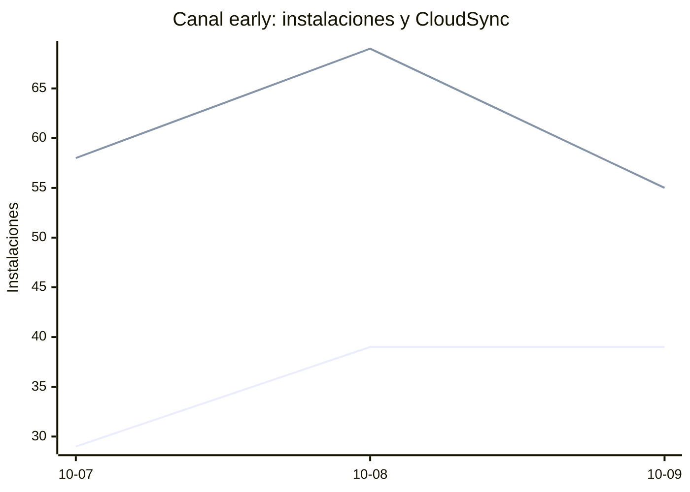

# Estadísticas de EmuDeck

Actualizado: 2026-10-10 07:18 UTC. Las gráficas no incluyen el día de hoy porque aún está incompleto.

## Arranques de la app (comprobaciones de actualización)

Cada arranque descarga el `latest*.yml` de su sistema. Cuenta arranques, no personas.

| Sistema | Ayer | Últimos 7 días |
|---|---|---|
| Linux x86 | 13083 | 49483 |
| Linux ARM | 177 | 749 |
| Windows | 3508 | 13214 |
| Mac | 0 | 0 |

Instalaciones nuevas estimadas en Windows (7 días, `.exe` menos `.blockmap`): **739**

## Instalaciones de EmuDeck (beacons)

Cada `setup` descarga `system-<sistema>.txt` y cada instalación de un emulador `<emulador>-<plataforma>.txt`. Los emuladores cuentan también las actualizaciones. Histórico completo desde el primer día.

| Sistema | Ayer | Últimos 7 días | Últimos 30 días | Total |
|---|---|---|---|---|
| linux | 44 | 120 | 120 | 150 |
| linux-arm | 8 | 20 | 20 | 27 |
| windows | 6 | 22 | 22 | 32 |

### Por mes

| Mes | Linux | Linux ARM | Windows | Total |
|---|---|---|---|---|
| 2026-10 | 120 | 20 | 22 | 162 |

### Canal early (early + early-unstable)

Instalaciones de EmuDeck con el backend en una rama early, y cuántas de ellas instalan CloudSync.

| | Últimos 7 días | Últimos 30 días | Total |
|---|---|---|---|
| Instalaciones early | 107 | 107 | 144 |
| Con CloudSync | 182 | 182 | 266 |
| % con CloudSync | | | 185% |

Línea de arriba: instalaciones early. Línea de abajo: de ellas, con CloudSync.

### Por emulador

| Emulador | Linux (total) | Linux ARM (total) | Windows (total) | Últimos 7 días | Últimos 30 días | Total |
|---|---|---|---|---|---|---|
| pcsx2 | 361 | 11 | 47 | 316 | 316 | 419 |
| esde | 309 | 31 | 73 | 288 | 288 | 413 |
| azahar | 320 | 40 | 46 | 301 | 301 | 406 |
| duckstation | 347 | 35 | 18 | 294 | 294 | 400 |
| ryujinx | 309 | 38 | 46 | 299 | 299 | 393 |
| cemu | 318 | 36 | 14 | 276 | 276 | 368 |
| rpcs3 | 308 | 34 | 18 | 269 | 269 | 360 |
| xenia | 282 | 30 | 31 | 259 | 259 | 343 |
| srm | 285 | 26 | 23 | 262 | 262 | 334 |
| shadps4 | 269 | 33 | 24 | 240 | 240 | 326 |
| vita3k | 284 | 30 | 9 | 233 | 233 | 323 |
| cloudsync | 187 | 10 | 82 | 192 | 192 | 279 |
| ra | 148 | 27 | 19 | 147 | 147 | 194 |
| dolphin | 139 | 26 | 21 | 141 | 141 | 186 |
| ppsspp | 126 | 24 | 29 | 135 | 135 | 179 |
| melonds | 118 | 19 | 15 | 113 | 113 | 152 |
| primehack | 111 | 21 | 15 | 113 | 113 | 147 |
| xemu | 109 | 20 | 16 | 109 | 109 | 145 |
| mgba | 118 | 14 | 10 | 109 | 109 | 142 |
| model2 | 106 | 22 | 2 | 99 | 99 | 130 |
| scummvm | 101 | 17 | 10 | 95 | 95 | 128 |
| supermodel | 102 | 22 | 4 | 97 | 97 | 128 |
| bigpemu | 78 | 3 | 1 | 59 | 59 | 82 |
| armsx2 | 25 | 38 | 0 | 48 | 48 | 63 |
| rmg | 30 | 10 | 0 | 32 | 32 | 40 |
| flycast | 33 | 2 | 3 | 28 | 28 | 38 |
| mame | 24 | 1 | 5 | 24 | 24 | 30 |
| eden | 10 | 0 | 0 | 2 | 2 | 10 |
| pegasus | 4 | 0 | 1 | 3 | 3 | 5 |
| ares | 1 | 1 | 0 | 2 | 2 | 2 |
| yuzu | 1 | 0 | 0 | 1 | 1 | 1 |
