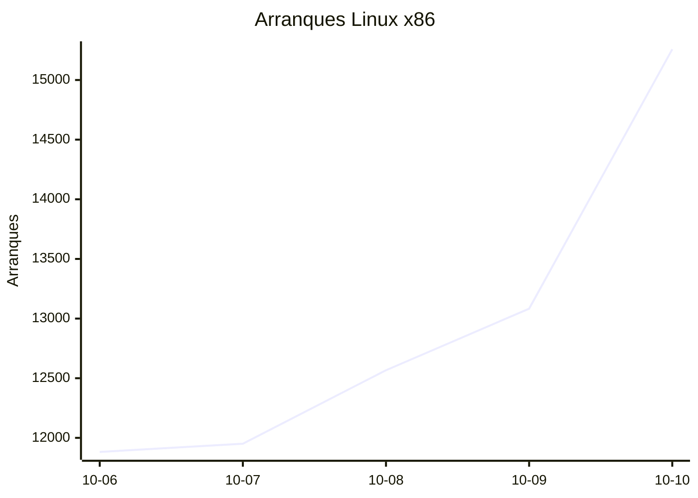
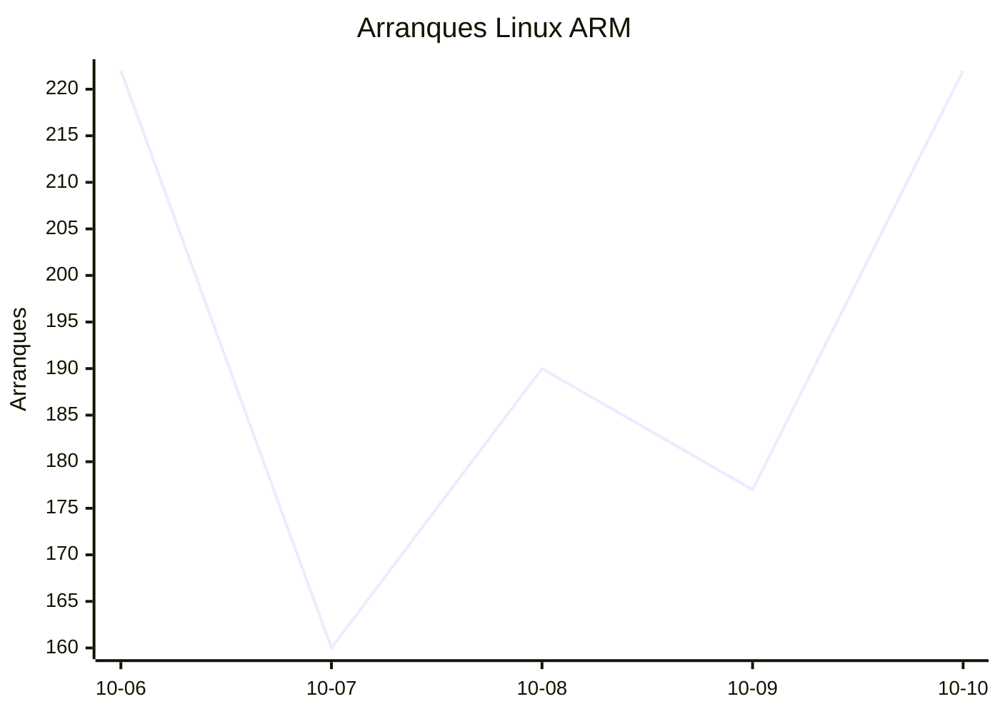
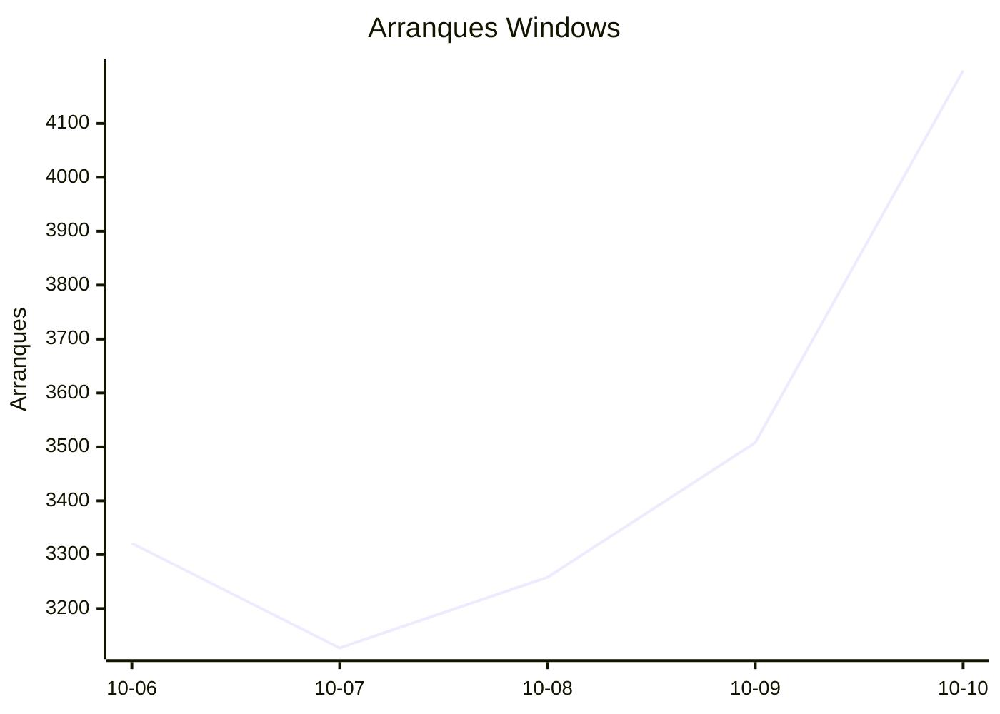
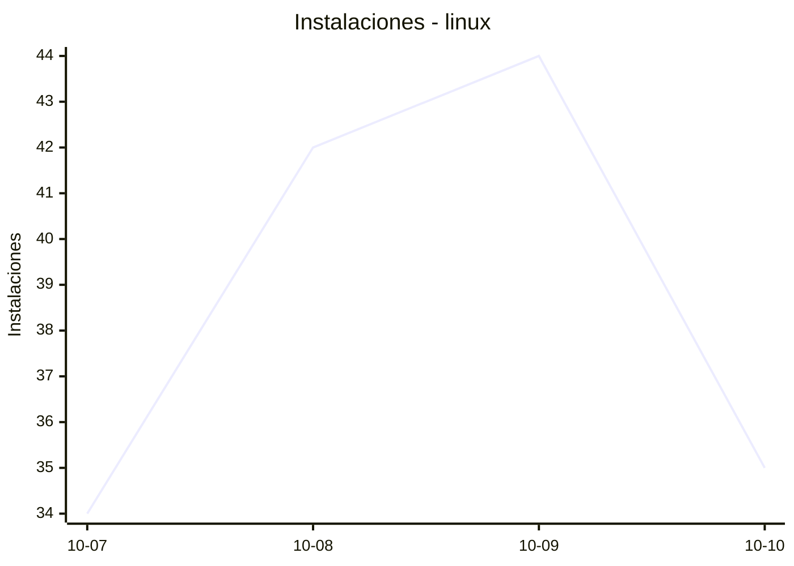
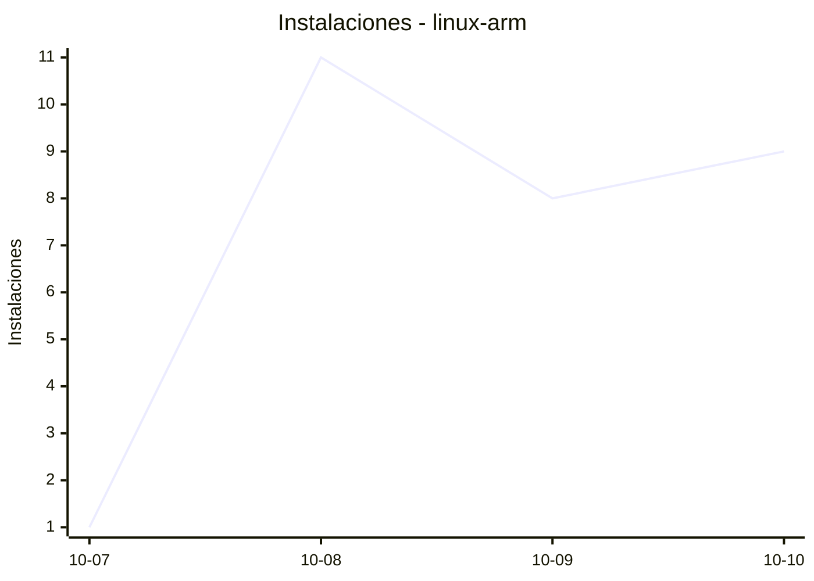
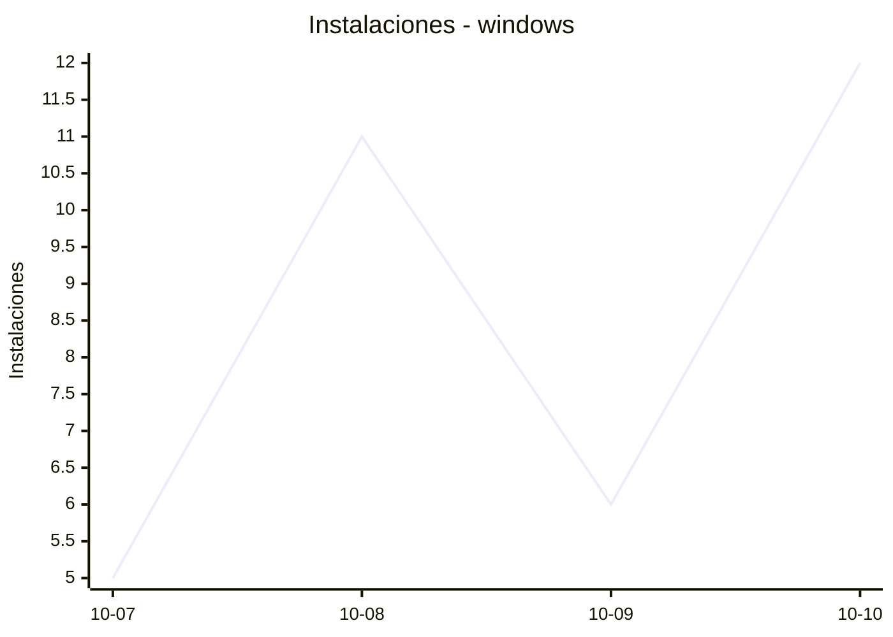
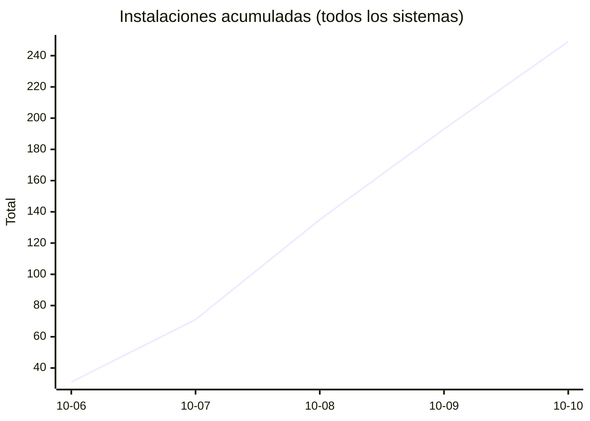
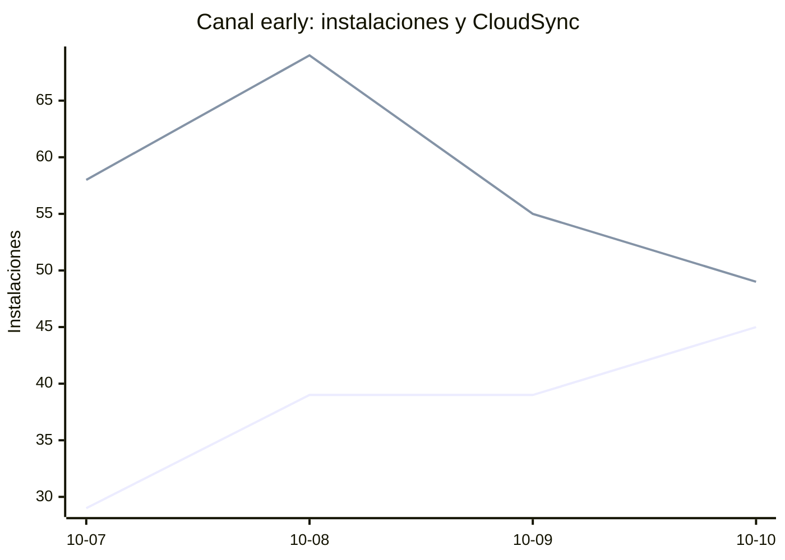

# Estadísticas de EmuDeck

Actualizado: 2026-10-11 00:46 UTC. Las gráficas no incluyen el día de hoy porque aún está incompleto.

## Arranques de la app (comprobaciones de actualización)

Cada arranque descarga el `latest*.yml` de su sistema. Cuenta arranques, no personas.

| Sistema | Ayer | Últimos 7 días |
|---|---|---|
| Linux x86 | 15258 | 64741 |
| Linux ARM | 222 | 971 |
| Windows | 4198 | 17412 |
| Mac | 0 | 0 |

Instalaciones nuevas estimadas en Windows (7 días, `.exe` menos `.blockmap`): **968**

## Instalaciones de EmuDeck (beacons)

Cada `setup` descarga `system-<sistema>.txt` y cada instalación de un emulador `<emulador>-<plataforma>.txt`. Los emuladores cuentan también las actualizaciones. Histórico completo desde el primer día.

| Sistema | Ayer | Últimos 7 días | Últimos 30 días | Total |
|---|---|---|---|---|
| linux | 35 | 155 | 155 | 181 |
| linux-arm | 9 | 29 | 29 | 32 |
| windows | 12 | 34 | 34 | 41 |

### Por mes

| Mes | Linux | Linux ARM | Windows | Total |
|---|---|---|---|---|
| 2026-10 | 155 | 29 | 34 | 218 |

### Canal early (early + early-unstable)

Instalaciones de EmuDeck con el backend en una rama early, y cuántas de ellas instalan CloudSync.

| | Últimos 7 días | Últimos 30 días | Total |
|---|---|---|---|
| Instalaciones early | 152 | 152 | 177 |
| Con CloudSync | 231 | 231 | 298 |
| % con CloudSync | | | 168% |

Línea de arriba: instalaciones early. Línea de abajo: de ellas, con CloudSync.

### Por emulador

| Emulador | Linux (total) | Linux ARM (total) | Windows (total) | Últimos 7 días | Últimos 30 días | Total |
|---|---|---|---|---|---|---|
| pcsx2 | 454 | 11 | 58 | 441 | 441 | 523 |
| esde | 384 | 37 | 92 | 415 | 415 | 513 |
| azahar | 404 | 42 | 58 | 422 | 422 | 504 |
| duckstation | 437 | 40 | 19 | 416 | 416 | 496 |
| ryujinx | 386 | 43 | 56 | 412 | 412 | 485 |
| rpcs3 | 398 | 39 | 20 | 385 | 385 | 457 |
| cemu | 398 | 41 | 15 | 386 | 386 | 454 |
| xenia | 352 | 35 | 39 | 362 | 362 | 426 |
| srm | 358 | 27 | 30 | 365 | 365 | 415 |
| shadps4 | 341 | 38 | 29 | 341 | 341 | 408 |
| vita3k | 352 | 35 | 11 | 332 | 332 | 398 |
| cloudsync | 214 | 13 | 86 | 244 | 244 | 313 |
| ra | 177 | 32 | 20 | 196 | 196 | 229 |
| dolphin | 171 | 31 | 21 | 189 | 189 | 223 |
| ppsspp | 156 | 29 | 38 | 187 | 187 | 223 |
| mgba | 158 | 17 | 12 | 164 | 164 | 187 |
| melonds | 145 | 21 | 16 | 150 | 150 | 182 |
| xemu | 140 | 22 | 19 | 153 | 153 | 181 |
| primehack | 133 | 23 | 20 | 150 | 150 | 176 |
| model2 | 126 | 27 | 2 | 133 | 133 | 155 |
| scummvm | 120 | 22 | 12 | 129 | 129 | 154 |
| supermodel | 121 | 27 | 5 | 130 | 130 | 153 |
| bigpemu | 116 | 3 | 2 | 101 | 101 | 121 |
| armsx2 | 32 | 43 | 0 | 65 | 65 | 75 |
| flycast | 39 | 5 | 4 | 42 | 42 | 48 |
| rmg | 35 | 10 | 0 | 41 | 41 | 45 |
| mame | 29 | 1 | 6 | 32 | 32 | 36 |
| eden | 10 | 2 | 0 | 4 | 4 | 12 |
| pegasus | 5 | 0 | 1 | 3 | 3 | 6 |
| ares | 1 | 1 | 0 | 2 | 2 | 2 |
| yuzu | 2 | 0 | 0 | 2 | 2 | 2 |
