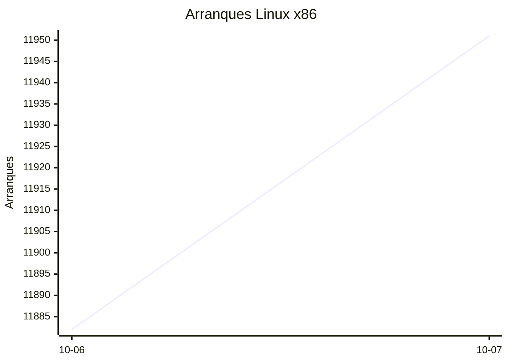
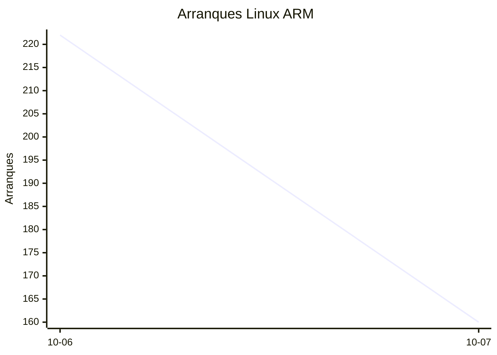
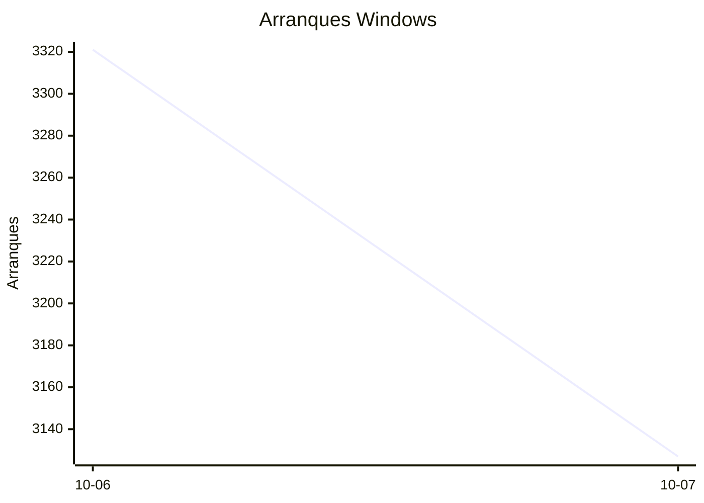

# Estadísticas de EmuDeck

Actualizado: 2026-10-08 12:53 UTC. Las gráficas no incluyen el día de hoy porque aún está incompleto.

## Arranques de la app (comprobaciones de actualización)

Cada arranque descarga el `latest*.yml` de su sistema. Cuenta arranques, no personas.

| Sistema | Ayer | Últimos 7 días |
|---|---|---|
| Linux x86 | 11951 | 23833 |
| Linux ARM | 160 | 382 |
| Windows | 3127 | 6448 |
| Mac | 0 | 0 |

Instalaciones nuevas estimadas en Windows (7 días, `.exe` menos `.blockmap`): **239**

## Instalaciones de EmuDeck (beacons)

Cada `setup` descarga `system-<sistema>.txt` y cada instalación de un emulador `<emulador>-<plataforma>.txt`. Los emuladores cuentan también las actualizaciones. Histórico completo desde el primer día.

| Sistema | Ayer | Últimos 7 días | Últimos 30 días | Total |
|---|---|---|---|---|
| linux | 34 | 34 | 34 | 79 |
| linux-arm | 1 | 1 | 1 | 6 |
| windows | 5 | 5 | 5 | 19 |

### Por mes

| Mes | Linux | Linux ARM | Windows | Total |
|---|---|---|---|---|
| 2026-10 | 34 | 1 | 5 | 40 |

### Canal early (early + early-unstable)

Instalaciones de EmuDeck con el backend en una rama early, y cuántas de ellas instalan CloudSync.

| | Últimos 7 días | Últimos 30 días | Total |
|---|---|---|---|
| Instalaciones early | 29 | 29 | 79 |
| Con CloudSync | 58 | 58 | 164 |
| % con CloudSync | | | 208% |

### Por emulador

| Emulador | Linux (total) | Linux ARM (total) | Windows (total) | Últimos 7 días | Últimos 30 días | Total |
|---|---|---|---|---|---|---|
| pcsx2 | 203 | 5 | 29 | 95 | 95 | 237 |
| esde | 176 | 10 | 40 | 84 | 84 | 226 |
| duckstation | 198 | 14 | 12 | 87 | 87 | 224 |
| azahar | 184 | 13 | 24 | 88 | 88 | 221 |
| ryujinx | 159 | 15 | 21 | 84 | 84 | 195 |
| rpcs3 | 171 | 12 | 11 | 78 | 78 | 194 |
| cemu | 171 | 13 | 8 | 80 | 80 | 192 |
| xenia | 153 | 14 | 17 | 79 | 79 | 184 |
| shadps4 | 157 | 14 | 12 | 81 | 81 | 183 |
| vita3k | 157 | 13 | 5 | 68 | 68 | 175 |
| srm | 149 | 9 | 13 | 76 | 76 | 171 |
| cloudsync | 107 | 3 | 59 | 60 | 60 | 169 |
| ra | 78 | 5 | 11 | 35 | 35 | 94 |
| dolphin | 75 | 7 | 11 | 34 | 34 | 93 |
| ppsspp | 68 | 6 | 19 | 31 | 31 | 93 |
| melonds | 63 | 7 | 10 | 31 | 31 | 80 |
| mgba | 64 | 8 | 5 | 35 | 35 | 77 |
| xemu | 57 | 6 | 11 | 26 | 26 | 74 |
| primehack | 58 | 4 | 9 | 23 | 23 | 71 |
| scummvm | 52 | 4 | 6 | 22 | 22 | 62 |
| model2 | 53 | 6 | 2 | 22 | 22 | 61 |
| supermodel | 52 | 6 | 1 | 21 | 21 | 59 |
| bigpemu | 45 | 3 | 1 | 18 | 18 | 49 |
| armsx2 | 14 | 14 | 0 | 13 | 13 | 28 |
| flycast | 19 | 1 | 2 | 9 | 9 | 22 |
| rmg | 15 | 1 | 0 | 6 | 6 | 16 |
| mame | 11 | 0 | 3 | 2 | 2 | 14 |
| eden | 8 | 0 | 0 | 0 | 0 | 8 |
| pegasus | 3 | 0 | 0 | 1 | 1 | 3 |
| ares | 0 | 1 | 0 | 1 | 1 | 1 |
