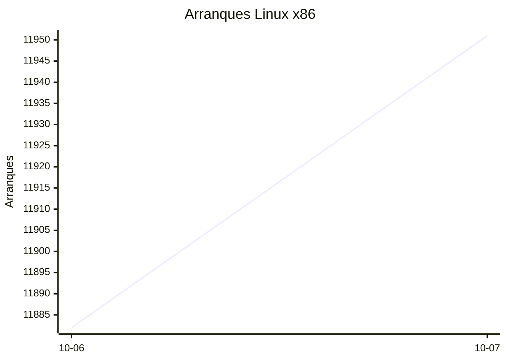
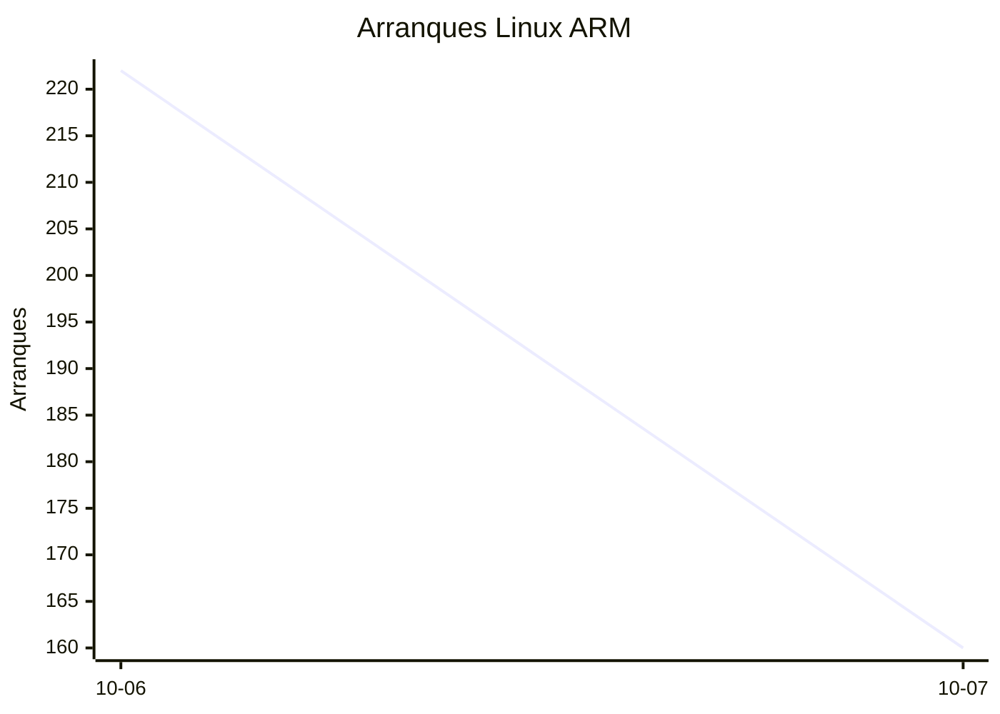
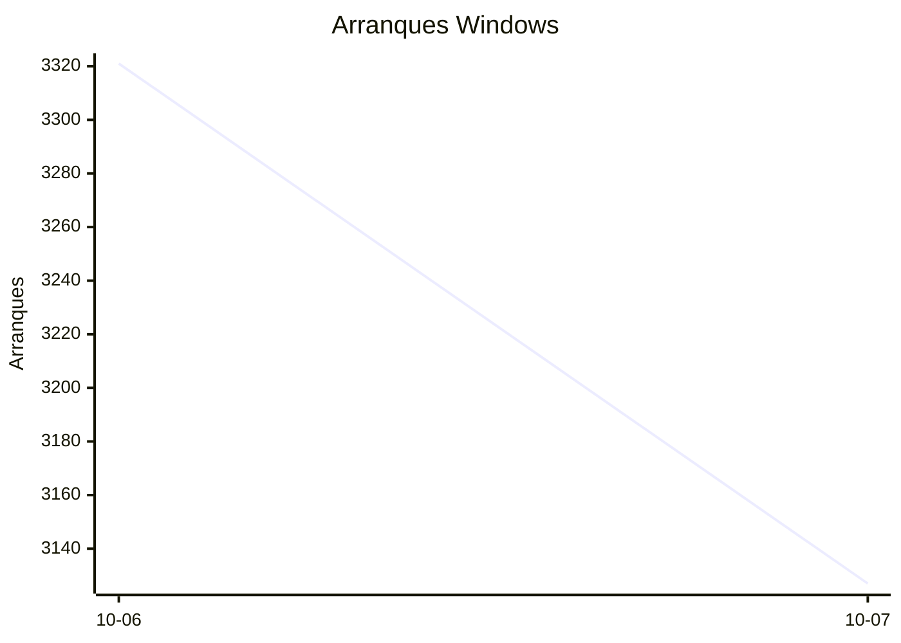

# Estadísticas de EmuDeck

Actualizado: 2026-10-08 01:34 UTC. Las gráficas no incluyen el día de hoy porque aún está incompleto.

## Arranques de la app (comprobaciones de actualización)

Cada arranque descarga el `latest*.yml` de su sistema. Cuenta arranques, no personas.

| Sistema | Ayer | Últimos 7 días |
|---|---|---|
| Linux x86 | 11951 | 23833 |
| Linux ARM | 160 | 382 |
| Windows | 3127 | 6448 |
| Mac | 0 | 0 |

Instalaciones nuevas estimadas en Windows (7 días, `.exe` menos `.blockmap`): **239**

## Instalaciones de EmuDeck (beacons)

Cada `setup` descarga `system-<sistema>.txt` y cada instalación de un emulador `<emulador>-<plataforma>.txt`. Los emuladores cuentan también las actualizaciones. Histórico completo desde el primer día.

| Sistema | Ayer | Últimos 7 días | Últimos 30 días | Total |
|---|---|---|---|---|
| linux | 34 | 34 | 34 | 60 |
| linux-arm | 1 | 1 | 1 | 5 |
| windows | 5 | 5 | 5 | 14 |

### Por mes

| Mes | Linux | Linux ARM | Windows | Total |
|---|---|---|---|---|
| 2026-10 | 34 | 1 | 5 | 40 |

### Canal early (early + early-unstable)

Instalaciones de EmuDeck con el backend en una rama early, y cuántas de ellas instalan CloudSync.

| | Últimos 7 días | Últimos 30 días | Total |
|---|---|---|---|
| Instalaciones early | 29 | 29 | 58 |
| Con CloudSync | 58 | 58 | 134 |
| % con CloudSync | | | 231% |

### Por emulador

| Emulador | Linux (total) | Linux ARM (total) | Windows (total) | Últimos 7 días | Últimos 30 días | Total |
|---|---|---|---|---|---|---|
| esde | 145 | 9 | 37 | 84 | 84 | 191 |
| pcsx2 | 158 | 4 | 20 | 95 | 95 | 182 |
| azahar | 147 | 12 | 17 | 88 | 88 | 176 |
| duckstation | 154 | 12 | 8 | 87 | 87 | 174 |
| ryujinx | 130 | 14 | 15 | 84 | 84 | 159 |
| rpcs3 | 138 | 11 | 8 | 78 | 78 | 157 |
| shadps4 | 131 | 12 | 10 | 81 | 81 | 153 |
| cemu | 135 | 11 | 6 | 80 | 80 | 152 |
| xenia | 123 | 12 | 12 | 79 | 79 | 147 |
| vita3k | 126 | 11 | 4 | 68 | 68 | 141 |
| cloudsync | 85 | 3 | 50 | 60 | 60 | 138 |
| srm | 115 | 8 | 8 | 76 | 76 | 131 |
| dolphin | 54 | 6 | 9 | 34 | 34 | 69 |
| ppsspp | 50 | 5 | 14 | 31 | 31 | 69 |
| ra | 57 | 5 | 7 | 35 | 35 | 69 |
| melonds | 50 | 5 | 7 | 31 | 31 | 62 |
| mgba | 50 | 8 | 2 | 35 | 35 | 60 |
| xemu | 42 | 5 | 8 | 26 | 26 | 55 |
| primehack | 41 | 4 | 6 | 23 | 23 | 51 |
| scummvm | 40 | 4 | 4 | 22 | 22 | 48 |
| model2 | 41 | 5 | 0 | 22 | 22 | 46 |
| supermodel | 40 | 5 | 0 | 21 | 21 | 45 |
| bigpemu | 36 | 3 | 0 | 18 | 18 | 39 |
| armsx2 | 12 | 13 | 0 | 13 | 13 | 25 |
| flycast | 14 | 1 | 1 | 9 | 9 | 16 |
| rmg | 12 | 1 | 0 | 6 | 6 | 13 |
| eden | 8 | 0 | 0 | 0 | 0 | 8 |
| mame | 7 | 0 | 1 | 2 | 2 | 8 |
| pegasus | 3 | 0 | 0 | 1 | 1 | 3 |
| ares | 0 | 1 | 0 | 1 | 1 | 1 |
