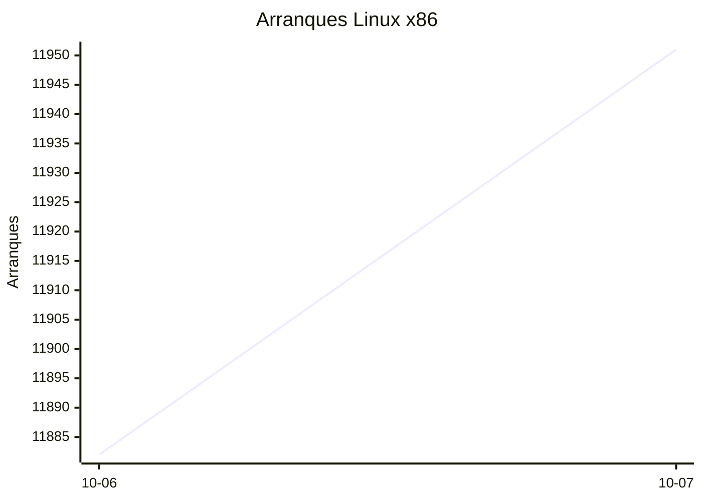
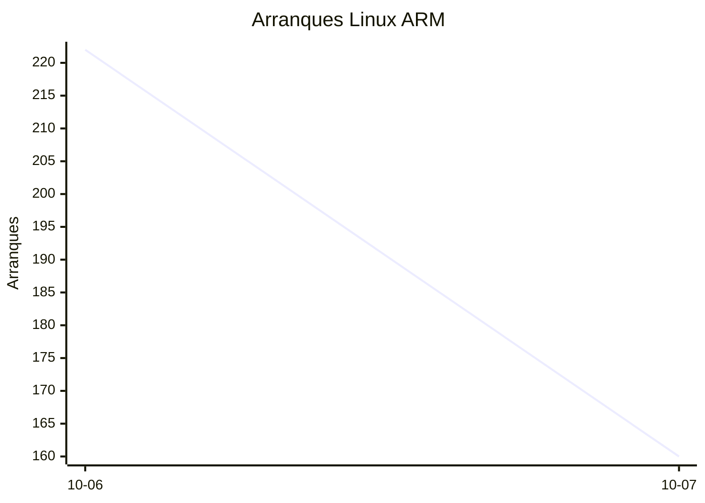
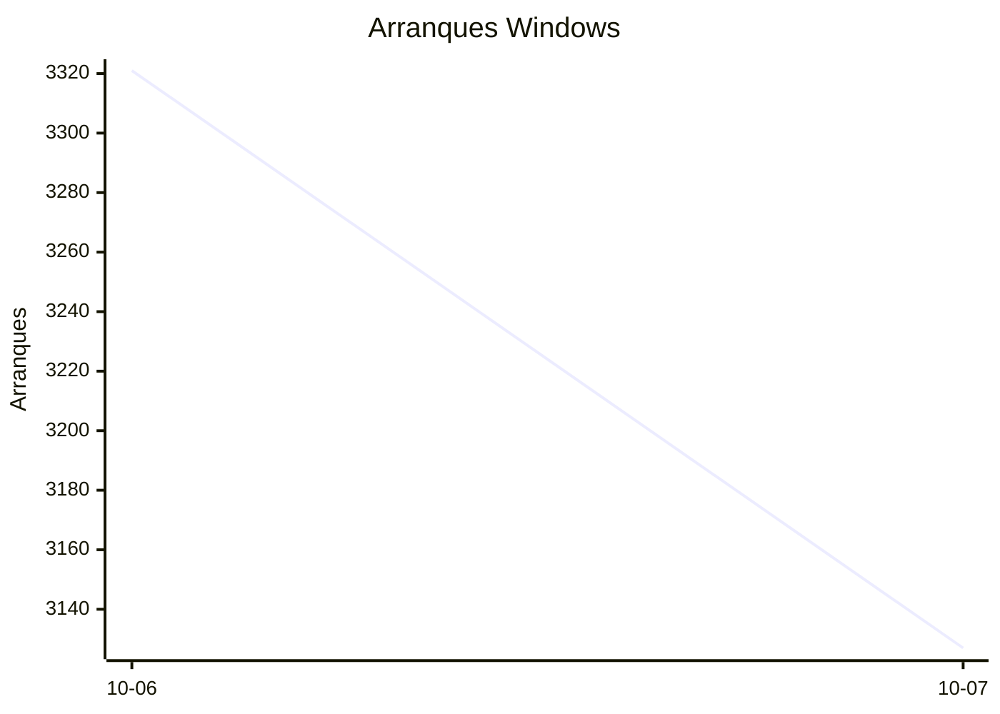

# Estadísticas de EmuDeck

Actualizado: 2026-10-08 02:27 UTC. Las gráficas no incluyen el día de hoy porque aún está incompleto.

## Arranques de la app (comprobaciones de actualización)

Cada arranque descarga el `latest*.yml` de su sistema. Cuenta arranques, no personas.

| Sistema | Ayer | Últimos 7 días |
|---|---|---|
| Linux x86 | 11951 | 23833 |
| Linux ARM | 160 | 382 |
| Windows | 3127 | 6448 |
| Mac | 0 | 0 |

Instalaciones nuevas estimadas en Windows (7 días, `.exe` menos `.blockmap`): **239**

## Instalaciones de EmuDeck (beacons)

Cada `setup` descarga `system-<sistema>.txt` y cada instalación de un emulador `<emulador>-<plataforma>.txt`. Los emuladores cuentan también las actualizaciones. Histórico completo desde el primer día.

| Sistema | Ayer | Últimos 7 días | Últimos 30 días | Total |
|---|---|---|---|---|
| linux | 34 | 34 | 34 | 64 |
| linux-arm | 1 | 1 | 1 | 5 |
| windows | 5 | 5 | 5 | 17 |

### Por mes

| Mes | Linux | Linux ARM | Windows | Total |
|---|---|---|---|---|
| 2026-10 | 34 | 1 | 5 | 40 |

### Canal early (early + early-unstable)

Instalaciones de EmuDeck con el backend en una rama early, y cuántas de ellas instalan CloudSync.

| | Últimos 7 días | Últimos 30 días | Total |
|---|---|---|---|
| Instalaciones early | 29 | 29 | 64 |
| Con CloudSync | 58 | 58 | 144 |
| % con CloudSync | | | 225% |

### Por emulador

| Emulador | Linux (total) | Linux ARM (total) | Windows (total) | Últimos 7 días | Últimos 30 días | Total |
|---|---|---|---|---|---|---|
| esde | 152 | 9 | 39 | 84 | 84 | 200 |
| pcsx2 | 168 | 4 | 22 | 95 | 95 | 194 |
| azahar | 153 | 12 | 19 | 88 | 88 | 184 |
| duckstation | 161 | 12 | 8 | 87 | 87 | 181 |
| ryujinx | 136 | 14 | 16 | 84 | 84 | 166 |
| rpcs3 | 144 | 11 | 8 | 78 | 78 | 163 |
| cemu | 141 | 11 | 6 | 80 | 80 | 158 |
| shadps4 | 135 | 12 | 10 | 81 | 81 | 157 |
| xenia | 129 | 12 | 12 | 79 | 79 | 153 |
| cloudsync | 88 | 3 | 57 | 60 | 60 | 148 |
| vita3k | 133 | 11 | 4 | 68 | 68 | 148 |
| srm | 120 | 8 | 9 | 76 | 76 | 137 |
| dolphin | 59 | 6 | 9 | 34 | 34 | 74 |
| ppsspp | 54 | 5 | 15 | 31 | 31 | 74 |
| ra | 61 | 5 | 7 | 35 | 35 | 73 |
| melonds | 53 | 5 | 7 | 31 | 31 | 65 |
| mgba | 53 | 8 | 2 | 35 | 35 | 63 |
| xemu | 45 | 5 | 8 | 26 | 26 | 58 |
| primehack | 45 | 4 | 6 | 23 | 23 | 55 |
| scummvm | 43 | 4 | 4 | 22 | 22 | 51 |
| model2 | 44 | 5 | 0 | 22 | 22 | 49 |
| supermodel | 43 | 5 | 0 | 21 | 21 | 48 |
| bigpemu | 37 | 3 | 0 | 18 | 18 | 40 |
| armsx2 | 12 | 13 | 0 | 13 | 13 | 25 |
| flycast | 15 | 1 | 1 | 9 | 9 | 17 |
| rmg | 13 | 1 | 0 | 6 | 6 | 14 |
| mame | 8 | 0 | 1 | 2 | 2 | 9 |
| eden | 8 | 0 | 0 | 0 | 0 | 8 |
| pegasus | 3 | 0 | 0 | 1 | 1 | 3 |
| ares | 0 | 1 | 0 | 1 | 1 | 1 |
