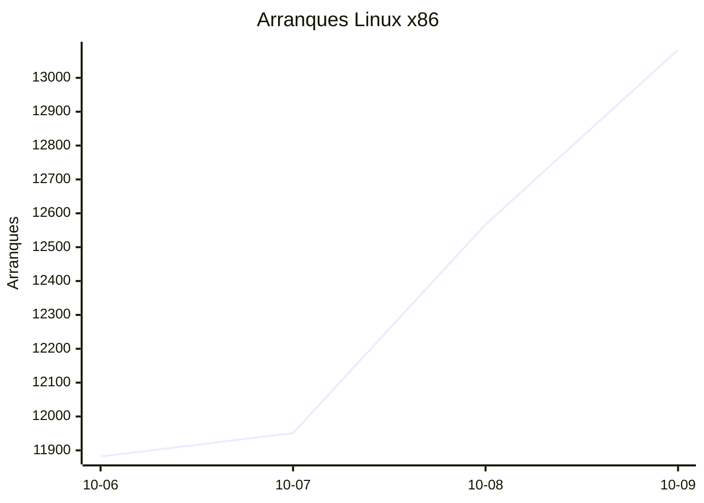
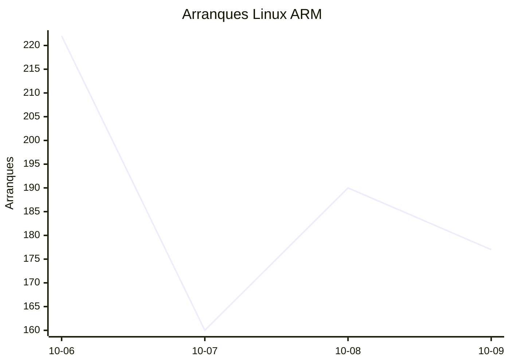
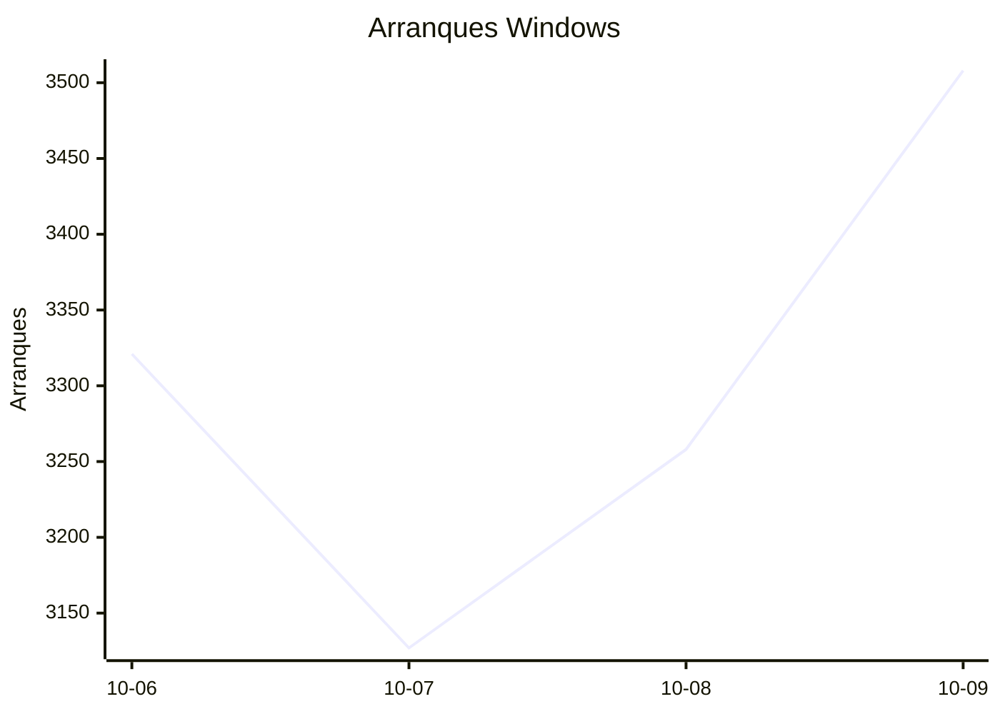
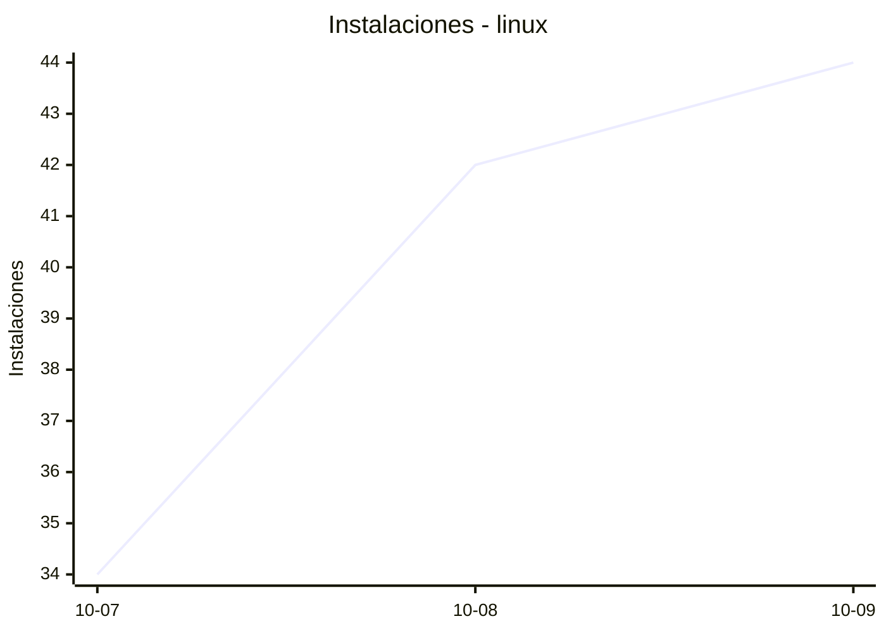
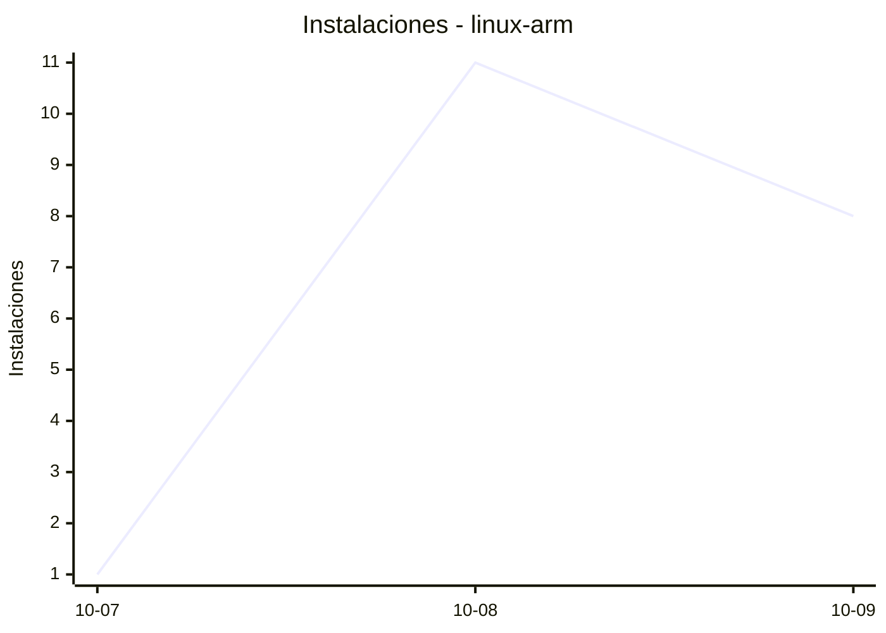
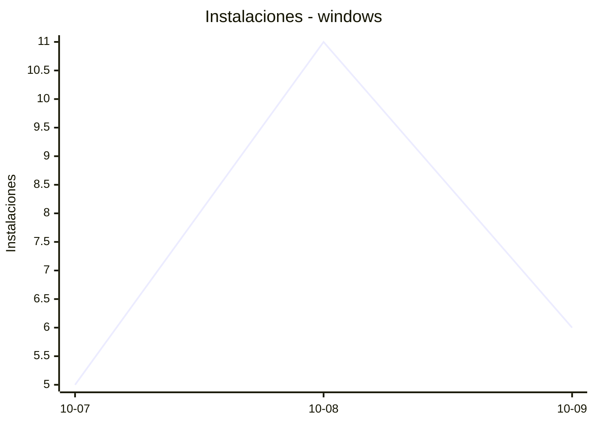
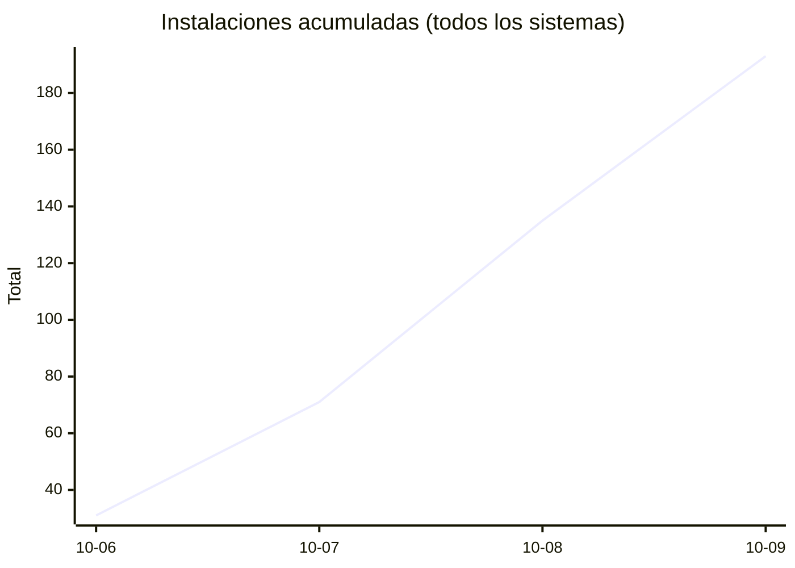
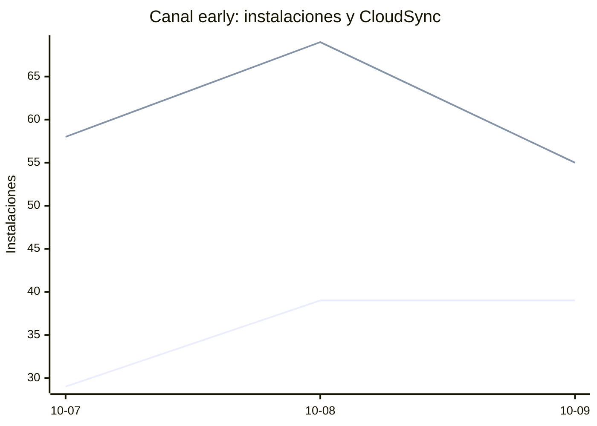

# Estadísticas de EmuDeck

Actualizado: 2026-10-10 15:39 UTC. Las gráficas no incluyen el día de hoy porque aún está incompleto.

## Arranques de la app (comprobaciones de actualización)

Cada arranque descarga el `latest*.yml` de su sistema. Cuenta arranques, no personas.

| Sistema | Ayer | Últimos 7 días |
|---|---|---|
| Linux x86 | 13083 | 49483 |
| Linux ARM | 177 | 749 |
| Windows | 3508 | 13214 |
| Mac | 0 | 0 |

Instalaciones nuevas estimadas en Windows (7 días, `.exe` menos `.blockmap`): **739**

## Instalaciones de EmuDeck (beacons)

Cada `setup` descarga `system-<sistema>.txt` y cada instalación de un emulador `<emulador>-<plataforma>.txt`. Los emuladores cuentan también las actualizaciones. Histórico completo desde el primer día.

| Sistema | Ayer | Últimos 7 días | Últimos 30 días | Total |
|---|---|---|---|---|
| linux | 44 | 120 | 120 | 159 |
| linux-arm | 8 | 20 | 20 | 31 |
| windows | 6 | 22 | 22 | 36 |

### Por mes

| Mes | Linux | Linux ARM | Windows | Total |
|---|---|---|---|---|
| 2026-10 | 120 | 20 | 22 | 162 |

### Canal early (early + early-unstable)

Instalaciones de EmuDeck con el backend en una rama early, y cuántas de ellas instalan CloudSync.

| | Últimos 7 días | Últimos 30 días | Total |
|---|---|---|---|
| Instalaciones early | 107 | 107 | 156 |
| Con CloudSync | 182 | 182 | 278 |
| % con CloudSync | | | 178% |

Línea de arriba: instalaciones early. Línea de abajo: de ellas, con CloudSync.

### Por emulador

| Emulador | Linux (total) | Linux ARM (total) | Windows (total) | Últimos 7 días | Últimos 30 días | Total |
|---|---|---|---|---|---|---|
| pcsx2 | 387 | 11 | 51 | 316 | 316 | 449 |
| esde | 331 | 36 | 78 | 288 | 288 | 445 |
| azahar | 342 | 41 | 51 | 301 | 301 | 434 |
| duckstation | 372 | 39 | 18 | 294 | 294 | 429 |
| ryujinx | 335 | 42 | 51 | 299 | 299 | 428 |
| cemu | 342 | 40 | 14 | 276 | 276 | 396 |
| rpcs3 | 334 | 38 | 19 | 269 | 269 | 391 |
| xenia | 300 | 34 | 33 | 259 | 259 | 367 |
| srm | 306 | 27 | 27 | 262 | 262 | 360 |
| shadps4 | 289 | 37 | 25 | 240 | 240 | 351 |
| vita3k | 303 | 34 | 9 | 233 | 233 | 346 |
| cloudsync | 195 | 13 | 83 | 192 | 192 | 291 |
| ra | 154 | 31 | 20 | 147 | 147 | 205 |
| dolphin | 147 | 30 | 21 | 141 | 141 | 198 |
| ppsspp | 134 | 28 | 32 | 135 | 135 | 194 |
| melonds | 124 | 20 | 16 | 113 | 113 | 160 |
| mgba | 130 | 17 | 12 | 109 | 109 | 159 |
| primehack | 117 | 22 | 17 | 113 | 113 | 156 |
| xemu | 116 | 21 | 16 | 109 | 109 | 153 |
| model2 | 111 | 26 | 2 | 99 | 99 | 139 |
| scummvm | 106 | 21 | 11 | 95 | 95 | 138 |
| supermodel | 107 | 26 | 4 | 97 | 97 | 137 |
| bigpemu | 90 | 3 | 1 | 59 | 59 | 94 |
| armsx2 | 26 | 42 | 0 | 48 | 48 | 68 |
| flycast | 35 | 5 | 4 | 28 | 28 | 44 |
| rmg | 32 | 10 | 0 | 32 | 32 | 42 |
| mame | 26 | 1 | 6 | 24 | 24 | 33 |
| eden | 10 | 0 | 0 | 2 | 2 | 10 |
| pegasus | 4 | 0 | 1 | 3 | 3 | 5 |
| ares | 1 | 1 | 0 | 2 | 2 | 2 |
| yuzu | 1 | 0 | 0 | 1 | 1 | 1 |
