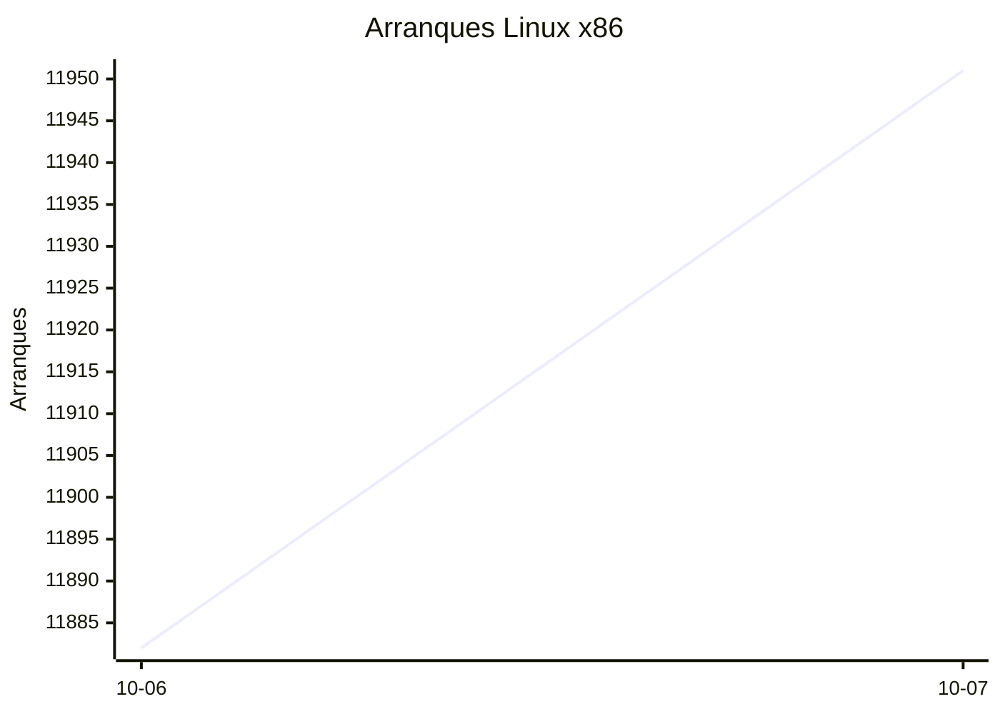
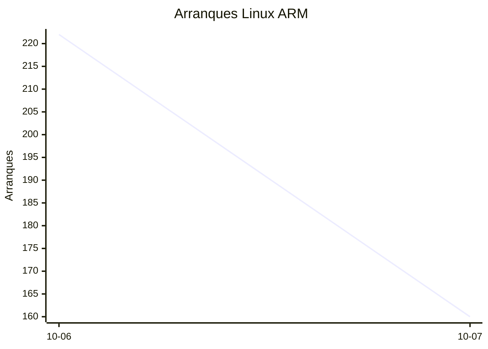
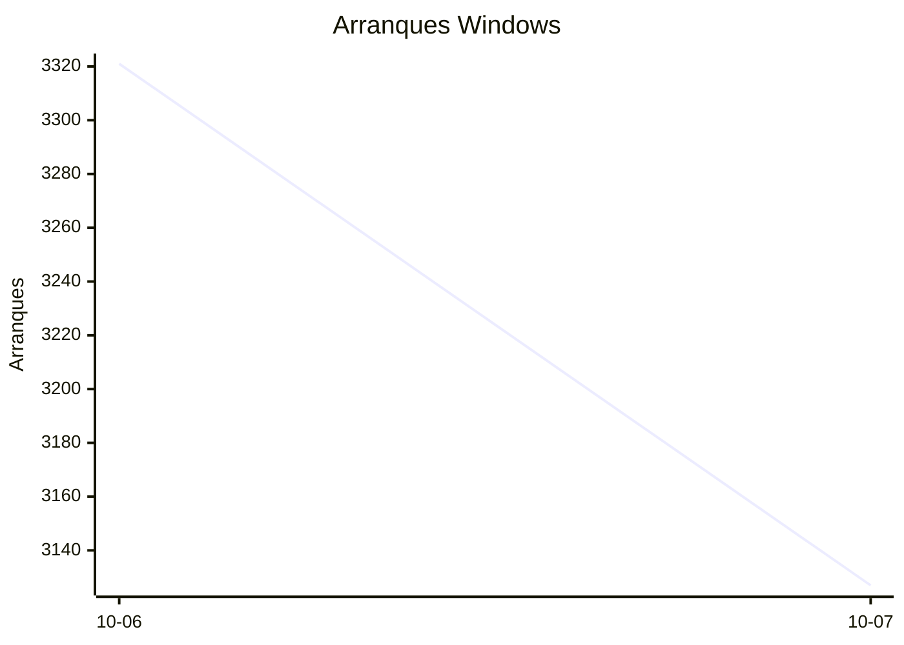

# Estadísticas de EmuDeck

Actualizado: 2026-10-08 04:18 UTC. Las gráficas no incluyen el día de hoy porque aún está incompleto.

## Arranques de la app (comprobaciones de actualización)

Cada arranque descarga el `latest*.yml` de su sistema. Cuenta arranques, no personas.

| Sistema | Ayer | Últimos 7 días |
|---|---|---|
| Linux x86 | 11951 | 23833 |
| Linux ARM | 160 | 382 |
| Windows | 3127 | 6448 |
| Mac | 0 | 0 |

Instalaciones nuevas estimadas en Windows (7 días, `.exe` menos `.blockmap`): **239**

## Instalaciones de EmuDeck (beacons)

Cada `setup` descarga `system-<sistema>.txt` y cada instalación de un emulador `<emulador>-<plataforma>.txt`. Los emuladores cuentan también las actualizaciones. Histórico completo desde el primer día.

| Sistema | Ayer | Últimos 7 días | Últimos 30 días | Total |
|---|---|---|---|---|
| linux | 34 | 34 | 34 | 73 |
| linux-arm | 1 | 1 | 1 | 5 |
| windows | 5 | 5 | 5 | 17 |

### Por mes

| Mes | Linux | Linux ARM | Windows | Total |
|---|---|---|---|---|
| 2026-10 | 34 | 1 | 5 | 40 |

### Canal early (early + early-unstable)

Instalaciones de EmuDeck con el backend en una rama early, y cuántas de ellas instalan CloudSync.

| | Últimos 7 días | Últimos 30 días | Total |
|---|---|---|---|
| Instalaciones early | 29 | 29 | 72 |
| Con CloudSync | 58 | 58 | 153 |
| % con CloudSync | | | 212% |

### Por emulador

| Emulador | Linux (total) | Linux ARM (total) | Windows (total) | Últimos 7 días | Últimos 30 días | Total |
|---|---|---|---|---|---|---|
| esde | 164 | 9 | 39 | 84 | 84 | 212 |
| pcsx2 | 185 | 4 | 23 | 95 | 95 | 212 |
| azahar | 172 | 12 | 20 | 88 | 88 | 204 |
| duckstation | 178 | 12 | 8 | 87 | 87 | 198 |
| ryujinx | 150 | 14 | 16 | 84 | 84 | 180 |
| rpcs3 | 158 | 11 | 8 | 78 | 78 | 177 |
| cemu | 157 | 11 | 6 | 80 | 80 | 174 |
| shadps4 | 147 | 12 | 10 | 81 | 81 | 169 |
| xenia | 144 | 12 | 13 | 79 | 79 | 169 |
| vita3k | 148 | 11 | 4 | 68 | 68 | 163 |
| cloudsync | 96 | 3 | 58 | 60 | 60 | 157 |
| srm | 133 | 8 | 10 | 76 | 76 | 151 |
| dolphin | 70 | 6 | 9 | 34 | 34 | 85 |
| ppsspp | 64 | 5 | 16 | 31 | 31 | 85 |
| ra | 72 | 5 | 7 | 35 | 35 | 84 |
| melonds | 60 | 5 | 7 | 31 | 31 | 72 |
| mgba | 58 | 8 | 2 | 35 | 35 | 68 |
| xemu | 54 | 5 | 9 | 26 | 26 | 68 |
| primehack | 53 | 4 | 7 | 23 | 23 | 64 |
| scummvm | 50 | 4 | 4 | 22 | 22 | 58 |
| model2 | 51 | 5 | 0 | 22 | 22 | 56 |
| supermodel | 50 | 5 | 0 | 21 | 21 | 55 |
| bigpemu | 40 | 3 | 0 | 18 | 18 | 43 |
| armsx2 | 13 | 13 | 0 | 13 | 13 | 26 |
| flycast | 17 | 1 | 1 | 9 | 9 | 19 |
| rmg | 14 | 1 | 0 | 6 | 6 | 15 |
| mame | 10 | 0 | 1 | 2 | 2 | 11 |
| eden | 8 | 0 | 0 | 0 | 0 | 8 |
| pegasus | 3 | 0 | 0 | 1 | 1 | 3 |
| ares | 0 | 1 | 0 | 1 | 1 | 1 |
