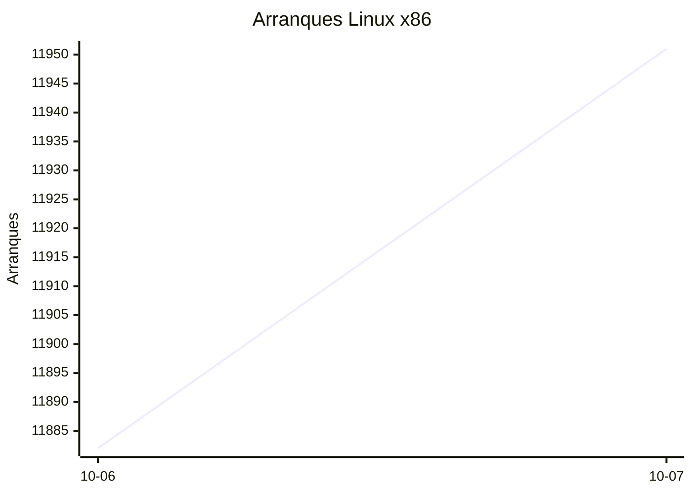
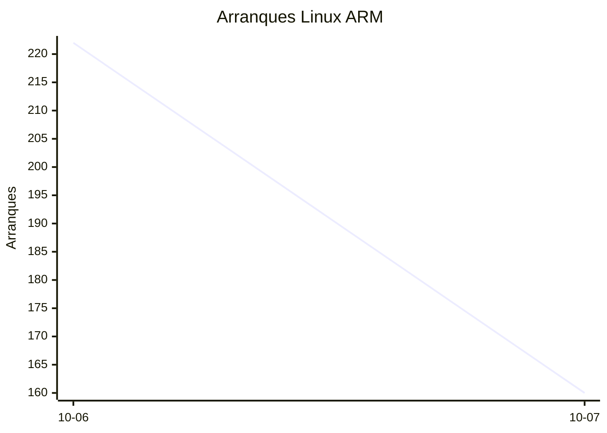
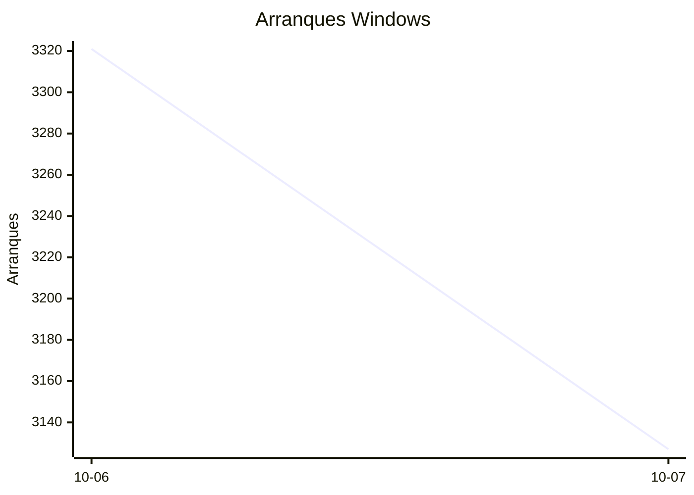

# Estadísticas de EmuDeck

Actualizado: 2026-10-08 06:27 UTC. Las gráficas no incluyen el día de hoy porque aún está incompleto.

## Arranques de la app (comprobaciones de actualización)

Cada arranque descarga el `latest*.yml` de su sistema. Cuenta arranques, no personas.

| Sistema | Ayer | Últimos 7 días |
|---|---|---|
| Linux x86 | 11951 | 23833 |
| Linux ARM | 160 | 382 |
| Windows | 3127 | 6448 |
| Mac | 0 | 0 |

Instalaciones nuevas estimadas en Windows (7 días, `.exe` menos `.blockmap`): **239**

## Instalaciones de EmuDeck (beacons)

Cada `setup` descarga `system-<sistema>.txt` y cada instalación de un emulador `<emulador>-<plataforma>.txt`. Los emuladores cuentan también las actualizaciones. Histórico completo desde el primer día.

| Sistema | Ayer | Últimos 7 días | Últimos 30 días | Total |
|---|---|---|---|---|
| linux | 34 | 34 | 34 | 74 |
| linux-arm | 1 | 1 | 1 | 5 |
| windows | 5 | 5 | 5 | 17 |

### Por mes

| Mes | Linux | Linux ARM | Windows | Total |
|---|---|---|---|---|
| 2026-10 | 34 | 1 | 5 | 40 |

### Canal early (early + early-unstable)

Instalaciones de EmuDeck con el backend en una rama early, y cuántas de ellas instalan CloudSync.

| | Últimos 7 días | Últimos 30 días | Total |
|---|---|---|---|
| Instalaciones early | 29 | 29 | 73 |
| Con CloudSync | 58 | 58 | 156 |
| % con CloudSync | | | 214% |

### Por emulador

| Emulador | Linux (total) | Linux ARM (total) | Windows (total) | Últimos 7 días | Últimos 30 días | Total |
|---|---|---|---|---|---|---|
| pcsx2 | 189 | 4 | 24 | 95 | 95 | 217 |
| esde | 166 | 9 | 40 | 84 | 84 | 215 |
| azahar | 175 | 12 | 21 | 88 | 88 | 208 |
| duckstation | 183 | 12 | 10 | 87 | 87 | 205 |
| ryujinx | 153 | 14 | 18 | 84 | 84 | 185 |
| rpcs3 | 161 | 11 | 9 | 78 | 78 | 181 |
| cemu | 160 | 11 | 7 | 80 | 80 | 178 |
| shadps4 | 150 | 12 | 11 | 81 | 81 | 173 |
| xenia | 147 | 12 | 14 | 79 | 79 | 173 |
| vita3k | 151 | 11 | 5 | 68 | 68 | 167 |
| cloudsync | 100 | 3 | 58 | 60 | 60 | 161 |
| srm | 137 | 8 | 10 | 76 | 76 | 155 |
| ppsspp | 65 | 5 | 17 | 31 | 31 | 87 |
| ra | 73 | 5 | 9 | 35 | 35 | 87 |
| dolphin | 71 | 6 | 9 | 34 | 34 | 86 |
| melonds | 61 | 5 | 8 | 31 | 31 | 74 |
| mgba | 60 | 8 | 3 | 35 | 35 | 71 |
| xemu | 55 | 5 | 10 | 26 | 26 | 70 |
| primehack | 54 | 4 | 8 | 23 | 23 | 66 |
| scummvm | 51 | 4 | 6 | 22 | 22 | 61 |
| model2 | 52 | 5 | 1 | 22 | 22 | 58 |
| supermodel | 51 | 5 | 1 | 21 | 21 | 57 |
| bigpemu | 41 | 3 | 0 | 18 | 18 | 44 |
| armsx2 | 13 | 13 | 0 | 13 | 13 | 26 |
| flycast | 18 | 1 | 1 | 9 | 9 | 20 |
| rmg | 15 | 1 | 0 | 6 | 6 | 16 |
| mame | 11 | 0 | 1 | 2 | 2 | 12 |
| eden | 8 | 0 | 0 | 0 | 0 | 8 |
| pegasus | 3 | 0 | 0 | 1 | 1 | 3 |
| ares | 0 | 1 | 0 | 1 | 1 | 1 |
