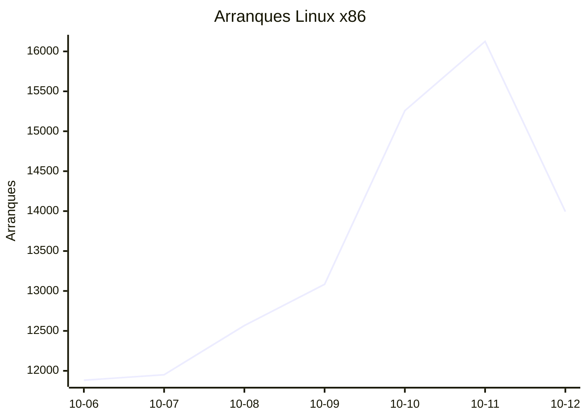
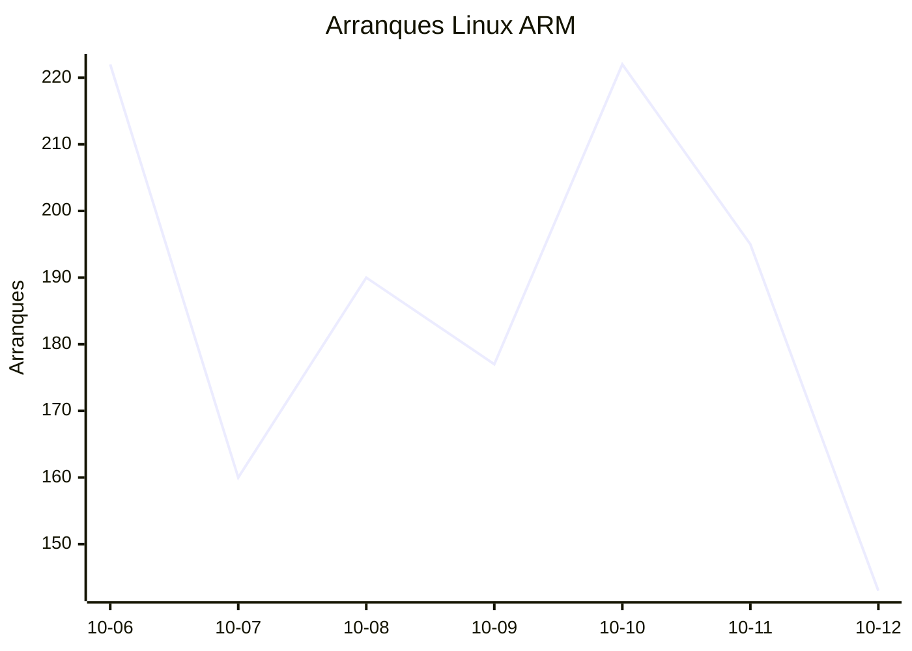
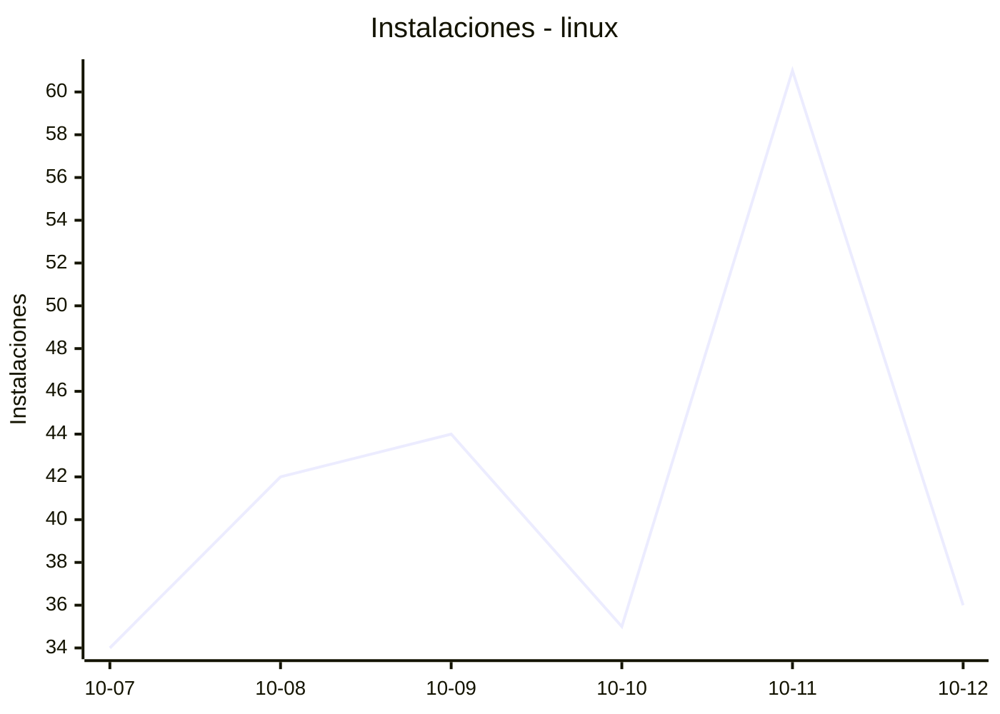
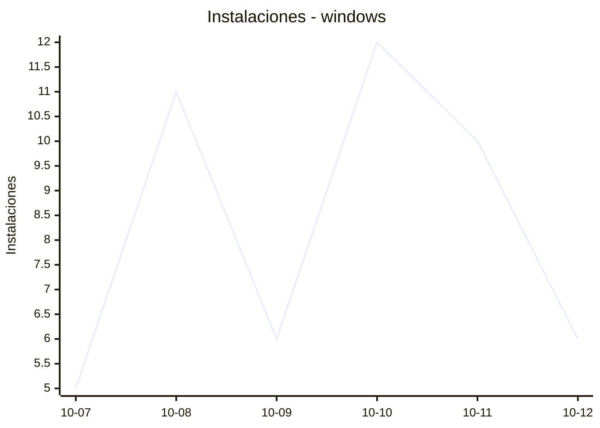
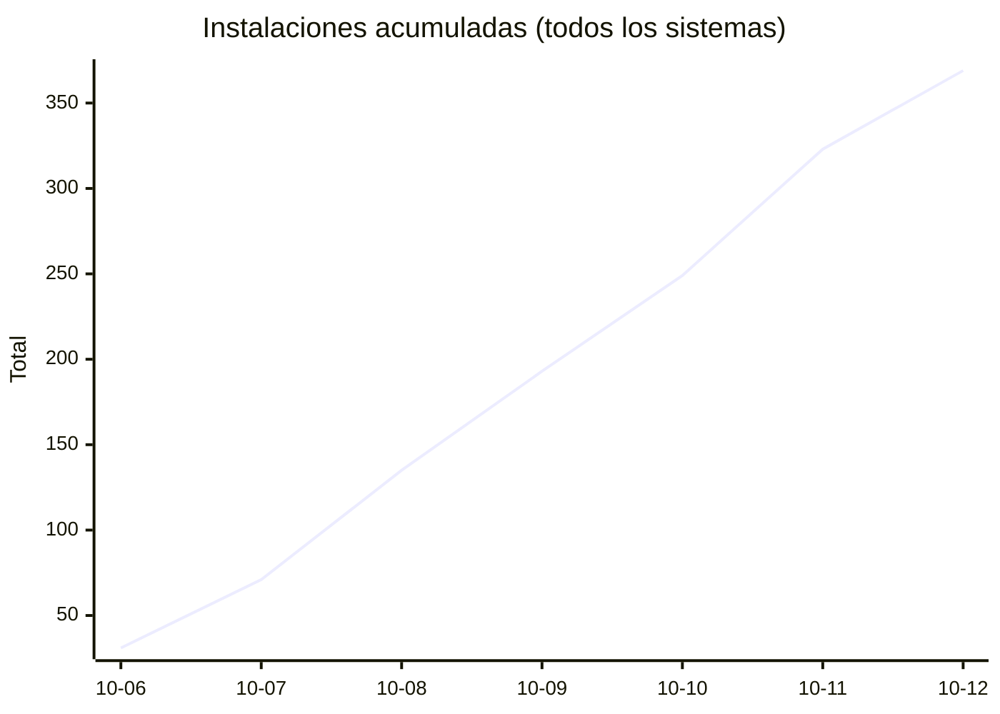
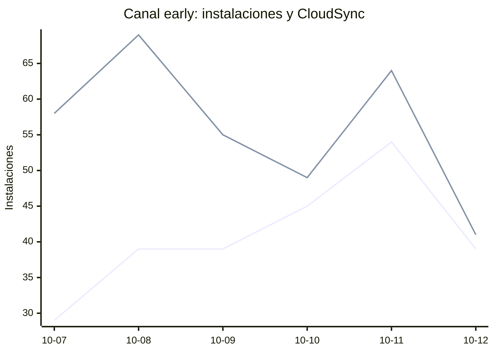

# Estadísticas de EmuDeck

Actualizado: 2026-10-13 19:11 UTC. Las gráficas no incluyen el día de hoy porque aún está incompleto.

## Arranques de la app (comprobaciones de actualización)

Cada arranque descarga el `latest*.yml` de su sistema. Cuenta arranques, no personas.

| Sistema | Ayer | Últimos 7 días |
|---|---|---|
| Linux x86 | 13994 | 94860 |
| Linux ARM | 143 | 1309 |
| Windows | 3719 | 25538 |
| Mac | 0 | 0 |

Instalaciones nuevas estimadas en Windows (7 días, `.exe` menos `.blockmap`): **1416**

```mermaid
xychart-beta
    title "Arranques Linux x86"
    x-axis ["10-06", "10-07", "10-08", "10-09", "10-10", "10-11", "10-12"]
    y-axis "Arranques"
    line [11882, 11951, 12567, 13083, 15258, 16125, 13994]
```

```mermaid
xychart-beta
    title "Arranques Linux ARM"
    x-axis ["10-06", "10-07", "10-08", "10-09", "10-10", "10-11", "10-12"]
    y-axis "Arranques"
    line [222, 160, 190, 177, 222, 195, 143]
```

```mermaid
xychart-beta
    title "Arranques Windows"
    x-axis ["10-06", "10-07", "10-08", "10-09", "10-10", "10-11", "10-12"]
    y-axis "Arranques"
    line [3321, 3127, 3258, 3508, 4198, 4407, 3719]
```

## Instalaciones de EmuDeck (beacons)

Cada `setup` descarga `system-<sistema>.txt` y cada instalación de un emulador `<emulador>-<plataforma>.txt`. Los emuladores cuentan también las actualizaciones. Histórico completo desde el primer día.

| Sistema | Ayer | Últimos 7 días | Últimos 30 días | Total |
|---|---|---|---|---|
| linux | 36 | 252 | 252 | 293 |
| linux-arm | 4 | 36 | 36 | 46 |
| windows | 6 | 50 | 50 | 63 |

```mermaid
xychart-beta
    title "Instalaciones - linux"
    x-axis ["10-07", "10-08", "10-09", "10-10", "10-11", "10-12"]
    y-axis "Instalaciones"
    line [34, 42, 44, 35, 61, 36]
```

```mermaid
xychart-beta
    title "Instalaciones - linux-arm"
    x-axis ["10-07", "10-08", "10-09", "10-10", "10-11", "10-12"]
    y-axis "Instalaciones"
    line [1, 11, 8, 9, 3, 4]
```

```mermaid
xychart-beta
    title "Instalaciones - windows"
    x-axis ["10-07", "10-08", "10-09", "10-10", "10-11", "10-12"]
    y-axis "Instalaciones"
    line [5, 11, 6, 12, 10, 6]
```

```mermaid
xychart-beta
    title "Instalaciones acumuladas (todos los sistemas)"
    x-axis ["10-06", "10-07", "10-08", "10-09", "10-10", "10-11", "10-12"]
    y-axis "Total"
    line [31, 71, 135, 193, 249, 323, 369]
```

### Por mes

| Mes | Linux | Linux ARM | Windows | Total |
|---|---|---|---|---|
| 2026-10 | 252 | 36 | 50 | 338 |

### Canal early (early + early-unstable)

Instalaciones de EmuDeck con el backend en una rama early, y cuántas de ellas instalan CloudSync.

| | Últimos 7 días | Últimos 30 días | Total |
|---|---|---|---|
| Instalaciones early | 245 | 245 | 295 |
| Con CloudSync | 336 | 336 | 436 |
| % con CloudSync | | | 148% |

Línea de arriba: instalaciones early. Línea de abajo: de ellas, con CloudSync.

```mermaid
xychart-beta
    title "Canal early: instalaciones y CloudSync"
    x-axis ["10-07", "10-08", "10-09", "10-10", "10-11", "10-12"]
    y-axis "Instalaciones"
    line [29, 39, 39, 45, 54, 39]
    line [58, 69, 55, 49, 64, 41]
```

### Por emulador

| Emulador | Linux (total) | Linux ARM (total) | Windows (total) | Últimos 7 días | Últimos 30 días | Total |
|---|---|---|---|---|---|---|
| pcsx2 | 702 | 12 | 88 | 657 | 657 | 802 |
| azahar | 631 | 56 | 81 | 623 | 623 | 768 |
| duckstation | 684 | 54 | 27 | 622 | 622 | 765 |
| esde | 579 | 47 | 126 | 592 | 592 | 752 |
| ryujinx | 589 | 58 | 84 | 600 | 600 | 731 |
| cemu | 636 | 56 | 18 | 582 | 582 | 710 |
| rpcs3 | 624 | 54 | 29 | 572 | 572 | 707 |
| xenia | 574 | 48 | 59 | 557 | 557 | 681 |
| srm | 554 | 43 | 55 | 534 | 534 | 652 |
| shadps4 | 527 | 50 | 47 | 511 | 511 | 624 |
| vita3k | 563 | 48 | 13 | 506 | 506 | 624 |
| cloudsync | 321 | 13 | 122 | 354 | 354 | 456 |
| ppsspp | 260 | 40 | 62 | 300 | 300 | 362 |
| dolphin | 284 | 43 | 30 | 294 | 294 | 357 |
| ra | 287 | 43 | 27 | 302 | 302 | 357 |
| melonds | 241 | 32 | 22 | 240 | 240 | 295 |
| xemu | 240 | 33 | 22 | 248 | 248 | 295 |
| mgba | 251 | 22 | 20 | 233 | 233 | 293 |
| primehack | 207 | 34 | 23 | 222 | 222 | 264 |
| model2 | 203 | 43 | 3 | 205 | 205 | 249 |
| supermodel | 202 | 40 | 5 | 207 | 207 | 247 |
| scummvm | 202 | 30 | 12 | 202 | 202 | 244 |
| bigpemu | 173 | 3 | 2 | 136 | 136 | 178 |
| armsx2 | 56 | 57 | 0 | 88 | 88 | 113 |
| flycast | 63 | 9 | 5 | 60 | 60 | 77 |
| rmg | 52 | 16 | 0 | 52 | 52 | 68 |
| mame | 41 | 2 | 9 | 39 | 39 | 52 |
| eden | 26 | 3 | 0 | 12 | 12 | 29 |
| pegasus | 5 | 0 | 3 | 4 | 4 | 8 |
| ares | 3 | 1 | 0 | 4 | 4 | 4 |
| yuzu | 4 | 0 | 0 | 4 | 4 | 4 |
| citron | 1 | 0 | 0 | 1 | 1 | 1 |
