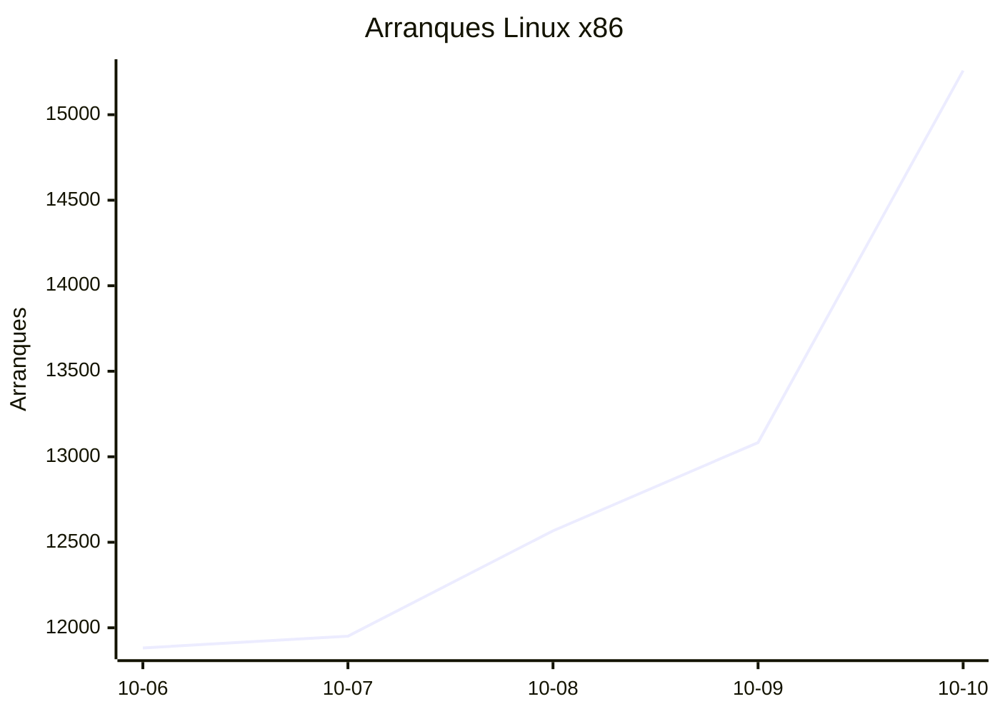
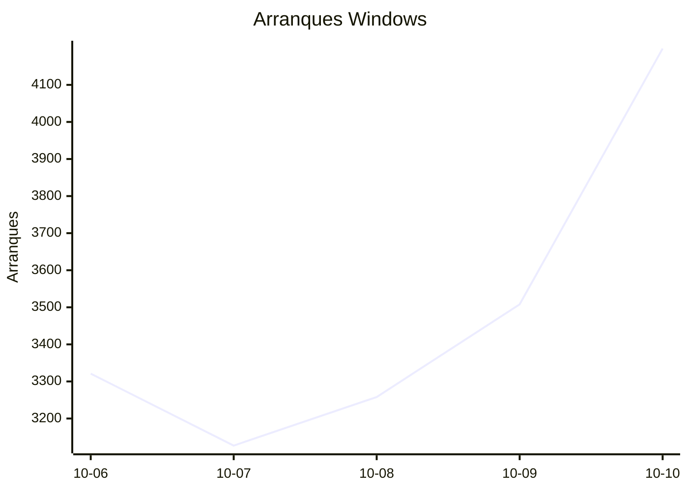
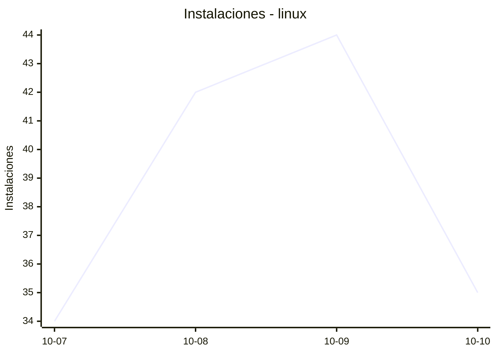
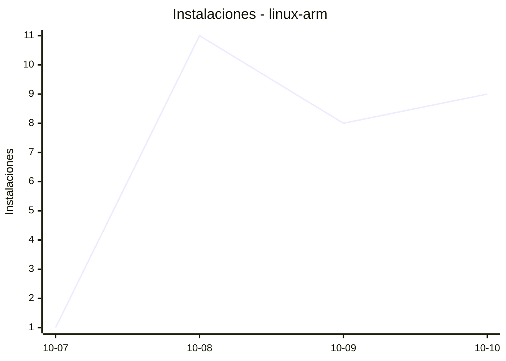
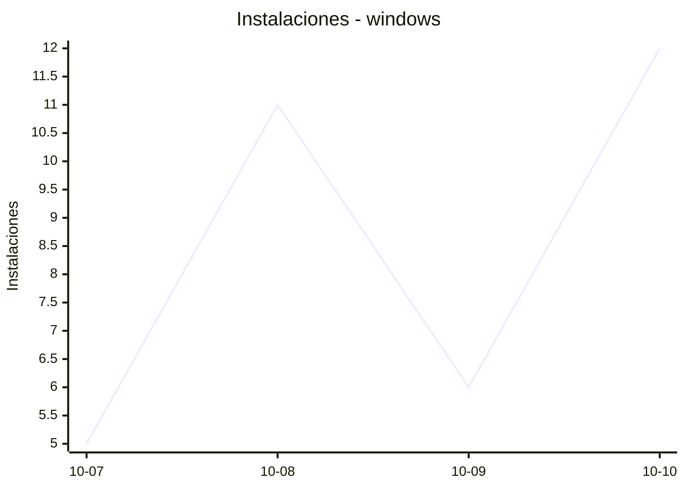
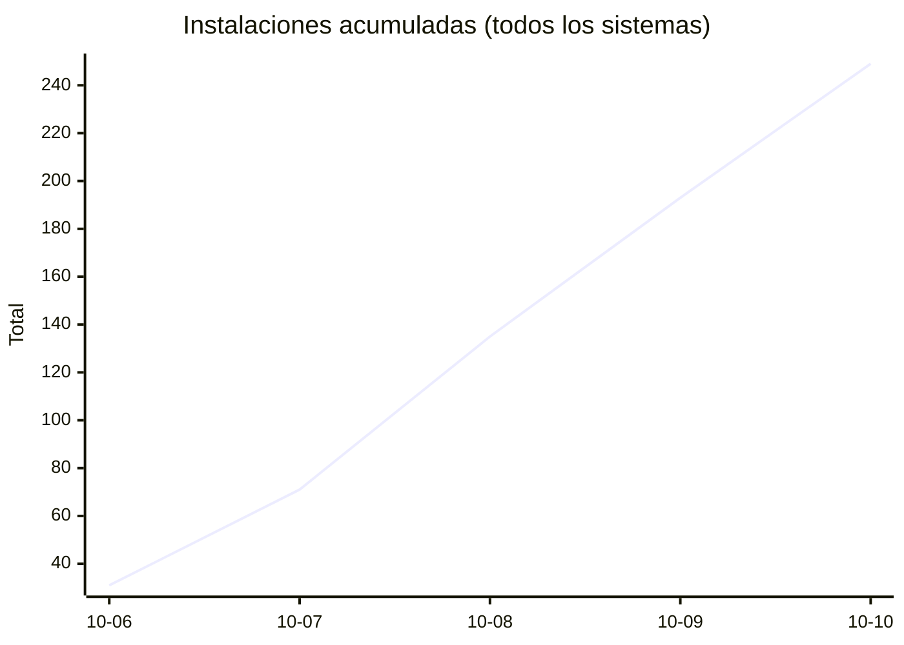
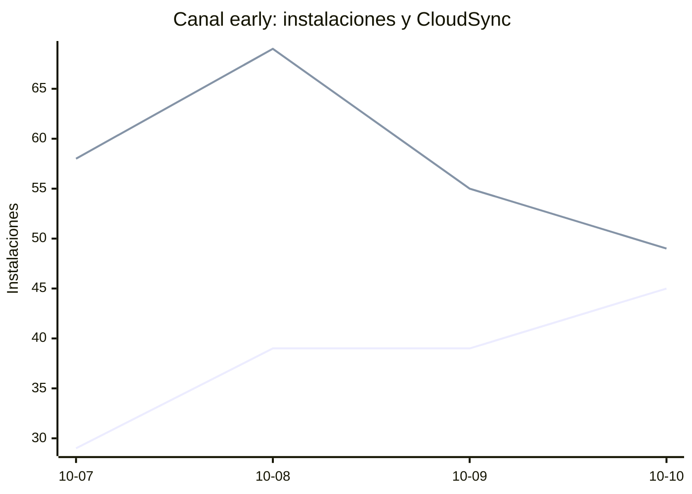

# Estadísticas de EmuDeck

Actualizado: 2026-10-11 02:29 UTC. Las gráficas no incluyen el día de hoy porque aún está incompleto.

## Arranques de la app (comprobaciones de actualización)

Cada arranque descarga el `latest*.yml` de su sistema. Cuenta arranques, no personas.

| Sistema | Ayer | Últimos 7 días |
|---|---|---|
| Linux x86 | 15258 | 64741 |
| Linux ARM | 222 | 971 |
| Windows | 4198 | 17412 |
| Mac | 0 | 0 |

Instalaciones nuevas estimadas en Windows (7 días, `.exe` menos `.blockmap`): **968**

```mermaid
xychart-beta
    title "Arranques Linux x86"
    x-axis ["10-06", "10-07", "10-08", "10-09", "10-10"]
    y-axis "Arranques"
    line [11882, 11951, 12567, 13083, 15258]
```

```mermaid
xychart-beta
    title "Arranques Linux ARM"
    x-axis ["10-06", "10-07", "10-08", "10-09", "10-10"]
    y-axis "Arranques"
    line [222, 160, 190, 177, 222]
```

```mermaid
xychart-beta
    title "Arranques Windows"
    x-axis ["10-06", "10-07", "10-08", "10-09", "10-10"]
    y-axis "Arranques"
    line [3321, 3127, 3258, 3508, 4198]
```

## Instalaciones de EmuDeck (beacons)

Cada `setup` descarga `system-<sistema>.txt` y cada instalación de un emulador `<emulador>-<plataforma>.txt`. Los emuladores cuentan también las actualizaciones. Histórico completo desde el primer día.

| Sistema | Ayer | Últimos 7 días | Últimos 30 días | Total |
|---|---|---|---|---|
| linux | 35 | 155 | 155 | 187 |
| linux-arm | 9 | 29 | 29 | 32 |
| windows | 12 | 34 | 34 | 42 |

```mermaid
xychart-beta
    title "Instalaciones - linux"
    x-axis ["10-07", "10-08", "10-09", "10-10"]
    y-axis "Instalaciones"
    line [34, 42, 44, 35]
```

```mermaid
xychart-beta
    title "Instalaciones - linux-arm"
    x-axis ["10-07", "10-08", "10-09", "10-10"]
    y-axis "Instalaciones"
    line [1, 11, 8, 9]
```

```mermaid
xychart-beta
    title "Instalaciones - windows"
    x-axis ["10-07", "10-08", "10-09", "10-10"]
    y-axis "Instalaciones"
    line [5, 11, 6, 12]
```

```mermaid
xychart-beta
    title "Instalaciones acumuladas (todos los sistemas)"
    x-axis ["10-06", "10-07", "10-08", "10-09", "10-10"]
    y-axis "Total"
    line [31, 71, 135, 193, 249]
```

### Por mes

| Mes | Linux | Linux ARM | Windows | Total |
|---|---|---|---|---|
| 2026-10 | 155 | 29 | 34 | 218 |

### Canal early (early + early-unstable)

Instalaciones de EmuDeck con el backend en una rama early, y cuántas de ellas instalan CloudSync.

| | Últimos 7 días | Últimos 30 días | Total |
|---|---|---|---|
| Instalaciones early | 152 | 152 | 183 |
| Con CloudSync | 231 | 231 | 299 |
| % con CloudSync | | | 163% |

Línea de arriba: instalaciones early. Línea de abajo: de ellas, con CloudSync.

```mermaid
xychart-beta
    title "Canal early: instalaciones y CloudSync"
    x-axis ["10-07", "10-08", "10-09", "10-10"]
    y-axis "Instalaciones"
    line [29, 39, 39, 45]
    line [58, 69, 55, 49]
```

### Por emulador

| Emulador | Linux (total) | Linux ARM (total) | Windows (total) | Últimos 7 días | Últimos 30 días | Total |
|---|---|---|---|---|---|---|
| pcsx2 | 467 | 11 | 59 | 441 | 441 | 537 |
| esde | 388 | 37 | 94 | 415 | 415 | 519 |
| azahar | 414 | 42 | 59 | 422 | 422 | 515 |
| duckstation | 448 | 40 | 19 | 416 | 416 | 507 |
| ryujinx | 397 | 43 | 58 | 412 | 412 | 498 |
| rpcs3 | 409 | 39 | 21 | 385 | 385 | 469 |
| cemu | 408 | 41 | 15 | 386 | 386 | 464 |
| xenia | 362 | 35 | 39 | 362 | 362 | 436 |
| srm | 369 | 27 | 30 | 365 | 365 | 426 |
| shadps4 | 351 | 38 | 29 | 341 | 341 | 418 |
| vita3k | 363 | 35 | 11 | 332 | 332 | 409 |
| cloudsync | 215 | 13 | 86 | 244 | 244 | 314 |
| ra | 183 | 32 | 20 | 196 | 196 | 235 |
| dolphin | 177 | 31 | 22 | 189 | 189 | 230 |
| ppsspp | 162 | 29 | 39 | 187 | 187 | 230 |
| mgba | 161 | 17 | 12 | 164 | 164 | 190 |
| melonds | 151 | 21 | 17 | 150 | 150 | 189 |
| xemu | 146 | 22 | 19 | 153 | 153 | 187 |
| primehack | 136 | 23 | 20 | 150 | 150 | 179 |
| model2 | 131 | 27 | 2 | 133 | 133 | 160 |
| scummvm | 125 | 22 | 12 | 129 | 129 | 159 |
| supermodel | 126 | 27 | 5 | 130 | 130 | 158 |
| bigpemu | 117 | 3 | 2 | 101 | 101 | 122 |
| armsx2 | 34 | 43 | 0 | 65 | 65 | 77 |
| flycast | 39 | 5 | 4 | 42 | 42 | 48 |
| rmg | 35 | 10 | 0 | 41 | 41 | 45 |
| mame | 29 | 1 | 6 | 32 | 32 | 36 |
| eden | 10 | 2 | 0 | 4 | 4 | 12 |
| pegasus | 5 | 0 | 1 | 3 | 3 | 6 |
| ares | 1 | 1 | 0 | 2 | 2 | 2 |
| yuzu | 2 | 0 | 0 | 2 | 2 | 2 |
| citron | 1 | 0 | 0 | 0 | 0 | 1 |
