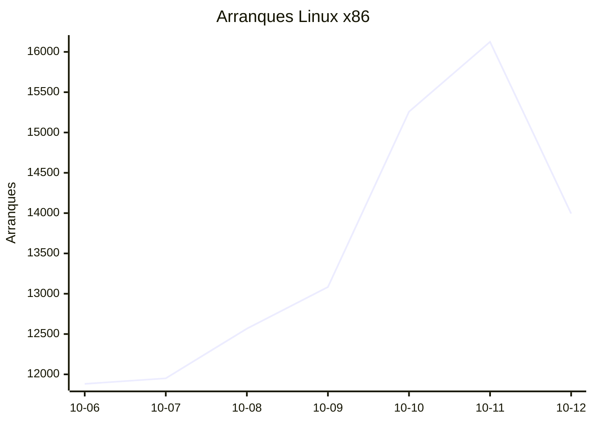
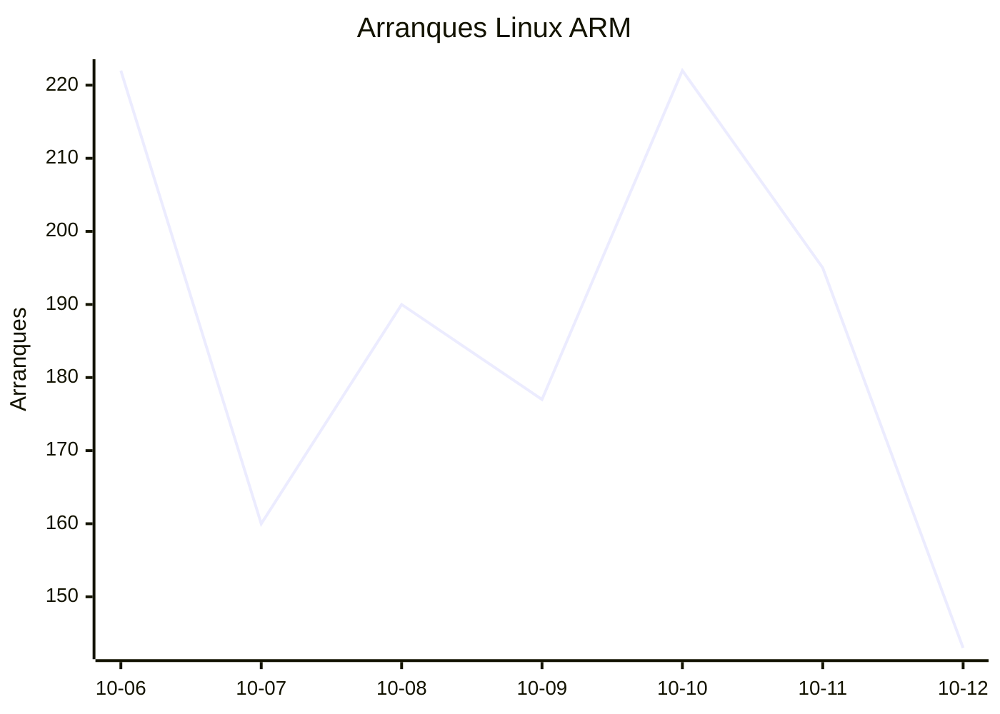
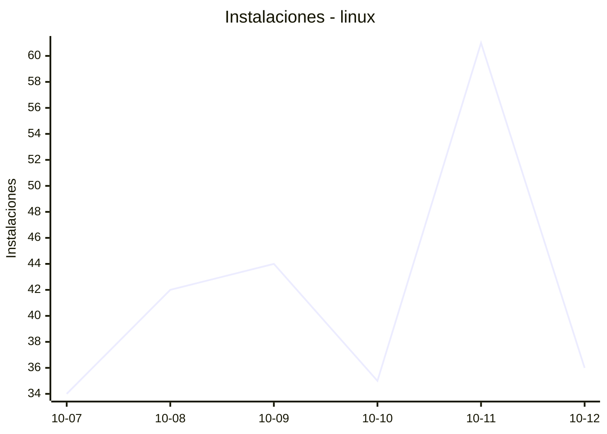
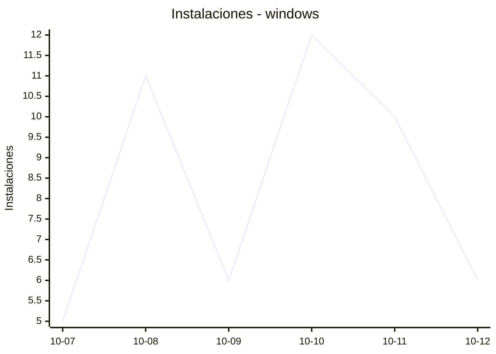
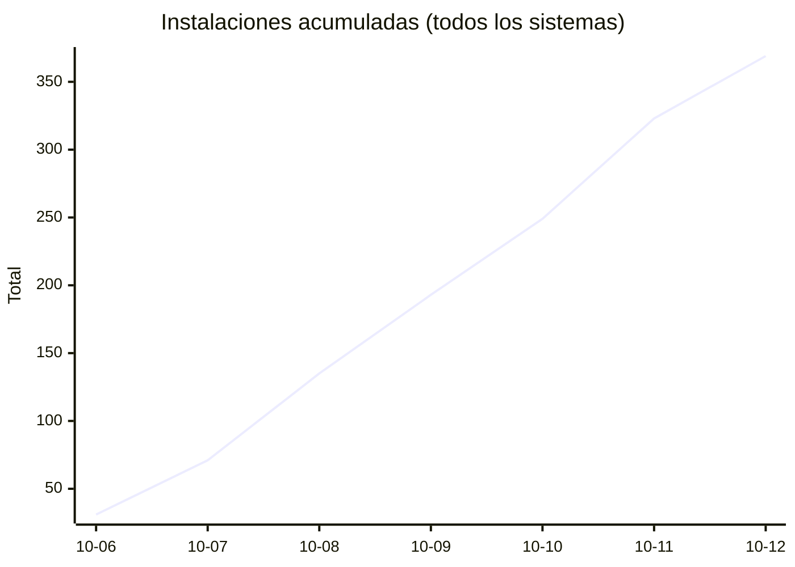
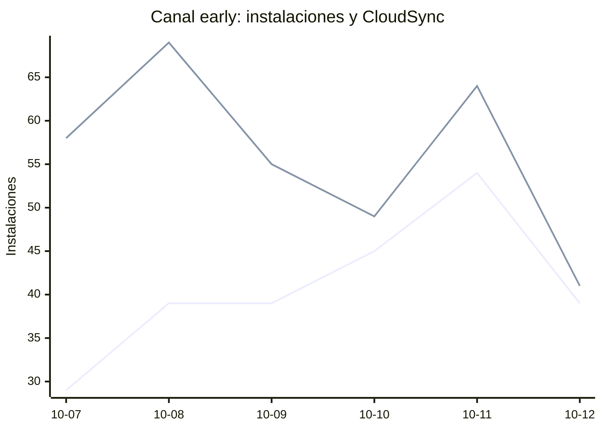

# Estadísticas de EmuDeck

Actualizado: 2026-10-13 03:22 UTC. Las gráficas no incluyen el día de hoy porque aún está incompleto.

## Arranques de la app (comprobaciones de actualización)

Cada arranque descarga el `latest*.yml` de su sistema. Cuenta arranques, no personas.

| Sistema | Ayer | Últimos 7 días |
|---|---|---|
| Linux x86 | 13994 | 94860 |
| Linux ARM | 143 | 1309 |
| Windows | 3719 | 25538 |
| Mac | 0 | 0 |

Instalaciones nuevas estimadas en Windows (7 días, `.exe` menos `.blockmap`): **1416**

```mermaid
xychart-beta
    title "Arranques Linux x86"
    x-axis ["10-06", "10-07", "10-08", "10-09", "10-10", "10-11", "10-12"]
    y-axis "Arranques"
    line [11882, 11951, 12567, 13083, 15258, 16125, 13994]
```

```mermaid
xychart-beta
    title "Arranques Linux ARM"
    x-axis ["10-06", "10-07", "10-08", "10-09", "10-10", "10-11", "10-12"]
    y-axis "Arranques"
    line [222, 160, 190, 177, 222, 195, 143]
```

```mermaid
xychart-beta
    title "Arranques Windows"
    x-axis ["10-06", "10-07", "10-08", "10-09", "10-10", "10-11", "10-12"]
    y-axis "Arranques"
    line [3321, 3127, 3258, 3508, 4198, 4407, 3719]
```

## Instalaciones de EmuDeck (beacons)

Cada `setup` descarga `system-<sistema>.txt` y cada instalación de un emulador `<emulador>-<plataforma>.txt`. Los emuladores cuentan también las actualizaciones. Histórico completo desde el primer día.

| Sistema | Ayer | Últimos 7 días | Últimos 30 días | Total |
|---|---|---|---|---|
| linux | 36 | 252 | 252 | 277 |
| linux-arm | 4 | 36 | 36 | 40 |
| windows | 6 | 50 | 50 | 57 |

```mermaid
xychart-beta
    title "Instalaciones - linux"
    x-axis ["10-07", "10-08", "10-09", "10-10", "10-11", "10-12"]
    y-axis "Instalaciones"
    line [34, 42, 44, 35, 61, 36]
```

```mermaid
xychart-beta
    title "Instalaciones - linux-arm"
    x-axis ["10-07", "10-08", "10-09", "10-10", "10-11", "10-12"]
    y-axis "Instalaciones"
    line [1, 11, 8, 9, 3, 4]
```

```mermaid
xychart-beta
    title "Instalaciones - windows"
    x-axis ["10-07", "10-08", "10-09", "10-10", "10-11", "10-12"]
    y-axis "Instalaciones"
    line [5, 11, 6, 12, 10, 6]
```

```mermaid
xychart-beta
    title "Instalaciones acumuladas (todos los sistemas)"
    x-axis ["10-06", "10-07", "10-08", "10-09", "10-10", "10-11", "10-12"]
    y-axis "Total"
    line [31, 71, 135, 193, 249, 323, 369]
```

### Por mes

| Mes | Linux | Linux ARM | Windows | Total |
|---|---|---|---|---|
| 2026-10 | 252 | 36 | 50 | 338 |

### Canal early (early + early-unstable)

Instalaciones de EmuDeck con el backend en una rama early, y cuántas de ellas instalan CloudSync.

| | Últimos 7 días | Últimos 30 días | Total |
|---|---|---|---|
| Instalaciones early | 245 | 245 | 272 |
| Con CloudSync | 336 | 336 | 403 |
| % con CloudSync | | | 148% |

Línea de arriba: instalaciones early. Línea de abajo: de ellas, con CloudSync.

```mermaid
xychart-beta
    title "Canal early: instalaciones y CloudSync"
    x-axis ["10-07", "10-08", "10-09", "10-10", "10-11", "10-12"]
    y-axis "Instalaciones"
    line [29, 39, 39, 45, 54, 39]
    line [58, 69, 55, 49, 64, 41]
```

### Por emulador

| Emulador | Linux (total) | Linux ARM (total) | Windows (total) | Últimos 7 días | Últimos 30 días | Total |
|---|---|---|---|---|---|---|
| pcsx2 | 658 | 12 | 81 | 657 | 657 | 751 |
| azahar | 591 | 50 | 75 | 623 | 623 | 716 |
| duckstation | 641 | 48 | 26 | 622 | 622 | 715 |
| esde | 543 | 45 | 119 | 592 | 592 | 707 |
| ryujinx | 558 | 51 | 77 | 600 | 600 | 686 |
| cemu | 598 | 49 | 18 | 582 | 582 | 665 |
| rpcs3 | 587 | 47 | 25 | 572 | 572 | 659 |
| xenia | 537 | 43 | 54 | 557 | 557 | 634 |
| srm | 520 | 33 | 46 | 534 | 534 | 599 |
| shadps4 | 497 | 48 | 44 | 511 | 511 | 589 |
| vita3k | 532 | 43 | 12 | 506 | 506 | 587 |
| cloudsync | 295 | 13 | 115 | 354 | 354 | 423 |
| ra | 272 | 38 | 26 | 302 | 302 | 336 |
| ppsspp | 244 | 35 | 56 | 300 | 300 | 335 |
| dolphin | 266 | 37 | 28 | 294 | 294 | 331 |
| xemu | 228 | 28 | 22 | 248 | 248 | 278 |
| melonds | 227 | 27 | 18 | 240 | 240 | 272 |
| mgba | 226 | 21 | 19 | 233 | 233 | 266 |
| primehack | 199 | 29 | 21 | 222 | 222 | 249 |
| supermodel | 190 | 35 | 5 | 207 | 207 | 230 |
| model2 | 191 | 35 | 3 | 205 | 205 | 229 |
| scummvm | 189 | 26 | 12 | 202 | 202 | 227 |
| bigpemu | 159 | 3 | 2 | 136 | 136 | 164 |
| armsx2 | 50 | 51 | 0 | 88 | 88 | 101 |
| flycast | 53 | 8 | 5 | 60 | 60 | 66 |
| rmg | 44 | 15 | 0 | 52 | 52 | 59 |
| mame | 34 | 1 | 9 | 39 | 39 | 44 |
| eden | 22 | 3 | 0 | 12 | 12 | 25 |
| pegasus | 5 | 0 | 1 | 4 | 4 | 6 |
| ares | 3 | 1 | 0 | 4 | 4 | 4 |
| yuzu | 4 | 0 | 0 | 4 | 4 | 4 |
| citron | 1 | 0 | 0 | 1 | 1 | 1 |
