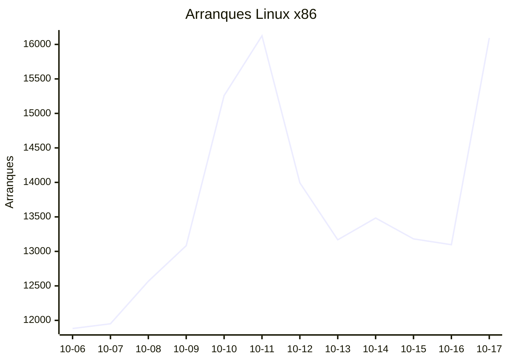
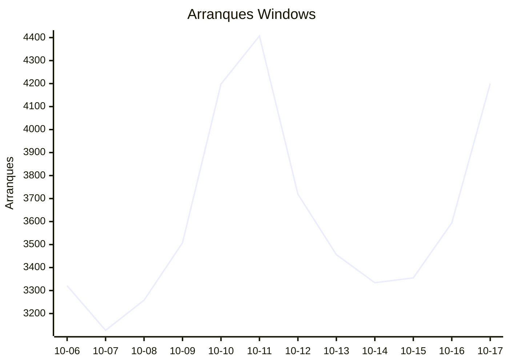
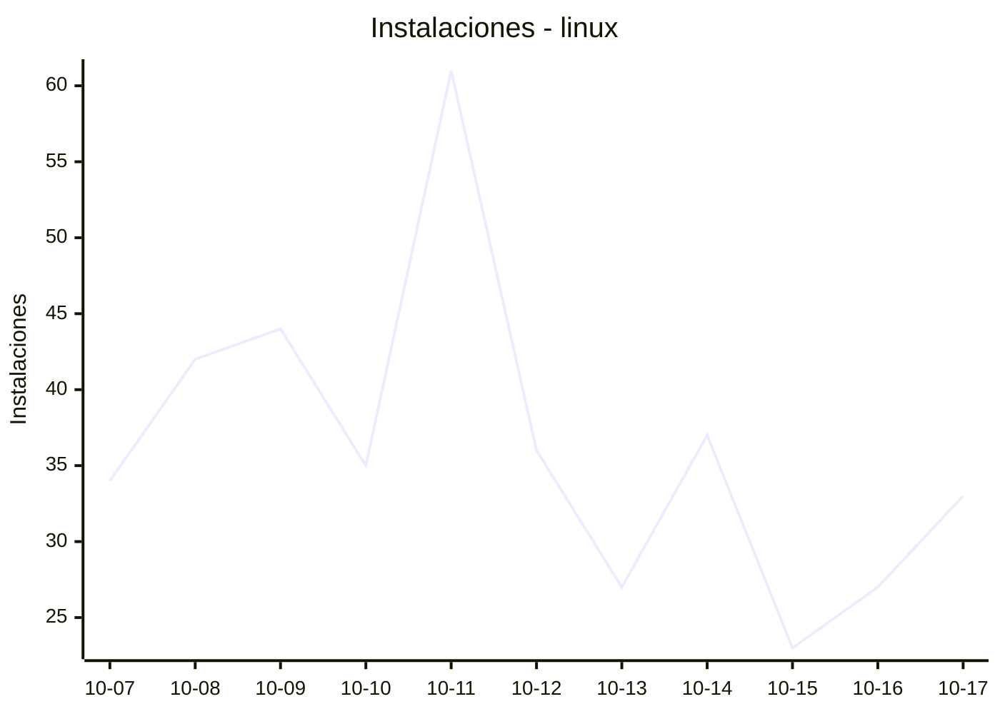
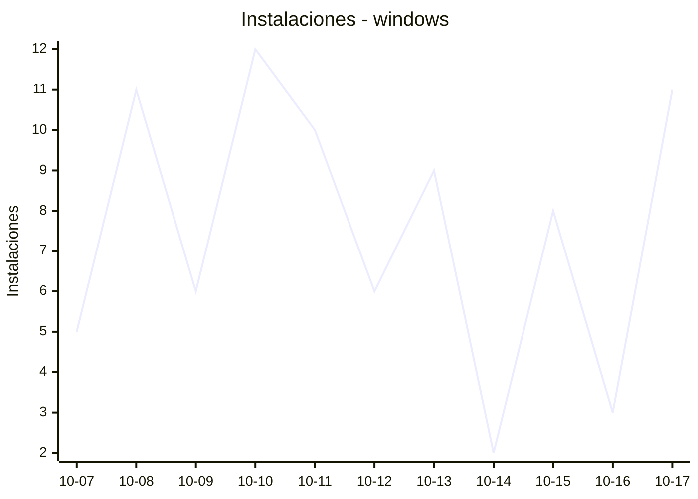
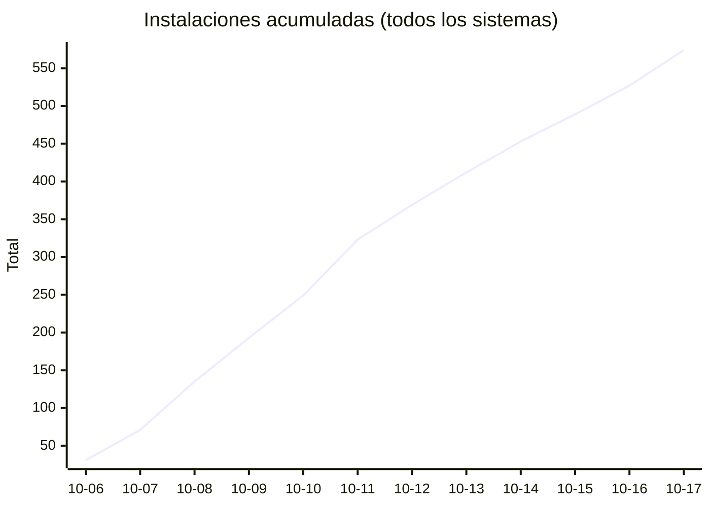
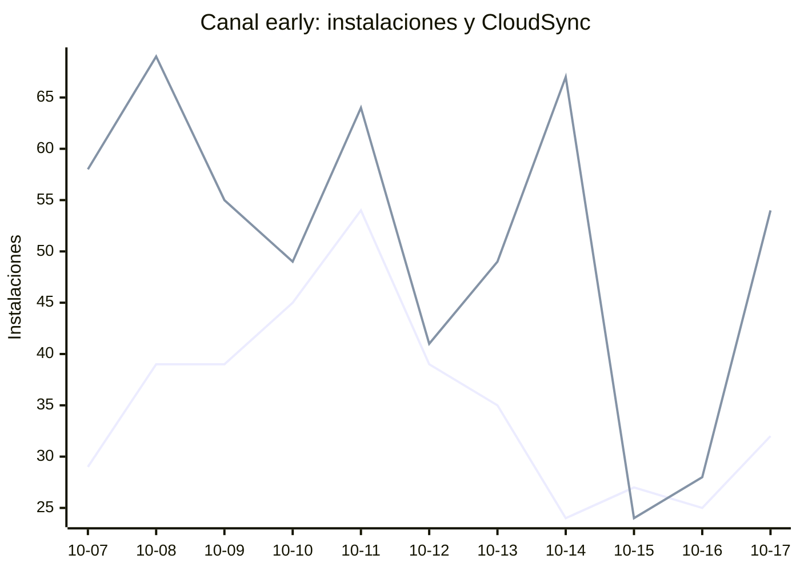

# Estadísticas de EmuDeck

Actualizado: 2026-10-18 01:24 UTC. Las gráficas no incluyen el día de hoy porque aún está incompleto.

## Arranques de la app (comprobaciones de actualización)

Cada arranque descarga el `latest*.yml` de su sistema. Cuenta arranques, no personas.

| Sistema | Ayer | Últimos 7 días |
|---|---|---|
| Linux x86 | 16093 | 99141 |
| Linux ARM | 158 | 1074 |
| Windows | 4200 | 26065 |
| Mac | 0 | 0 |

Instalaciones nuevas estimadas en Windows (7 días, `.exe` menos `.blockmap`): **1915**

```mermaid
xychart-beta
    title "Arranques Linux x86"
    x-axis ["10-06", "10-07", "10-08", "10-09", "10-10", "10-11", "10-12", "10-13", "10-14", "10-15", "10-16", "10-17"]
    y-axis "Arranques"
    line [11882, 11951, 12567, 13083, 15258, 16125, 13994, 13168, 13483, 13181, 13097, 16093]
```

```mermaid
xychart-beta
    title "Arranques Linux ARM"
    x-axis ["10-06", "10-07", "10-08", "10-09", "10-10", "10-11", "10-12", "10-13", "10-14", "10-15", "10-16", "10-17"]
    y-axis "Arranques"
    line [222, 160, 190, 177, 222, 195, 143, 126, 169, 147, 136, 158]
```

```mermaid
xychart-beta
    title "Arranques Windows"
    x-axis ["10-06", "10-07", "10-08", "10-09", "10-10", "10-11", "10-12", "10-13", "10-14", "10-15", "10-16", "10-17"]
    y-axis "Arranques"
    line [3321, 3127, 3258, 3508, 4198, 4407, 3719, 3456, 3334, 3355, 3594, 4200]
```

## Instalaciones de EmuDeck (beacons)

Cada `setup` descarga `system-<sistema>.txt` y cada instalación de un emulador `<emulador>-<plataforma>.txt`. Los emuladores cuentan también las actualizaciones. Histórico completo desde el primer día.

| Sistema | Ayer | Últimos 7 días | Últimos 30 días | Total |
|---|---|---|---|---|
| linux | 33 | 244 | 399 | 428 |
| linux-arm | 3 | 32 | 61 | 64 |
| windows | 11 | 49 | 83 | 92 |

```mermaid
xychart-beta
    title "Instalaciones - linux"
    x-axis ["10-07", "10-08", "10-09", "10-10", "10-11", "10-12", "10-13", "10-14", "10-15", "10-16", "10-17"]
    y-axis "Instalaciones"
    line [34, 42, 44, 35, 61, 36, 27, 37, 23, 27, 33]
```

```mermaid
xychart-beta
    title "Instalaciones - linux-arm"
    x-axis ["10-07", "10-08", "10-09", "10-10", "10-11", "10-12", "10-13", "10-14", "10-15", "10-16", "10-17"]
    y-axis "Instalaciones"
    line [1, 11, 8, 9, 3, 4, 7, 2, 5, 8, 3]
```

```mermaid
xychart-beta
    title "Instalaciones - windows"
    x-axis ["10-07", "10-08", "10-09", "10-10", "10-11", "10-12", "10-13", "10-14", "10-15", "10-16", "10-17"]
    y-axis "Instalaciones"
    line [5, 11, 6, 12, 10, 6, 9, 2, 8, 3, 11]
```

```mermaid
xychart-beta
    title "Instalaciones acumuladas (todos los sistemas)"
    x-axis ["10-06", "10-07", "10-08", "10-09", "10-10", "10-11", "10-12", "10-13", "10-14", "10-15", "10-16", "10-17"]
    y-axis "Total"
    line [31, 71, 135, 193, 249, 323, 369, 412, 453, 489, 527, 574]
```

### Por mes

| Mes | Linux | Linux ARM | Windows | Total |
|---|---|---|---|---|
| 2026-10 | 399 | 61 | 83 | 543 |

### Canal early (early + early-unstable)

Instalaciones de EmuDeck con el backend en una rama early, y cuántas de ellas instalan CloudSync.

| | Últimos 7 días | Últimos 30 días | Total |
|---|---|---|---|
| Instalaciones early | 236 | 388 | 421 |
| Con CloudSync | 327 | 558 | 627 |
| % con CloudSync | | | 149% |

Línea de arriba: instalaciones early. Línea de abajo: de ellas, con CloudSync.

```mermaid
xychart-beta
    title "Canal early: instalaciones y CloudSync"
    x-axis ["10-07", "10-08", "10-09", "10-10", "10-11", "10-12", "10-13", "10-14", "10-15", "10-16", "10-17"]
    y-axis "Instalaciones"
    line [29, 39, 39, 45, 54, 39, 35, 24, 27, 25, 32]
    line [58, 69, 55, 49, 64, 41, 49, 67, 24, 28, 54]
```

### Por emulador

| Emulador | Linux (total) | Linux ARM (total) | Windows (total) | Últimos 7 días | Últimos 30 días | Total |
|---|---|---|---|---|---|---|
| pcsx2 | 1096 | 18 | 120 | 703 | 1144 | 1234 |
| duckstation | 1061 | 79 | 41 | 677 | 1093 | 1181 |
| azahar | 976 | 80 | 119 | 666 | 1088 | 1175 |
| ryujinx | 941 | 81 | 122 | 652 | 1064 | 1144 |
| esde | 889 | 70 | 176 | 618 | 1033 | 1135 |
| rpcs3 | 990 | 81 | 39 | 643 | 1028 | 1110 |
| cemu | 977 | 80 | 28 | 626 | 1012 | 1085 |
| xenia | 887 | 67 | 88 | 611 | 973 | 1042 |
| srm | 856 | 65 | 95 | 595 | 960 | 1016 |
| shadps4 | 847 | 65 | 83 | 579 | 920 | 995 |
| vita3k | 893 | 69 | 21 | 578 | 910 | 983 |
| cloudsync | 455 | 17 | 176 | 333 | 577 | 648 |
| dolphin | 419 | 57 | 47 | 296 | 485 | 523 |
| ppsspp | 384 | 53 | 83 | 292 | 479 | 520 |
| ra | 413 | 58 | 45 | 283 | 479 | 516 |
| mgba | 386 | 32 | 26 | 255 | 419 | 444 |
| melonds | 361 | 43 | 32 | 253 | 403 | 436 |
| xemu | 354 | 47 | 32 | 246 | 399 | 433 |
| primehack | 311 | 45 | 31 | 205 | 355 | 387 |
| supermodel | 307 | 52 | 8 | 212 | 342 | 367 |
| model2 | 303 | 55 | 5 | 205 | 338 | 363 |
| scummvm | 300 | 40 | 17 | 198 | 327 | 357 |
| bigpemu | 261 | 3 | 6 | 151 | 252 | 270 |
| armsx2 | 80 | 87 | 0 | 93 | 158 | 167 |
| flycast | 80 | 13 | 6 | 52 | 94 | 99 |
| rmg | 77 | 20 | 0 | 52 | 93 | 97 |
| mame | 48 | 2 | 9 | 23 | 55 | 59 |
| eden | 50 | 7 | 0 | 45 | 49 | 57 |
| pegasus | 9 | 0 | 9 | 13 | 16 | 18 |
| yuzu | 6 | 0 | 0 | 4 | 6 | 6 |
| ares | 3 | 1 | 0 | 2 | 4 | 4 |
| citron | 3 | 0 | 0 | 3 | 3 | 3 |
