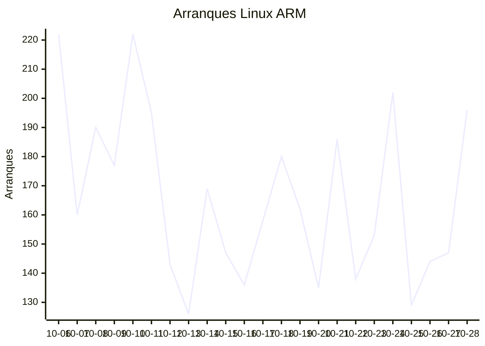
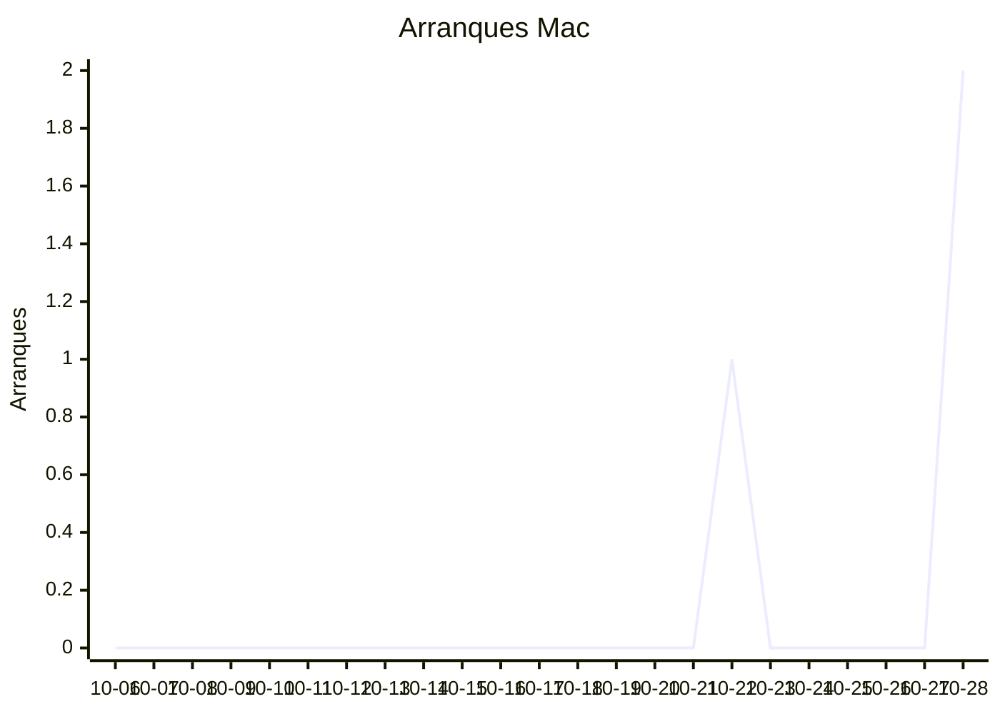
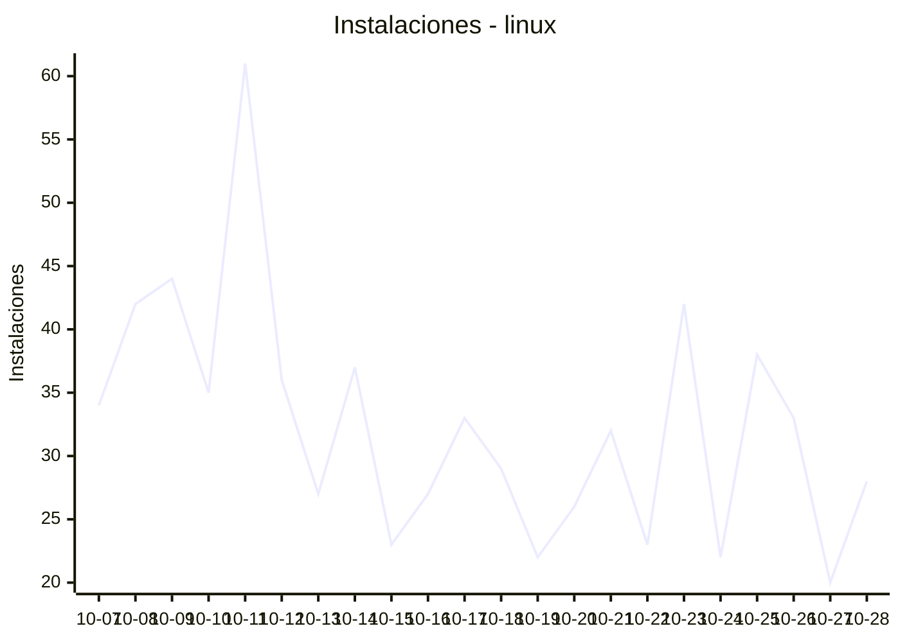
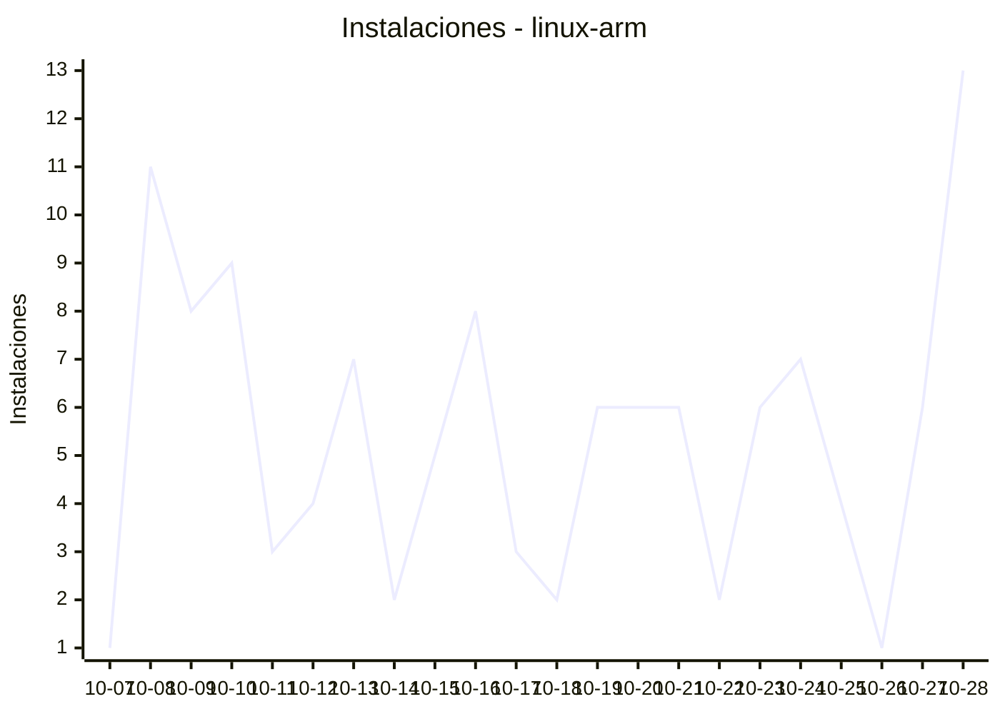
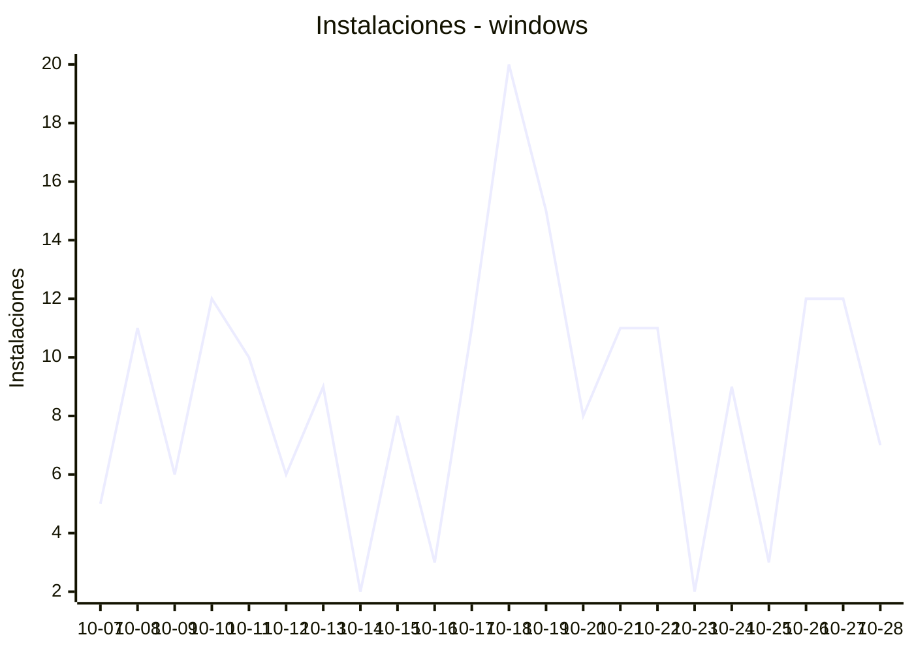
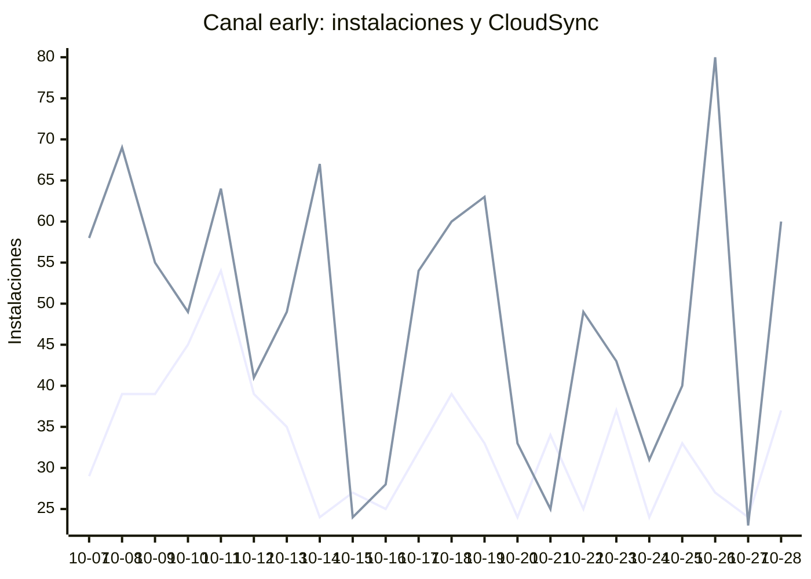

# Estadísticas de EmuDeck

Actualizado: 2026-10-29 19:36 UTC. Las gráficas no incluyen el día de hoy porque aún está incompleto.

## Arranques de la app (comprobaciones de actualización)

Cada arranque descarga el `latest*.yml` de su sistema. Cuenta arranques, no personas.

| Sistema | Ayer | Últimos 7 días |
|---|---|---|
| Linux x86 | 11883 | 92549 |
| Linux ARM | 196 | 1109 |
| Windows | 3272 | 24601 |
| Mac | 2 | 3 |

Instalaciones nuevas estimadas en Windows (7 días, `.exe` menos `.blockmap`): **2310**

```mermaid
xychart-beta
    title "Arranques Linux x86"
    x-axis ["10-06", "10-07", "10-08", "10-09", "10-10", "10-11", "10-12", "10-13", "10-14", "10-15", "10-16", "10-17", "10-18", "10-19", "10-20", "10-21", "10-22", "10-23", "10-24", "10-25", "10-26", "10-27", "10-28"]
    y-axis "Arranques"
    line [11882, 11951, 12567, 13083, 15258, 16125, 13994, 13168, 13483, 13181, 13097, 16093, 16587, 12882, 12465, 12272, 12219, 13039, 15016, 15683, 12702, 12007, 11883]
```

```mermaid
xychart-beta
    title "Arranques Linux ARM"
    x-axis ["10-06", "10-07", "10-08", "10-09", "10-10", "10-11", "10-12", "10-13", "10-14", "10-15", "10-16", "10-17", "10-18", "10-19", "10-20", "10-21", "10-22", "10-23", "10-24", "10-25", "10-26", "10-27", "10-28"]
    y-axis "Arranques"
    line [222, 160, 190, 177, 222, 195, 143, 126, 169, 147, 136, 158, 180, 162, 135, 186, 138, 153, 202, 129, 144, 147, 196]
```

```mermaid
xychart-beta
    title "Arranques Windows"
    x-axis ["10-06", "10-07", "10-08", "10-09", "10-10", "10-11", "10-12", "10-13", "10-14", "10-15", "10-16", "10-17", "10-18", "10-19", "10-20", "10-21", "10-22", "10-23", "10-24", "10-25", "10-26", "10-27", "10-28"]
    y-axis "Arranques"
    line [3321, 3127, 3258, 3508, 4198, 4407, 3719, 3456, 3334, 3355, 3594, 4200, 4479, 3342, 3116, 3183, 3270, 3317, 3877, 4147, 3496, 3222, 3272]
```

```mermaid
xychart-beta
    title "Arranques Mac"
    x-axis ["10-06", "10-07", "10-08", "10-09", "10-10", "10-11", "10-12", "10-13", "10-14", "10-15", "10-16", "10-17", "10-18", "10-19", "10-20", "10-21", "10-22", "10-23", "10-24", "10-25", "10-26", "10-27", "10-28"]
    y-axis "Arranques"
    line [0, 0, 0, 0, 0, 0, 0, 0, 0, 0, 0, 0, 0, 0, 0, 0, 1, 0, 0, 0, 0, 0, 2]
```

## Instalaciones de EmuDeck (beacons)

Cada `setup` descarga `system-<sistema>.txt` y cada instalación de un emulador `<emulador>-<plataforma>.txt`. Los emuladores cuentan también las actualizaciones. Histórico completo desde el primer día.

| Sistema | Ayer | Últimos 7 días | Últimos 30 días | Total |
|---|---|---|---|---|
| linux | 28 | 206 | 714 | 755 |
| linux-arm | 13 | 39 | 120 | 125 |
| windows | 7 | 56 | 193 | 214 |

```mermaid
xychart-beta
    title "Instalaciones - linux"
    x-axis ["10-07", "10-08", "10-09", "10-10", "10-11", "10-12", "10-13", "10-14", "10-15", "10-16", "10-17", "10-18", "10-19", "10-20", "10-21", "10-22", "10-23", "10-24", "10-25", "10-26", "10-27", "10-28"]
    y-axis "Instalaciones"
    line [34, 42, 44, 35, 61, 36, 27, 37, 23, 27, 33, 29, 22, 26, 32, 23, 42, 22, 38, 33, 20, 28]
```

```mermaid
xychart-beta
    title "Instalaciones - linux-arm"
    x-axis ["10-07", "10-08", "10-09", "10-10", "10-11", "10-12", "10-13", "10-14", "10-15", "10-16", "10-17", "10-18", "10-19", "10-20", "10-21", "10-22", "10-23", "10-24", "10-25", "10-26", "10-27", "10-28"]
    y-axis "Instalaciones"
    line [1, 11, 8, 9, 3, 4, 7, 2, 5, 8, 3, 2, 6, 6, 6, 2, 6, 7, 4, 1, 6, 13]
```

```mermaid
xychart-beta
    title "Instalaciones - windows"
    x-axis ["10-07", "10-08", "10-09", "10-10", "10-11", "10-12", "10-13", "10-14", "10-15", "10-16", "10-17", "10-18", "10-19", "10-20", "10-21", "10-22", "10-23", "10-24", "10-25", "10-26", "10-27", "10-28"]
    y-axis "Instalaciones"
    line [5, 11, 6, 12, 10, 6, 9, 2, 8, 3, 11, 20, 15, 8, 11, 11, 2, 9, 3, 12, 12, 7]
```

```mermaid
xychart-beta
    title "Instalaciones acumuladas (todos los sistemas)"
    x-axis ["10-06", "10-07", "10-08", "10-09", "10-10", "10-11", "10-12", "10-13", "10-14", "10-15", "10-16", "10-17", "10-18", "10-19", "10-20", "10-21", "10-22", "10-23", "10-24", "10-25", "10-26", "10-27", "10-28"]
    y-axis "Total"
    line [31, 71, 135, 193, 249, 323, 369, 412, 453, 489, 527, 574, 625, 668, 708, 757, 793, 843, 881, 926, 972, 1010, 1058]
```

### Por mes

| Mes | Linux | Linux ARM | Windows | Total |
|---|---|---|---|---|
| 2026-10 | 714 | 120 | 193 | 1027 |

### Canal early (early + early-unstable)

Instalaciones de EmuDeck con el backend en una rama early, y cuántas de ellas instalan CloudSync.

| | Últimos 7 días | Últimos 30 días | Total |
|---|---|---|---|
| Instalaciones early | 207 | 725 | 773 |
| Con CloudSync | 326 | 1065 | 1156 |
| % con CloudSync | | | 150% |

Línea de arriba: instalaciones early. Línea de abajo: de ellas, con CloudSync.

```mermaid
xychart-beta
    title "Canal early: instalaciones y CloudSync"
    x-axis ["10-07", "10-08", "10-09", "10-10", "10-11", "10-12", "10-13", "10-14", "10-15", "10-16", "10-17", "10-18", "10-19", "10-20", "10-21", "10-22", "10-23", "10-24", "10-25", "10-26", "10-27", "10-28"]
    y-axis "Instalaciones"
    line [29, 39, 39, 45, 54, 39, 35, 24, 27, 25, 32, 39, 33, 24, 34, 25, 37, 24, 33, 27, 24, 37]
    line [58, 69, 55, 49, 64, 41, 49, 67, 24, 28, 54, 60, 63, 33, 25, 49, 43, 31, 40, 80, 23, 60]
```

### Por emulador

| Emulador | Linux (total) | Linux ARM (total) | Windows (total) | Últimos 7 días | Últimos 30 días | Total |
|---|---|---|---|---|---|---|
| pcsx2 | 2070 | 22 | 249 | 669 | 2200 | 2341 |
| duckstation | 1981 | 168 | 103 | 658 | 2121 | 2252 |
| azahar | 1812 | 186 | 251 | 650 | 2110 | 2249 |
| esde | 1673 | 154 | 389 | 661 | 2059 | 2216 |
| ryujinx | 1765 | 176 | 248 | 645 | 2066 | 2189 |
| rpcs3 | 1868 | 170 | 101 | 639 | 2019 | 2139 |
| cemu | 1820 | 171 | 87 | 620 | 1965 | 2078 |
| srm | 1650 | 153 | 272 | 616 | 1962 | 2075 |
| xenia | 1686 | 136 | 215 | 598 | 1917 | 2037 |
| shadps4 | 1578 | 144 | 194 | 560 | 1792 | 1916 |
| vita3k | 1650 | 149 | 68 | 538 | 1756 | 1867 |
| cloudsync | 797 | 40 | 358 | 336 | 1102 | 1195 |
| ppsspp | 672 | 105 | 194 | 280 | 907 | 971 |
| dolphin | 732 | 121 | 109 | 273 | 901 | 962 |
| ra | 727 | 112 | 116 | 273 | 902 | 955 |
| mgba | 726 | 53 | 58 | 235 | 794 | 837 |
| xemu | 629 | 93 | 81 | 232 | 755 | 803 |
| melonds | 613 | 88 | 78 | 207 | 730 | 779 |
| primehack | 547 | 88 | 80 | 207 | 670 | 715 |
| supermodel | 525 | 101 | 19 | 171 | 608 | 645 |
| scummvm | 509 | 75 | 54 | 174 | 597 | 638 |
| model2 | 517 | 105 | 8 | 160 | 592 | 630 |
| bigpemu | 493 | 10 | 14 | 146 | 490 | 517 |
| armsx2 | 151 | 196 | 0 | 120 | 335 | 347 |
| flycast | 135 | 17 | 19 | 44 | 162 | 171 |
| rmg | 132 | 27 | 0 | 35 | 152 | 159 |
| eden | 82 | 9 | 3 | 16 | 86 | 94 |
| mame | 71 | 2 | 17 | 20 | 86 | 90 |
| pegasus | 19 | 0 | 14 | 9 | 28 | 33 |
| ares | 9 | 1 | 0 | 5 | 10 | 10 |
| yuzu | 8 | 0 | 2 | 4 | 10 | 10 |
| citron | 5 | 0 | 0 | 1 | 5 | 5 |
