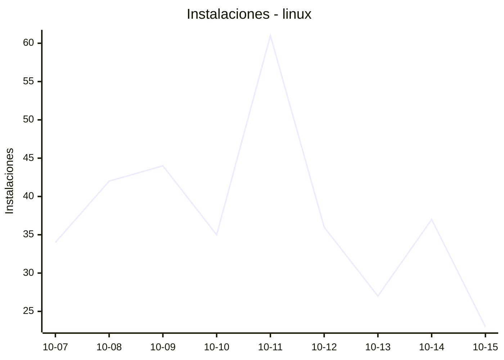
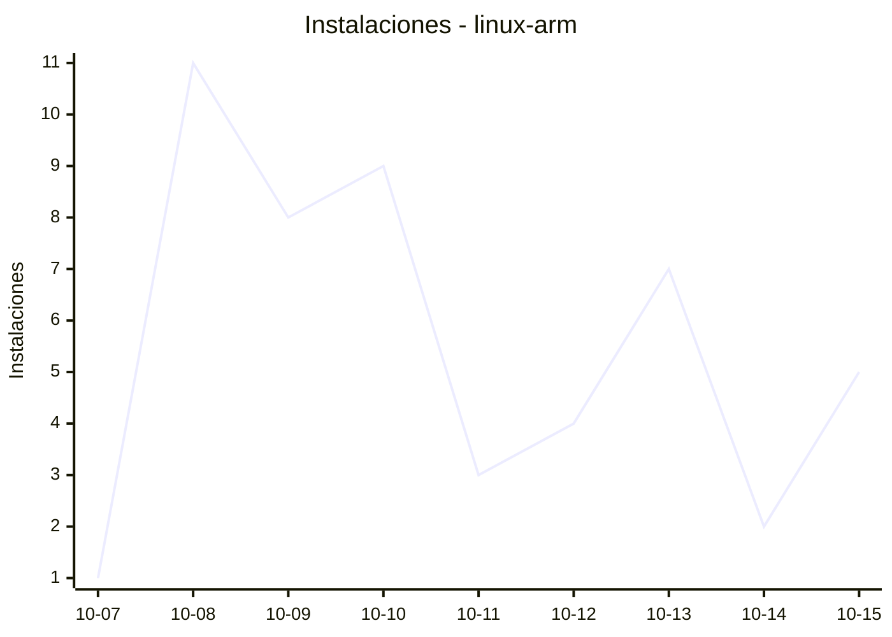
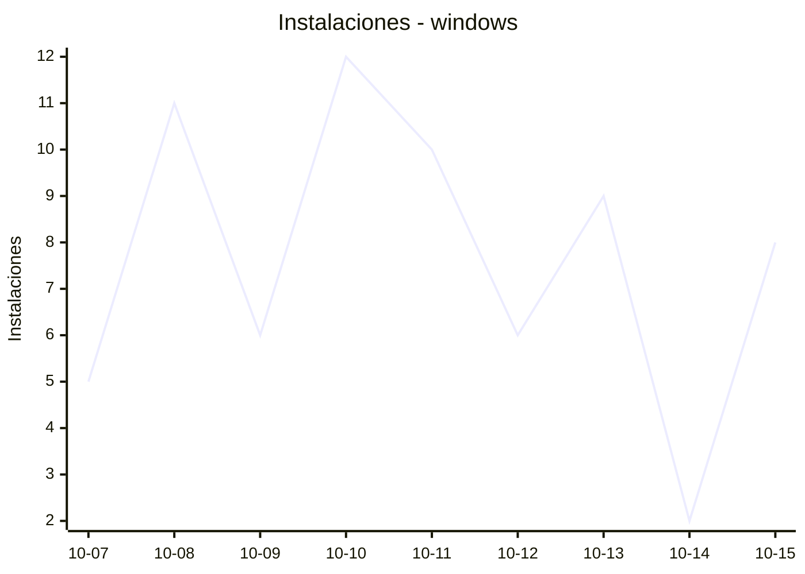
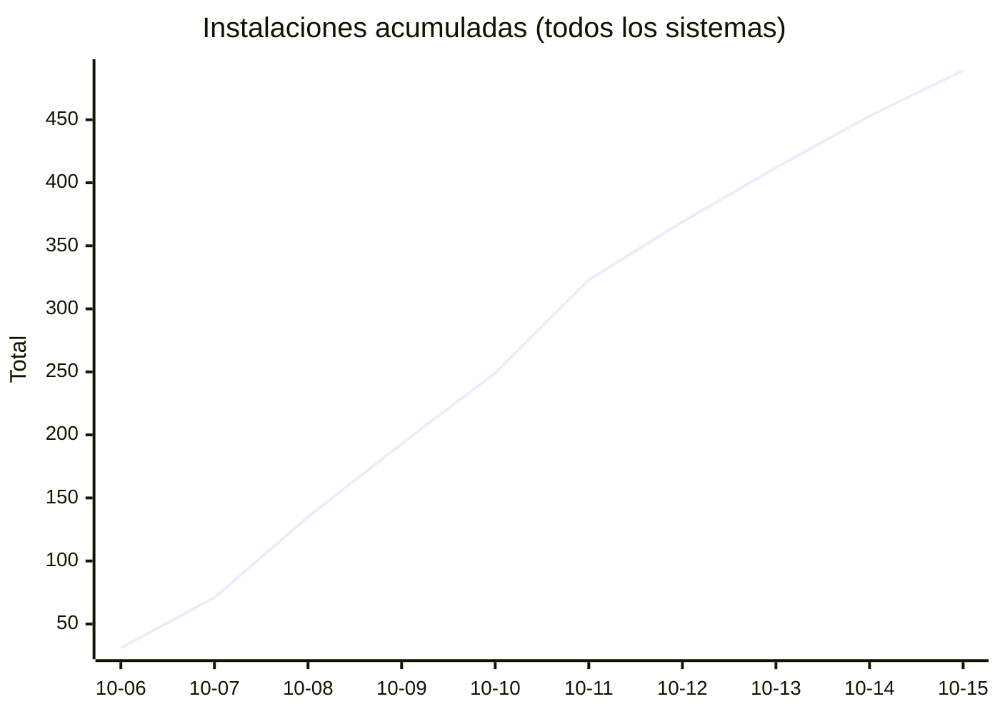
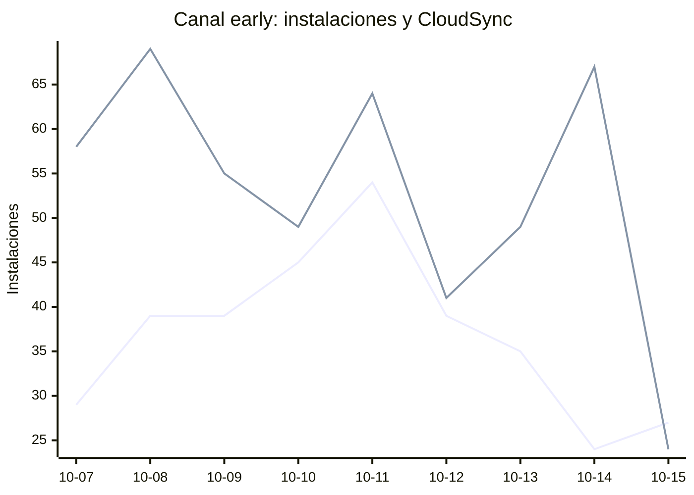

# Estadísticas de EmuDeck

Actualizado: 2026-10-16 21:36 UTC. Las gráficas no incluyen el día de hoy porque aún está incompleto.

## Arranques de la app (comprobaciones de actualización)

Cada arranque descarga el `latest*.yml` de su sistema. Cuenta arranques, no personas.

| Sistema | Ayer | Últimos 7 días |
|---|---|---|
| Linux x86 | 13181 | 98292 |
| Linux ARM | 147 | 1179 |
| Windows | 3355 | 25977 |
| Mac | 0 | 0 |

Instalaciones nuevas estimadas en Windows (7 días, `.exe` menos `.blockmap`): **1731**

```mermaid
xychart-beta
    title "Arranques Linux x86"
    x-axis ["10-06", "10-07", "10-08", "10-09", "10-10", "10-11", "10-12", "10-13", "10-14", "10-15"]
    y-axis "Arranques"
    line [11882, 11951, 12567, 13083, 15258, 16125, 13994, 13168, 13483, 13181]
```

```mermaid
xychart-beta
    title "Arranques Linux ARM"
    x-axis ["10-06", "10-07", "10-08", "10-09", "10-10", "10-11", "10-12", "10-13", "10-14", "10-15"]
    y-axis "Arranques"
    line [222, 160, 190, 177, 222, 195, 143, 126, 169, 147]
```

```mermaid
xychart-beta
    title "Arranques Windows"
    x-axis ["10-06", "10-07", "10-08", "10-09", "10-10", "10-11", "10-12", "10-13", "10-14", "10-15"]
    y-axis "Arranques"
    line [3321, 3127, 3258, 3508, 4198, 4407, 3719, 3456, 3334, 3355]
```

## Instalaciones de EmuDeck (beacons)

Cada `setup` descarga `system-<sistema>.txt` y cada instalación de un emulador `<emulador>-<plataforma>.txt`. Los emuladores cuentan también las actualizaciones. Histórico completo desde el primer día.

| Sistema | Ayer | Últimos 7 días | Últimos 30 días | Total |
|---|---|---|---|---|
| linux | 23 | 263 | 339 | 384 |
| linux-arm | 5 | 38 | 50 | 61 |
| windows | 8 | 53 | 69 | 79 |

```mermaid
xychart-beta
    title "Instalaciones - linux"
    x-axis ["10-07", "10-08", "10-09", "10-10", "10-11", "10-12", "10-13", "10-14", "10-15"]
    y-axis "Instalaciones"
    line [34, 42, 44, 35, 61, 36, 27, 37, 23]
```

```mermaid
xychart-beta
    title "Instalaciones - linux-arm"
    x-axis ["10-07", "10-08", "10-09", "10-10", "10-11", "10-12", "10-13", "10-14", "10-15"]
    y-axis "Instalaciones"
    line [1, 11, 8, 9, 3, 4, 7, 2, 5]
```

```mermaid
xychart-beta
    title "Instalaciones - windows"
    x-axis ["10-07", "10-08", "10-09", "10-10", "10-11", "10-12", "10-13", "10-14", "10-15"]
    y-axis "Instalaciones"
    line [5, 11, 6, 12, 10, 6, 9, 2, 8]
```

```mermaid
xychart-beta
    title "Instalaciones acumuladas (todos los sistemas)"
    x-axis ["10-06", "10-07", "10-08", "10-09", "10-10", "10-11", "10-12", "10-13", "10-14", "10-15"]
    y-axis "Total"
    line [31, 71, 135, 193, 249, 323, 369, 412, 453, 489]
```

### Por mes

| Mes | Linux | Linux ARM | Windows | Total |
|---|---|---|---|---|
| 2026-10 | 339 | 50 | 69 | 458 |

### Canal early (early + early-unstable)

Instalaciones de EmuDeck con el backend en una rama early, y cuántas de ellas instalan CloudSync.

| | Últimos 7 días | Últimos 30 días | Total |
|---|---|---|---|
| Instalaciones early | 263 | 331 | 376 |
| Con CloudSync | 349 | 476 | 562 |
| % con CloudSync | | | 149% |

Línea de arriba: instalaciones early. Línea de abajo: de ellas, con CloudSync.

```mermaid
xychart-beta
    title "Canal early: instalaciones y CloudSync"
    x-axis ["10-07", "10-08", "10-09", "10-10", "10-11", "10-12", "10-13", "10-14", "10-15"]
    y-axis "Instalaciones"
    line [29, 39, 39, 45, 54, 39, 35, 24, 27]
    line [58, 69, 55, 49, 64, 41, 49, 67, 24]
```

### Por emulador

| Emulador | Linux (total) | Linux ARM (total) | Windows (total) | Últimos 7 días | Últimos 30 días | Total |
|---|---|---|---|---|---|---|
| pcsx2 | 967 | 17 | 110 | 729 | 948 | 1094 |
| azahar | 869 | 77 | 104 | 706 | 905 | 1050 |
| duckstation | 932 | 76 | 37 | 702 | 899 | 1045 |
| ryujinx | 830 | 77 | 109 | 684 | 877 | 1016 |
| esde | 790 | 66 | 156 | 671 | 860 | 1012 |
| rpcs3 | 871 | 75 | 34 | 670 | 847 | 980 |
| cemu | 866 | 75 | 23 | 669 | 845 | 964 |
| xenia | 793 | 62 | 79 | 641 | 811 | 934 |
| srm | 755 | 63 | 83 | 608 | 786 | 901 |
| shadps4 | 747 | 63 | 69 | 588 | 751 | 879 |
| vita3k | 787 | 66 | 17 | 593 | 745 | 870 |
| cloudsync | 408 | 16 | 159 | 364 | 495 | 583 |
| dolphin | 376 | 54 | 43 | 325 | 415 | 473 |
| ppsspp | 341 | 51 | 74 | 322 | 406 | 466 |
| ra | 373 | 55 | 37 | 312 | 407 | 465 |
| mgba | 346 | 32 | 21 | 273 | 351 | 399 |
| melonds | 326 | 41 | 27 | 268 | 341 | 394 |
| xemu | 319 | 44 | 28 | 269 | 338 | 391 |
| primehack | 281 | 43 | 26 | 240 | 307 | 350 |
| supermodel | 280 | 50 | 8 | 241 | 298 | 338 |
| model2 | 276 | 53 | 5 | 231 | 291 | 334 |
| scummvm | 270 | 38 | 13 | 225 | 279 | 321 |
| bigpemu | 234 | 3 | 6 | 180 | 218 | 243 |
| armsx2 | 73 | 81 | 0 | 109 | 138 | 154 |
| flycast | 78 | 12 | 5 | 62 | 84 | 95 |
| rmg | 72 | 20 | 0 | 60 | 82 | 92 |
| mame | 46 | 2 | 9 | 34 | 51 | 57 |
| eden | 35 | 7 | 0 | 31 | 31 | 42 |
| pegasus | 9 | 0 | 7 | 13 | 14 | 16 |
| yuzu | 6 | 0 | 0 | 6 | 6 | 6 |
| ares | 3 | 1 | 0 | 3 | 4 | 4 |
| citron | 3 | 0 | 0 | 3 | 3 | 3 |
