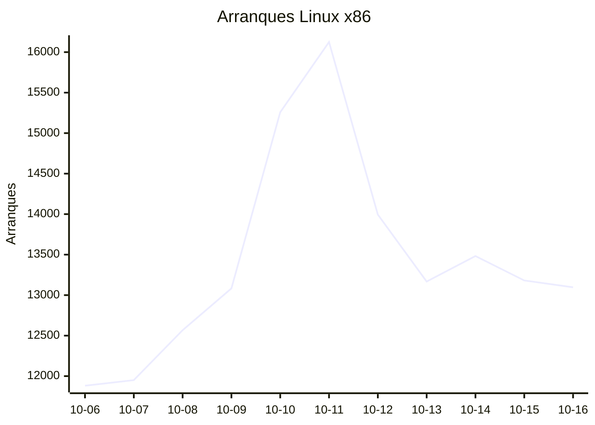
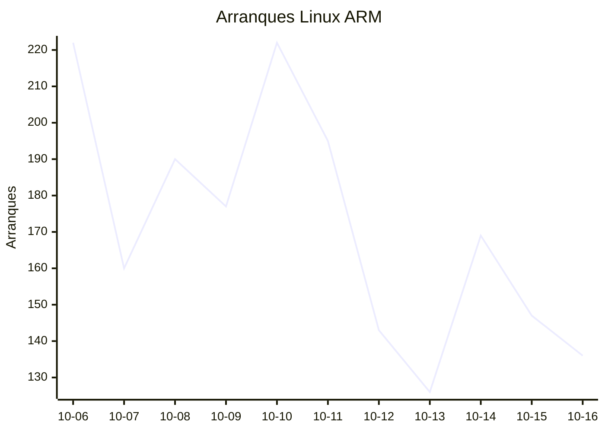
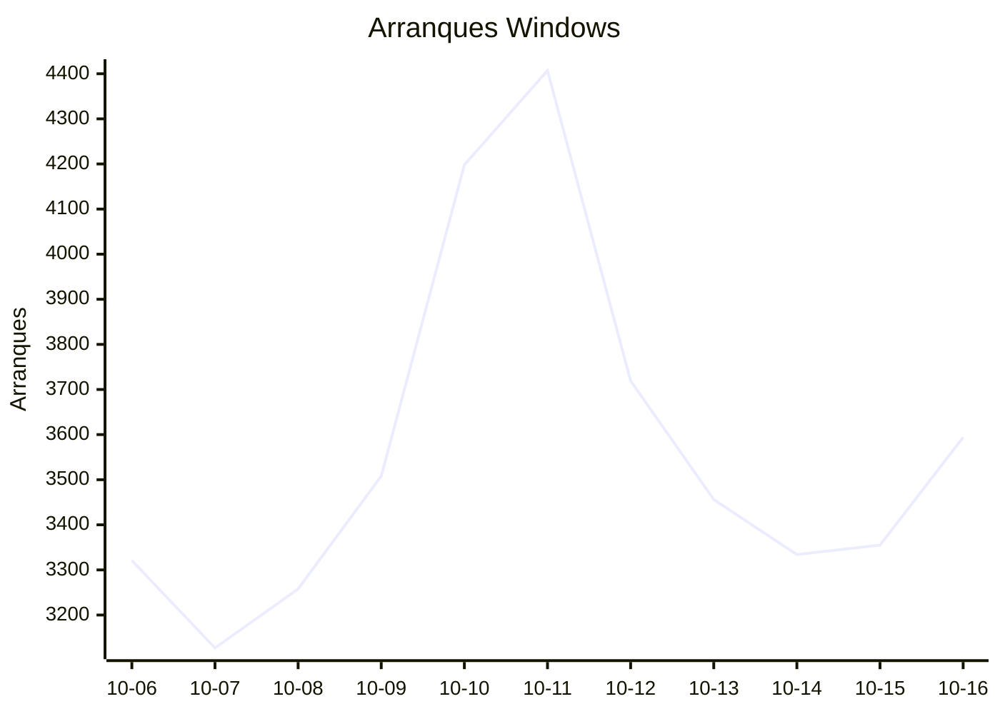
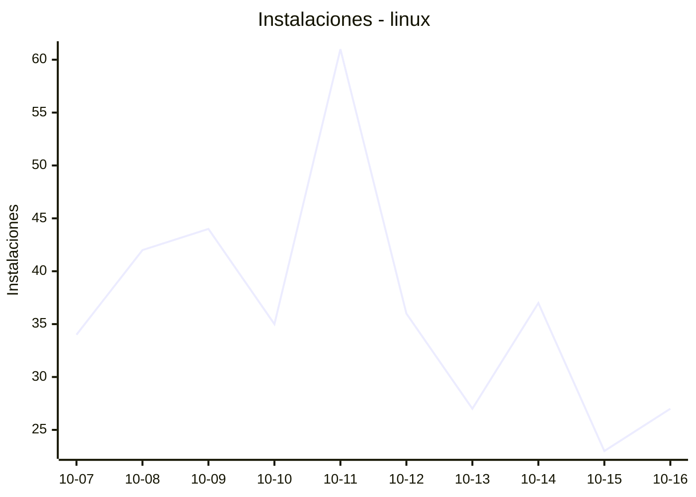
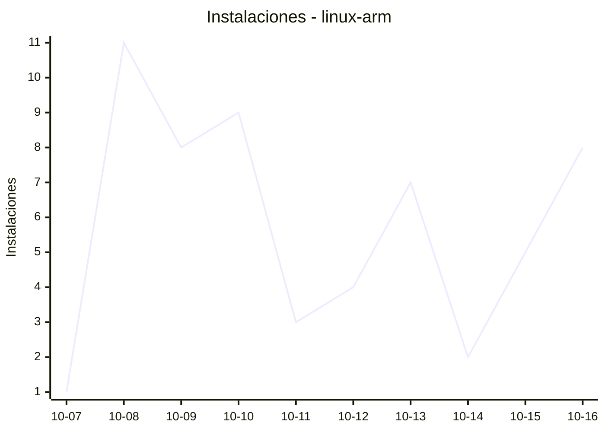
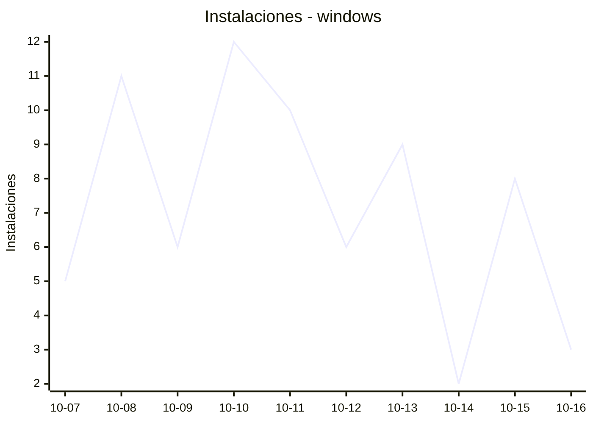
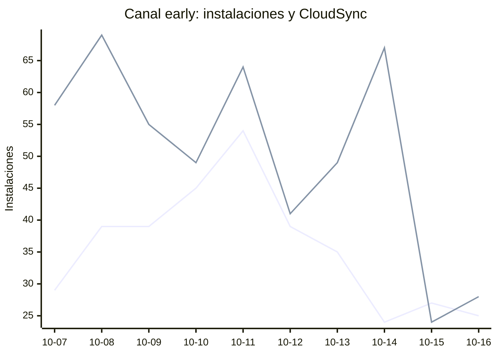

# Estadísticas de EmuDeck

Actualizado: 2026-10-17 07:38 UTC. Las gráficas no incluyen el día de hoy porque aún está incompleto.

## Arranques de la app (comprobaciones de actualización)

Cada arranque descarga el `latest*.yml` de su sistema. Cuenta arranques, no personas.

| Sistema | Ayer | Últimos 7 días |
|---|---|---|
| Linux x86 | 13097 | 98306 |
| Linux ARM | 136 | 1138 |
| Windows | 3594 | 26063 |
| Mac | 0 | 0 |

Instalaciones nuevas estimadas en Windows (7 días, `.exe` menos `.blockmap`): **1812**

```mermaid
xychart-beta
    title "Arranques Linux x86"
    x-axis ["10-06", "10-07", "10-08", "10-09", "10-10", "10-11", "10-12", "10-13", "10-14", "10-15", "10-16"]
    y-axis "Arranques"
    line [11882, 11951, 12567, 13083, 15258, 16125, 13994, 13168, 13483, 13181, 13097]
```

```mermaid
xychart-beta
    title "Arranques Linux ARM"
    x-axis ["10-06", "10-07", "10-08", "10-09", "10-10", "10-11", "10-12", "10-13", "10-14", "10-15", "10-16"]
    y-axis "Arranques"
    line [222, 160, 190, 177, 222, 195, 143, 126, 169, 147, 136]
```

```mermaid
xychart-beta
    title "Arranques Windows"
    x-axis ["10-06", "10-07", "10-08", "10-09", "10-10", "10-11", "10-12", "10-13", "10-14", "10-15", "10-16"]
    y-axis "Arranques"
    line [3321, 3127, 3258, 3508, 4198, 4407, 3719, 3456, 3334, 3355, 3594]
```

## Instalaciones de EmuDeck (beacons)

Cada `setup` descarga `system-<sistema>.txt` y cada instalación de un emulador `<emulador>-<plataforma>.txt`. Los emuladores cuentan también las actualizaciones. Histórico completo desde el primer día.

| Sistema | Ayer | Últimos 7 días | Últimos 30 días | Total |
|---|---|---|---|---|
| linux | 27 | 246 | 366 | 393 |
| linux-arm | 8 | 38 | 58 | 62 |
| windows | 3 | 50 | 72 | 85 |

```mermaid
xychart-beta
    title "Instalaciones - linux"
    x-axis ["10-07", "10-08", "10-09", "10-10", "10-11", "10-12", "10-13", "10-14", "10-15", "10-16"]
    y-axis "Instalaciones"
    line [34, 42, 44, 35, 61, 36, 27, 37, 23, 27]
```

```mermaid
xychart-beta
    title "Instalaciones - linux-arm"
    x-axis ["10-07", "10-08", "10-09", "10-10", "10-11", "10-12", "10-13", "10-14", "10-15", "10-16"]
    y-axis "Instalaciones"
    line [1, 11, 8, 9, 3, 4, 7, 2, 5, 8]
```

```mermaid
xychart-beta
    title "Instalaciones - windows"
    x-axis ["10-07", "10-08", "10-09", "10-10", "10-11", "10-12", "10-13", "10-14", "10-15", "10-16"]
    y-axis "Instalaciones"
    line [5, 11, 6, 12, 10, 6, 9, 2, 8, 3]
```

```mermaid
xychart-beta
    title "Instalaciones acumuladas (todos los sistemas)"
    x-axis ["10-06", "10-07", "10-08", "10-09", "10-10", "10-11", "10-12", "10-13", "10-14", "10-15", "10-16"]
    y-axis "Total"
    line [31, 71, 135, 193, 249, 323, 369, 412, 453, 489, 527]
```

### Por mes

| Mes | Linux | Linux ARM | Windows | Total |
|---|---|---|---|---|
| 2026-10 | 366 | 58 | 72 | 496 |

### Canal early (early + early-unstable)

Instalaciones de EmuDeck con el backend en una rama early, y cuántas de ellas instalan CloudSync.

| | Últimos 7 días | Últimos 30 días | Total |
|---|---|---|---|
| Instalaciones early | 249 | 356 | 389 |
| Con CloudSync | 322 | 504 | 582 |
| % con CloudSync | | | 150% |

Línea de arriba: instalaciones early. Línea de abajo: de ellas, con CloudSync.

```mermaid
xychart-beta
    title "Canal early: instalaciones y CloudSync"
    x-axis ["10-07", "10-08", "10-09", "10-10", "10-11", "10-12", "10-13", "10-14", "10-15", "10-16"]
    y-axis "Instalaciones"
    line [29, 39, 39, 45, 54, 39, 35, 24, 27, 25]
    line [58, 69, 55, 49, 64, 41, 49, 67, 24, 28]
```

### Por emulador

| Emulador | Linux (total) | Linux ARM (total) | Windows (total) | Últimos 7 días | Últimos 30 días | Total |
|---|---|---|---|---|---|---|
| pcsx2 | 1002 | 18 | 113 | 710 | 1026 | 1133 |
| azahar | 902 | 79 | 111 | 682 | 983 | 1092 |
| duckstation | 965 | 78 | 38 | 683 | 977 | 1081 |
| esde | 824 | 66 | 166 | 639 | 927 | 1056 |
| ryujinx | 860 | 80 | 114 | 656 | 955 | 1054 |
| rpcs3 | 901 | 77 | 35 | 649 | 918 | 1013 |
| cemu | 900 | 77 | 25 | 631 | 907 | 1002 |
| xenia | 820 | 64 | 83 | 621 | 880 | 967 |
| srm | 783 | 65 | 90 | 600 | 862 | 938 |
| shadps4 | 777 | 64 | 72 | 580 | 820 | 913 |
| vita3k | 817 | 68 | 18 | 579 | 812 | 903 |
| cloudsync | 426 | 16 | 161 | 331 | 523 | 603 |
| dolphin | 387 | 55 | 44 | 307 | 448 | 486 |
| ppsspp | 350 | 52 | 78 | 303 | 438 | 480 |
| ra | 383 | 56 | 40 | 295 | 442 | 479 |
| mgba | 357 | 32 | 23 | 271 | 380 | 412 |
| melonds | 333 | 42 | 29 | 258 | 371 | 404 |
| xemu | 326 | 45 | 29 | 259 | 368 | 400 |
| primehack | 285 | 44 | 28 | 214 | 327 | 357 |
| supermodel | 284 | 51 | 8 | 222 | 319 | 343 |
| model2 | 280 | 54 | 5 | 216 | 315 | 339 |
| scummvm | 275 | 39 | 14 | 204 | 299 | 328 |
| bigpemu | 243 | 3 | 6 | 167 | 226 | 252 |
| armsx2 | 76 | 83 | 0 | 98 | 146 | 159 |
| flycast | 78 | 12 | 5 | 62 | 90 | 95 |
| rmg | 73 | 20 | 0 | 56 | 88 | 93 |
| mame | 46 | 2 | 9 | 29 | 53 | 57 |
| eden | 37 | 7 | 0 | 32 | 34 | 44 |
| pegasus | 9 | 0 | 7 | 11 | 14 | 16 |
| yuzu | 6 | 0 | 0 | 5 | 6 | 6 |
| ares | 3 | 1 | 0 | 2 | 4 | 4 |
| citron | 3 | 0 | 0 | 3 | 3 | 3 |
