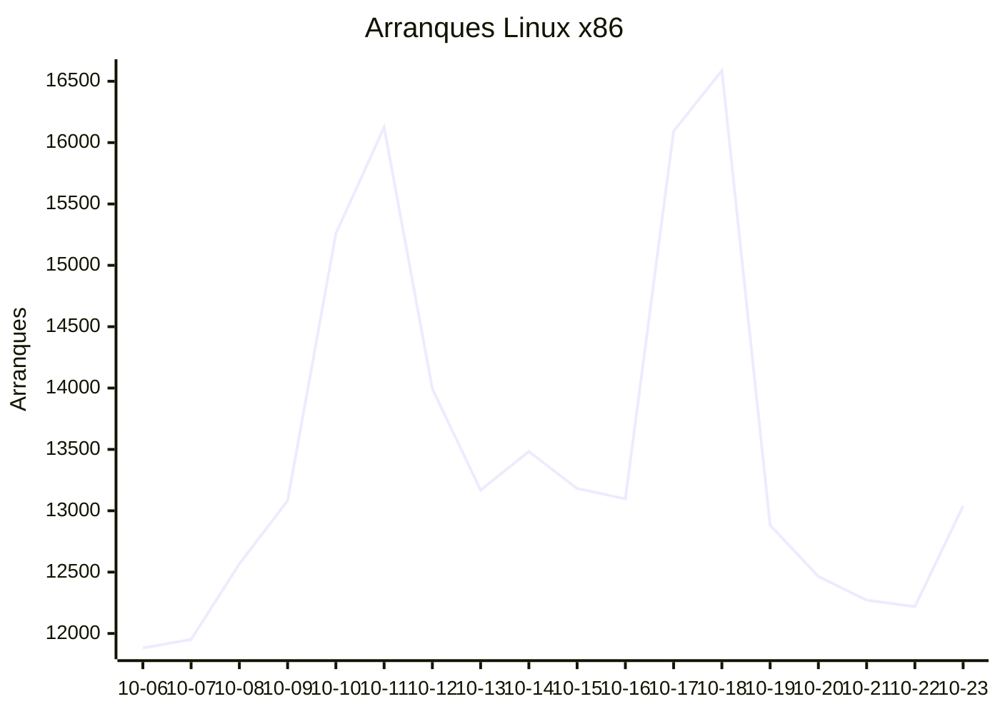
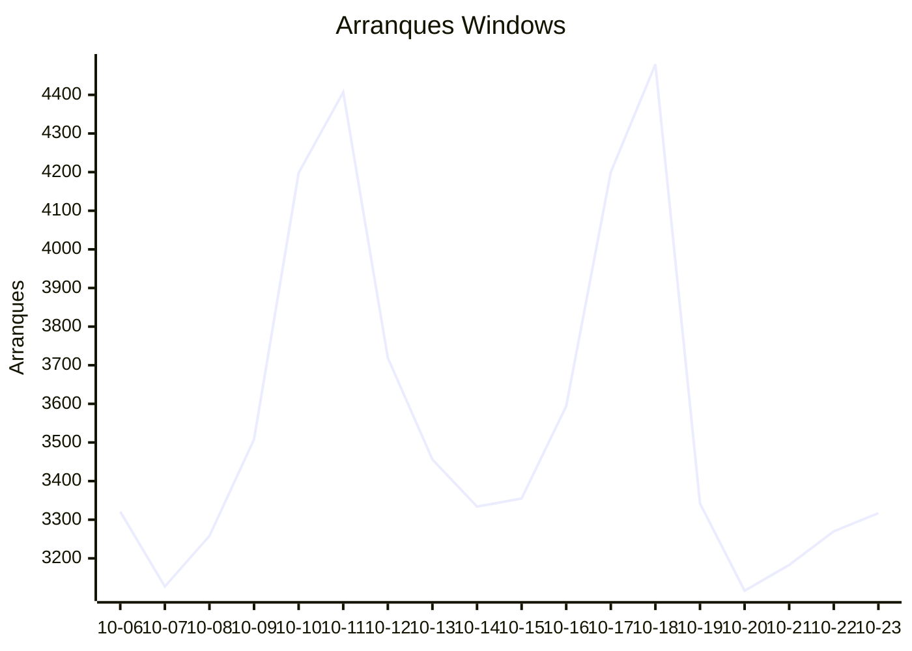
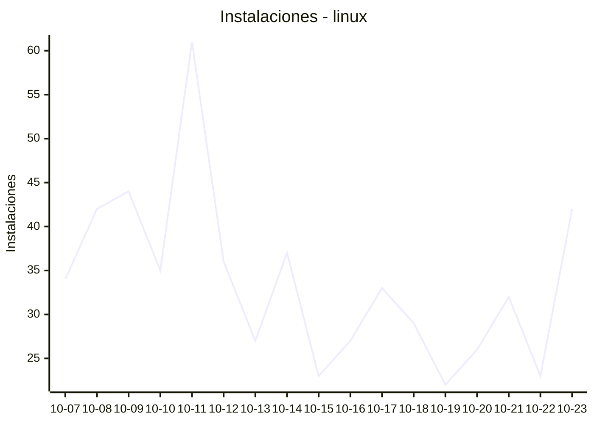
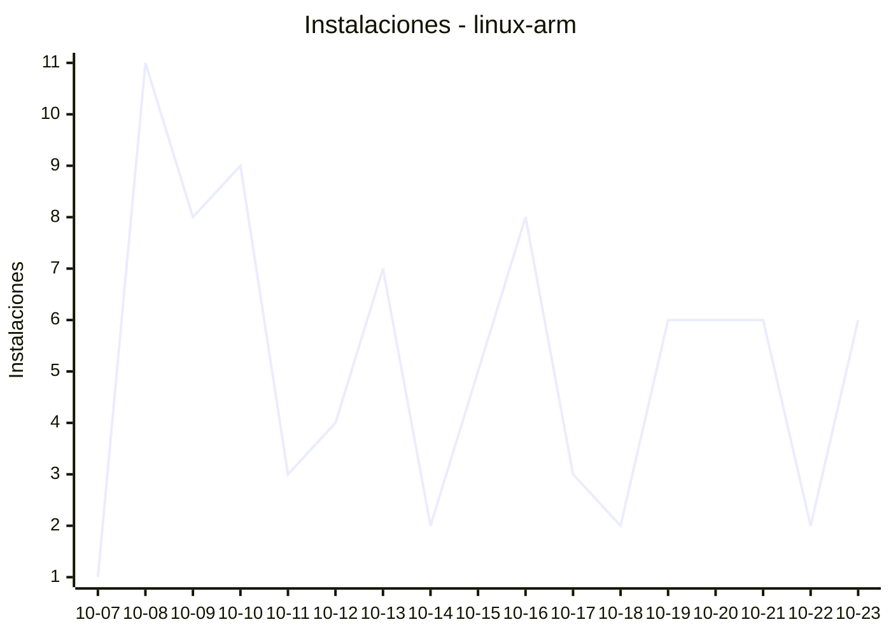
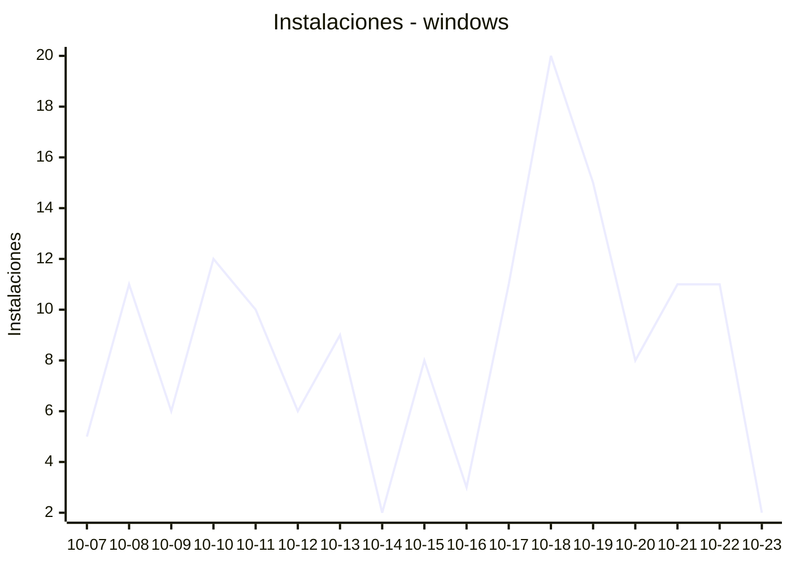
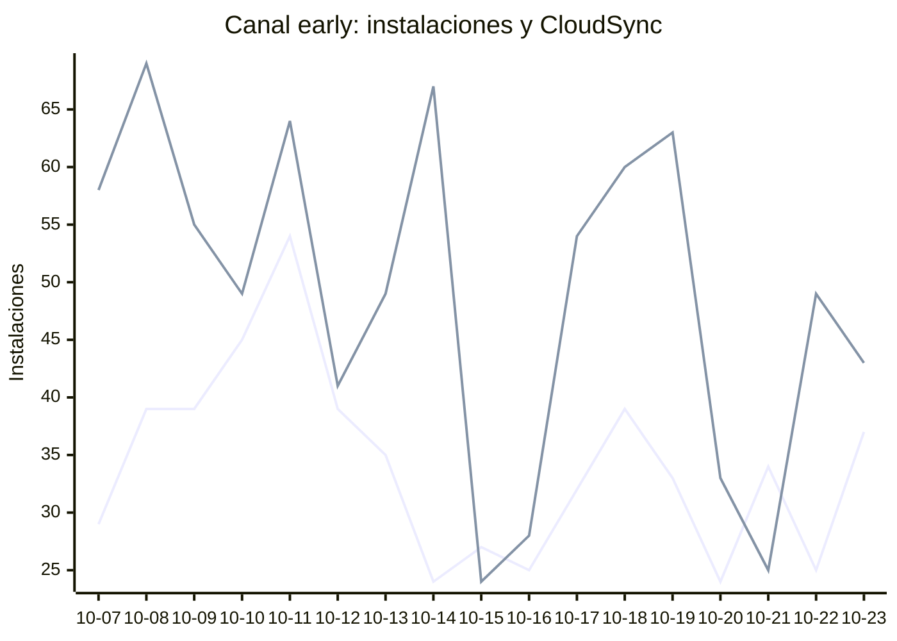

# Estadísticas de EmuDeck

Actualizado: 2026-10-24 23:11 UTC. Las gráficas no incluyen el día de hoy porque aún está incompleto.

## Arranques de la app (comprobaciones de actualización)

Cada arranque descarga el `latest*.yml` de su sistema. Cuenta arranques, no personas.

| Sistema | Ayer | Últimos 7 días |
|---|---|---|
| Linux x86 | 13039 | 95557 |
| Linux ARM | 153 | 1112 |
| Windows | 3317 | 24907 |
| Mac | 0 | 1 |

Instalaciones nuevas estimadas en Windows (7 días, `.exe` menos `.blockmap`): **2061**

```mermaid
xychart-beta
    title "Arranques Linux x86"
    x-axis ["10-06", "10-07", "10-08", "10-09", "10-10", "10-11", "10-12", "10-13", "10-14", "10-15", "10-16", "10-17", "10-18", "10-19", "10-20", "10-21", "10-22", "10-23"]
    y-axis "Arranques"
    line [11882, 11951, 12567, 13083, 15258, 16125, 13994, 13168, 13483, 13181, 13097, 16093, 16587, 12882, 12465, 12272, 12219, 13039]
```

```mermaid
xychart-beta
    title "Arranques Linux ARM"
    x-axis ["10-06", "10-07", "10-08", "10-09", "10-10", "10-11", "10-12", "10-13", "10-14", "10-15", "10-16", "10-17", "10-18", "10-19", "10-20", "10-21", "10-22", "10-23"]
    y-axis "Arranques"
    line [222, 160, 190, 177, 222, 195, 143, 126, 169, 147, 136, 158, 180, 162, 135, 186, 138, 153]
```

```mermaid
xychart-beta
    title "Arranques Windows"
    x-axis ["10-06", "10-07", "10-08", "10-09", "10-10", "10-11", "10-12", "10-13", "10-14", "10-15", "10-16", "10-17", "10-18", "10-19", "10-20", "10-21", "10-22", "10-23"]
    y-axis "Arranques"
    line [3321, 3127, 3258, 3508, 4198, 4407, 3719, 3456, 3334, 3355, 3594, 4200, 4479, 3342, 3116, 3183, 3270, 3317]
```

```mermaid
xychart-beta
    title "Arranques Mac"
    x-axis ["10-06", "10-07", "10-08", "10-09", "10-10", "10-11", "10-12", "10-13", "10-14", "10-15", "10-16", "10-17", "10-18", "10-19", "10-20", "10-21", "10-22", "10-23"]
    y-axis "Arranques"
    line [0, 0, 0, 0, 0, 0, 0, 0, 0, 0, 0, 0, 0, 0, 0, 0, 1, 0]
```

## Instalaciones de EmuDeck (beacons)

Cada `setup` descarga `system-<sistema>.txt` y cada instalación de un emulador `<emulador>-<plataforma>.txt`. Los emuladores cuentan también las actualizaciones. Histórico completo desde el primer día.

| Sistema | Ayer | Últimos 7 días | Últimos 30 días | Total |
|---|---|---|---|---|
| linux | 42 | 207 | 573 | 615 |
| linux-arm | 6 | 31 | 89 | 99 |
| windows | 2 | 78 | 150 | 165 |

```mermaid
xychart-beta
    title "Instalaciones - linux"
    x-axis ["10-07", "10-08", "10-09", "10-10", "10-11", "10-12", "10-13", "10-14", "10-15", "10-16", "10-17", "10-18", "10-19", "10-20", "10-21", "10-22", "10-23"]
    y-axis "Instalaciones"
    line [34, 42, 44, 35, 61, 36, 27, 37, 23, 27, 33, 29, 22, 26, 32, 23, 42]
```

```mermaid
xychart-beta
    title "Instalaciones - linux-arm"
    x-axis ["10-07", "10-08", "10-09", "10-10", "10-11", "10-12", "10-13", "10-14", "10-15", "10-16", "10-17", "10-18", "10-19", "10-20", "10-21", "10-22", "10-23"]
    y-axis "Instalaciones"
    line [1, 11, 8, 9, 3, 4, 7, 2, 5, 8, 3, 2, 6, 6, 6, 2, 6]
```

```mermaid
xychart-beta
    title "Instalaciones - windows"
    x-axis ["10-07", "10-08", "10-09", "10-10", "10-11", "10-12", "10-13", "10-14", "10-15", "10-16", "10-17", "10-18", "10-19", "10-20", "10-21", "10-22", "10-23"]
    y-axis "Instalaciones"
    line [5, 11, 6, 12, 10, 6, 9, 2, 8, 3, 11, 20, 15, 8, 11, 11, 2]
```

```mermaid
xychart-beta
    title "Instalaciones acumuladas (todos los sistemas)"
    x-axis ["10-06", "10-07", "10-08", "10-09", "10-10", "10-11", "10-12", "10-13", "10-14", "10-15", "10-16", "10-17", "10-18", "10-19", "10-20", "10-21", "10-22", "10-23"]
    y-axis "Total"
    line [31, 71, 135, 193, 249, 323, 369, 412, 453, 489, 527, 574, 625, 668, 708, 757, 793, 843]
```

### Por mes

| Mes | Linux | Linux ARM | Windows | Total |
|---|---|---|---|---|
| 2026-10 | 573 | 89 | 150 | 812 |

### Canal early (early + early-unstable)

Instalaciones de EmuDeck con el backend en una rama early, y cuántas de ellas instalan CloudSync.

| | Últimos 7 días | Últimos 30 días | Total |
|---|---|---|---|
| Instalaciones early | 224 | 580 | 625 |
| Con CloudSync | 327 | 831 | 926 |
| % con CloudSync | | | 148% |

Línea de arriba: instalaciones early. Línea de abajo: de ellas, con CloudSync.

```mermaid
xychart-beta
    title "Canal early: instalaciones y CloudSync"
    x-axis ["10-07", "10-08", "10-09", "10-10", "10-11", "10-12", "10-13", "10-14", "10-15", "10-16", "10-17", "10-18", "10-19", "10-20", "10-21", "10-22", "10-23"]
    y-axis "Instalaciones"
    line [29, 39, 39, 45, 54, 39, 35, 24, 27, 25, 32, 39, 33, 24, 34, 25, 37]
    line [58, 69, 55, 49, 64, 41, 49, 67, 24, 28, 54, 60, 63, 33, 25, 49, 43]
```

### Por emulador

| Emulador | Linux (total) | Linux ARM (total) | Windows (total) | Últimos 7 días | Últimos 30 días | Total |
|---|---|---|---|---|---|---|
| pcsx2 | 1683 | 22 | 193 | 690 | 1716 | 1898 |
| duckstation | 1610 | 132 | 83 | 677 | 1654 | 1825 |
| azahar | 1485 | 145 | 189 | 659 | 1642 | 1819 |
| ryujinx | 1439 | 144 | 196 | 654 | 1609 | 1779 |
| esde | 1362 | 110 | 304 | 643 | 1570 | 1776 |
| rpcs3 | 1509 | 132 | 79 | 638 | 1556 | 1720 |
| cemu | 1486 | 135 | 63 | 625 | 1532 | 1684 |
| srm | 1331 | 124 | 215 | 653 | 1515 | 1670 |
| xenia | 1357 | 108 | 163 | 606 | 1486 | 1628 |
| shadps4 | 1280 | 110 | 138 | 567 | 1387 | 1528 |
| vita3k | 1343 | 119 | 52 | 560 | 1372 | 1514 |
| cloudsync | 656 | 25 | 281 | 339 | 862 | 962 |
| ppsspp | 546 | 83 | 145 | 271 | 709 | 774 |
| ra | 592 | 87 | 95 | 275 | 717 | 774 |
| dolphin | 592 | 90 | 85 | 261 | 709 | 767 |
| mgba | 591 | 51 | 47 | 249 | 629 | 689 |
| xemu | 512 | 74 | 62 | 227 | 595 | 648 |
| melonds | 511 | 70 | 62 | 222 | 593 | 643 |
| primehack | 445 | 68 | 65 | 200 | 527 | 578 |
| supermodel | 435 | 81 | 15 | 175 | 494 | 531 |
| scummvm | 423 | 59 | 40 | 181 | 480 | 522 |
| model2 | 429 | 84 | 7 | 171 | 486 | 520 |
| bigpemu | 419 | 10 | 11 | 169 | 395 | 440 |
| armsx2 | 129 | 147 | 0 | 99 | 245 | 276 |
| flycast | 118 | 15 | 16 | 50 | 140 | 149 |
| rmg | 112 | 26 | 0 | 42 | 130 | 138 |
| mame | 65 | 2 | 15 | 23 | 76 | 82 |
| eden | 73 | 7 | 0 | 38 | 72 | 80 |
| pegasus | 13 | 0 | 12 | 7 | 21 | 25 |
| yuzu | 8 | 0 | 2 | 1 | 7 | 10 |
| ares | 6 | 1 | 0 | 3 | 7 | 7 |
| citron | 4 | 0 | 0 | 1 | 4 | 4 |
