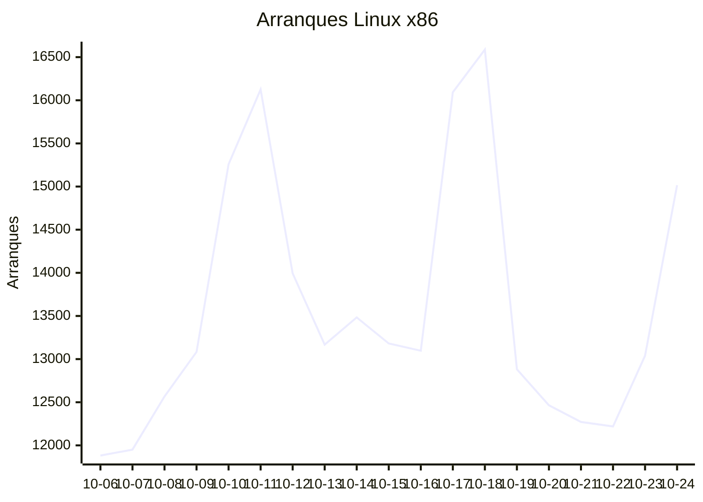
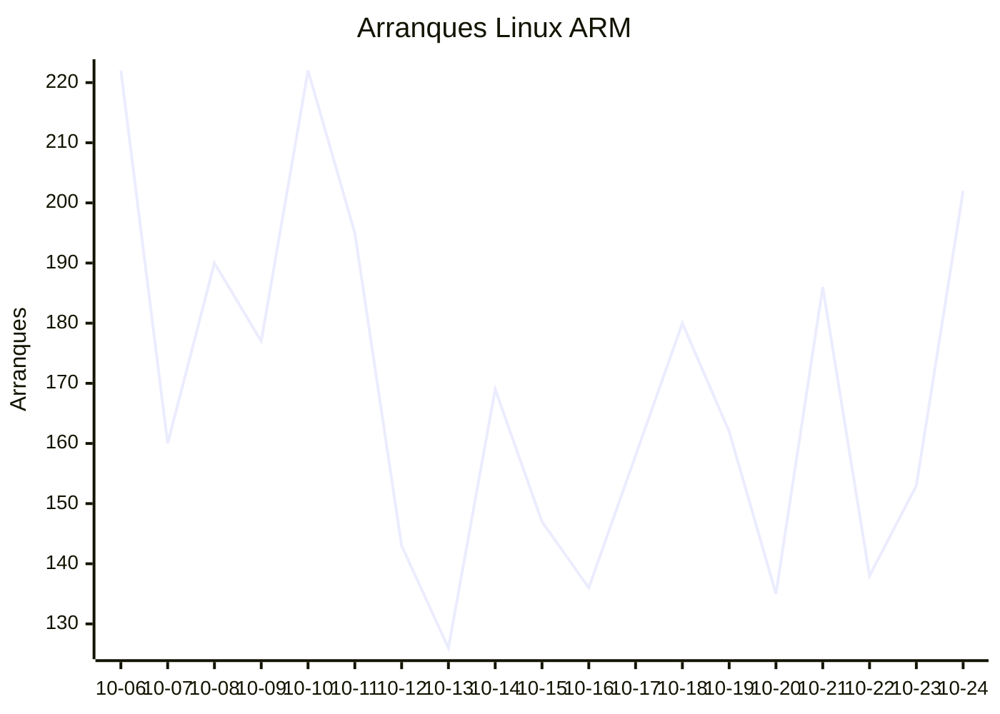
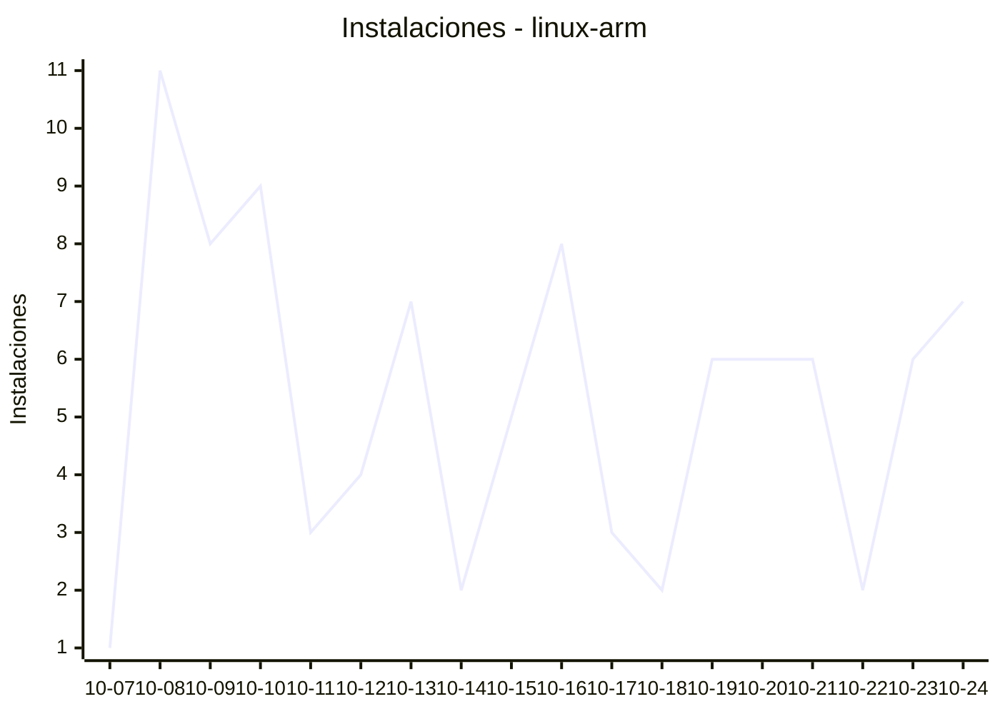
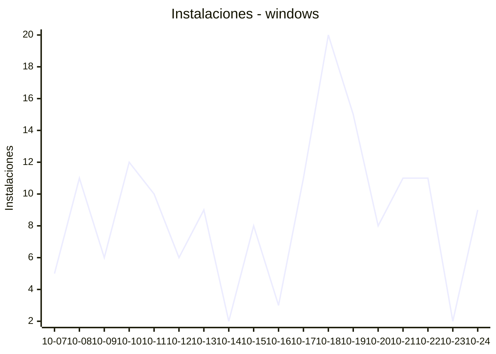
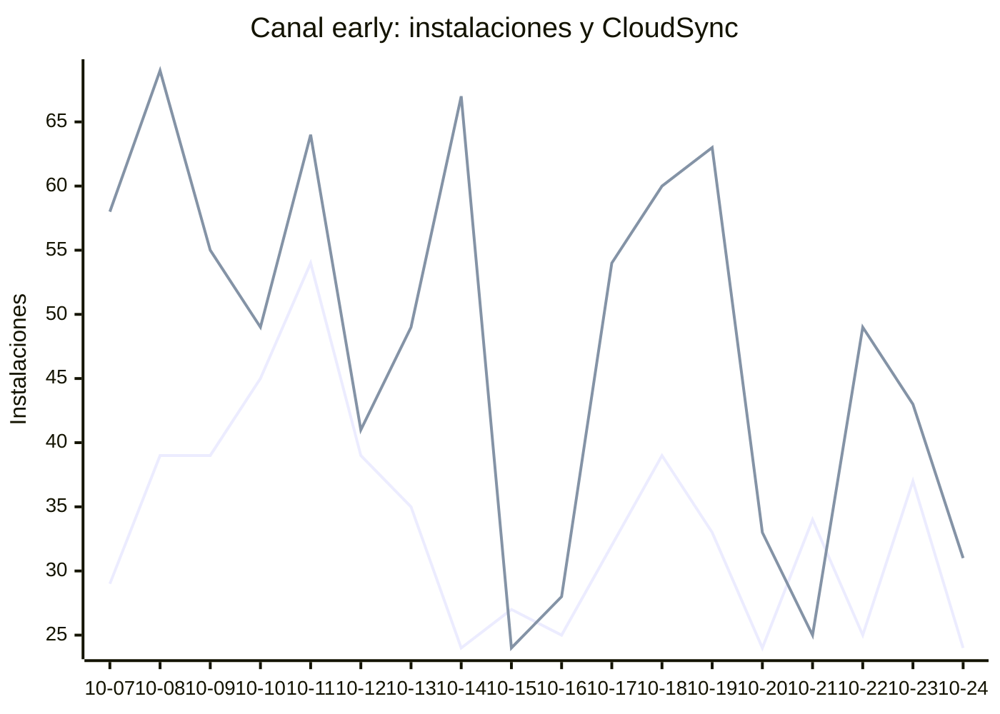

# Estadísticas de EmuDeck

Actualizado: 2026-10-25 15:37 UTC. Las gráficas no incluyen el día de hoy porque aún está incompleto.

## Arranques de la app (comprobaciones de actualización)

Cada arranque descarga el `latest*.yml` de su sistema. Cuenta arranques, no personas.

| Sistema | Ayer | Últimos 7 días |
|---|---|---|
| Linux x86 | 15016 | 94480 |
| Linux ARM | 202 | 1156 |
| Windows | 3877 | 24584 |
| Mac | 0 | 1 |

Instalaciones nuevas estimadas en Windows (7 días, `.exe` menos `.blockmap`): **2046**

```mermaid
xychart-beta
    title "Arranques Linux x86"
    x-axis ["10-06", "10-07", "10-08", "10-09", "10-10", "10-11", "10-12", "10-13", "10-14", "10-15", "10-16", "10-17", "10-18", "10-19", "10-20", "10-21", "10-22", "10-23", "10-24"]
    y-axis "Arranques"
    line [11882, 11951, 12567, 13083, 15258, 16125, 13994, 13168, 13483, 13181, 13097, 16093, 16587, 12882, 12465, 12272, 12219, 13039, 15016]
```

```mermaid
xychart-beta
    title "Arranques Linux ARM"
    x-axis ["10-06", "10-07", "10-08", "10-09", "10-10", "10-11", "10-12", "10-13", "10-14", "10-15", "10-16", "10-17", "10-18", "10-19", "10-20", "10-21", "10-22", "10-23", "10-24"]
    y-axis "Arranques"
    line [222, 160, 190, 177, 222, 195, 143, 126, 169, 147, 136, 158, 180, 162, 135, 186, 138, 153, 202]
```

```mermaid
xychart-beta
    title "Arranques Windows"
    x-axis ["10-06", "10-07", "10-08", "10-09", "10-10", "10-11", "10-12", "10-13", "10-14", "10-15", "10-16", "10-17", "10-18", "10-19", "10-20", "10-21", "10-22", "10-23", "10-24"]
    y-axis "Arranques"
    line [3321, 3127, 3258, 3508, 4198, 4407, 3719, 3456, 3334, 3355, 3594, 4200, 4479, 3342, 3116, 3183, 3270, 3317, 3877]
```

```mermaid
xychart-beta
    title "Arranques Mac"
    x-axis ["10-06", "10-07", "10-08", "10-09", "10-10", "10-11", "10-12", "10-13", "10-14", "10-15", "10-16", "10-17", "10-18", "10-19", "10-20", "10-21", "10-22", "10-23", "10-24"]
    y-axis "Arranques"
    line [0, 0, 0, 0, 0, 0, 0, 0, 0, 0, 0, 0, 0, 0, 0, 0, 1, 0, 0]
```

## Instalaciones de EmuDeck (beacons)

Cada `setup` descarga `system-<sistema>.txt` y cada instalación de un emulador `<emulador>-<plataforma>.txt`. Los emuladores cuentan también las actualizaciones. Histórico completo desde el primer día.

| Sistema | Ayer | Últimos 7 días | Últimos 30 días | Total |
|---|---|---|---|---|
| linux | 22 | 196 | 595 | 640 |
| linux-arm | 7 | 35 | 96 | 100 |
| windows | 9 | 76 | 159 | 167 |

```mermaid
xychart-beta
    title "Instalaciones - linux"
    x-axis ["10-07", "10-08", "10-09", "10-10", "10-11", "10-12", "10-13", "10-14", "10-15", "10-16", "10-17", "10-18", "10-19", "10-20", "10-21", "10-22", "10-23", "10-24"]
    y-axis "Instalaciones"
    line [34, 42, 44, 35, 61, 36, 27, 37, 23, 27, 33, 29, 22, 26, 32, 23, 42, 22]
```

```mermaid
xychart-beta
    title "Instalaciones - linux-arm"
    x-axis ["10-07", "10-08", "10-09", "10-10", "10-11", "10-12", "10-13", "10-14", "10-15", "10-16", "10-17", "10-18", "10-19", "10-20", "10-21", "10-22", "10-23", "10-24"]
    y-axis "Instalaciones"
    line [1, 11, 8, 9, 3, 4, 7, 2, 5, 8, 3, 2, 6, 6, 6, 2, 6, 7]
```

```mermaid
xychart-beta
    title "Instalaciones - windows"
    x-axis ["10-07", "10-08", "10-09", "10-10", "10-11", "10-12", "10-13", "10-14", "10-15", "10-16", "10-17", "10-18", "10-19", "10-20", "10-21", "10-22", "10-23", "10-24"]
    y-axis "Instalaciones"
    line [5, 11, 6, 12, 10, 6, 9, 2, 8, 3, 11, 20, 15, 8, 11, 11, 2, 9]
```

```mermaid
xychart-beta
    title "Instalaciones acumuladas (todos los sistemas)"
    x-axis ["10-06", "10-07", "10-08", "10-09", "10-10", "10-11", "10-12", "10-13", "10-14", "10-15", "10-16", "10-17", "10-18", "10-19", "10-20", "10-21", "10-22", "10-23", "10-24"]
    y-axis "Total"
    line [31, 71, 135, 193, 249, 323, 369, 412, 453, 489, 527, 574, 625, 668, 708, 757, 793, 843, 881]
```

### Por mes

| Mes | Linux | Linux ARM | Windows | Total |
|---|---|---|---|---|
| 2026-10 | 595 | 96 | 159 | 850 |

### Canal early (early + early-unstable)

Instalaciones de EmuDeck con el backend en una rama early, y cuántas de ellas instalan CloudSync.

| | Últimos 7 días | Últimos 30 días | Total |
|---|---|---|---|
| Instalaciones early | 216 | 604 | 647 |
| Con CloudSync | 304 | 862 | 951 |
| % con CloudSync | | | 147% |

Línea de arriba: instalaciones early. Línea de abajo: de ellas, con CloudSync.

```mermaid
xychart-beta
    title "Canal early: instalaciones y CloudSync"
    x-axis ["10-07", "10-08", "10-09", "10-10", "10-11", "10-12", "10-13", "10-14", "10-15", "10-16", "10-17", "10-18", "10-19", "10-20", "10-21", "10-22", "10-23", "10-24"]
    y-axis "Instalaciones"
    line [29, 39, 39, 45, 54, 39, 35, 24, 27, 25, 32, 39, 33, 24, 34, 25, 37, 24]
    line [58, 69, 55, 49, 64, 41, 49, 67, 24, 28, 54, 60, 63, 33, 25, 49, 43, 31]
```

### Por emulador

| Emulador | Linux (total) | Linux ARM (total) | Windows (total) | Últimos 7 días | Últimos 30 días | Total |
|---|---|---|---|---|---|---|
| pcsx2 | 1750 | 22 | 196 | 684 | 1828 | 1968 |
| duckstation | 1674 | 135 | 83 | 662 | 1755 | 1892 |
| azahar | 1539 | 150 | 194 | 659 | 1747 | 1883 |
| ryujinx | 1496 | 145 | 201 | 651 | 1715 | 1842 |
| esde | 1414 | 112 | 313 | 657 | 1690 | 1839 |
| rpcs3 | 1574 | 134 | 80 | 628 | 1656 | 1788 |
| cemu | 1547 | 137 | 63 | 612 | 1624 | 1747 |
| srm | 1392 | 126 | 220 | 665 | 1625 | 1738 |
| xenia | 1419 | 109 | 166 | 600 | 1573 | 1694 |
| shadps4 | 1337 | 113 | 142 | 548 | 1468 | 1592 |
| vita3k | 1394 | 121 | 52 | 544 | 1454 | 1567 |
| cloudsync | 675 | 25 | 287 | 319 | 896 | 987 |
| ra | 616 | 88 | 97 | 268 | 747 | 801 |
| ppsspp | 567 | 84 | 147 | 266 | 745 | 798 |
| dolphin | 616 | 91 | 85 | 254 | 739 | 792 |
| mgba | 621 | 51 | 48 | 250 | 669 | 720 |
| xemu | 532 | 74 | 63 | 225 | 624 | 669 |
| melonds | 529 | 71 | 62 | 214 | 617 | 662 |
| primehack | 463 | 68 | 66 | 200 | 555 | 597 |
| supermodel | 450 | 82 | 15 | 170 | 512 | 547 |
| scummvm | 437 | 60 | 40 | 173 | 500 | 537 |
| model2 | 443 | 85 | 7 | 163 | 501 | 535 |
| bigpemu | 436 | 10 | 11 | 170 | 422 | 457 |
| armsx2 | 132 | 151 | 0 | 109 | 267 | 283 |
| flycast | 120 | 15 | 17 | 50 | 144 | 152 |
| rmg | 116 | 26 | 0 | 41 | 134 | 142 |
| mame | 67 | 2 | 15 | 23 | 78 | 84 |
| eden | 73 | 7 | 0 | 23 | 72 | 80 |
| pegasus | 15 | 0 | 12 | 7 | 23 | 27 |
| yuzu | 8 | 0 | 2 | 4 | 10 | 10 |
| ares | 7 | 1 | 0 | 3 | 7 | 8 |
| citron | 4 | 0 | 0 | 1 | 4 | 4 |
