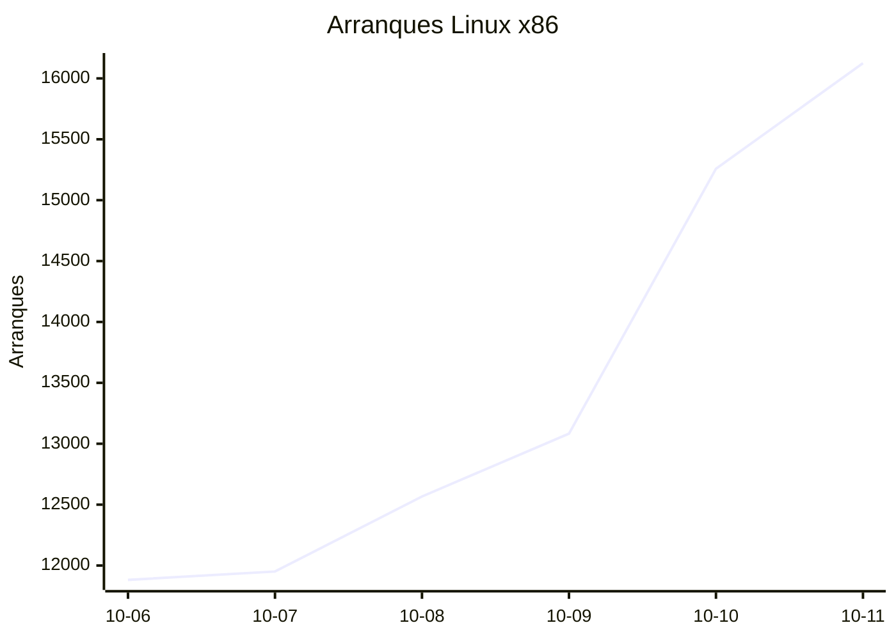
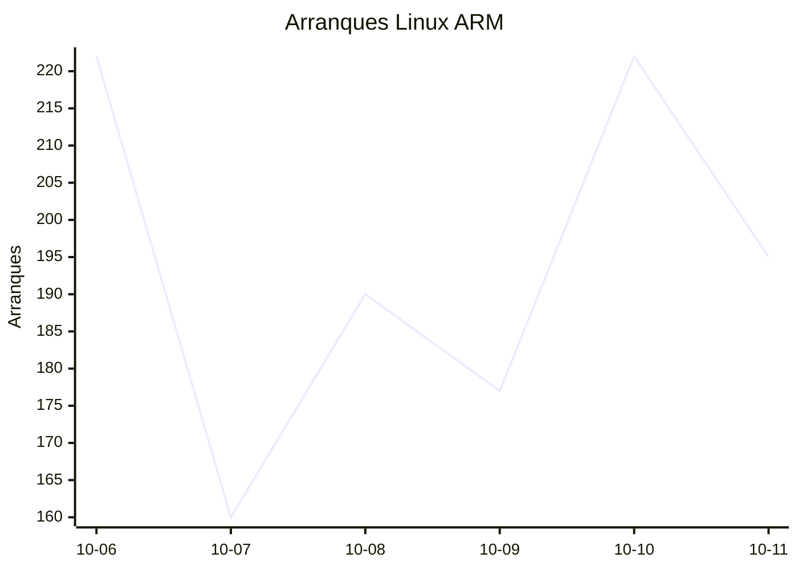
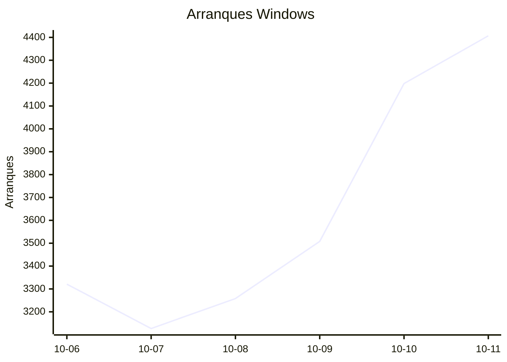
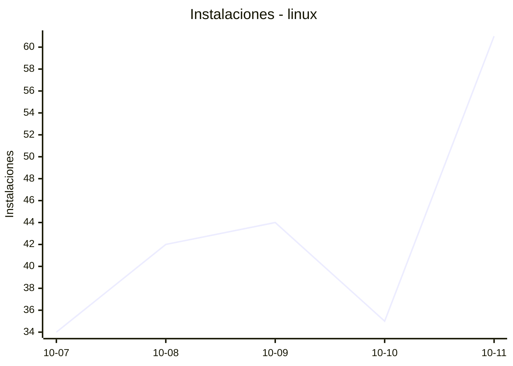
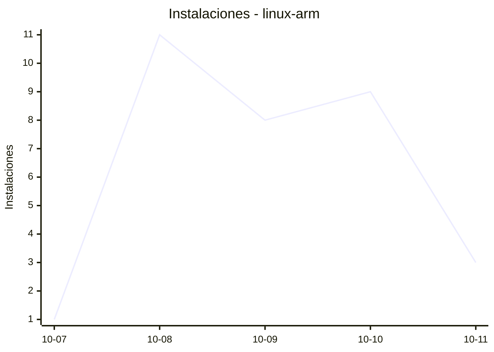
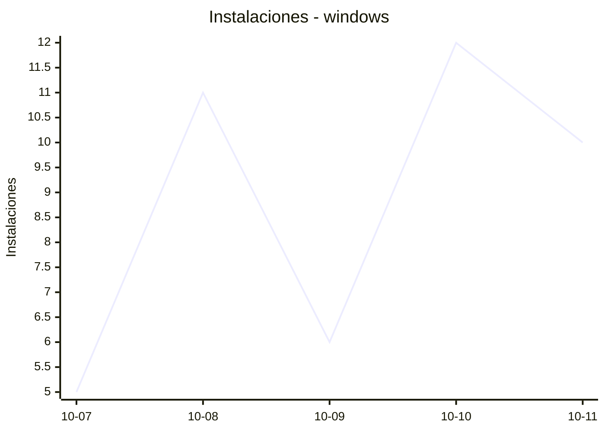
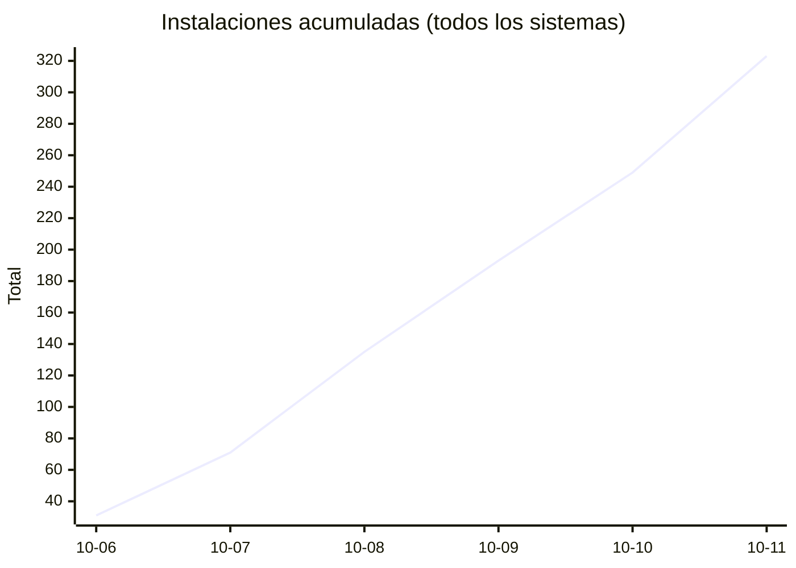
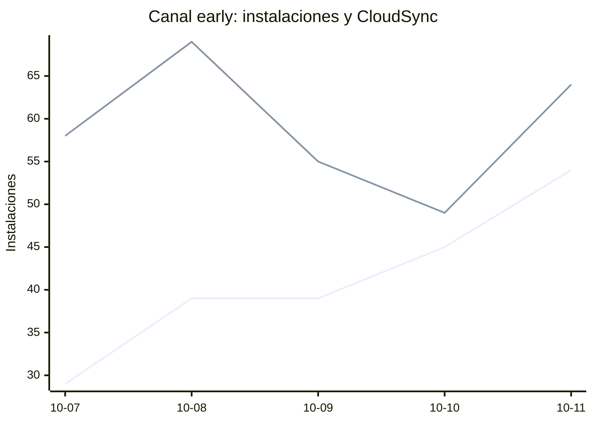

# Estadísticas de EmuDeck

Actualizado: 2026-10-12 14:49 UTC. Las gráficas no incluyen el día de hoy porque aún está incompleto.

## Arranques de la app (comprobaciones de actualización)

Cada arranque descarga el `latest*.yml` de su sistema. Cuenta arranques, no personas.

| Sistema | Ayer | Últimos 7 días |
|---|---|---|
| Linux x86 | 16125 | 80866 |
| Linux ARM | 195 | 1166 |
| Windows | 4407 | 21819 |
| Mac | 0 | 0 |

Instalaciones nuevas estimadas en Windows (7 días, `.exe` menos `.blockmap`): **1216**

```mermaid
xychart-beta
    title "Arranques Linux x86"
    x-axis ["10-06", "10-07", "10-08", "10-09", "10-10", "10-11"]
    y-axis "Arranques"
    line [11882, 11951, 12567, 13083, 15258, 16125]
```

```mermaid
xychart-beta
    title "Arranques Linux ARM"
    x-axis ["10-06", "10-07", "10-08", "10-09", "10-10", "10-11"]
    y-axis "Arranques"
    line [222, 160, 190, 177, 222, 195]
```

```mermaid
xychart-beta
    title "Arranques Windows"
    x-axis ["10-06", "10-07", "10-08", "10-09", "10-10", "10-11"]
    y-axis "Arranques"
    line [3321, 3127, 3258, 3508, 4198, 4407]
```

## Instalaciones de EmuDeck (beacons)

Cada `setup` descarga `system-<sistema>.txt` y cada instalación de un emulador `<emulador>-<plataforma>.txt`. Los emuladores cuentan también las actualizaciones. Histórico completo desde el primer día.

| Sistema | Ayer | Últimos 7 días | Últimos 30 días | Total |
|---|---|---|---|---|
| linux | 61 | 216 | 216 | 251 |
| linux-arm | 3 | 32 | 32 | 39 |
| windows | 10 | 44 | 44 | 55 |

```mermaid
xychart-beta
    title "Instalaciones - linux"
    x-axis ["10-07", "10-08", "10-09", "10-10", "10-11"]
    y-axis "Instalaciones"
    line [34, 42, 44, 35, 61]
```

```mermaid
xychart-beta
    title "Instalaciones - linux-arm"
    x-axis ["10-07", "10-08", "10-09", "10-10", "10-11"]
    y-axis "Instalaciones"
    line [1, 11, 8, 9, 3]
```

```mermaid
xychart-beta
    title "Instalaciones - windows"
    x-axis ["10-07", "10-08", "10-09", "10-10", "10-11"]
    y-axis "Instalaciones"
    line [5, 11, 6, 12, 10]
```

```mermaid
xychart-beta
    title "Instalaciones acumuladas (todos los sistemas)"
    x-axis ["10-06", "10-07", "10-08", "10-09", "10-10", "10-11"]
    y-axis "Total"
    line [31, 71, 135, 193, 249, 323]
```

### Por mes

| Mes | Linux | Linux ARM | Windows | Total |
|---|---|---|---|---|
| 2026-10 | 216 | 32 | 44 | 292 |

### Canal early (early + early-unstable)

Instalaciones de EmuDeck con el backend en una rama early, y cuántas de ellas instalan CloudSync.

| | Últimos 7 días | Últimos 30 días | Total |
|---|---|---|---|
| Instalaciones early | 206 | 206 | 248 |
| Con CloudSync | 295 | 295 | 373 |
| % con CloudSync | | | 150% |

Línea de arriba: instalaciones early. Línea de abajo: de ellas, con CloudSync.

```mermaid
xychart-beta
    title "Canal early: instalaciones y CloudSync"
    x-axis ["10-07", "10-08", "10-09", "10-10", "10-11"]
    y-axis "Instalaciones"
    line [29, 39, 39, 45, 54]
    line [58, 69, 55, 49, 64]
```

### Por emulador

| Emulador | Linux (total) | Linux ARM (total) | Windows (total) | Últimos 7 días | Últimos 30 días | Total |
|---|---|---|---|---|---|---|
| pcsx2 | 592 | 12 | 75 | 561 | 561 | 679 |
| azahar | 527 | 49 | 72 | 531 | 531 | 648 |
| duckstation | 576 | 47 | 23 | 530 | 530 | 646 |
| esde | 486 | 44 | 110 | 505 | 505 | 640 |
| ryujinx | 499 | 50 | 75 | 518 | 518 | 624 |
| rpcs3 | 527 | 46 | 23 | 487 | 487 | 596 |
| cemu | 527 | 48 | 17 | 487 | 487 | 592 |
| xenia | 475 | 42 | 52 | 466 | 466 | 569 |
| srm | 461 | 33 | 46 | 460 | 460 | 540 |
| shadps4 | 448 | 47 | 41 | 439 | 439 | 536 |
| vita3k | 473 | 42 | 11 | 425 | 425 | 526 |
| cloudsync | 270 | 13 | 108 | 311 | 311 | 391 |
| ppsspp | 222 | 34 | 53 | 258 | 258 | 309 |
| ra | 247 | 37 | 20 | 259 | 259 | 304 |
| dolphin | 240 | 36 | 24 | 254 | 254 | 300 |
| xemu | 203 | 27 | 21 | 210 | 210 | 251 |
| melonds | 203 | 26 | 17 | 204 | 204 | 246 |
| mgba | 195 | 21 | 18 | 197 | 197 | 234 |
| primehack | 180 | 28 | 21 | 190 | 190 | 229 |
| model2 | 172 | 34 | 2 | 176 | 176 | 208 |
| scummvm | 170 | 26 | 12 | 174 | 174 | 208 |
| supermodel | 169 | 34 | 5 | 176 | 176 | 208 |
| bigpemu | 143 | 3 | 2 | 121 | 121 | 148 |
| armsx2 | 43 | 50 | 0 | 76 | 76 | 93 |
| flycast | 48 | 8 | 5 | 53 | 53 | 61 |
| rmg | 39 | 14 | 0 | 45 | 45 | 53 |
| mame | 33 | 1 | 8 | 38 | 38 | 42 |
| eden | 13 | 3 | 0 | 8 | 8 | 16 |
| pegasus | 5 | 0 | 1 | 4 | 4 | 6 |
| yuzu | 4 | 0 | 0 | 4 | 4 | 4 |
| ares | 2 | 1 | 0 | 2 | 2 | 3 |
| citron | 1 | 0 | 0 | 1 | 1 | 1 |
