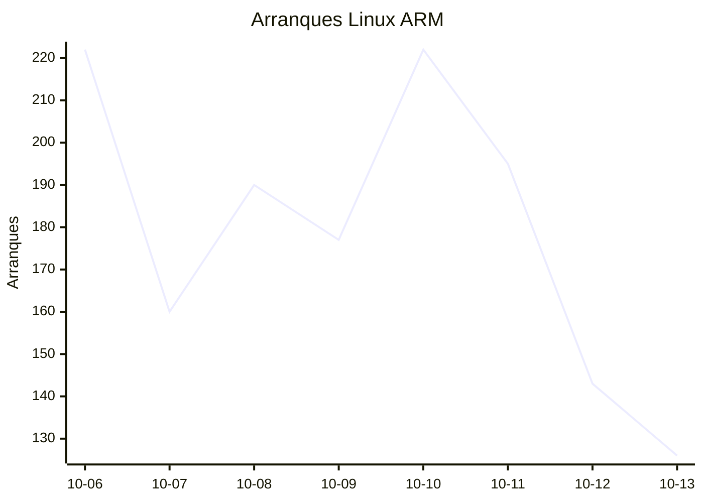
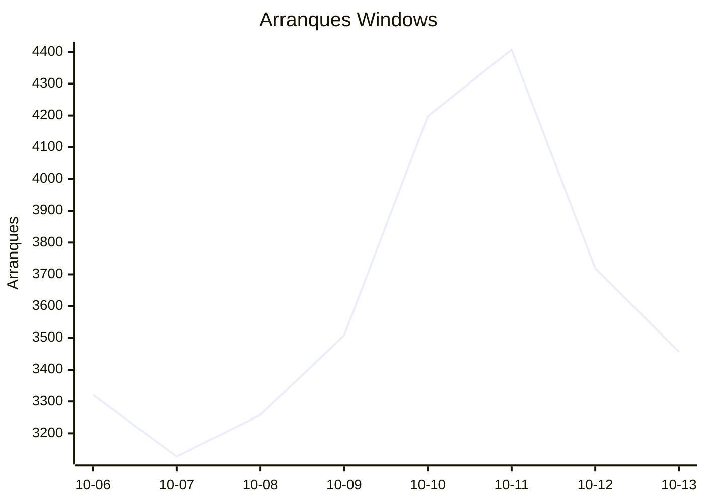
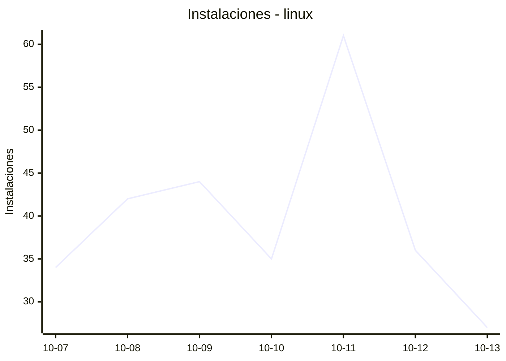
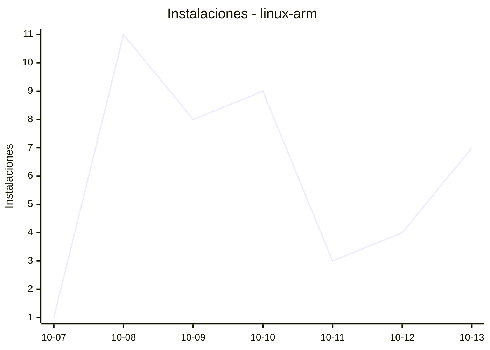
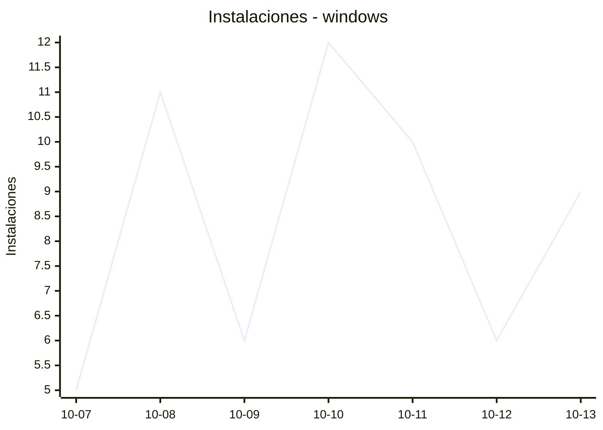
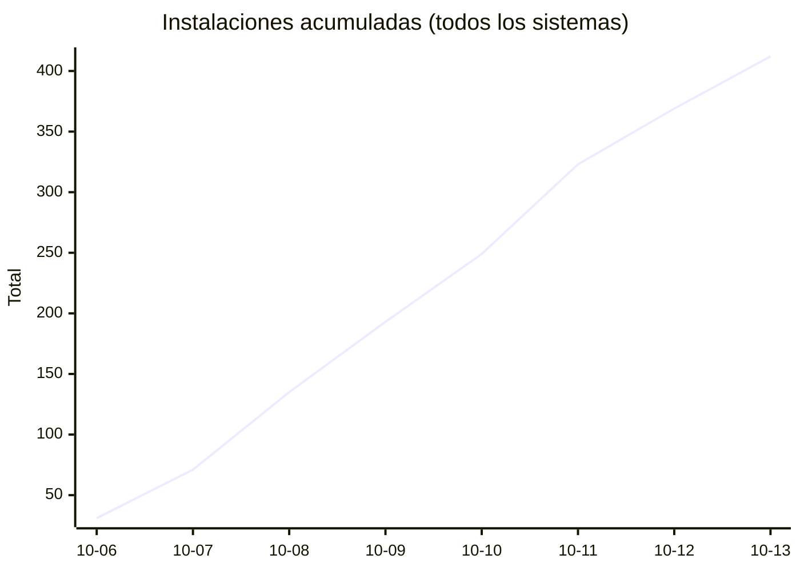
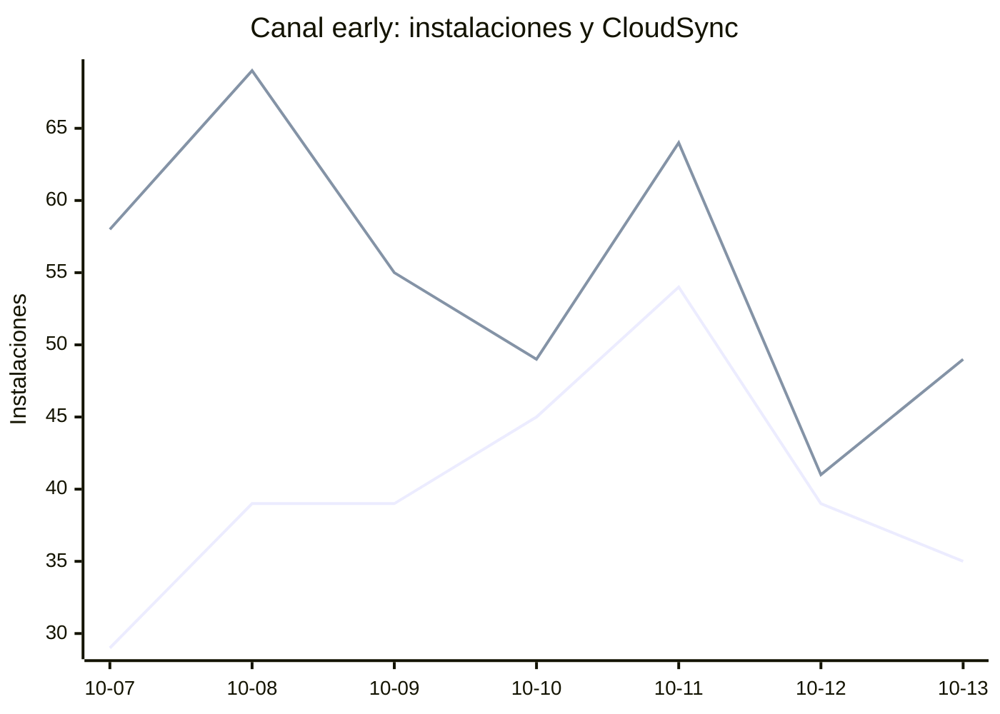

# Estadísticas de EmuDeck

Actualizado: 2026-10-14 20:14 UTC. Las gráficas no incluyen el día de hoy porque aún está incompleto.

## Arranques de la app (comprobaciones de actualización)

Cada arranque descarga el `latest*.yml` de su sistema. Cuenta arranques, no personas.

| Sistema | Ayer | Últimos 7 días |
|---|---|---|
| Linux x86 | 13168 | 96146 |
| Linux ARM | 126 | 1213 |
| Windows | 3456 | 25673 |
| Mac | 0 | 0 |

Instalaciones nuevas estimadas en Windows (7 días, `.exe` menos `.blockmap`): **1566**

```mermaid
xychart-beta
    title "Arranques Linux x86"
    x-axis ["10-06", "10-07", "10-08", "10-09", "10-10", "10-11", "10-12", "10-13"]
    y-axis "Arranques"
    line [11882, 11951, 12567, 13083, 15258, 16125, 13994, 13168]
```

```mermaid
xychart-beta
    title "Arranques Linux ARM"
    x-axis ["10-06", "10-07", "10-08", "10-09", "10-10", "10-11", "10-12", "10-13"]
    y-axis "Arranques"
    line [222, 160, 190, 177, 222, 195, 143, 126]
```

```mermaid
xychart-beta
    title "Arranques Windows"
    x-axis ["10-06", "10-07", "10-08", "10-09", "10-10", "10-11", "10-12", "10-13"]
    y-axis "Arranques"
    line [3321, 3127, 3258, 3508, 4198, 4407, 3719, 3456]
```

## Instalaciones de EmuDeck (beacons)

Cada `setup` descarga `system-<sistema>.txt` y cada instalación de un emulador `<emulador>-<plataforma>.txt`. Los emuladores cuentan también las actualizaciones. Histórico completo desde el primer día.

| Sistema | Ayer | Últimos 7 días | Últimos 30 días | Total |
|---|---|---|---|---|
| linux | 27 | 279 | 279 | 331 |
| linux-arm | 7 | 43 | 43 | 48 |
| windows | 9 | 59 | 59 | 68 |

```mermaid
xychart-beta
    title "Instalaciones - linux"
    x-axis ["10-07", "10-08", "10-09", "10-10", "10-11", "10-12", "10-13"]
    y-axis "Instalaciones"
    line [34, 42, 44, 35, 61, 36, 27]
```

```mermaid
xychart-beta
    title "Instalaciones - linux-arm"
    x-axis ["10-07", "10-08", "10-09", "10-10", "10-11", "10-12", "10-13"]
    y-axis "Instalaciones"
    line [1, 11, 8, 9, 3, 4, 7]
```

```mermaid
xychart-beta
    title "Instalaciones - windows"
    x-axis ["10-07", "10-08", "10-09", "10-10", "10-11", "10-12", "10-13"]
    y-axis "Instalaciones"
    line [5, 11, 6, 12, 10, 6, 9]
```

```mermaid
xychart-beta
    title "Instalaciones acumuladas (todos los sistemas)"
    x-axis ["10-06", "10-07", "10-08", "10-09", "10-10", "10-11", "10-12", "10-13"]
    y-axis "Total"
    line [31, 71, 135, 193, 249, 323, 369, 412]
```

### Por mes

| Mes | Linux | Linux ARM | Windows | Total |
|---|---|---|---|---|
| 2026-10 | 279 | 43 | 59 | 381 |

### Canal early (early + early-unstable)

Instalaciones de EmuDeck con el backend en una rama early, y cuántas de ellas instalan CloudSync.

| | Últimos 7 días | Últimos 30 días | Total |
|---|---|---|---|
| Instalaciones early | 280 | 280 | 322 |
| Con CloudSync | 385 | 385 | 504 |
| % con CloudSync | | | 157% |

Línea de arriba: instalaciones early. Línea de abajo: de ellas, con CloudSync.

```mermaid
xychart-beta
    title "Canal early: instalaciones y CloudSync"
    x-axis ["10-07", "10-08", "10-09", "10-10", "10-11", "10-12", "10-13"]
    y-axis "Instalaciones"
    line [29, 39, 39, 45, 54, 39, 35]
    line [58, 69, 55, 49, 64, 41, 49]
```

### Por emulador

| Emulador | Linux (total) | Linux ARM (total) | Windows (total) | Últimos 7 días | Últimos 30 días | Total |
|---|---|---|---|---|---|---|
| pcsx2 | 816 | 15 | 97 | 753 | 753 | 928 |
| azahar | 731 | 64 | 90 | 717 | 717 | 885 |
| duckstation | 790 | 62 | 30 | 715 | 715 | 882 |
| esde | 675 | 57 | 138 | 686 | 686 | 870 |
| ryujinx | 684 | 64 | 89 | 685 | 685 | 837 |
| rpcs3 | 731 | 62 | 32 | 660 | 660 | 825 |
| cemu | 733 | 62 | 21 | 666 | 666 | 816 |
| xenia | 666 | 54 | 67 | 645 | 645 | 787 |
| srm | 631 | 47 | 60 | 622 | 622 | 738 |
| shadps4 | 621 | 56 | 54 | 579 | 579 | 731 |
| vita3k | 656 | 54 | 14 | 579 | 579 | 724 |
| cloudsync | 367 | 16 | 141 | 403 | 403 | 524 |
| dolphin | 324 | 45 | 38 | 336 | 336 | 407 |
| ppsspp | 294 | 42 | 68 | 340 | 340 | 404 |
| ra | 327 | 45 | 30 | 336 | 336 | 402 |
| melonds | 279 | 34 | 23 | 274 | 274 | 336 |
| xemu | 274 | 35 | 24 | 275 | 275 | 333 |
| mgba | 286 | 23 | 20 | 278 | 278 | 329 |
| primehack | 241 | 36 | 24 | 246 | 246 | 301 |
| supermodel | 242 | 42 | 7 | 232 | 232 | 291 |
| model2 | 238 | 45 | 4 | 234 | 234 | 287 |
| scummvm | 234 | 31 | 12 | 225 | 225 | 277 |
| bigpemu | 203 | 3 | 4 | 166 | 166 | 210 |
| armsx2 | 68 | 65 | 0 | 107 | 107 | 133 |
| flycast | 67 | 10 | 5 | 73 | 73 | 82 |
| rmg | 57 | 17 | 0 | 65 | 65 | 74 |
| mame | 42 | 2 | 9 | 48 | 48 | 53 |
| eden | 31 | 6 | 0 | 21 | 21 | 37 |
| pegasus | 6 | 0 | 4 | 6 | 6 | 10 |
| yuzu | 6 | 0 | 0 | 4 | 4 | 6 |
| ares | 3 | 1 | 0 | 4 | 4 | 4 |
| citron | 1 | 0 | 0 | 1 | 1 | 1 |
