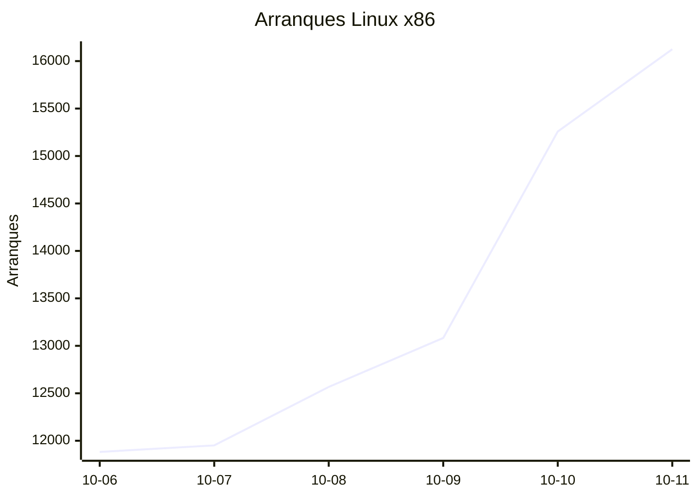
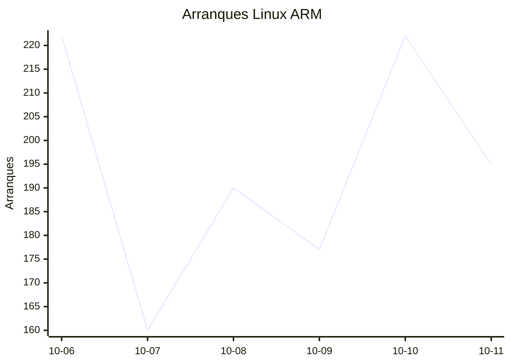
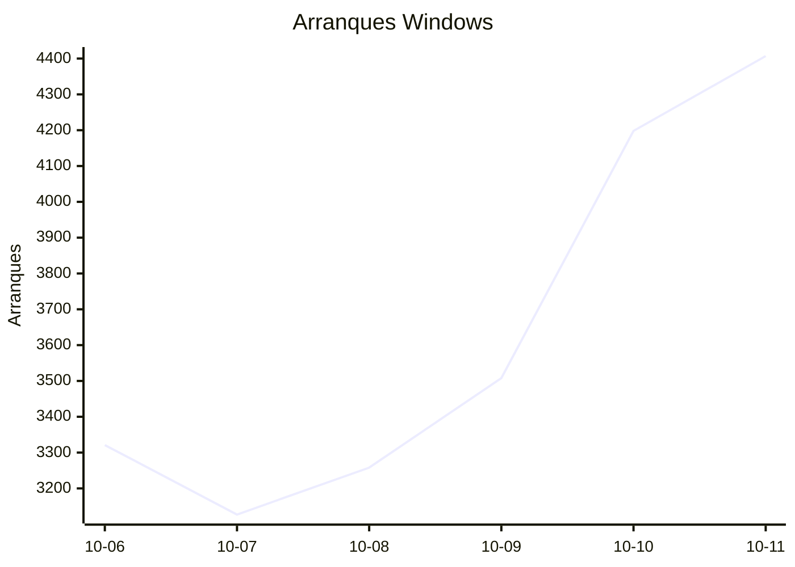
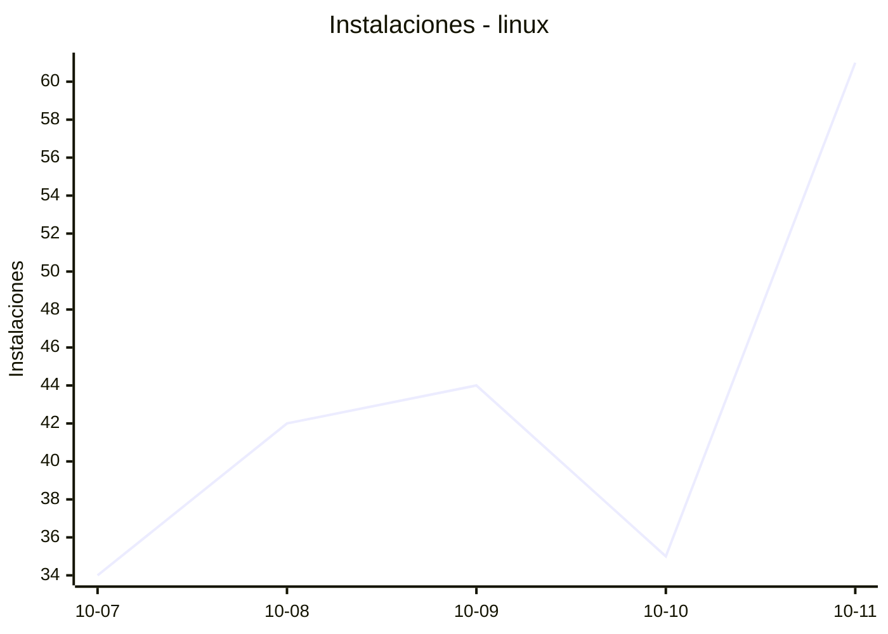
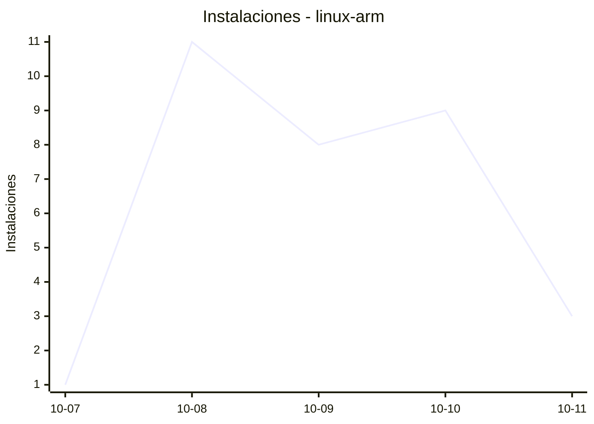
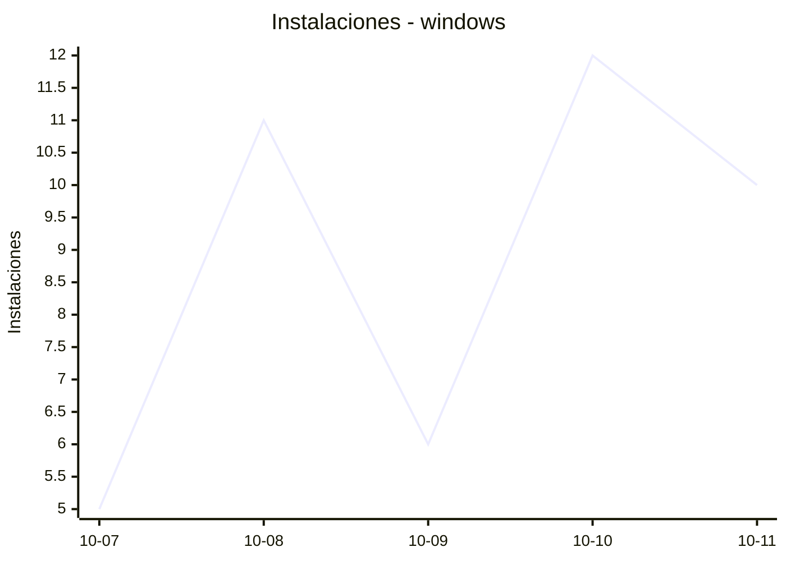
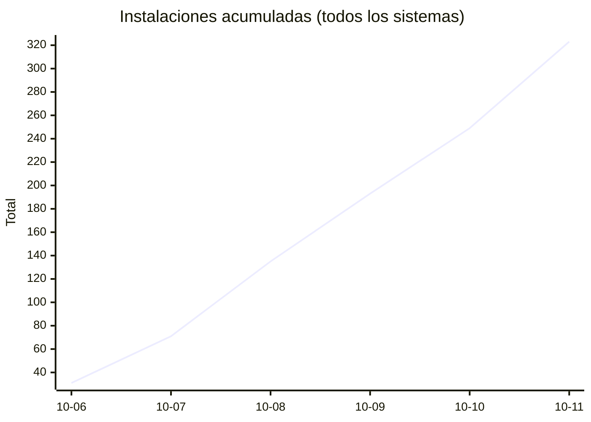
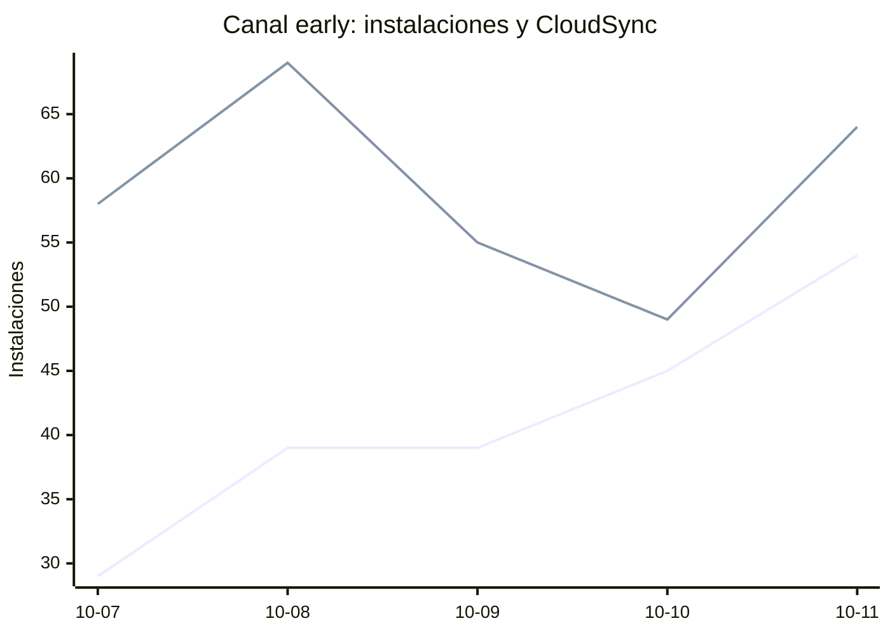

# Estadísticas de EmuDeck

Actualizado: 2026-10-12 05:22 UTC. Las gráficas no incluyen el día de hoy porque aún está incompleto.

## Arranques de la app (comprobaciones de actualización)

Cada arranque descarga el `latest*.yml` de su sistema. Cuenta arranques, no personas.

| Sistema | Ayer | Últimos 7 días |
|---|---|---|
| Linux x86 | 16125 | 80866 |
| Linux ARM | 195 | 1166 |
| Windows | 4407 | 21819 |
| Mac | 0 | 0 |

Instalaciones nuevas estimadas en Windows (7 días, `.exe` menos `.blockmap`): **1216**

```mermaid
xychart-beta
    title "Arranques Linux x86"
    x-axis ["10-06", "10-07", "10-08", "10-09", "10-10", "10-11"]
    y-axis "Arranques"
    line [11882, 11951, 12567, 13083, 15258, 16125]
```

```mermaid
xychart-beta
    title "Arranques Linux ARM"
    x-axis ["10-06", "10-07", "10-08", "10-09", "10-10", "10-11"]
    y-axis "Arranques"
    line [222, 160, 190, 177, 222, 195]
```

```mermaid
xychart-beta
    title "Arranques Windows"
    x-axis ["10-06", "10-07", "10-08", "10-09", "10-10", "10-11"]
    y-axis "Arranques"
    line [3321, 3127, 3258, 3508, 4198, 4407]
```

## Instalaciones de EmuDeck (beacons)

Cada `setup` descarga `system-<sistema>.txt` y cada instalación de un emulador `<emulador>-<plataforma>.txt`. Los emuladores cuentan también las actualizaciones. Histórico completo desde el primer día.

| Sistema | Ayer | Últimos 7 días | Últimos 30 días | Total |
|---|---|---|---|---|
| linux | 61 | 216 | 216 | 242 |
| linux-arm | 3 | 32 | 32 | 37 |
| windows | 10 | 44 | 44 | 52 |

```mermaid
xychart-beta
    title "Instalaciones - linux"
    x-axis ["10-07", "10-08", "10-09", "10-10", "10-11"]
    y-axis "Instalaciones"
    line [34, 42, 44, 35, 61]
```

```mermaid
xychart-beta
    title "Instalaciones - linux-arm"
    x-axis ["10-07", "10-08", "10-09", "10-10", "10-11"]
    y-axis "Instalaciones"
    line [1, 11, 8, 9, 3]
```

```mermaid
xychart-beta
    title "Instalaciones - windows"
    x-axis ["10-07", "10-08", "10-09", "10-10", "10-11"]
    y-axis "Instalaciones"
    line [5, 11, 6, 12, 10]
```

```mermaid
xychart-beta
    title "Instalaciones acumuladas (todos los sistemas)"
    x-axis ["10-06", "10-07", "10-08", "10-09", "10-10", "10-11"]
    y-axis "Total"
    line [31, 71, 135, 193, 249, 323]
```

### Por mes

| Mes | Linux | Linux ARM | Windows | Total |
|---|---|---|---|---|
| 2026-10 | 216 | 32 | 44 | 292 |

### Canal early (early + early-unstable)

Instalaciones de EmuDeck con el backend en una rama early, y cuántas de ellas instalan CloudSync.

| | Últimos 7 días | Últimos 30 días | Total |
|---|---|---|---|
| Instalaciones early | 206 | 206 | 235 |
| Con CloudSync | 295 | 295 | 361 |
| % con CloudSync | | | 154% |

Línea de arriba: instalaciones early. Línea de abajo: de ellas, con CloudSync.

```mermaid
xychart-beta
    title "Canal early: instalaciones y CloudSync"
    x-axis ["10-07", "10-08", "10-09", "10-10", "10-11"]
    y-axis "Instalaciones"
    line [29, 39, 39, 45, 54]
    line [58, 69, 55, 49, 64]
```

### Por emulador

| Emulador | Linux (total) | Linux ARM (total) | Windows (total) | Últimos 7 días | Últimos 30 días | Total |
|---|---|---|---|---|---|---|
| pcsx2 | 572 | 12 | 71 | 561 | 561 | 655 |
| azahar | 510 | 47 | 69 | 531 | 531 | 626 |
| duckstation | 557 | 45 | 23 | 530 | 530 | 625 |
| esde | 466 | 42 | 110 | 505 | 505 | 618 |
| ryujinx | 485 | 48 | 74 | 518 | 518 | 607 |
| rpcs3 | 509 | 44 | 23 | 487 | 487 | 576 |
| cemu | 508 | 46 | 16 | 487 | 487 | 570 |
| xenia | 456 | 40 | 49 | 466 | 466 | 545 |
| srm | 450 | 33 | 43 | 460 | 460 | 526 |
| shadps4 | 436 | 45 | 37 | 439 | 439 | 518 |
| vita3k | 455 | 40 | 11 | 425 | 425 | 506 |
| cloudsync | 263 | 13 | 103 | 311 | 311 | 379 |
| ppsspp | 215 | 32 | 50 | 258 | 258 | 297 |
| ra | 239 | 35 | 20 | 259 | 259 | 294 |
| dolphin | 231 | 34 | 24 | 254 | 254 | 289 |
| xemu | 196 | 25 | 21 | 210 | 210 | 242 |
| melonds | 196 | 24 | 17 | 204 | 204 | 237 |
| mgba | 189 | 19 | 17 | 197 | 197 | 225 |
| primehack | 173 | 26 | 21 | 190 | 190 | 220 |
| model2 | 168 | 32 | 2 | 176 | 176 | 202 |
| scummvm | 166 | 24 | 12 | 174 | 174 | 202 |
| supermodel | 165 | 32 | 5 | 176 | 176 | 202 |
| bigpemu | 137 | 3 | 2 | 121 | 121 | 142 |
| armsx2 | 42 | 48 | 0 | 76 | 76 | 90 |
| flycast | 48 | 6 | 5 | 53 | 53 | 59 |
| rmg | 39 | 12 | 0 | 45 | 45 | 51 |
| mame | 33 | 1 | 8 | 38 | 38 | 42 |
| eden | 13 | 3 | 0 | 8 | 8 | 16 |
| pegasus | 5 | 0 | 1 | 4 | 4 | 6 |
| yuzu | 4 | 0 | 0 | 4 | 4 | 4 |
| ares | 2 | 1 | 0 | 2 | 2 | 3 |
| citron | 1 | 0 | 0 | 1 | 1 | 1 |
