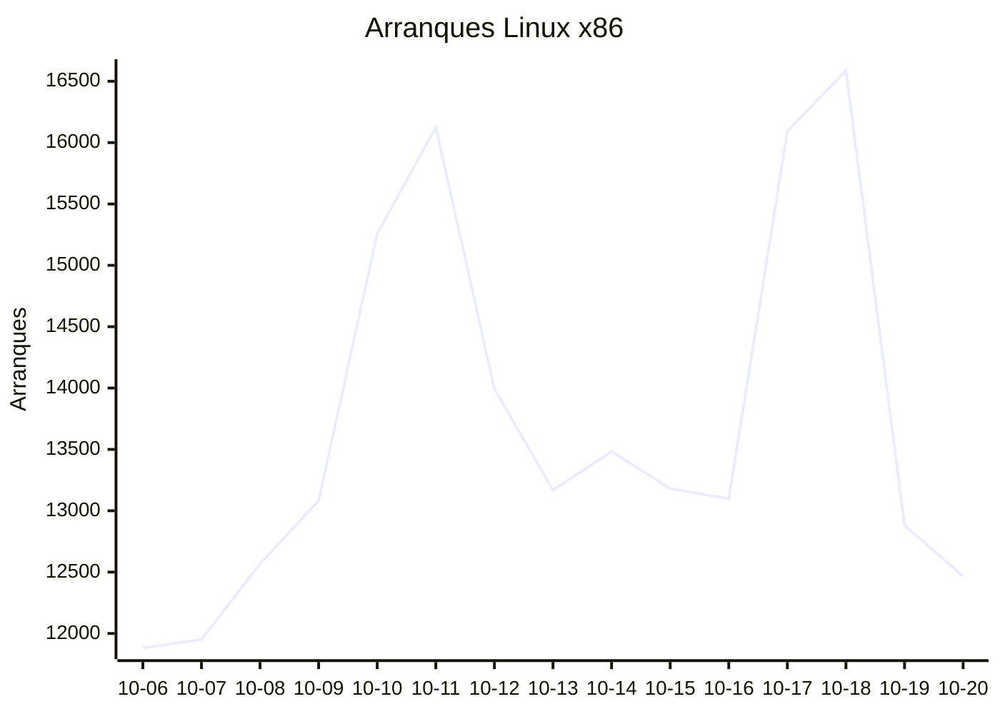
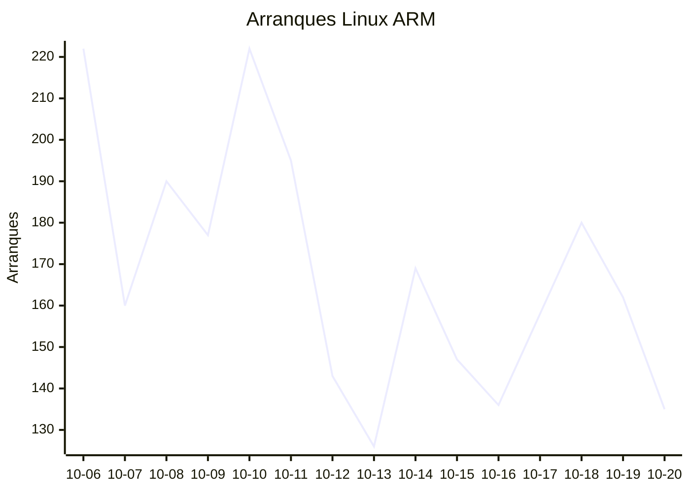
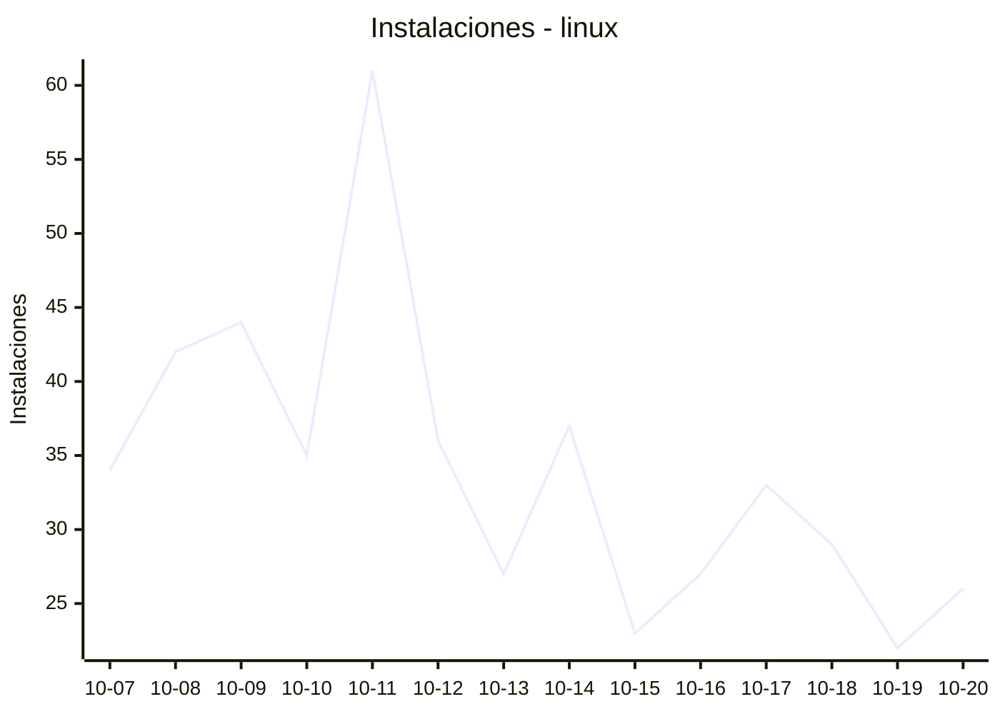
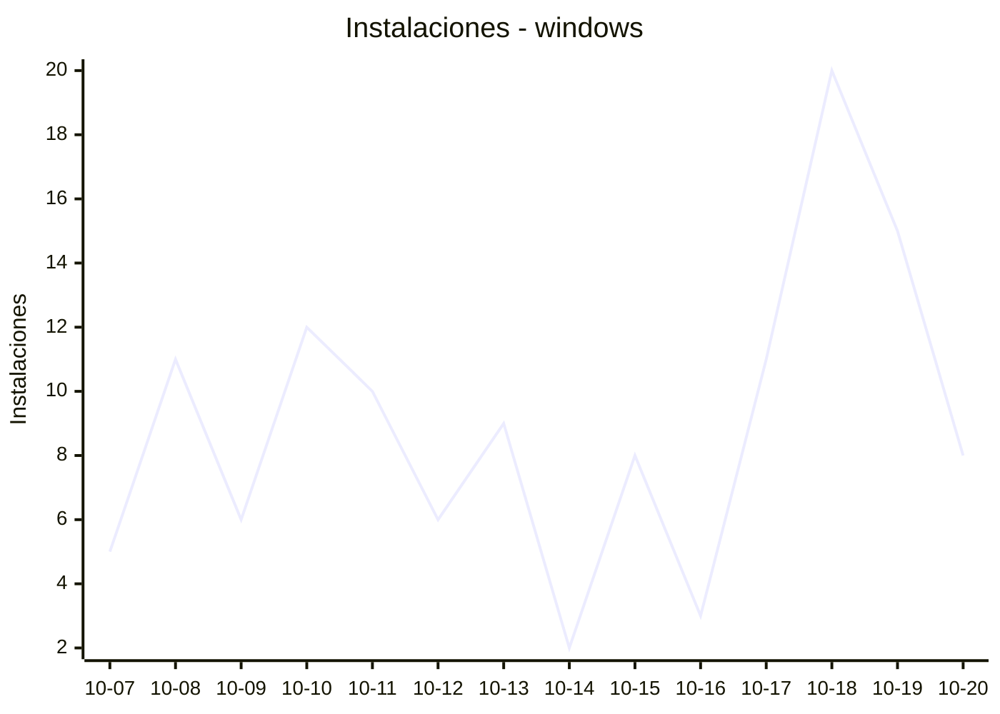
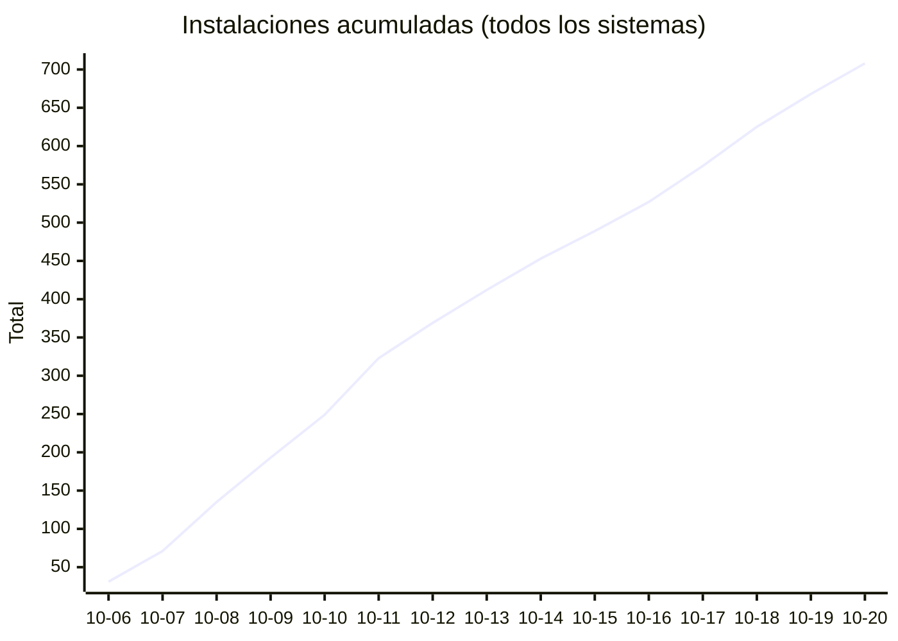
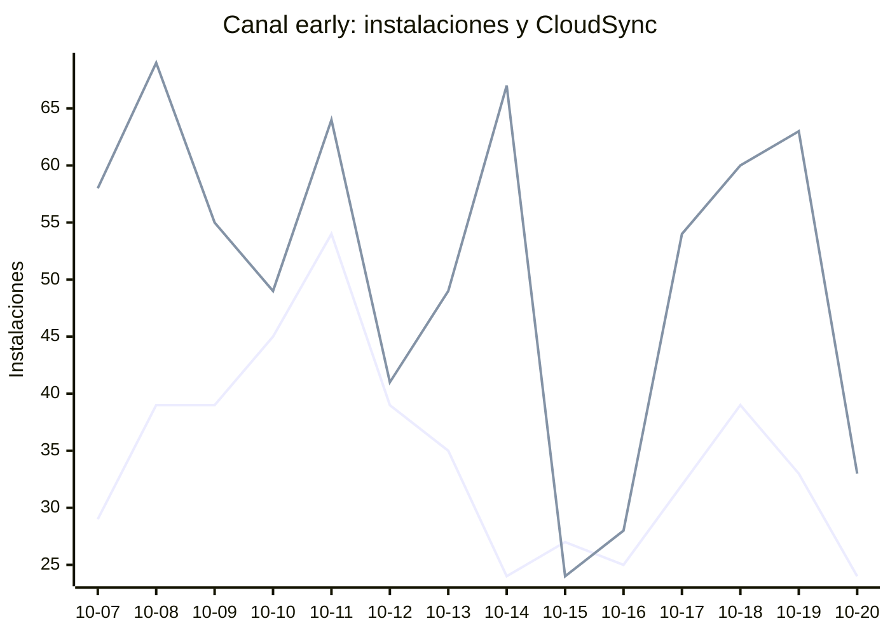

# Estadísticas de EmuDeck

Actualizado: 2026-10-21 08:18 UTC. Las gráficas no incluyen el día de hoy porque aún está incompleto.

## Arranques de la app (comprobaciones de actualización)

Cada arranque descarga el `latest*.yml` de su sistema. Cuenta arranques, no personas.

| Sistema | Ayer | Últimos 7 días |
|---|---|---|
| Linux x86 | 12465 | 97788 |
| Linux ARM | 135 | 1087 |
| Windows | 3116 | 25420 |
| Mac | 0 | 0 |

Instalaciones nuevas estimadas en Windows (7 días, `.exe` menos `.blockmap`): **2069**

```mermaid
xychart-beta
    title "Arranques Linux x86"
    x-axis ["10-06", "10-07", "10-08", "10-09", "10-10", "10-11", "10-12", "10-13", "10-14", "10-15", "10-16", "10-17", "10-18", "10-19", "10-20"]
    y-axis "Arranques"
    line [11882, 11951, 12567, 13083, 15258, 16125, 13994, 13168, 13483, 13181, 13097, 16093, 16587, 12882, 12465]
```

```mermaid
xychart-beta
    title "Arranques Linux ARM"
    x-axis ["10-06", "10-07", "10-08", "10-09", "10-10", "10-11", "10-12", "10-13", "10-14", "10-15", "10-16", "10-17", "10-18", "10-19", "10-20"]
    y-axis "Arranques"
    line [222, 160, 190, 177, 222, 195, 143, 126, 169, 147, 136, 158, 180, 162, 135]
```

```mermaid
xychart-beta
    title "Arranques Windows"
    x-axis ["10-06", "10-07", "10-08", "10-09", "10-10", "10-11", "10-12", "10-13", "10-14", "10-15", "10-16", "10-17", "10-18", "10-19", "10-20"]
    y-axis "Arranques"
    line [3321, 3127, 3258, 3508, 4198, 4407, 3719, 3456, 3334, 3355, 3594, 4200, 4479, 3342, 3116]
```

## Instalaciones de EmuDeck (beacons)

Cada `setup` descarga `system-<sistema>.txt` y cada instalación de un emulador `<emulador>-<plataforma>.txt`. Los emuladores cuentan también las actualizaciones. Histórico completo desde el primer día.

| Sistema | Ayer | Últimos 7 días | Últimos 30 días | Total |
|---|---|---|---|---|
| linux | 26 | 197 | 476 | 517 |
| linux-arm | 6 | 32 | 75 | 81 |
| windows | 8 | 67 | 126 | 139 |

```mermaid
xychart-beta
    title "Instalaciones - linux"
    x-axis ["10-07", "10-08", "10-09", "10-10", "10-11", "10-12", "10-13", "10-14", "10-15", "10-16", "10-17", "10-18", "10-19", "10-20"]
    y-axis "Instalaciones"
    line [34, 42, 44, 35, 61, 36, 27, 37, 23, 27, 33, 29, 22, 26]
```

```mermaid
xychart-beta
    title "Instalaciones - linux-arm"
    x-axis ["10-07", "10-08", "10-09", "10-10", "10-11", "10-12", "10-13", "10-14", "10-15", "10-16", "10-17", "10-18", "10-19", "10-20"]
    y-axis "Instalaciones"
    line [1, 11, 8, 9, 3, 4, 7, 2, 5, 8, 3, 2, 6, 6]
```

```mermaid
xychart-beta
    title "Instalaciones - windows"
    x-axis ["10-07", "10-08", "10-09", "10-10", "10-11", "10-12", "10-13", "10-14", "10-15", "10-16", "10-17", "10-18", "10-19", "10-20"]
    y-axis "Instalaciones"
    line [5, 11, 6, 12, 10, 6, 9, 2, 8, 3, 11, 20, 15, 8]
```

```mermaid
xychart-beta
    title "Instalaciones acumuladas (todos los sistemas)"
    x-axis ["10-06", "10-07", "10-08", "10-09", "10-10", "10-11", "10-12", "10-13", "10-14", "10-15", "10-16", "10-17", "10-18", "10-19", "10-20"]
    y-axis "Total"
    line [31, 71, 135, 193, 249, 323, 369, 412, 453, 489, 527, 574, 625, 668, 708]
```

### Por mes

| Mes | Linux | Linux ARM | Windows | Total |
|---|---|---|---|---|
| 2026-10 | 476 | 75 | 126 | 677 |

### Canal early (early + early-unstable)

Instalaciones de EmuDeck con el backend en una rama early, y cuántas de ellas instalan CloudSync.

| | Últimos 7 días | Últimos 30 días | Total |
|---|---|---|---|
| Instalaciones early | 204 | 484 | 532 |
| Con CloudSync | 329 | 714 | 793 |
| % con CloudSync | | | 149% |

Línea de arriba: instalaciones early. Línea de abajo: de ellas, con CloudSync.

```mermaid
xychart-beta
    title "Canal early: instalaciones y CloudSync"
    x-axis ["10-07", "10-08", "10-09", "10-10", "10-11", "10-12", "10-13", "10-14", "10-15", "10-16", "10-17", "10-18", "10-19", "10-20"]
    y-axis "Instalaciones"
    line [29, 39, 39, 45, 54, 39, 35, 24, 27, 25, 32, 39, 33, 24]
    line [58, 69, 55, 49, 64, 41, 49, 67, 24, 28, 54, 60, 63, 33]
```

### Por emulador

| Emulador | Linux (total) | Linux ARM (total) | Windows (total) | Últimos 7 días | Últimos 30 días | Total |
|---|---|---|---|---|---|---|
| pcsx2 | 1357 | 19 | 163 | 673 | 1426 | 1539 |
| azahar | 1205 | 108 | 157 | 634 | 1351 | 1470 |
| duckstation | 1310 | 101 | 56 | 641 | 1356 | 1467 |
| esde | 1098 | 87 | 245 | 616 | 1302 | 1430 |
| ryujinx | 1161 | 107 | 157 | 633 | 1318 | 1425 |
| rpcs3 | 1223 | 103 | 58 | 617 | 1277 | 1384 |
| cemu | 1200 | 103 | 45 | 583 | 1249 | 1348 |
| xenia | 1100 | 91 | 130 | 576 | 1221 | 1321 |
| srm | 1076 | 87 | 157 | 602 | 1224 | 1320 |
| shadps4 | 1044 | 85 | 118 | 568 | 1147 | 1247 |
| vita3k | 1105 | 90 | 35 | 553 | 1132 | 1230 |
| cloudsync | 558 | 22 | 242 | 338 | 741 | 822 |
| ppsspp | 458 | 68 | 117 | 252 | 592 | 643 |
| ra | 498 | 72 | 70 | 252 | 588 | 640 |
| dolphin | 500 | 73 | 65 | 250 | 586 | 638 |
| mgba | 484 | 39 | 36 | 243 | 521 | 559 |
| melonds | 433 | 58 | 46 | 217 | 491 | 537 |
| xemu | 428 | 60 | 44 | 213 | 488 | 532 |
| primehack | 375 | 55 | 48 | 191 | 437 | 478 |
| supermodel | 371 | 69 | 9 | 178 | 410 | 449 |
| model2 | 367 | 72 | 7 | 173 | 407 | 446 |
| scummvm | 361 | 51 | 28 | 173 | 398 | 440 |
| bigpemu | 335 | 5 | 8 | 154 | 320 | 348 |
| armsx2 | 102 | 110 | 0 | 87 | 194 | 212 |
| flycast | 93 | 14 | 11 | 37 | 110 | 118 |
| rmg | 90 | 23 | 0 | 42 | 107 | 113 |
| eden | 70 | 7 | 0 | 47 | 68 | 77 |
| mame | 56 | 2 | 12 | 15 | 63 | 70 |
| pegasus | 10 | 0 | 10 | 11 | 17 | 20 |
| yuzu | 6 | 0 | 0 | 2 | 6 | 6 |
| ares | 4 | 1 | 0 | 1 | 5 | 5 |
| citron | 4 | 0 | 0 | 3 | 4 | 4 |
