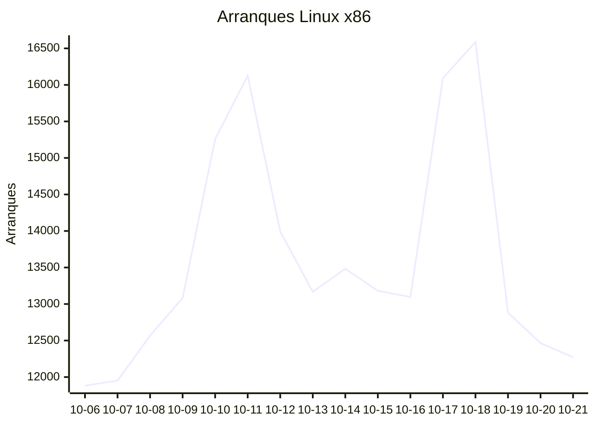
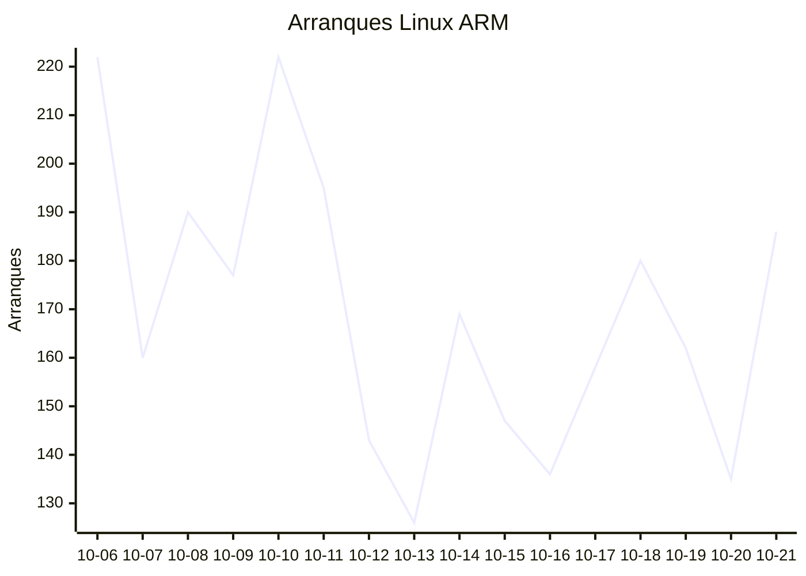
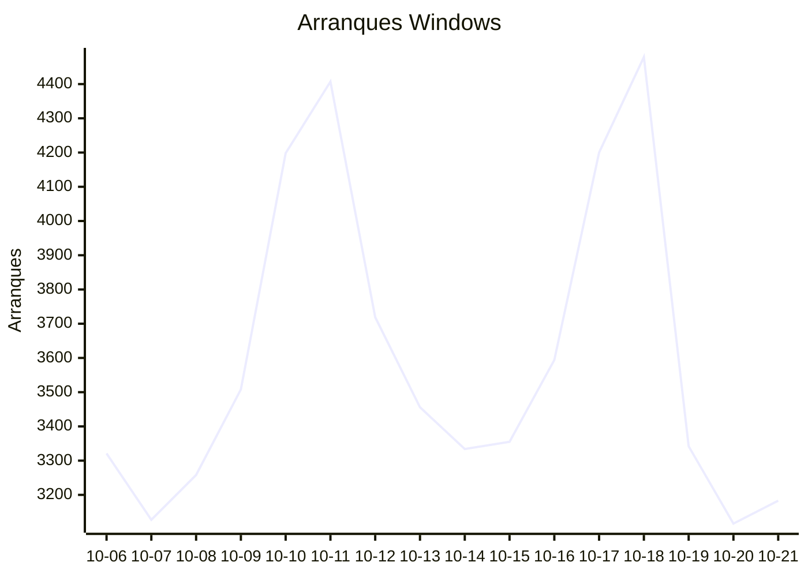
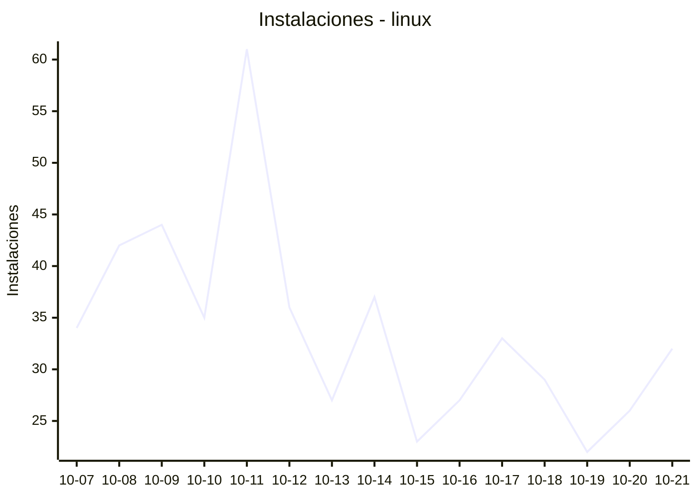
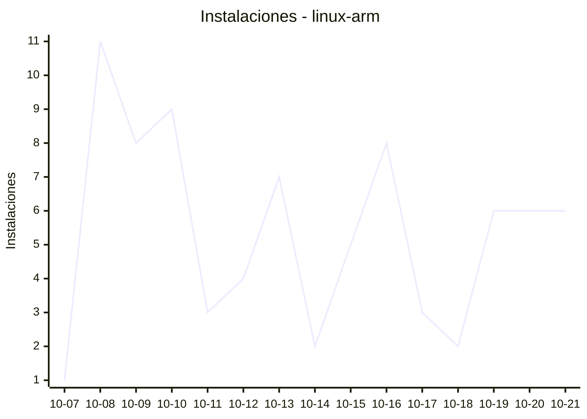
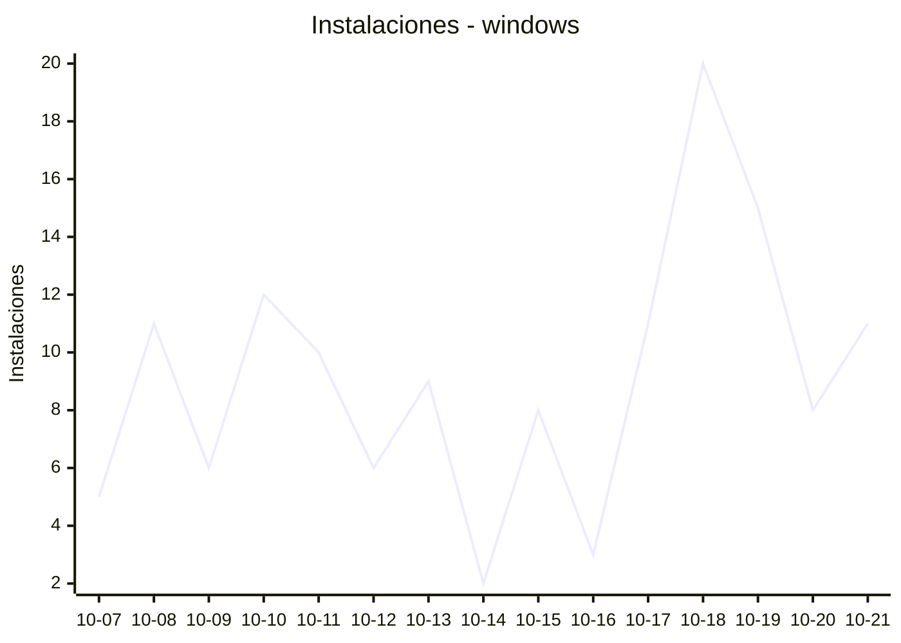
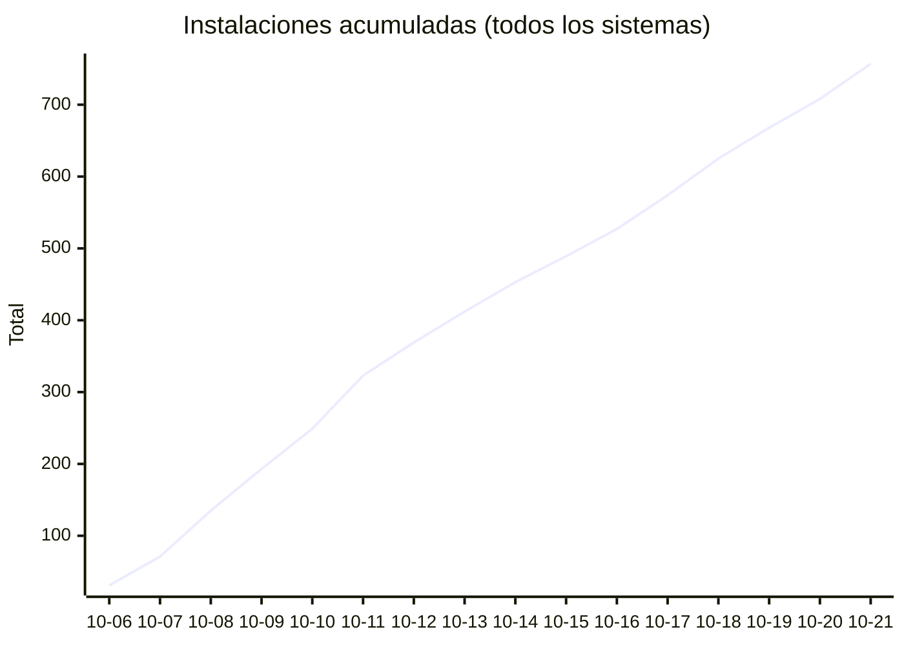
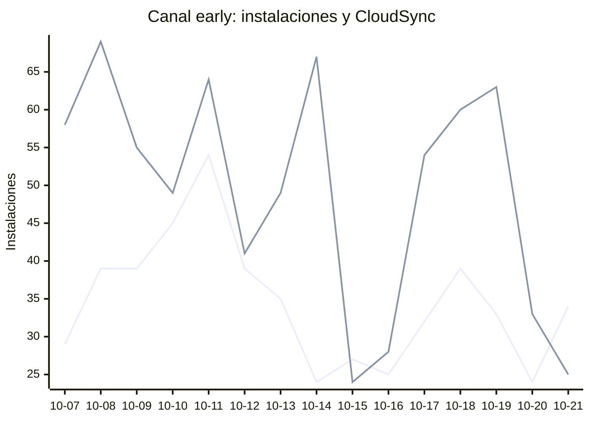

# Estadísticas de EmuDeck

Actualizado: 2026-10-22 01:48 UTC. Las gráficas no incluyen el día de hoy porque aún está incompleto.

## Arranques de la app (comprobaciones de actualización)

Cada arranque descarga el `latest*.yml` de su sistema. Cuenta arranques, no personas.

| Sistema | Ayer | Últimos 7 días |
|---|---|---|
| Linux x86 | 12272 | 96577 |
| Linux ARM | 186 | 1104 |
| Windows | 3183 | 25269 |
| Mac | 0 | 0 |

Instalaciones nuevas estimadas en Windows (7 días, `.exe` menos `.blockmap`): **2120**

```mermaid
xychart-beta
    title "Arranques Linux x86"
    x-axis ["10-06", "10-07", "10-08", "10-09", "10-10", "10-11", "10-12", "10-13", "10-14", "10-15", "10-16", "10-17", "10-18", "10-19", "10-20", "10-21"]
    y-axis "Arranques"
    line [11882, 11951, 12567, 13083, 15258, 16125, 13994, 13168, 13483, 13181, 13097, 16093, 16587, 12882, 12465, 12272]
```

```mermaid
xychart-beta
    title "Arranques Linux ARM"
    x-axis ["10-06", "10-07", "10-08", "10-09", "10-10", "10-11", "10-12", "10-13", "10-14", "10-15", "10-16", "10-17", "10-18", "10-19", "10-20", "10-21"]
    y-axis "Arranques"
    line [222, 160, 190, 177, 222, 195, 143, 126, 169, 147, 136, 158, 180, 162, 135, 186]
```

```mermaid
xychart-beta
    title "Arranques Windows"
    x-axis ["10-06", "10-07", "10-08", "10-09", "10-10", "10-11", "10-12", "10-13", "10-14", "10-15", "10-16", "10-17", "10-18", "10-19", "10-20", "10-21"]
    y-axis "Arranques"
    line [3321, 3127, 3258, 3508, 4198, 4407, 3719, 3456, 3334, 3355, 3594, 4200, 4479, 3342, 3116, 3183]
```

## Instalaciones de EmuDeck (beacons)

Cada `setup` descarga `system-<sistema>.txt` y cada instalación de un emulador `<emulador>-<plataforma>.txt`. Los emuladores cuentan también las actualizaciones. Histórico completo desde el primer día.

| Sistema | Ayer | Últimos 7 días | Últimos 30 días | Total |
|---|---|---|---|---|
| linux | 32 | 192 | 508 | 529 |
| linux-arm | 6 | 36 | 81 | 84 |
| windows | 11 | 76 | 137 | 148 |

```mermaid
xychart-beta
    title "Instalaciones - linux"
    x-axis ["10-07", "10-08", "10-09", "10-10", "10-11", "10-12", "10-13", "10-14", "10-15", "10-16", "10-17", "10-18", "10-19", "10-20", "10-21"]
    y-axis "Instalaciones"
    line [34, 42, 44, 35, 61, 36, 27, 37, 23, 27, 33, 29, 22, 26, 32]
```

```mermaid
xychart-beta
    title "Instalaciones - linux-arm"
    x-axis ["10-07", "10-08", "10-09", "10-10", "10-11", "10-12", "10-13", "10-14", "10-15", "10-16", "10-17", "10-18", "10-19", "10-20", "10-21"]
    y-axis "Instalaciones"
    line [1, 11, 8, 9, 3, 4, 7, 2, 5, 8, 3, 2, 6, 6, 6]
```

```mermaid
xychart-beta
    title "Instalaciones - windows"
    x-axis ["10-07", "10-08", "10-09", "10-10", "10-11", "10-12", "10-13", "10-14", "10-15", "10-16", "10-17", "10-18", "10-19", "10-20", "10-21"]
    y-axis "Instalaciones"
    line [5, 11, 6, 12, 10, 6, 9, 2, 8, 3, 11, 20, 15, 8, 11]
```

```mermaid
xychart-beta
    title "Instalaciones acumuladas (todos los sistemas)"
    x-axis ["10-06", "10-07", "10-08", "10-09", "10-10", "10-11", "10-12", "10-13", "10-14", "10-15", "10-16", "10-17", "10-18", "10-19", "10-20", "10-21"]
    y-axis "Total"
    line [31, 71, 135, 193, 249, 323, 369, 412, 453, 489, 527, 574, 625, 668, 708, 757]
```

### Por mes

| Mes | Linux | Linux ARM | Windows | Total |
|---|---|---|---|---|
| 2026-10 | 508 | 81 | 137 | 726 |

### Canal early (early + early-unstable)

Instalaciones de EmuDeck con el backend en una rama early, y cuántas de ellas instalan CloudSync.

| | Últimos 7 días | Últimos 30 días | Total |
|---|---|---|---|
| Instalaciones early | 214 | 518 | 544 |
| Con CloudSync | 287 | 739 | 805 |
| % con CloudSync | | | 148% |

Línea de arriba: instalaciones early. Línea de abajo: de ellas, con CloudSync.

```mermaid
xychart-beta
    title "Canal early: instalaciones y CloudSync"
    x-axis ["10-07", "10-08", "10-09", "10-10", "10-11", "10-12", "10-13", "10-14", "10-15", "10-16", "10-17", "10-18", "10-19", "10-20", "10-21"]
    y-axis "Instalaciones"
    line [29, 39, 39, 45, 54, 39, 35, 24, 27, 25, 32, 39, 33, 24, 34]
    line [58, 69, 55, 49, 64, 41, 49, 67, 24, 28, 54, 60, 63, 33, 25]
```

### Por emulador

| Emulador | Linux (total) | Linux ARM (total) | Windows (total) | Últimos 7 días | Últimos 30 días | Total |
|---|---|---|---|---|---|---|
| pcsx2 | 1421 | 19 | 172 | 658 | 1531 | 1612 |
| azahar | 1260 | 115 | 167 | 633 | 1460 | 1542 |
| duckstation | 1370 | 108 | 64 | 638 | 1463 | 1542 |
| esde | 1155 | 88 | 261 | 605 | 1398 | 1504 |
| ryujinx | 1218 | 111 | 166 | 633 | 1421 | 1495 |
| rpcs3 | 1283 | 106 | 64 | 604 | 1380 | 1453 |
| cemu | 1256 | 109 | 50 | 570 | 1345 | 1415 |
| srm | 1136 | 96 | 167 | 642 | 1346 | 1399 |
| xenia | 1154 | 92 | 137 | 572 | 1319 | 1383 |
| shadps4 | 1088 | 89 | 125 | 548 | 1232 | 1302 |
| vita3k | 1150 | 96 | 41 | 536 | 1218 | 1287 |
| cloudsync | 565 | 24 | 245 | 296 | 766 | 834 |
| ppsspp | 466 | 71 | 125 | 248 | 627 | 662 |
| ra | 508 | 75 | 78 | 248 | 629 | 661 |
| dolphin | 512 | 76 | 71 | 244 | 628 | 659 |
| mgba | 502 | 42 | 39 | 246 | 559 | 583 |
| melonds | 440 | 61 | 51 | 206 | 523 | 552 |
| xemu | 437 | 63 | 50 | 209 | 523 | 550 |
| primehack | 379 | 58 | 53 | 180 | 463 | 490 |
| supermodel | 374 | 72 | 11 | 160 | 437 | 457 |
| model2 | 370 | 75 | 7 | 159 | 432 | 452 |
| scummvm | 364 | 52 | 32 | 163 | 423 | 448 |
| bigpemu | 351 | 5 | 8 | 147 | 344 | 364 |
| armsx2 | 108 | 117 | 0 | 90 | 215 | 225 |
| flycast | 98 | 14 | 11 | 40 | 118 | 123 |
| rmg | 96 | 25 | 0 | 46 | 117 | 121 |
| eden | 71 | 7 | 0 | 41 | 70 | 78 |
| mame | 56 | 2 | 13 | 17 | 66 | 71 |
| pegasus | 11 | 0 | 11 | 11 | 19 | 22 |
| yuzu | 6 | 0 | 0 | 0 | 6 | 6 |
| ares | 4 | 1 | 0 | 1 | 5 | 5 |
| citron | 4 | 0 | 0 | 2 | 4 | 4 |
