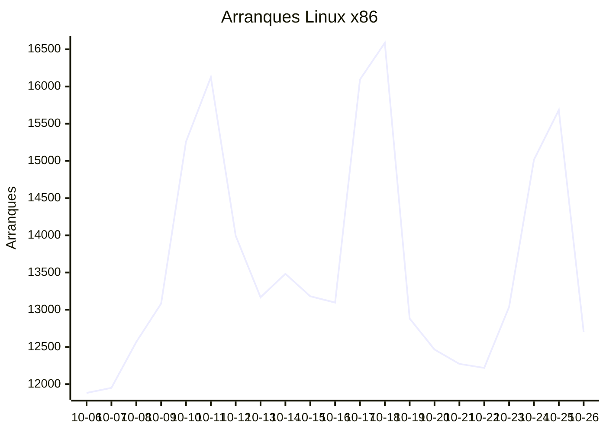
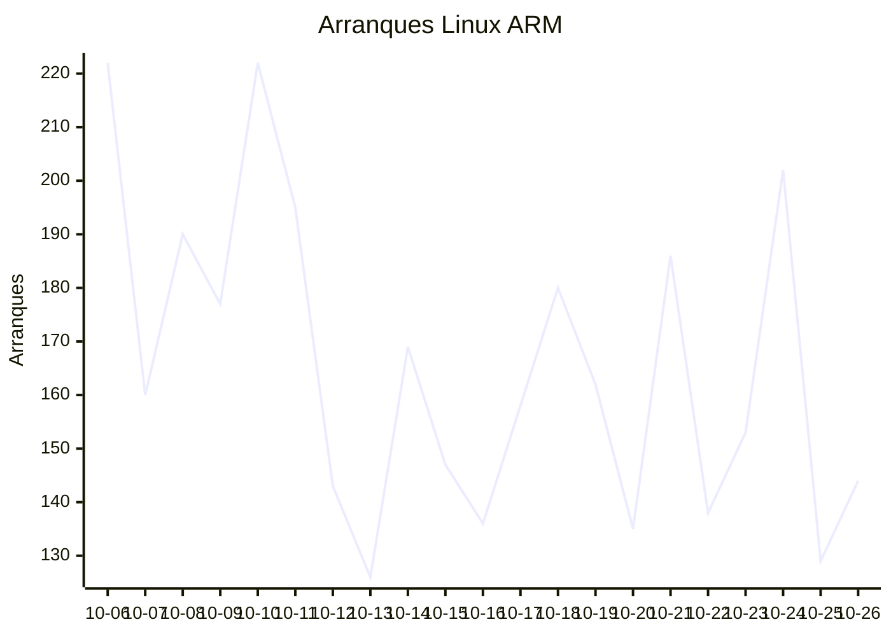
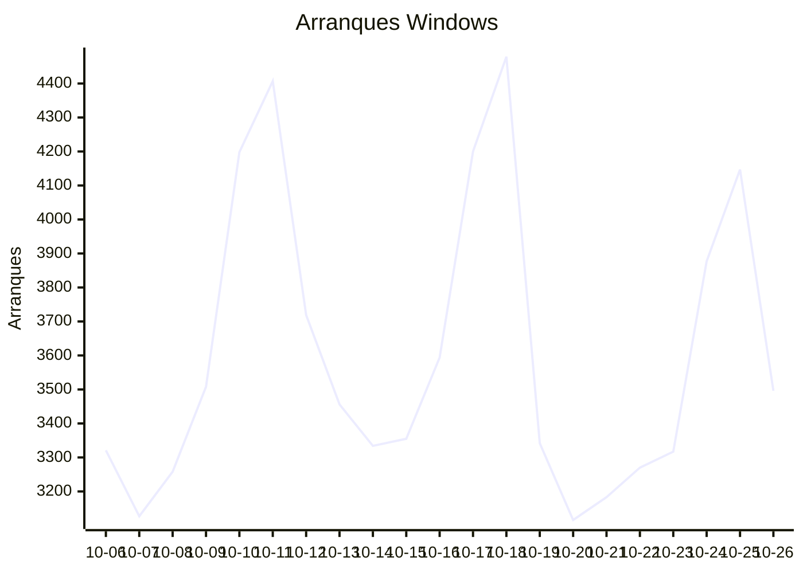
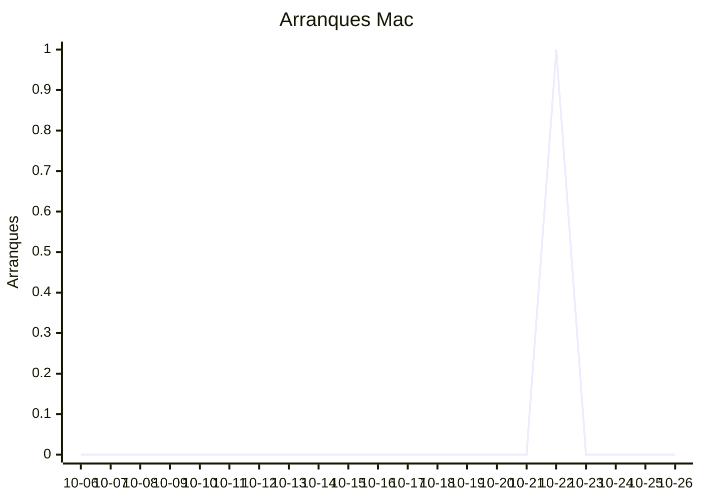
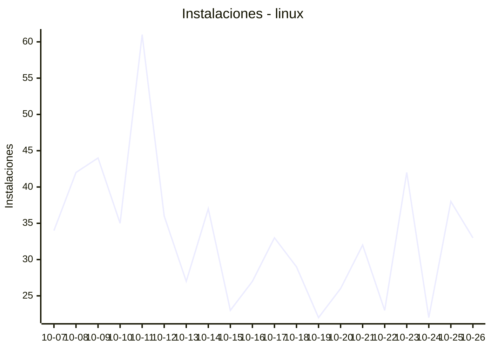
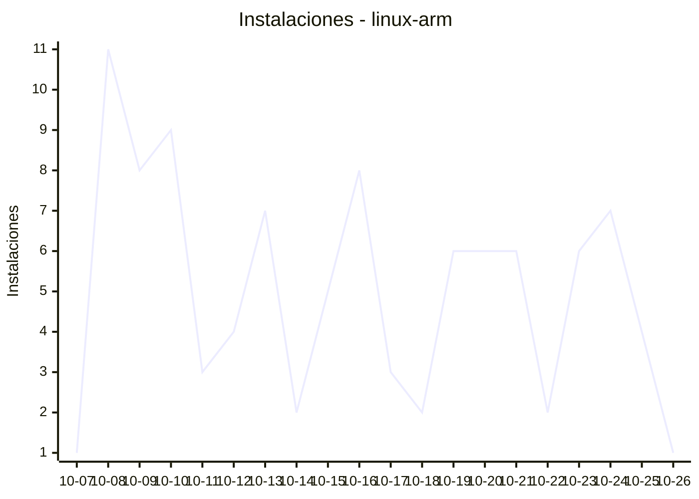
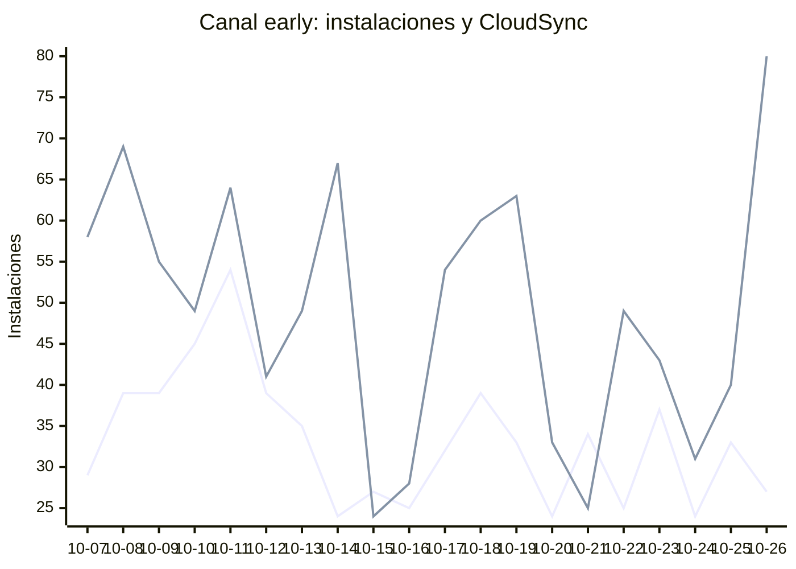

# Estadísticas de EmuDeck

Actualizado: 2026-10-27 13:44 UTC. Las gráficas no incluyen el día de hoy porque aún está incompleto.

## Arranques de la app (comprobaciones de actualización)

Cada arranque descarga el `latest*.yml` de su sistema. Cuenta arranques, no personas.

| Sistema | Ayer | Últimos 7 días |
|---|---|---|
| Linux x86 | 12702 | 93396 |
| Linux ARM | 144 | 1087 |
| Windows | 3496 | 24406 |
| Mac | 0 | 1 |

Instalaciones nuevas estimadas en Windows (7 días, `.exe` menos `.blockmap`): **2207**

```mermaid
xychart-beta
    title "Arranques Linux x86"
    x-axis ["10-06", "10-07", "10-08", "10-09", "10-10", "10-11", "10-12", "10-13", "10-14", "10-15", "10-16", "10-17", "10-18", "10-19", "10-20", "10-21", "10-22", "10-23", "10-24", "10-25", "10-26"]
    y-axis "Arranques"
    line [11882, 11951, 12567, 13083, 15258, 16125, 13994, 13168, 13483, 13181, 13097, 16093, 16587, 12882, 12465, 12272, 12219, 13039, 15016, 15683, 12702]
```

```mermaid
xychart-beta
    title "Arranques Linux ARM"
    x-axis ["10-06", "10-07", "10-08", "10-09", "10-10", "10-11", "10-12", "10-13", "10-14", "10-15", "10-16", "10-17", "10-18", "10-19", "10-20", "10-21", "10-22", "10-23", "10-24", "10-25", "10-26"]
    y-axis "Arranques"
    line [222, 160, 190, 177, 222, 195, 143, 126, 169, 147, 136, 158, 180, 162, 135, 186, 138, 153, 202, 129, 144]
```

```mermaid
xychart-beta
    title "Arranques Windows"
    x-axis ["10-06", "10-07", "10-08", "10-09", "10-10", "10-11", "10-12", "10-13", "10-14", "10-15", "10-16", "10-17", "10-18", "10-19", "10-20", "10-21", "10-22", "10-23", "10-24", "10-25", "10-26"]
    y-axis "Arranques"
    line [3321, 3127, 3258, 3508, 4198, 4407, 3719, 3456, 3334, 3355, 3594, 4200, 4479, 3342, 3116, 3183, 3270, 3317, 3877, 4147, 3496]
```

```mermaid
xychart-beta
    title "Arranques Mac"
    x-axis ["10-06", "10-07", "10-08", "10-09", "10-10", "10-11", "10-12", "10-13", "10-14", "10-15", "10-16", "10-17", "10-18", "10-19", "10-20", "10-21", "10-22", "10-23", "10-24", "10-25", "10-26"]
    y-axis "Arranques"
    line [0, 0, 0, 0, 0, 0, 0, 0, 0, 0, 0, 0, 0, 0, 0, 0, 1, 0, 0, 0, 0]
```

## Instalaciones de EmuDeck (beacons)

Cada `setup` descarga `system-<sistema>.txt` y cada instalación de un emulador `<emulador>-<plataforma>.txt`. Los emuladores cuentan también las actualizaciones. Histórico completo desde el primer día.

| Sistema | Ayer | Últimos 7 días | Últimos 30 días | Total |
|---|---|---|---|---|
| linux | 33 | 216 | 666 | 696 |
| linux-arm | 1 | 32 | 101 | 108 |
| windows | 12 | 56 | 174 | 184 |

```mermaid
xychart-beta
    title "Instalaciones - linux"
    x-axis ["10-07", "10-08", "10-09", "10-10", "10-11", "10-12", "10-13", "10-14", "10-15", "10-16", "10-17", "10-18", "10-19", "10-20", "10-21", "10-22", "10-23", "10-24", "10-25", "10-26"]
    y-axis "Instalaciones"
    line [34, 42, 44, 35, 61, 36, 27, 37, 23, 27, 33, 29, 22, 26, 32, 23, 42, 22, 38, 33]
```

```mermaid
xychart-beta
    title "Instalaciones - linux-arm"
    x-axis ["10-07", "10-08", "10-09", "10-10", "10-11", "10-12", "10-13", "10-14", "10-15", "10-16", "10-17", "10-18", "10-19", "10-20", "10-21", "10-22", "10-23", "10-24", "10-25", "10-26"]
    y-axis "Instalaciones"
    line [1, 11, 8, 9, 3, 4, 7, 2, 5, 8, 3, 2, 6, 6, 6, 2, 6, 7, 4, 1]
```

```mermaid
xychart-beta
    title "Instalaciones - windows"
    x-axis ["10-07", "10-08", "10-09", "10-10", "10-11", "10-12", "10-13", "10-14", "10-15", "10-16", "10-17", "10-18", "10-19", "10-20", "10-21", "10-22", "10-23", "10-24", "10-25", "10-26"]
    y-axis "Instalaciones"
    line [5, 11, 6, 12, 10, 6, 9, 2, 8, 3, 11, 20, 15, 8, 11, 11, 2, 9, 3, 12]
```

```mermaid
xychart-beta
    title "Instalaciones acumuladas (todos los sistemas)"
    x-axis ["10-06", "10-07", "10-08", "10-09", "10-10", "10-11", "10-12", "10-13", "10-14", "10-15", "10-16", "10-17", "10-18", "10-19", "10-20", "10-21", "10-22", "10-23", "10-24", "10-25", "10-26"]
    y-axis "Total"
    line [31, 71, 135, 193, 249, 323, 369, 412, 453, 489, 527, 574, 625, 668, 708, 757, 793, 843, 881, 926, 972]
```

### Por mes

| Mes | Linux | Linux ARM | Windows | Total |
|---|---|---|---|---|
| 2026-10 | 666 | 101 | 174 | 941 |

### Canal early (early + early-unstable)

Instalaciones de EmuDeck con el backend en una rama early, y cuántas de ellas instalan CloudSync.

| | Últimos 7 días | Últimos 30 días | Total |
|---|---|---|---|
| Instalaciones early | 204 | 664 | 695 |
| Con CloudSync | 301 | 982 | 1060 |
| % con CloudSync | | | 153% |

Línea de arriba: instalaciones early. Línea de abajo: de ellas, con CloudSync.

```mermaid
xychart-beta
    title "Canal early: instalaciones y CloudSync"
    x-axis ["10-07", "10-08", "10-09", "10-10", "10-11", "10-12", "10-13", "10-14", "10-15", "10-16", "10-17", "10-18", "10-19", "10-20", "10-21", "10-22", "10-23", "10-24", "10-25", "10-26"]
    y-axis "Instalaciones"
    line [29, 39, 39, 45, 54, 39, 35, 24, 27, 25, 32, 39, 33, 24, 34, 25, 37, 24, 33, 27]
    line [58, 69, 55, 49, 64, 41, 49, 67, 24, 28, 54, 60, 63, 33, 25, 49, 43, 31, 40, 80]
```

### Por emulador

| Emulador | Linux (total) | Linux ARM (total) | Windows (total) | Últimos 7 días | Últimos 30 días | Total |
|---|---|---|---|---|---|---|
| pcsx2 | 1917 | 22 | 218 | 693 | 2048 | 2157 |
| duckstation | 1836 | 146 | 90 | 671 | 1961 | 2072 |
| azahar | 1668 | 161 | 217 | 660 | 1941 | 2046 |
| esde | 1558 | 131 | 349 | 671 | 1904 | 2038 |
| ryujinx | 1638 | 154 | 227 | 665 | 1919 | 2019 |
| rpcs3 | 1727 | 147 | 91 | 658 | 1869 | 1965 |
| cemu | 1682 | 151 | 73 | 628 | 1815 | 1906 |
| srm | 1523 | 135 | 241 | 668 | 1824 | 1899 |
| xenia | 1556 | 118 | 186 | 621 | 1774 | 1860 |
| shadps4 | 1462 | 122 | 164 | 569 | 1655 | 1748 |
| vita3k | 1525 | 130 | 59 | 554 | 1627 | 1714 |
| cloudsync | 739 | 33 | 327 | 315 | 1019 | 1099 |
| ppsspp | 619 | 91 | 165 | 266 | 826 | 875 |
| ra | 672 | 96 | 104 | 271 | 829 | 872 |
| dolphin | 671 | 100 | 94 | 260 | 820 | 865 |
| mgba | 678 | 51 | 49 | 252 | 746 | 778 |
| xemu | 579 | 81 | 70 | 230 | 693 | 730 |
| melonds | 565 | 77 | 68 | 211 | 676 | 710 |
| primehack | 498 | 74 | 71 | 198 | 611 | 643 |
| supermodel | 486 | 89 | 17 | 175 | 563 | 592 |
| scummvm | 470 | 65 | 46 | 176 | 551 | 581 |
| model2 | 478 | 92 | 8 | 164 | 549 | 578 |
| bigpemu | 463 | 10 | 11 | 156 | 462 | 484 |
| armsx2 | 146 | 172 | 0 | 118 | 301 | 318 |
| flycast | 128 | 16 | 18 | 49 | 154 | 162 |
| rmg | 127 | 27 | 0 | 41 | 145 | 154 |
| eden | 82 | 9 | 1 | 19 | 83 | 92 |
| mame | 69 | 2 | 15 | 20 | 81 | 86 |
| pegasus | 17 | 0 | 12 | 8 | 25 | 29 |
| yuzu | 8 | 0 | 2 | 4 | 10 | 10 |
| ares | 8 | 1 | 0 | 4 | 9 | 9 |
| citron | 5 | 0 | 0 | 1 | 5 | 5 |
