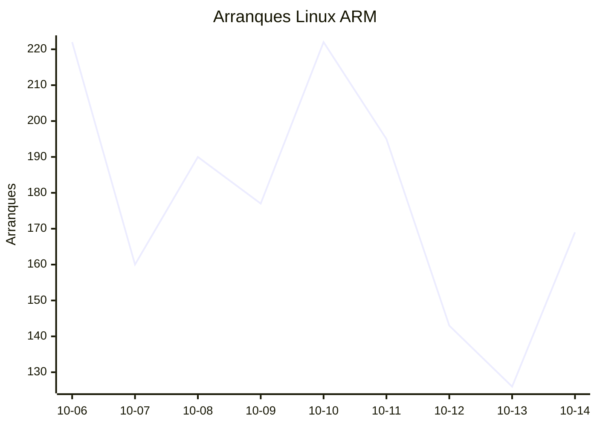
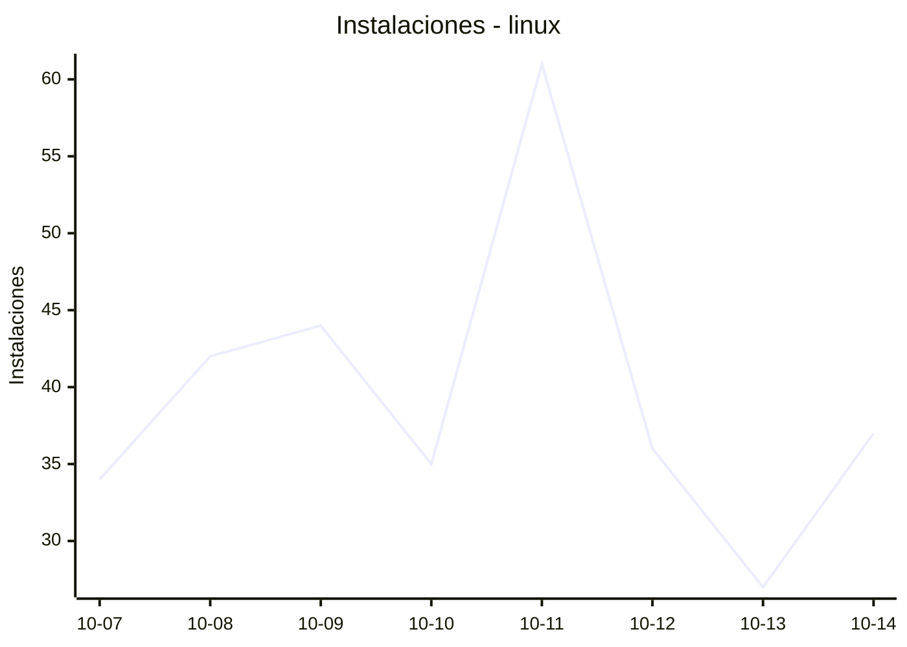
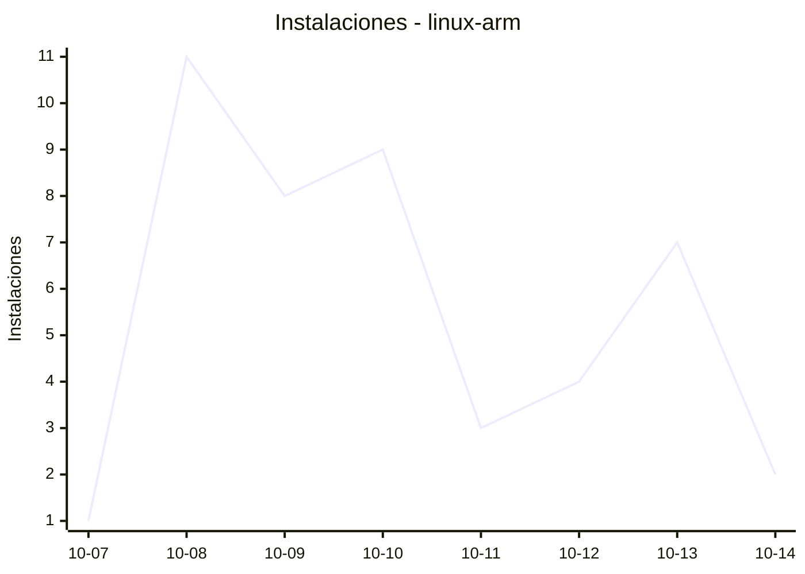
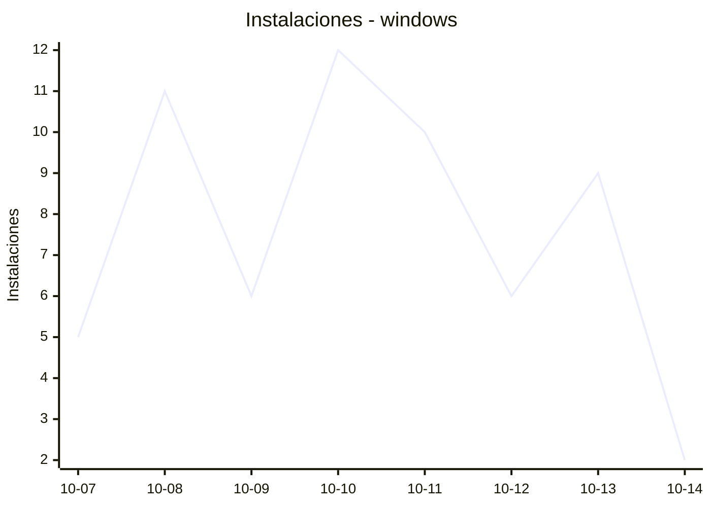
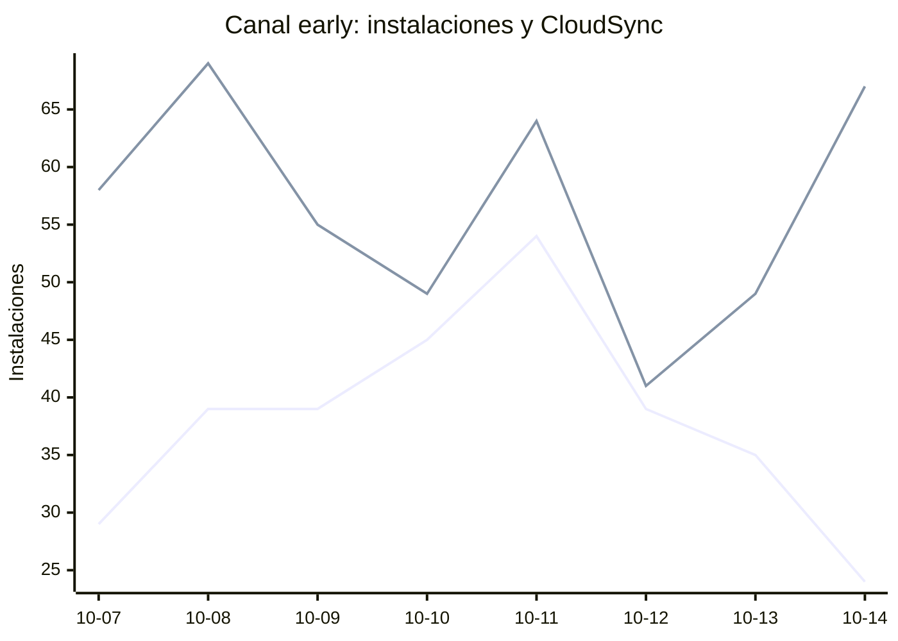

# Estadísticas de EmuDeck

Actualizado: 2026-10-15 01:46 UTC. Las gráficas no incluyen el día de hoy porque aún está incompleto.

## Arranques de la app (comprobaciones de actualización)

Cada arranque descarga el `latest*.yml` de su sistema. Cuenta arranques, no personas.

| Sistema | Ayer | Últimos 7 días |
|---|---|---|
| Linux x86 | 13483 | 97678 |
| Linux ARM | 169 | 1222 |
| Windows | 3334 | 25880 |
| Mac | 0 | 0 |

Instalaciones nuevas estimadas en Windows (7 días, `.exe` menos `.blockmap`): **1663**

```mermaid
xychart-beta
    title "Arranques Linux x86"
    x-axis ["10-06", "10-07", "10-08", "10-09", "10-10", "10-11", "10-12", "10-13", "10-14"]
    y-axis "Arranques"
    line [11882, 11951, 12567, 13083, 15258, 16125, 13994, 13168, 13483]
```

```mermaid
xychart-beta
    title "Arranques Linux ARM"
    x-axis ["10-06", "10-07", "10-08", "10-09", "10-10", "10-11", "10-12", "10-13", "10-14"]
    y-axis "Arranques"
    line [222, 160, 190, 177, 222, 195, 143, 126, 169]
```

```mermaid
xychart-beta
    title "Arranques Windows"
    x-axis ["10-06", "10-07", "10-08", "10-09", "10-10", "10-11", "10-12", "10-13", "10-14"]
    y-axis "Arranques"
    line [3321, 3127, 3258, 3508, 4198, 4407, 3719, 3456, 3334]
```

## Instalaciones de EmuDeck (beacons)

Cada `setup` descarga `system-<sistema>.txt` y cada instalación de un emulador `<emulador>-<plataforma>.txt`. Los emuladores cuentan también las actualizaciones. Histórico completo desde el primer día.

| Sistema | Ayer | Últimos 7 días | Últimos 30 días | Total |
|---|---|---|---|---|
| linux | 37 | 282 | 316 | 338 |
| linux-arm | 2 | 44 | 45 | 49 |
| windows | 2 | 56 | 61 | 68 |

```mermaid
xychart-beta
    title "Instalaciones - linux"
    x-axis ["10-07", "10-08", "10-09", "10-10", "10-11", "10-12", "10-13", "10-14"]
    y-axis "Instalaciones"
    line [34, 42, 44, 35, 61, 36, 27, 37]
```

```mermaid
xychart-beta
    title "Instalaciones - linux-arm"
    x-axis ["10-07", "10-08", "10-09", "10-10", "10-11", "10-12", "10-13", "10-14"]
    y-axis "Instalaciones"
    line [1, 11, 8, 9, 3, 4, 7, 2]
```

```mermaid
xychart-beta
    title "Instalaciones - windows"
    x-axis ["10-07", "10-08", "10-09", "10-10", "10-11", "10-12", "10-13", "10-14"]
    y-axis "Instalaciones"
    line [5, 11, 6, 12, 10, 6, 9, 2]
```

```mermaid
xychart-beta
    title "Instalaciones acumuladas (todos los sistemas)"
    x-axis ["10-06", "10-07", "10-08", "10-09", "10-10", "10-11", "10-12", "10-13", "10-14"]
    y-axis "Total"
    line [31, 71, 135, 193, 249, 323, 369, 412, 453]
```

### Por mes

| Mes | Linux | Linux ARM | Windows | Total |
|---|---|---|---|---|
| 2026-10 | 316 | 45 | 61 | 422 |

### Canal early (early + early-unstable)

Instalaciones de EmuDeck con el backend en una rama early, y cuántas de ellas instalan CloudSync.

| | Últimos 7 días | Últimos 30 días | Total |
|---|---|---|---|
| Instalaciones early | 275 | 304 | 329 |
| Con CloudSync | 394 | 452 | 520 |
| % con CloudSync | | | 158% |

Línea de arriba: instalaciones early. Línea de abajo: de ellas, con CloudSync.

```mermaid
xychart-beta
    title "Canal early: instalaciones y CloudSync"
    x-axis ["10-07", "10-08", "10-09", "10-10", "10-11", "10-12", "10-13", "10-14"]
    y-axis "Instalaciones"
    line [29, 39, 39, 45, 54, 39, 35, 24]
    line [58, 69, 55, 49, 64, 41, 49, 67]
```

### Por emulador

| Emulador | Linux (total) | Linux ARM (total) | Windows (total) | Últimos 7 días | Últimos 30 días | Total |
|---|---|---|---|---|---|---|
| pcsx2 | 839 | 15 | 97 | 778 | 873 | 951 |
| azahar | 751 | 65 | 91 | 739 | 827 | 907 |
| duckstation | 809 | 63 | 31 | 738 | 825 | 903 |
| esde | 691 | 58 | 140 | 709 | 793 | 889 |
| ryujinx | 705 | 65 | 91 | 704 | 788 | 861 |
| rpcs3 | 753 | 63 | 33 | 698 | 776 | 849 |
| cemu | 757 | 64 | 22 | 695 | 775 | 843 |
| xenia | 687 | 55 | 68 | 668 | 747 | 810 |
| srm | 648 | 47 | 60 | 628 | 704 | 755 |
| shadps4 | 642 | 56 | 54 | 603 | 684 | 752 |
| vita3k | 680 | 55 | 14 | 614 | 682 | 749 |
| cloudsync | 381 | 16 | 143 | 410 | 470 | 540 |
| dolphin | 330 | 46 | 38 | 350 | 384 | 414 |
| ppsspp | 300 | 43 | 68 | 348 | 379 | 411 |
| ra | 333 | 46 | 31 | 346 | 381 | 410 |
| melonds | 286 | 35 | 24 | 286 | 317 | 345 |
| xemu | 280 | 36 | 24 | 288 | 314 | 340 |
| mgba | 292 | 23 | 21 | 278 | 313 | 336 |
| primehack | 248 | 37 | 24 | 260 | 283 | 309 |
| supermodel | 248 | 43 | 7 | 256 | 277 | 298 |
| model2 | 244 | 46 | 4 | 251 | 273 | 294 |
| scummvm | 240 | 32 | 12 | 238 | 260 | 284 |
| bigpemu | 207 | 3 | 5 | 179 | 197 | 215 |
| armsx2 | 69 | 66 | 0 | 112 | 125 | 135 |
| flycast | 68 | 10 | 5 | 69 | 78 | 83 |
| rmg | 58 | 17 | 0 | 65 | 71 | 75 |
| mame | 42 | 2 | 9 | 47 | 49 | 53 |
| eden | 31 | 6 | 0 | 29 | 29 | 37 |
| pegasus | 6 | 0 | 4 | 7 | 8 | 10 |
| yuzu | 6 | 0 | 0 | 6 | 6 | 6 |
| ares | 3 | 1 | 0 | 3 | 4 | 4 |
| citron | 2 | 0 | 0 | 2 | 2 | 2 |
